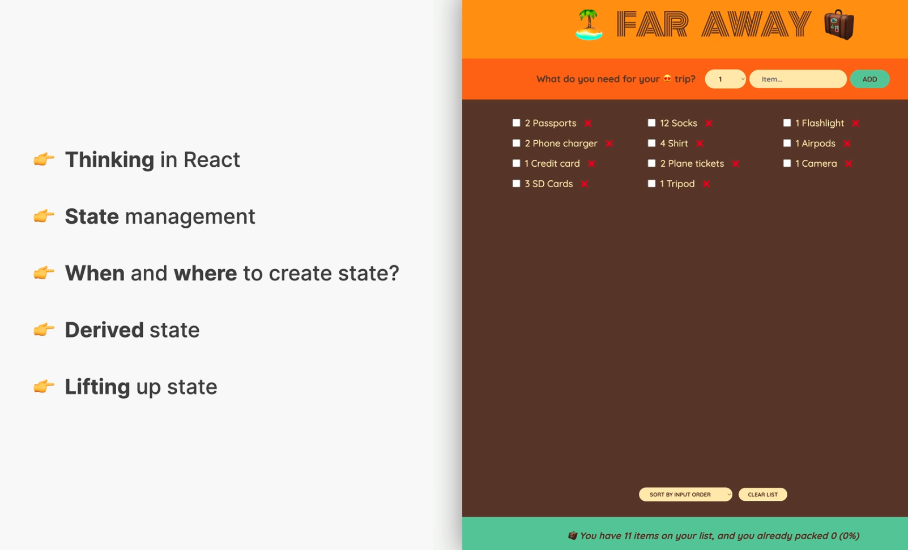
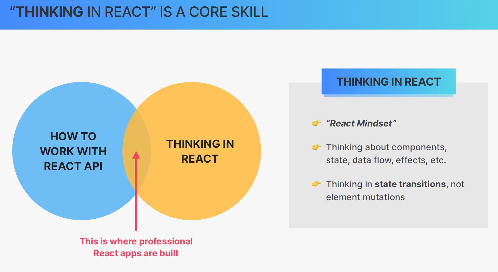
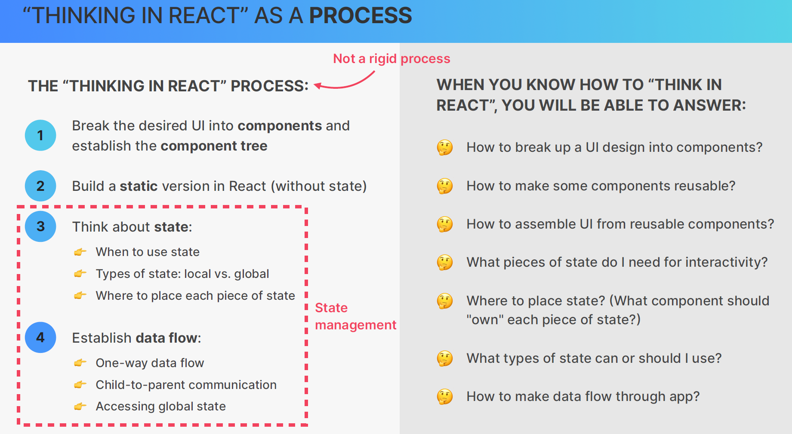
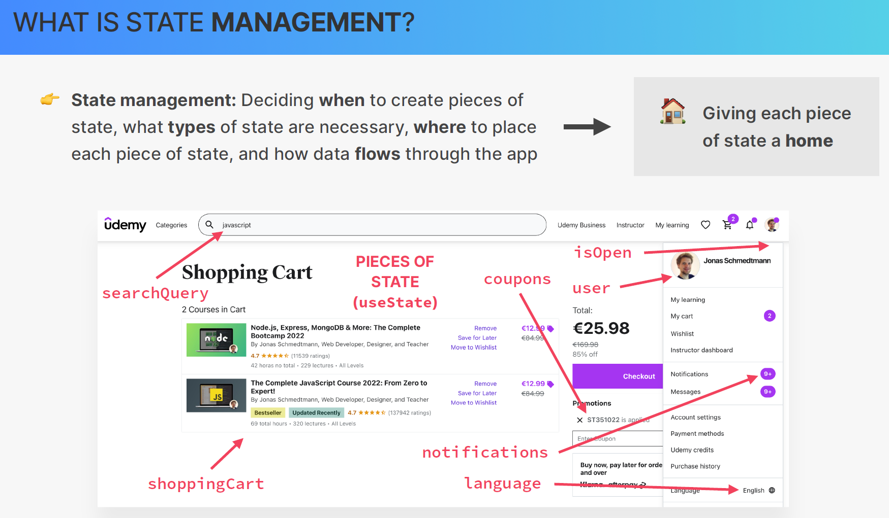
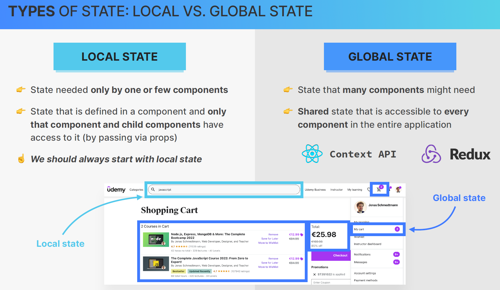
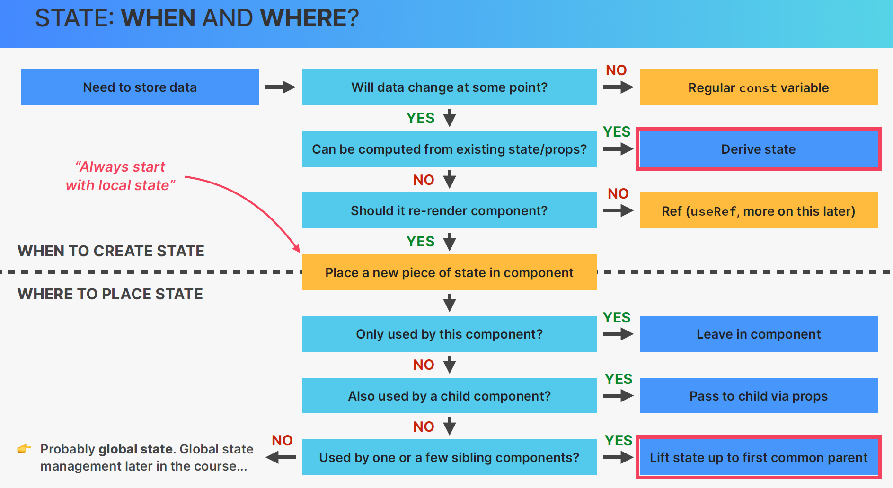
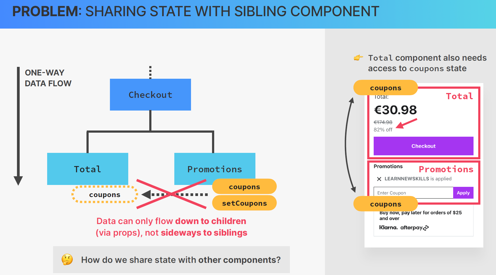
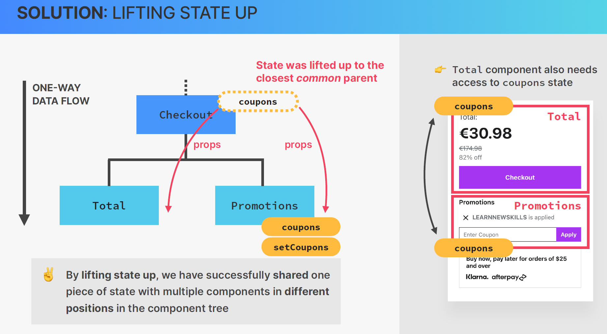
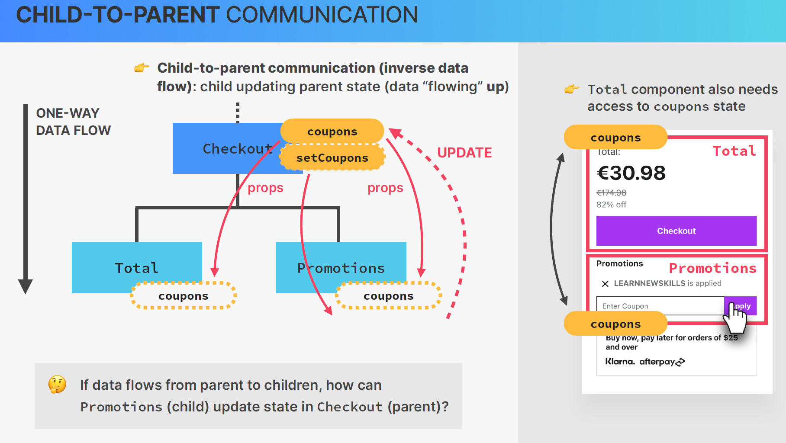
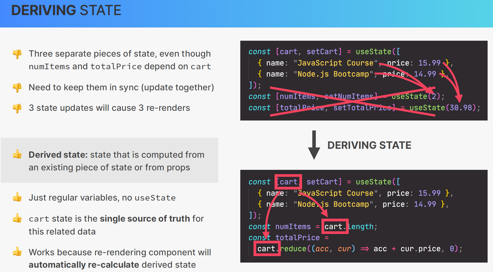

# 07 - Thinking In React State Management

## 001 Section Overview



## 002 What is Thinking in React




The image provides an overview of **"Thinking in React" as a Process**, which breaks down how to design and build React applications effectively by focusing on breaking down the user interface (UI) into components, thinking about state, and establishing a clear data flow. Let’s dive deeper into this process with detailed explanations and examples.

## **The "Thinking in React" Process**

1. **Break the Desired UI into Components**
2. **Build a Static Version in React (without state)**
3. **Think About State**
4. **Establish Data Flow**

These four steps are not rigid but form a flexible workflow that helps guide how to structure and build React applications efficiently.

---

### 1. **Break the Desired UI into Components**

The first step is to look at the entire UI and break it down into components. Each part of the UI that performs a distinct role or functionality can be thought of as a React component. This step involves identifying **reusable components** and figuring out how the **component tree** (or hierarchy) will look.

#### Example:

Imagine you're building a simple **product list** page for an e-commerce site. The UI could look something like this:

- **Header**
- **Search bar**
- **Product list**
  - Each product has:
    - Image
    - Name
    - Price
    - Add to Cart button

**Breaking the UI into components**:

- `Header`: A static header that could include a logo or navigation links.
- `SearchBar`: A component that allows users to search for products.
- `ProductList`: A container that loops through an array of products and displays them.
- `ProductItem`: Represents an individual product, including the image, name, price, and the button to add the product to the cart.

Here’s a basic **component tree** structure:

```
App
 ├── Header
 ├── SearchBar
 └── ProductList
      ├── ProductItem
      ├── ProductItem
      └── ProductItem
```

---

### 2. **Build a Static Version in React (Without State)**

In this step, you’ll take the UI components you’ve identified and build a static version of the application. This static version should **not** involve any state yet—it's purely about rendering the UI structure.

#### Example:

```jsx
function Header() {
  return <h1>Product List</h1>;
}

function SearchBar() {
  return <input type="text" placeholder="Search products..." />;
}

function ProductItem() {
  return (
    <div className="product-item">
      
      <p>Product Name</p>
      <p>$19.99</p>
      <button>Add to Cart</button>
    </div>
  );
}

function ProductList() {
  return (
    <div className="product-list">
      <ProductItem />
      <ProductItem />
      <ProductItem />
    </div>
  );
}

function App() {
  return (
    <div>
      <Header />
      <SearchBar />
      <ProductList />
    </div>
  );
}

export default App;
```

In this static version, the UI is rendered, but there’s no **interactivity** yet. You can view the structure, and make sure all components render as expected.

---

### 3. **Think About State**

Once you have the static UI version, it's time to add **state** to make the application interactive. State is what makes the UI dynamic by allowing components to store and update data.

#### Key Questions to Think About:
- **When to use state?** – State should be used for data that changes over time or based on user interaction (like form inputs, product data, or a shopping cart).
- **What type of state?** – Determine whether the state is local (specific to one component) or shared (used by multiple components).
- **Where to place each piece of state?** – Identify the "owner" component for each piece of state. The owner component should be the highest common ancestor of all components that need access to that state.

#### Example:

Let’s say the **SearchBar** needs to filter the products, and the **ProductList** needs to update based on that search. Here, state is needed for:
- **Search term** in the `SearchBar`
- **Filtered products** in the `ProductList`

In this case:
- The **App** component will manage the state, because both `SearchBar` and `ProductList` need to access or modify the state.

#### Adding State:

```jsx
import { useState } from 'react';

function App() {
  const [searchTerm, setSearchTerm] = useState(''); // State for search term
  const products = [
    { name: 'Product 1', price: 19.99 },
    { name: 'Product 2', price: 29.99 },
    { name: 'Product 3', price: 39.99 }
  ];

  // Filter products based on search term
  const filteredProducts = products.filter(product =>
    product.name.toLowerCase().includes(searchTerm.toLowerCase())
  );

  return (
    <div>
      <Header />
      <SearchBar searchTerm={searchTerm} setSearchTerm={setSearchTerm} />
      <ProductList products={filteredProducts} />
    </div>
  );
}

function SearchBar({ searchTerm, setSearchTerm }) {
  return (
    <input
      type="text"
      placeholder="Search products..."
      value={searchTerm}
      onChange={e => setSearchTerm(e.target.value)}
    />
  );
}

function ProductList({ products }) {
  return (
    <div className="product-list">
      {products.map(product => (
        <ProductItem key={product.name} name={product.name} price={product.price} />
      ))}
    </div>
  );
}

function ProductItem({ name, price }) {
  return (
    <div className="product-item">
      <p>{name}</p>
      <p>${price}</p>
      <button>Add to Cart</button>
    </div>
  );
}

export default App;
```

### How State Works:
- **`searchTerm`**: Managed in the `App` component and passed down to `SearchBar` as a prop.
- **`setSearchTerm`**: A function that updates the state in `App` when the search input changes.
- **Filtered products**: The `App` component filters the products based on the search term and passes the filtered list to `ProductList`.

---

### 4. **Establish Data Flow**

Once state is managed, the next step is to ensure that the **data flows** correctly throughout the component tree. React has a **one-way data flow** (also known as **unidirectional data flow**), meaning data is passed down from parent to child components through **props**.

#### Key Concepts:
- **One-way Data Flow**: The parent component holds the state and passes data down to child components as props.
- **Child-to-Parent Communication**: If a child component needs to update the state in a parent, the parent should pass down a callback function to the child. The child can invoke this function to modify the parent’s state.
- **Global State (if needed)**: If you have data that needs to be shared across multiple components that are not parent-child, you might use **global state management** (using Context API, Redux, etc.).

#### Example of Data Flow in the Product App:

1. **One-Way Data Flow**: The `App` component holds the product data and the search term state, and passes them as props to `ProductList` and `SearchBar`.
2. **Child-to-Parent Communication**: The `SearchBar` component doesn’t manage the search term itself. Instead, it receives the `searchTerm` and `setSearchTerm` props from `App`. When the user types in the search box, the `setSearchTerm` function is called, updating the state in the parent `App` component, which in turn re-renders the filtered products.
3. **Data Flow**: The data flows **downwards** from the `App` component to the `SearchBar` and `ProductList`, and user interactions (like typing a search query) flow **upwards** to update the state in the parent.

---

## **When You Know How to "Think in React"**

When you understand how to "Think in React," you’ll be able to answer several key questions about building your React application:

- **How to break up a UI design into components?**: You’ll know how to divide the UI into reusable components that handle individual pieces of functionality.
  
- **How to make components reusable?**: By identifying shared functionality, you can build components that are flexible and reusable across different parts of your application.

- **How to assemble UI from reusable components?**: You’ll be able to construct the full UI by assembling the components, ensuring that state and props are managed correctly.

- **What pieces of state do I need for interactivity?**: You’ll be able to determine which parts of the UI need state for dynamic behavior, and where to place that state.

- **Where to place state?**: You’ll understand which component should "own" each piece of state, ensuring that the right components manage the data they need.

- **What types of state should I use?**: Whether local or global, you’ll know how to structure state based on the needs of your application.

- **How to make data flow through the app?**: You’ll be comfortable passing data through props, handling user inputs, and managing parent-child communication, ensuring that data flows correctly throughout the app.


## 003 Fundamentals of State Management



The image provides a visual explanation of **state management** in React, focusing on the idea of giving each piece of state a "home" and understanding **when**, **what type**, and **where** to place state in a React application.

### **What is State Management?**

**State management** refers to the process of:
1. **Deciding when** to create pieces of state.
2. **Choosing what types** of state are necessary.
3. **Determining where** to place each piece of state.
4. **Managing how data flows** through the app to ensure components render and update properly.

State management is essential in React because state is what drives interactivity in applications. Without effectively managing state, the app would not know how to respond to user input, fetch and display data, or keep track of various dynamic elements.

---

### **Giving Each Piece of State a "Home"**

In React, **each piece of state needs a "home"** in the component tree, which means the state must live in the correct component based on the data flow and interaction requirements.

Let’s break this down with examples from the shopping cart application shown in the image:

---

### **Key Pieces of State in the Example**

1. **searchQuery**:
   - **Where it’s used**: The search bar at the top of the page.
   - **Purpose**: This state holds the text the user is typing into the search bar.
   - **Component home**: The **SearchBar** component (or a parent component that handles the search functionality).
   - **Type**: Local state, because the search query only affects what’s displayed in the search results and doesn’t need to be shared globally.
   - **Example Code**:

     ```jsx
     function SearchBar() {
       const [searchQuery, setSearchQuery] = useState('');

       return (
         <input
           type="text"
           value={searchQuery}
           onChange={e => setSearchQuery(e.target.value)}
           placeholder="Search for courses..."
         />
       );
     }
     ```

     In this example, `searchQuery` is local to the `SearchBar` component, and the `onChange` event updates the search term whenever the user types.

---

2. **shoppingCart**:
   - **Where it’s used**: The shopping cart section, which shows the items the user has added.
   - **Purpose**: This state tracks the items currently in the shopping cart.
   - **Component home**: Likely managed in the **App** component or a **ShoppingCart** component. It’s shared across multiple components (e.g., product pages, checkout, cart), so it needs to be higher in the component hierarchy.
   - **Type**: Global or shared state, as it affects multiple parts of the app.
   - **Example Code**:

     ```jsx
     function App() {
       const [shoppingCart, setShoppingCart] = useState([
         { name: "JavaScript Course", price: 12.99 },
         { name: "Node.js Bootcamp", price: 12.99 },
       ]);

       return <ShoppingCart cartItems={shoppingCart} />;
     }

     function ShoppingCart({ cartItems }) {
       return (
         <div>
           {cartItems.map(item => (
             <div key={item.name}>
               <p>{item.name}</p>
               <p>${item.price}</p>
             </div>
           ))}
         </div>
       );
     }
     ```

     In this case, the shopping cart items (`shoppingCart`) are managed in the `App` component because it might be needed by other components like `Checkout`, `ProductList`, or `Header`.

---

3. **user**:
   - **Where it’s used**: The user profile section, displaying the current user's name and profile picture.
   - **Purpose**: This state holds the information about the logged-in user.
   - **Component home**: It’s global or shared state, likely managed at the app level or in a user management service, because other parts of the app might need user information (e.g., cart, notifications, settings).
   - **Type**: Global state, since the user’s information is relevant across different components.
   - **Example Code**:

     ```jsx
     function UserProfile({ user }) {
       return (
         <div className="user-profile">
           
           <p>{user.name}</p>
         </div>
       );
     }

     function App() {
       const [user, setUser] = useState({
         name: "Jonas Schmedtmann",
         profilePicture: "avatar.jpg"
       });

       return <UserProfile user={user} />;
     }
     ```

     Here, `user` is a shared piece of state, passed down from `App` to `UserProfile` and potentially other components that need to display or use the user's information.

---

4. **isOpen**:
   - **Where it’s used**: To toggle whether a dropdown or sidebar is open or closed.
   - **Purpose**: This state tracks the open/closed state of a dropdown (e.g., the user menu in the top-right corner).
   - **Component home**: Local state in the component that controls the dropdown (e.g., `UserMenu`).
   - **Type**: Local state because the toggle only affects the visibility of the menu and doesn’t need to be shared elsewhere.
   - **Example Code**:

     ```jsx
     function UserMenu() {
       const [isOpen, setIsOpen] = useState(false);

       return (
         <div>
           <button onClick={() => setIsOpen(!isOpen)}>
             {isOpen ? "Close" : "Open"} Menu
           </button>
           {isOpen && <div className="menu">User Menu Content</div>}
         </div>
       );
     }
     ```

     The `isOpen` state is local to the `UserMenu` component and controls whether the menu is displayed.

---

5. **coupons**:
   - **Where it’s used**: The checkout area, showing applied coupons or promotions.
   - **Purpose**: This state tracks any applied coupons or promotional codes.
   - **Component home**: Likely managed in the **Checkout** component, though it may also exist in higher-level components if it impacts pricing across different pages.
   - **Type**: Local state to `Checkout`, but could also be shared if needed by other components.
   - **Example Code**:

     ```jsx
     function Checkout() {
       const [coupons, setCoupons] = useState('');

       return (
         <div>
           <input
             type="text"
             placeholder="Enter coupon code"
             value={coupons}
             onChange={e => setCoupons(e.target.value)}
           />
           <button>Apply Coupon</button>
         </div>
       );
     }
     ```

     The `coupons` state manages the coupon code entered by the user. It might only need to exist within the `Checkout` component unless it influences other sections like product pages.

---

6. **notifications**:
   - **Where it’s used**: A notifications icon that shows how many notifications the user has.
   - **Purpose**: This state tracks the number of unread notifications or messages.
   - **Component home**: Likely a global state, as notifications may need to be displayed or updated in different areas of the application (e.g., the header, notifications page).
   - **Type**: Global state, because notifications are part of a system-wide feature.
   - **Example Code**:

     ```jsx
     function Notifications({ notifications }) {
       return (
         <div className="notifications">
           <p>Unread notifications: {notifications.length}</p>
         </div>
       );
     }

     function App() {
       const [notifications, setNotifications] = useState([{ id: 1, message: 'New course available!' }]);

       return <Notifications notifications={notifications} />;
     }
     ```

     Here, `notifications` is a shared piece of state, passed down to the `Notifications` component to show the user’s current unread notifications.

---

7. **language**:
   - **Where it’s used**: The footer or settings section, allowing the user to switch the language of the application.
   - **Purpose**: This state tracks the currently selected language for the interface.
   - **Component home**: Likely a global state or context, as the language selection affects the entire app's UI.
   - **Type**: Global state, because the language setting must be shared across all components.
   - **Example Code**:

     ```jsx
     function LanguageSelector() {
       const [language, setLanguage] = useState('English');

       return (
         <select value={language} onChange={e => setLanguage(e.target.value)}>
           <option value="English">English</option>
           <option value="Spanish">Spanish</option>
         </select>
       );
     }
     ```

     The `language` state is global because it impacts the text and UI across the entire app.

---

### **Deciding Where to Place State**

When deciding **where to place state** in a React application, you should follow these rules:

1. **Identify which component needs the state**: Start by determining which components in the tree need to read or update the state.
2. **Place state in the closest common ancestor**: If multiple components need the same piece of state, the state should live in their closest common parent.
3. **Use local state for isolated logic**: If a piece of state only affects a single component (like toggling a menu),



The image provides an explanation of the two key **types of state** in React: **Local State** and **Global State**. Understanding the difference between these types of state helps in effectively managing data in React applications.

### **Types of State: Local vs. Global**

#### 1. **Local State**

- **Definition**: 
  Local state is state that is **needed only by one or a few components**. This state is defined within a component, and typically, only the component and its child components (if passed via props) have access to it. Local state is **internal** to the component and controls data that’s only relevant to that component or its immediate children.

- **Characteristics**:
  - It’s scoped to a specific component.
  - Other components can’t directly access it unless it’s passed down via props.
  - Used for **isolated interactions** like form inputs, toggling UI elements, etc.
  
- **Rule of Thumb**: 
  "We should always start with local state" — this means it’s generally best to first implement state locally and then elevate it if needed by other parts of the application.

#### Example of Local State:

Let’s take the **search bar** from the example in the image. The search bar state (`searchQuery`) is local because:
  - It’s only needed by the **SearchBar** component.
  - The state manages what the user is typing in the search input and does not need to be shared across the app.

```jsx
import { useState } from 'react';

function SearchBar() {
  const [searchQuery, setSearchQuery] = useState(''); // Local state for the search input

  return (
    <input
      type="text"
      value={searchQuery}
      onChange={e => setSearchQuery(e.target.value)}
      placeholder="Search for courses..."
    />
  );
}

export default SearchBar;
```

In this example:
- The `searchQuery` state only matters to the `SearchBar` component.
- The state is updated with each keystroke, but it’s not shared outside of this component.
- **Local State Example from the Image**: The search input field is the blue highlighted box labeled as **Local State** in the example, where users type a search query.

---

#### 2. **Global State**

- **Definition**: 
  Global state is **shared** state that **many components** across the application might need. It’s accessible to multiple components, no matter where they are located in the component tree.

- **Characteristics**:
  - It can be accessed by any component that subscribes to it.
  - It is often stored in a **centralized place** using tools like **React Context** or **Redux**.
  - It is useful for managing state that needs to be available across different parts of the app, such as user information, shopping cart data, app settings, or notifications.

#### Example of Global State:

In the example from the image, **the shopping cart** is labeled as global state. This state is likely used in multiple components across the app, such as:
  - The **shopping cart icon** in the header (showing the number of items).
  - The **checkout page** showing the total price.
  - The **cart detail page** listing all the items in the cart.

In this scenario, the shopping cart state needs to be **shared** across various components, so it would make sense to use a **global state management solution**, such as the **Context API** or **Redux**.

#### Using React’s Context API for Global State:

Here’s an example of how you might implement global state using the **Context API** to share the **shoppingCart** state across different components:

```jsx
import React, { createContext, useContext, useState } from 'react';

// Create a Context for the global shoppingCart state
const CartContext = createContext();

// Create a provider component
function CartProvider({ children }) {
  const [shoppingCart, setShoppingCart] = useState([]);

  return (
    <CartContext.Provider value={{ shoppingCart, setShoppingCart }}>
      {children}
    </CartContext.Provider>
  );
}

// Hook to use the cart context
function useCart() {
  return useContext(CartContext);
}

// Example usage in a component
function CartIcon() {
  const { shoppingCart } = useCart();
  
  return (
    <div>
      <span>{shoppingCart.length}</span> {/* Number of items in the cart */}
    </div>
  );
}

function AddToCartButton({ product }) {
  const { shoppingCart, setShoppingCart } = useCart();

  const addToCart = () => {
    setShoppingCart([...shoppingCart, product]); // Add new item to the cart
  };

  return <button onClick={addToCart}>Add to Cart</button>;
}

function App() {
  return (
    <CartProvider>
      <CartIcon />
      <AddToCartButton product={{ name: "JavaScript Course", price: 12.99 }} />
    </CartProvider>
  );
}

export default App;
```

### How it Works:
- **Global State**: The `shoppingCart` state is placed inside the `CartContext` and managed by the `CartProvider` component. This makes the `shoppingCart` state accessible to any component wrapped by the provider.
- **Using Global State**: The `useCart` hook is used to access the global `shoppingCart` state. Both `CartIcon` (which shows the number of items) and `AddToCartButton` (which adds items to the cart) access the same shared state.
- **Global State Example from the Image**: The shopping cart icon and cart page both access the same global `shoppingCart` state, allowing them to show the number of items in the cart and display the cart details, respectively.

---

### **When to Use Local State vs. Global State**

#### **Use Local State** When:
1. **State is used only by a specific component** or by that component’s children.
2. The data doesn’t need to be shared outside of a single component or doesn’t affect other parts of the app.
3. Example: **Input fields, dropdown toggles, form validation**, etc.

#### **Use Global State** When:
1. **Many components** need to access and share the same piece of state.
2. You have **data that affects multiple components** across different parts of the app.
3. Example: **User authentication, shopping cart, theme preferences, notifications**, etc.

---

### **Summary of Key Differences**

| **Local State**                          | **Global State**                          |
|------------------------------------------|-------------------------------------------|
| Managed within a specific component.     | Shared across multiple components.        |
| Accessible only within the component or passed to children via props. | Accessible to any component in the app using a global state management tool (like Context API or Redux). |
| Used for isolated and component-specific interactions. | Used for data that needs to be available app-wide or in many parts of the app. |
| Examples: Input fields, toggles, local form states. | Examples: User authentication, shopping cart, notifications, theme. |

---

### **Tools for Managing Global State**

There are a couple of tools to manage global state in React:

1. **React Context API**:
   - Built-in API for managing global state in React.
   - Ideal for smaller applications or scenarios where global state management is relatively simple.

2. **Redux**:
   - A more powerful state management library, ideal for larger and more complex applications.
   - Centralizes all state into a **single store** and uses **reducers** to manage changes to the state.

Both tools allow you to manage **shared global state** in a predictable way and make it accessible to any component that needs it.

### Final Takeaway

In most cases, **start with local state** and elevate to global state when it’s clear that multiple components need to share the same data. This makes your code simpler and avoids unnecessary complexity early on, while still allowing scalability as your app grows.



The image explains **when** and **where** to create and place state in a React application, using a flowchart to guide the decision-making process. The goal is to help developers decide if a piece of data should be stored as state, and where in the component tree that state should be managed. Let's break down the process step by step with examples.

## **State: When and Where?**

### **When to Create State**
This section helps determine whether something needs to be stored as state and when it’s appropriate to create new state in a React component.

1. **Do you need to store data?**
   - **Yes**: If you need to track or store data, the next question is whether the data will change over time.
   - **No**: If not, the data can be stored as a regular constant or variable.

#### Example: Static Data
```jsx
function Header() {
  const appName = "My React App"; // No need for state, as the data doesn't change.
  return <h1>{appName}</h1>;
}
```

Here, `appName` is a constant because it does not need to change. This would be a case where state is **not needed**.

2. **Will the data change at some point?**
   - **Yes**: If the data will change (e.g., user input, API data, etc.), proceed to the next decision point.
   - **No**: If the data will remain constant, there's no need for state—use a regular constant or variable.

3. **Can the data be computed from existing state/props?**
   - **Yes**: If you can derive the data from existing state or props, there is no need for new state. Derived state should be calculated dynamically from other state/props instead of being stored separately.
   - **No**: If the data cannot be computed from existing state or props, proceed to creating new state.

#### Example: Derived State

```jsx
function FullName({ firstName, lastName }) {
  const fullName = `${firstName} ${lastName}`; // Derived from props, no need for state.
  return <p>{fullName}</p>;
}
```

In this example, `fullName` is derived from props (`firstName` and `lastName`). There's no need to store `fullName` in state because it can be computed from the props.

4. **Should the data trigger a re-render?**
   - **Yes**: If the data should trigger a re-render when it changes (e.g., form inputs, animations), then create a new piece of state.
   - **No**: If the data should not trigger a re-render, it can be stored using a `ref` (React’s `useRef` hook) instead of state.

#### Example: Ref (Non-Rendering Data)

```jsx
import { useRef } from 'react';

function FocusableInput() {
  const inputRef = useRef(null); // Does not trigger a re-render
  const focusInput = () => {
    inputRef.current.focus(); // Accesses the DOM element without re-rendering
  };

  return (
    <div>
      <input ref={inputRef} />
      <button onClick={focusInput}>Focus the input</button>
    </div>
  );
}
```

In this example, `inputRef` holds a reference to the input DOM element but does not trigger a re-render. `useRef` is useful when you need to access elements or data without causing re-renders.

---

### **Where to Place State**
Once you’ve determined that you need a piece of state, the next step is figuring out **where** to place that state within the component tree.

1. **Is the state only used by this component?**
   - **Yes**: If the state is only needed in the current component, leave it in that component as local state.
   - **No**: If the state is shared with other components, continue to the next question.

#### Example: Local State

```jsx
function Counter() {
  const [count, setCount] = useState(0); // Local state, only used by this component

  return (
    <div>
      <p>{count}</p>
      <button onClick={() => setCount(count + 1)}>Increment</button>
    </div>
  );
}
```

Here, the `count` state is only used by the `Counter` component, so it’s managed locally.

2. **Is the state also used by a child component?**
   - **Yes**: If a child component also needs access to the state, the parent should manage the state and pass it down to the child via props.
   - **No**: If the state is not used by children, continue to the next question.

#### Example: Passing State to a Child via Props

```jsx
function Parent() {
  const [text, setText] = useState('Hello');

  return <Child text={text} />; // Passing state as a prop to a child component
}

function Child({ text }) {
  return <p>{text}</p>; // Child receives the state as a prop
}
```

In this example, the parent component manages the `text` state and passes it down to the child component via props.

3. **Is the state used by one or a few sibling components?**
   - **Yes**: If the state is shared between sibling components, **lift the state up** to the first common parent so it can be shared between the siblings.
   - **No**: If the state is not shared, continue with managing it locally.

#### Example: Lifting State to a Common Parent

```jsx
function Parent() {
  const [inputValue, setInputValue] = useState('');

  return (
    <div>
      <InputField value={inputValue} onChange={setInputValue} />
      <DisplayInput value={inputValue} />
    </div>
  );
}

function InputField({ value, onChange }) {
  return (
    <input
      type="text"
      value={value}
      onChange={e => onChange(e.target.value)}
    />
  );
}

function DisplayInput({ value }) {
  return <p>{value}</p>;
}
```

Here:
- The `inputValue` state is managed in the `Parent` component because it’s shared between two sibling components: `InputField` (for updating the input) and `DisplayInput` (for displaying the input).

### **Final Step: Global State**
- If the state is **used by many components**, and it becomes challenging to manage through props alone, you might need **global state** management. This can be handled using tools like the **Context API** or **Redux**.

---

### **Summary of Key Concepts**

- **Always start with local state**: If the state is only needed in one component, manage it locally.
- **Lift state up**: When sibling components need to share state, lift the state up to the nearest common parent.
- **Use props** to pass state down from a parent to child components.
- **Use global state** only if the state is used by many components across different areas of the app.

### **Conclusion**
This flowchart provides a structured way to think about **when to create state** and **where to place state** in a React application. By following this process, you can avoid state management pitfalls like redundant states, prop drilling, or unnecessary re-renders, leading to a cleaner, more maintainable React codebase.

## 004 Thinking About State and Lifting State Up

```tsx
import {FC, FormEvent, useState} from "react";

type Item = {
    id: number;
    description: string;
    quantity: number;
    packed: boolean;
};


type PropsItem = {
    item: Item;
};


type PropsForm = {
    onAddItem: (item: Item) => void;
}

type PropsPackagingList = {
    items: Item[];

}


function App() {

    const [items, setItems] = useState<Item[]>([]);

    const handleAddItem = (item: Item) => {
        setItems([...items, item]);
    }

    return (
        <div className={'app'}>
            <Logo/>
            <Form onAddItem={handleAddItem}/>
            <PackingList items={items}/>
            <Stats/>
        </div>
    )
}

const Logo = () => {
    return (
        <h1> 🌴 Far Away 💼</h1>
    )
};

const Form: FC<PropsForm> = ({onAddItem}) => {

    const [description, setDescription] = useState<string>('');
    const [quantity, setQuantity] = useState<number>(1);


    const reset = () => {
        setDescription('');
        setQuantity(1);
    };

    const handleSubmit = (e: FormEvent<HTMLFormElement>) => {
        e.preventDefault();

        if (!description) return;

        const newItem: Item = {
            id: new Date().getTime(),
            description,
            quantity,
            packed: false
        }

        onAddItem(newItem);
        reset();

    }

    const handleChange = (e: FormEvent<HTMLInputElement>) => {
        setDescription(e.currentTarget.value);
    }

    return (
        <form onSubmit={handleSubmit} className={'add-form'}>
            <h3>What is you need for your trip ?</h3>
            <select value={quantity} onChange={event => setQuantity(+event.target.value)}>
                {
                    Array.from({length: 20}, (_, i) => (
                        <option key={i + 1} value={i + 1}>{i + 1}</option>
                    ))
                }
            </select>
            <input type="text" placeholder={"type a item here"} value={description} onChange={handleChange}/>
            <button>add</button>
        </form>
    )
};


const PackingList: FC<PropsPackagingList> = ({items}) => {
    return (
        <div className={'list'}>
            <ul>
                {items.map(item => <Item key={item.id} item={item}/>)}
            </ul>
        </div>
    )
};


const Item: FC<PropsItem> = ({item}) => {
    return (
        <li>
            <span style={item.packed ? {textDecoration: 'line-through'} : {}}>
            {item.quantity} {item.description}
            </span>
            <button>❌</button>
        </li>
    )
}


const Stats = () => {
    return (
        <footer className={'stats'}>
            <em>
                You Have X items on your list, and you already packed X
            </em>
        </footer>
    )
};


export default App

```
The code you provided represents a simple **React** application for a packing list app, and the output image shows the visual representation of the app. This app allows users to add items they need for a trip, including the quantity of each item, and displays them in a list where items can be checked off once packed. Let’s break down the app's components and how they work, along with a deeper explanation.

## **Key Components of the App**

1. **App Component**:
   The `App` component is the parent component that manages the entire packing list application. It holds the `items` state and passes functions and props down to child components to handle adding items and rendering the list.

   - **State**: 
     ```tsx
     const [items, setItems] = useState<Item[]>([]);
     ```
     The `items` state holds an array of objects where each object is an item the user adds to their packing list. Each item consists of the following:
     - `id`: A unique identifier for each item.
     - `description`: The name of the item (what the user types into the input field).
     - `quantity`: How many of the item the user needs.
     - `packed`: A boolean representing whether the item has been packed or not.

   - **handleAddItem**: 
     This function updates the state with a new item when it’s submitted in the form.
     ```tsx
     const handleAddItem = (item: Item) => {
         setItems([...items, item]);
     };
     ```

   - **Components used**: 
     The `App` component renders several child components:
     - `Logo` for displaying the header.
     - `Form` for adding new items.
     - `PackingList` for displaying the list of items.
     - `Stats` for showing statistics about the number of items packed vs. total items.

---

2. **Logo Component**:
   The `Logo` component is a simple functional component that renders the title "Far Away" with decorative emojis. It does not take any props or manage state.
   
   ```tsx
   const Logo = () => {
       return (
           <h1> 🌴 Far Away 💼</h1>
       );
   };
   ```

---

3. **Form Component**:
   The `Form` component is responsible for capturing user input (the item description and quantity) and then submitting it to add to the packing list.

   - **State**: 
     The form manages two pieces of local state:
     ```tsx
     const [description, setDescription] = useState<string>('');
     const [quantity, setQuantity] = useState<number>(1);
     ```
     - `description` stores the user input for the item’s description.
     - `quantity` stores the number of items the user wants to add.

   - **handleSubmit**: 
     This function is triggered when the form is submitted. It checks if a description is provided, creates a new item, and calls the `onAddItem` prop passed from the parent (`App`) to add the item to the list.

     ```tsx
     const handleSubmit = (e: FormEvent<HTMLFormElement>) => {
         e.preventDefault();
         if (!description) return;

         const newItem: Item = {
             id: new Date().getTime(),
             description,
             quantity,
             packed: false
         };

         onAddItem(newItem);
         reset();
     };
     ```

   - **reset**: 
     Resets the form fields after the item is added.

   - **handleChange**: 
     Updates the `description` state whenever the user types into the input field.

     ```tsx
     const handleChange = (e: FormEvent<HTMLInputElement>) => {
         setDescription(e.currentTarget.value);
     };
     ```

   The form component also includes:
   - A dropdown (`select`) to choose the item quantity.
   - An input field for entering the item’s description.
   - A submit button to add the item to the list.

   ```tsx
   <select value={quantity} onChange={event => setQuantity(+event.target.value)}>
       {Array.from({ length: 20 }, (_, i) => (
           <option key={i + 1} value={i + 1}>{i + 1}</option>
       ))}
   </select>
   <input type="text" placeholder="type a item here" value={description} onChange={handleChange} />
   ```

---

4. **PackingList Component**:
   The `PackingList` component is responsible for rendering the list of items that have been added. It receives the `items` array as a prop from the `App` component and maps through the items to render each `Item` component.

   ```tsx
   const PackingList: FC<PropsPackagingList> = ({ items }) => {
       return (
           <div className={'list'}>
               <ul>
                   {items.map(item => <Item key={item.id} item={item} />)}
               </ul>
           </div>
       );
   };
   ```

---

5. **Item Component**:
   Each individual item in the list is represented by the `Item` component. It displays the item’s quantity and description, and includes a button to remove the item (although the delete functionality is not yet implemented).

   - **Styling**: 
     The item is struck through if it is marked as `packed`. This is controlled by applying a `textDecoration: 'line-through'` style when the item is packed.
     
     ```tsx
     <span style={item.packed ? { textDecoration: 'line-through' } : {}}>
         {item.quantity} {item.description}
     </span>
     ```

   - **Remove Button**: 
     A ❌ button is included next to each item, but currently, it doesn't have functionality to remove the item.

---

6. **Stats Component**:
   The `Stats` component is responsible for displaying the number of items in the list and how many of them have been packed. In the current code, the stats are static and display "You Have X items on your list, and you already packed X." 

   This can later be made dynamic by counting the total items and the packed items from the `items` array.

   ```tsx
   const Stats = () => {
       return (
           <footer className={'stats'}>
               <em>
                   You Have X items on your list, and you already packed X
               </em>
           </footer>
       );
   };
   ```

---

## **How the Application Works**

1. **Adding Items**:
   - The user selects the **quantity** and types a **description** of the item they want to add using the form.
   - Upon clicking the "Add" button (submitting the form), the item is added to the packing list and displayed in the `PackingList` component.

2. **Displaying Items**:
   - The `PackingList` component maps over the `items` array and renders an `Item` component for each item.
   - Each item shows the **quantity** and **description**, and a ❌ button (though it’s not functional yet).

3. **Tracking Stats**:
   - The `Stats` component (though currently static) is intended to show how many items are on the list and how many have been packed.

## **Suggested Improvements and Additional Features**

1. **Toggle Packed Status**:
   - Allow users to mark items as packed by clicking on them or checking a checkbox. Update the `Item` component to include a checkbox that toggles the `packed` status of each item.

   ```tsx
   const togglePacked = (id: number) => {
       setItems(items.map(item => 
           item.id === id ? { ...item, packed: !item.packed } : item
       ));
   };
   ```

2. **Remove Item from List**:
   - Implement the functionality for the ❌ button to remove items from the list by filtering them out from the `items` array.

   ```tsx
   const removeItem = (id: number) => {
       setItems(items.filter(item => item.id !== id));
   };
   ```

3. **Dynamic Stats**:
   - Calculate and display the total number of items and the number of packed items dynamically.

   ```tsx
   const totalItems = items.length;
   const packedItems = items.filter(item => item.packed).length;
   ```

   The `Stats` component can use this to display meaningful information:
   
   ```tsx
   <em>
       You Have {totalItems} items on your list, and you already packed {packedItems}
   </em>
   ```

4. **Input Validation**:
   - Add input validation to ensure that the description is not empty or duplicated.

5. **LocalStorage Persistence**:
   - Store the `items` in `localStorage` so that the packing list persists even when the page is refreshed.

## **Conclusion**

This packing list app demonstrates the use of React’s **state management**, **event handling**, and **component-based architecture**. Users can add items dynamically to the list, and with further improvements, the app could include features like marking items as packed, removing items, and calculating statistics dynamically.
## 005 Reviewing Lifting Up State





The three images illustrate a common **problem** in React applications — **sharing state between sibling components** — and two key solutions: **lifting state up** and **child-to-parent communication**. Let’s go step by step to explain this concept in detail with examples.

## **Problem: Sharing State with Sibling Components**

In React, data flows in **one direction**: from parent to child components. This is called **one-way data flow**. However, this presents a challenge when sibling components need to share state. 

### Scenario:
- You have two sibling components: **Total** and **Promotions**.
- Both components need access to the same piece of state, in this case, the `coupons` state. The **Total** component needs to know about the applied coupon to calculate the final price, and the **Promotions** component is where users enter the coupon.
  
But, React’s one-way data flow means **data cannot flow directly between sibling components**. Therefore, you cannot directly pass `coupons` from **Promotions** to **Total** or vice versa. The **coupons** state must flow from a **parent** component.

---

## **Solution: Lifting State Up**

### What Does It Mean to "Lift State Up"?
When multiple components need to access the same piece of state, you **"lift the state up"** to the nearest common parent component. In this case, the `coupons` state is **lifted up** to the parent component (**Checkout**), and then it is passed down as **props** to both **Total** and **Promotions**.

### How It Works:
1. **Checkout Component**:
   The `coupons` state is managed in the **Checkout** component, which is the **common parent** of **Total** and **Promotions**.
   
   ```jsx
   function Checkout() {
     const [coupons, setCoupons] = useState(''); // Lifting state to the parent

     return (
       <div>
         <Total coupons={coupons} />
         <Promotions coupons={coupons} setCoupons={setCoupons} />
       </div>
     );
   }
   ```

   - **`coupons`** is lifted up to **Checkout** and passed down to both child components as props.
   - **Total** receives `coupons` to use it for calculating the total price.
   - **Promotions** receives both `coupons` and `setCoupons` to manage and apply a new coupon.

2. **Total Component**:
   The **Total** component now receives `coupons` as a prop from its parent, **Checkout**.

   ```jsx
   function Total({ coupons }) {
     const totalPrice = 100; // Assume a base price
     const discount = coupons === 'DISCOUNT50' ? 0.5 : 1; // Apply discount based on coupon

     return <div>Total: €{totalPrice * discount}</div>;
   }
   ```

   - The **Total** component applies the `coupons` prop to adjust the total price.
   - If the coupon code is `'DISCOUNT50'`, a 50% discount is applied.

3. **Promotions Component**:
   The **Promotions** component allows the user to input a coupon code and update the `coupons` state in the parent (via `setCoupons`).

   ```jsx
   function Promotions({ coupons, setCoupons }) {
     const applyCoupon = () => {
       setCoupons('DISCOUNT50'); // Apply coupon and update state in parent
     };

     return (
       <div>
         <input type="text" placeholder="Enter Coupon" />
         <button onClick={applyCoupon}>Apply</button>
       </div>
     );
   }
   ```

   - **Promotions** can update the `coupons` state in **Checkout** using the `setCoupons` function passed from the parent.
   - When the user clicks the "Apply" button, the coupon is applied and shared between both **Promotions** and **Total** components.

### The Key Idea:
- By lifting the `coupons` state up to the **Checkout** parent component, it can now be shared across both sibling components, **Total** and **Promotions**.
- **State is lifted up** to the closest common ancestor of the components that need to share it.

---

## **Child-to-Parent Communication**

In React, data flows from **parent to child** through **props**. But, what if a **child component** needs to update the parent’s state? This is called **child-to-parent communication**, and it is achieved by passing **callback functions** as props.

### How Child-to-Parent Communication Works:
1. **The parent component (Checkout)** passes a callback function (`setCoupons`) down to the child component (**Promotions**).
2. **The child component (Promotions)** calls this function to update the state in the parent.

### Example:

```jsx
function Checkout() {
  const [coupons, setCoupons] = useState(''); // Parent state

  return (
    <div>
      <Total coupons={coupons} />
      <Promotions coupons={coupons} setCoupons={setCoupons} /> {/* Passing setCoupons to child */}
    </div>
  );
}

function Promotions({ setCoupons }) {
  const applyCoupon = () => {
    setCoupons('DISCOUNT50'); // Updating parent's state from the child
  };

  return (
    <div>
      <input type="text" placeholder="Enter Coupon" />
      <button onClick={applyCoupon}>Apply</button>
    </div>
  );
}
```

Here’s how this communication works:
1. The **Promotions** component receives `setCoupons` as a prop.
2. When the user clicks the "Apply" button, `setCoupons` is called, updating the parent’s `coupons` state.
3. The updated `coupons` state is then passed down to both **Total** and **Promotions**, ensuring both components receive the updated coupon code.

---

## **Summary of Key Points**

1. **Problem: Sharing State Between Siblings**:
   - In React, data flows **one way** from parent to child. You cannot directly share state between sibling components.
   
2. **Solution: Lifting State Up**:
   - To share state between siblings, **lift the state up** to their common parent.
   - The parent manages the state and passes it down to the children via props.

3. **Child-to-Parent Communication**:
   - If a child needs to update the parent's state, the parent passes a **callback function** (like `setCoupons`) to the child.
   - The child calls the function to update the parent’s state.

By applying these concepts, you can solve the common issue of sharing state between sibling components in React while maintaining the integrity of React's one-way data flow. This approach keeps the data flow predictable and makes it easier to track how state changes propagate through the component tree.
## 006 Deleting an Item More Child-to-Parent Communication!

```tsx
import {FC, FormEvent, useState} from "react";

type Item = {
    id: number;
    description: string;
    quantity: number;
    packed: boolean;
};


type PropsItem = {
    item: Item;
    onDelete: (id: number) => void;
};


type PropsForm = {
    onAddItem: (item: Item) => void;
}

type PropsPackagingList = {
    items: Item[];
    onDelete: (id: number) => void;

}


function App() {

    const [items, setItems] = useState<Item[]>([]);

    const handleAddItem = (item: Item) => {
        setItems([...items, item]);
    }
    const handleDeleteItem = (id: number) => {
        setItems(items.filter(item => item.id !== id));
    }
    return (
        <div className={'app'}>
            <Logo/>
            <Form onAddItem={handleAddItem}/>
            <PackingList onDelete={handleDeleteItem} items={items}/>
            <Stats/>
        </div>
    )
}

const Logo = () => {
    return (
        <h1> 🌴 Far Away 💼</h1>
    )
};

const Form: FC<PropsForm> = ({onAddItem}) => {

    const [description, setDescription] = useState<string>('');
    const [quantity, setQuantity] = useState<number>(1);


    const reset = () => {
        setDescription('');
        setQuantity(1);
    };

    const handleSubmit = (e: FormEvent<HTMLFormElement>) => {
        e.preventDefault();

        if (!description) return;

        const newItem: Item = {
            id: new Date().getTime(),
            description,
            quantity,
            packed: false
        }

        onAddItem(newItem);
        reset();

    }

    const handleChange = (e: FormEvent<HTMLInputElement>) => {
        setDescription(e.currentTarget.value);
    }

    return (
        <form onSubmit={handleSubmit} className={'add-form'}>
            <h3>What is you need for your trip ?</h3>
            <select value={quantity} onChange={event => setQuantity(+event.target.value)}>
                {
                    Array.from({length: 20}, (_, i) => (
                        <option key={i + 1} value={i + 1}>{i + 1}</option>
                    ))
                }
            </select>
            <input type="text" placeholder={"type a item here"} value={description} onChange={handleChange}/>
            <button>add</button>
        </form>
    )
};


const PackingList: FC<PropsPackagingList> = ({items, onDelete}) => {
    return (
        <div className={'list'}>
            <ul>
                {items.map(item => <Item onDelete={onDelete} key={item.id} item={item}/>)}
            </ul>
        </div>
    )
};


const Item: FC<PropsItem> = ({item, onDelete}) => {
    return (
        <li>
            <span style={item.packed ? {textDecoration: 'line-through'} : {}}>
            {item.quantity} {item.description}
            </span>
            <button onClick={() => onDelete(item.id)}>❌</button>
        </li>
    )
}


const Stats = () => {
    return (
        <footer className={'stats'}>
            <em>
                You Have X items on your list, and you already packed X
            </em>
        </footer>
    )
};


export default App
```

## 007 Updating an Item Complex Immutable Data Operation

```tsx
import {FC, FormEvent, useState} from "react";

type Item = {
    id: number;
    description: string;
    quantity: number;
    packed: boolean;
};


type PropsItem = {
    item: Item;
    onDelete: (id: number) => void;
    onChange: (id: number) => void;
};


type PropsForm = {
    onAddItem: (item: Item) => void;
}

type PropsPackagingList = {
    items: Item[];
    onDelete: (id: number) => void;
    onChange: (id: number) => void;

}


function App() {

    const [items, setItems] = useState<Item[]>([]);

    const handleAddItem = (item: Item) => {
        setItems([...items, item]);
    }
    const handleDeleteItem = (id: number) => {
        setItems(items.filter(item => item.id !== id));
    }

    const handleItemChange = (id: number) => {
        setItems(items.map(item => {
            if (item.id === id) {
                return {
                    ...item,
                    packed: !item.packed
                }
            }
            return item;
        }))
    };

    return (
        <div className={'app'}>
            <Logo/>
            <Form onAddItem={handleAddItem}/>
            <PackingList onDelete={handleDeleteItem} items={items} onChange={handleItemChange}/>
            <Stats/>
        </div>
    )
}

const Logo = () => {
    return (
        <h1> 🌴 Far Away 💼</h1>
    )
};

const Form: FC<PropsForm> = ({onAddItem}) => {

    const [description, setDescription] = useState<string>('');
    const [quantity, setQuantity] = useState<number>(1);


    const reset = () => {
        setDescription('');
        setQuantity(1);
    };

    const handleSubmit = (e: FormEvent<HTMLFormElement>) => {
        e.preventDefault();

        if (!description) return;

        const newItem: Item = {
            id: new Date().getTime(),
            description,
            quantity,
            packed: false
        }

        onAddItem(newItem);
        reset();

    }

    const handleChange = (e: FormEvent<HTMLInputElement>) => {
        setDescription(e.currentTarget.value);
    }

    return (
        <form onSubmit={handleSubmit} className={'add-form'}>
            <h3>What is you need for your trip ?</h3>
            <select value={quantity} onChange={event => setQuantity(+event.target.value)}>
                {
                    Array.from({length: 20}, (_, i) => (
                        <option key={i + 1} value={i + 1}>{i + 1}</option>
                    ))
                }
            </select>
            <input type="text" placeholder={"type a item here"} value={description} onChange={handleChange}/>
            <button>add</button>
        </form>
    )
};


const PackingList: FC<PropsPackagingList> = ({items, onDelete, onChange}) => {
    return (
        <div className={'list'}>
            <ul>
                {items.map(item => <Item onDelete={onDelete} key={item.id} item={item} onChange={onChange}/>)}
            </ul>
        </div>
    )
};


const Item: FC<PropsItem> = ({item, onDelete, onChange}) => {
    return (
        <li>
            <input type="checkbox" value={item.packed.toString()} onChange={() => onChange(item.id)}/>
            <span style={item.packed ? {textDecoration: 'line-through'} : {}}>
            {item.quantity} {item.description}
            </span>
            <button onClick={() => onDelete(item.id)}>❌</button>
        </li>
    )
}


const Stats = () => {
    return (
        <footer className={'stats'}>
            <em>
                You Have X items on your list, and you already packed X
            </em>
        </footer>
    )
};


export default App

```

## 008 Derived State


The image you’ve provided explains the concept of **deriving state** in React and shows why it’s better to avoid using separate state variables for data that can be computed from other existing state.

Let's break it down:

## **What is Derived State?**

Derived state is **state that is computed** from existing state or props. Instead of storing multiple pieces of state that are dependent on each other, it’s more efficient to derive the state using calculations based on other state or props.

### Example Scenario

Suppose you're building a shopping cart, and you want to track:
- The total number of items in the cart (`numItems`).
- The total price of the items (`totalPrice`).
- The actual cart items (`cart`).

A **naive approach** would be to store `numItems` and `totalPrice` as separate pieces of state along with the `cart`. However, this causes unnecessary complexity, because `numItems` and `totalPrice` can be **derived** from the `cart` state itself.

---

### **Problems with Storing Separate State**

If you store `cart`, `numItems`, and `totalPrice` as three separate state variables, this has several disadvantages:

1. **Redundant State**: Both `numItems` and `totalPrice` can be derived from `cart`. Storing them as separate state introduces redundant data.
  
   ```jsx
   const [cart, setCart] = useState([
     { name: "JavaScript Course", price: 15.99 },
     { name: "Node.js Bootcamp", price: 14.99 }
   ]);

   const [numItems, setNumItems] = useState(2); // Redundant, can be derived from cart.length
   const [totalPrice, setTotalPrice] = useState(30.98); // Redundant, can be derived from cart items
   ```

2. **Synchronization Issues**: Now, whenever the `cart` is updated (e.g., an item is added or removed), you need to manually update `numItems` and `totalPrice`. Forgetting to update one of these values can lead to bugs where the data goes out of sync.

   ```jsx
   const handleAddItem = (newItem) => {
     const updatedCart = [...cart, newItem];
     setCart(updatedCart);
     setNumItems(updatedCart.length); // Must update manually
     setTotalPrice(updatedCart.reduce((acc, cur) => acc + cur.price, 0)); // Must update manually
   };
   ```

3. **Performance Overhead**: Every time you update one of these states, React will re-render the component. If you are managing three separate pieces of state, you might cause three re-renders, leading to unnecessary performance overhead.

---

### **Solution: Deriving State**

Instead of storing `numItems` and `totalPrice` as separate state variables, you can **derive them** from the `cart` state. This ensures that the `cart` is the **single source of truth**, and `numItems` and `totalPrice` can be calculated dynamically whenever the component re-renders.

#### **How to Derive State**

1. **Remove the `numItems` and `totalPrice` state**: Only keep the `cart` state.
   ```jsx
   const [cart, setCart] = useState([
     { name: "JavaScript Course", price: 15.99 },
     { name: "Node.js Bootcamp", price: 14.99 }
   ]);
   ```

2. **Calculate `numItems` from `cart.length`**:
   ```jsx
   const numItems = cart.length;
   ```

3. **Calculate `totalPrice` by reducing over the cart array**:
   ```jsx
   const totalPrice = cart.reduce((acc, cur) => acc + cur.price, 0);
   ```

4. **Render the component using derived state**:
   ```jsx
   return (
     <div>
       <h2>Cart Summary</h2>
       <p>Total Items: {numItems}</p>
       <p>Total Price: ${totalPrice.toFixed(2)}</p>
     </div>
   );
   ```

This approach ensures that whenever the `cart` changes, `numItems` and `totalPrice` are automatically recalculated during the re-render, and you don’t have to manually keep them in sync.

---

### **Advantages of Derived State**

1. **Single Source of Truth**:
   - The `cart` is the **only** piece of state, making it easier to manage and maintain.
   - You don’t have to worry about synchronizing multiple pieces of state, which reduces the chances of bugs.

2. **Improved Performance**:
   - React only needs to re-render the component when the `cart` changes, rather than re-rendering multiple times for `numItems` and `totalPrice`.

3. **Cleaner Code**:
   - Your code is more readable and simpler because you’re deriving the additional values instead of managing extra state.

4. **Automatic Recalculation**:
   - Since `numItems` and `totalPrice` are derived from `cart`, they are automatically recalculated whenever `cart` is updated, ensuring they are always accurate.

---

### **Final Code Example**

Here’s the final, simplified version of the code using derived state:

```jsx
import { useState } from "react";

function ShoppingCart() {
  const [cart, setCart] = useState([
    { name: "JavaScript Course", price: 15.99 },
    { name: "Node.js Bootcamp", price: 14.99 }
  ]);

  const numItems = cart.length; // Derived state
  const totalPrice = cart.reduce((acc, cur) => acc + cur.price, 0); // Derived state

  const handleAddItem = () => {
    const newItem = { name: "React Course", price: 19.99 };
    setCart([...cart, newItem]);
  };

  return (
    <div>
      <h2>Cart Summary</h2>
      <p>Total Items: {numItems}</p>
      <p>Total Price: ${totalPrice.toFixed(2)}</p>
      <button onClick={handleAddItem}>Add Item</button>
    </div>
  );
}

export default ShoppingCart;
```

### Summary:

- **Don’t store redundant state** that can be computed from existing state or props.
- **Derive state** to keep your code simpler, avoid synchronization issues, and improve performance.
- Use derived variables, calculated on each render, to ensure your data stays consistent with the main source of truth.

By **deriving state** from your `cart`, you reduce complexity and avoid the pitfalls of managing redundant or dependent state.
## 009 Calculating Statistics as Derived State

```tsx
import {FC, FormEvent, useState} from "react";

type Item = {
    id: number;
    description: string;
    quantity: number;
    packed: boolean;
};


type PropsItem = {
    item: Item;
    onDelete: (id: number) => void;
    onChange: (id: number) => void;
};


type PropsForm = {
    onAddItem: (item: Item) => void;
}

type PropsPackagingList = {
    items: Item[];
    onDelete: (id: number) => void;
    onChange: (id: number) => void;

}

type PropsStats = {
    items: Item[]
}


function App() {

    const [items, setItems] = useState<Item[]>([]);

    const handleAddItem = (item: Item) => {
        setItems([...items, item]);
    }
    const handleDeleteItem = (id: number) => {
        setItems(items.filter(item => item.id !== id));
    }

    const handleItemChange = (id: number) => {
        setItems(items.map(item => {
            if (item.id === id) {
                return {
                    ...item,
                    packed: !item.packed
                }
            }
            return item;
        }))
    };

    return (
        <div className={'app'}>
            <Logo/>
            <Form onAddItem={handleAddItem}/>
            <PackingList onDelete={handleDeleteItem} items={items} onChange={handleItemChange}/>
            <Stats items={items}/>
        </div>
    )
}

const Logo = () => {
    return (
        <h1> 🌴 Far Away 💼</h1>
    )
};

const Form: FC<PropsForm> = ({onAddItem}) => {

    const [description, setDescription] = useState<string>('');
    const [quantity, setQuantity] = useState<number>(1);


    const reset = () => {
        setDescription('');
        setQuantity(1);
    };

    const handleSubmit = (e: FormEvent<HTMLFormElement>) => {
        e.preventDefault();

        if (!description) return;

        const newItem: Item = {
            id: new Date().getTime(),
            description,
            quantity,
            packed: false
        }

        onAddItem(newItem);
        reset();

    }

    const handleChange = (e: FormEvent<HTMLInputElement>) => {
        setDescription(e.currentTarget.value);
    }

    return (
        <form onSubmit={handleSubmit} className={'add-form'}>
            <h3>What is you need for your trip ?</h3>
            <select value={quantity} onChange={event => setQuantity(+event.target.value)}>
                {
                    Array.from({length: 20}, (_, i) => (
                        <option key={i + 1} value={i + 1}>{i + 1}</option>
                    ))
                }
            </select>
            <input type="text" placeholder={"type a item here"} value={description} onChange={handleChange}/>
            <button>add</button>
        </form>
    )
};


const PackingList: FC<PropsPackagingList> = ({items, onDelete, onChange}) => {
    return (
        <div className={'list'}>
            <ul>
                {items.map(item => <Item onDelete={onDelete} key={item.id} item={item} onChange={onChange}/>)}
            </ul>
        </div>
    )
};


const Item: FC<PropsItem> = ({item, onDelete, onChange}) => {
    return (
        <li>
            <input type="checkbox" value={item.packed.toString()} onChange={() => onChange(item.id)}/>
            <span style={item.packed ? {textDecoration: 'line-through'} : {}}>
            {item.quantity} {item.description}
            </span>
            <button onClick={() => onDelete(item.id)}>❌</button>
        </li>
    )
}


const Stats: FC<PropsStats> = ({items}) => {

    if (!items.length) {
        return <footer className={'stats'}>Start adding items to your packing list 😊 </footer>
    }

    const totalItems = items.length;
    const pickedItems = items.filter(item => item.packed).length;
    const percentage = (pickedItems / totalItems) * 100;
    const completeMessage = "You are ready to go! ✈️";
    const incompleteMessage = `You Have ${totalItems} items on your list, and you already packed ${pickedItems}(${percentage}%)`
    return (
        <footer className={'stats'}>
            <em>
                {
                    percentage === 100 ? completeMessage : incompleteMessage
                }
            </em>
        </footer>
    )
};


export default App

```
This is a React application built with TypeScript for managing a packing list. It allows the user to add items to the list, mark items as packed, and delete items. The application consists of multiple functional components such as `App`, `Logo`, `Form`, `PackingList`, `Item`, and `Stats`.

Let's go over the key aspects of the application, including the components, how state is managed, and how user interactions are handled.

## **Key Components Breakdown**

### 1. **App Component (Parent Component)**

The `App` component is the root of the application, managing the state of all the items in the packing list. It maintains a list of `Item` objects in the `items` state, and provides the functionality for adding, deleting, and updating the items.

- **State**:
  ```typescript
  const [items, setItems] = useState<Item[]>([]);
  ```
  The `items` state holds an array of `Item` objects, where each `Item` has:
  - `id`: A unique identifier (timestamp-based).
  - `description`: The description of the item.
  - `quantity`: The quantity of the item.
  - `packed`: A boolean that tracks whether the item has been packed.

- **Methods**:
  1. **`handleAddItem`**: This method is passed down to the `Form` component and handles adding a new item to the `items` array.
     ```typescript
     const handleAddItem = (item: Item) => {
       setItems([...items, item]);
     };
     ```
     - It spreads the existing `items` array and appends the new item.
     
  2. **`handleDeleteItem`**: This method is passed to the `PackingList` and `Item` components, enabling users to delete an item by filtering the `items` array.
     ```typescript
     const handleDeleteItem = (id: number) => {
       setItems(items.filter(item => item.id !== id));
     };
     ```
     
  3. **`handleItemChange`**: This method allows users to toggle the `packed` status of an item. It is passed down to the `Item` component and toggles the `packed` value when an item is checked or unchecked.
     ```typescript
     const handleItemChange = (id: number) => {
       setItems(items.map(item => {
         if (item.id === id) {
           return { ...item, packed: !item.packed };
         }
         return item;
       }));
     };
     ```

- **Child Components**:
  - The `App` component renders the following child components:
    - `<Logo />`: Displays the title.
    - `<Form />`: Renders the form for adding new items.
    - `<PackingList />`: Displays the list of items, with delete and pack/unpack functionalities.
    - `<Stats />`: Shows statistics about packed and unpacked items.

---

### 2. **Logo Component**

The `Logo` component is a simple functional component that displays the title of the app: "Far Away."

```tsx
const Logo = () => {
  return <h1> 🌴 Far Away 💼</h1>;
};
```

---

### 3. **Form Component**

The `Form` component allows users to input new items into the packing list. It manages two pieces of local state:
- `description`: The description of the item.
- `quantity`: The number of items the user wants to add.

- **State**:
  ```typescript
  const [description, setDescription] = useState<string>('');
  const [quantity, setQuantity] = useState<number>(1);
  ```

- **Reset Function**:
  After an item is added, the form fields are reset.
  ```typescript
  const reset = () => {
    setDescription('');
    setQuantity(1);
  };
  ```

- **Handle Submit**:
  When the form is submitted, a new item is created and passed to the parent `App` component through the `onAddItem` prop.
  ```typescript
  const handleSubmit = (e: FormEvent<HTMLFormElement>) => {
    e.preventDefault();
    if (!description) return;

    const newItem: Item = {
      id: new Date().getTime(),
      description,
      quantity,
      packed: false,
    };

    onAddItem(newItem);
    reset();
  };
  ```

- **Input Fields**:
  There are two inputs: one for the quantity (a dropdown) and one for the description (a text input).

  ```tsx
  <select value={quantity} onChange={event => setQuantity(+event.target.value)}>
    {Array.from({ length: 20 }, (_, i) => (
      <option key={i + 1} value={i + 1}>{i + 1}</option>
    ))}
  </select>
  <input type="text" placeholder="type a item here" value={description} onChange={handleChange} />
  ```

---

### 4. **PackingList Component**

The `PackingList` component receives the `items` array from the parent `App` component and maps over it to display each `Item` component.

- **Props**:
  ```typescript
  type PropsPackagingList = {
    items: Item[];
    onDelete: (id: number) => void;
    onChange: (id: number) => void;
  };
  ```

- **Rendering Items**:
  The component renders each `Item` using the `Item` component.
  ```tsx
  return (
    <div className="list">
      <ul>
        {items.map(item => (
          <Item onDelete={onDelete} key={item.id} item={item} onChange={onChange} />
        ))}
      </ul>
    </div>
  );
  ```

---

### 5. **Item Component**

The `Item` component is responsible for rendering an individual item in the list, with the ability to toggle whether it's packed and delete it.

- **Props**:
  ```typescript
  type PropsItem = {
    item: Item;
    onDelete: (id: number) => void;
    onChange: (id: number) => void;
  };
  ```

- **Checkbox for Packing**:
  The checkbox toggles the `packed` state when clicked.
  ```tsx
  <input type="checkbox" checked={item.packed} onChange={() => onChange(item.id)} />
  ```

- **Delete Button**:
  The ❌ button deletes the item by calling the `onDelete` function.
  ```tsx
  <button onClick={() => onDelete(item.id)}>❌</button>
  ```

---

### 6. **Stats Component**

The `Stats` component displays the statistics for the packing list: how many items are packed versus unpacked, and the percentage of packed items.

- **Props**:
  ```typescript
  type PropsStats = {
    items: Item[];
  };
  ```

- **Dynamic Message**:
  If no items are present, a message prompts the user to add items. Otherwise, it shows how many items are packed out of the total, and the percentage packed.
  
  - Total items:
    ```tsx
    const totalItems = items.length;
    ```
  - Packed items:
    ```tsx
    const packedItems = items.filter(item => item.packed).length;
    const percentage = (packedItems / totalItems) * 100;
    ```

- **Conditional Message**:
  Depending on the percentage of items packed, the message changes.
  ```tsx
  const completeMessage = "You are ready to go! ✈️";
  const incompleteMessage = `You Have ${totalItems} items on your list, and you already packed ${packedItems}(${percentage.toFixed(2)}%)`;
  ```

---

## **Conclusion**

This app demonstrates the use of **state management**, **props** for communication between components, and a **component-based architecture**. The state management in the parent component (`App`) controls the packing list, and functions are passed down as props to allow child components to modify the state (add, delete, or toggle packed status).

### Key Features:
- **Adding items**: The user can input the item’s description and quantity to add it to the list.
- **Marking items as packed/unpacked**: The user can toggle whether an item is packed or not using a checkbox.
- **Deleting items**: The user can remove items from the list by clicking the delete button.
- **Displaying stats**: The app displays a summary of packed and unpacked items, including the percentage of packed items.
## 010 Sorting Items
## 011 Clearing the List
## 012 Moving Components Into Separate Files
## 013 EXERCISE #1 Accordion Component (v1)
## 014 The children Prop Making a Reusable Button
## 015 More Reusability With the children Prop
## 016 EXERCISE #2 Accordion Component (v2)
## 017 CHALLENGE #1 Tip Calculator