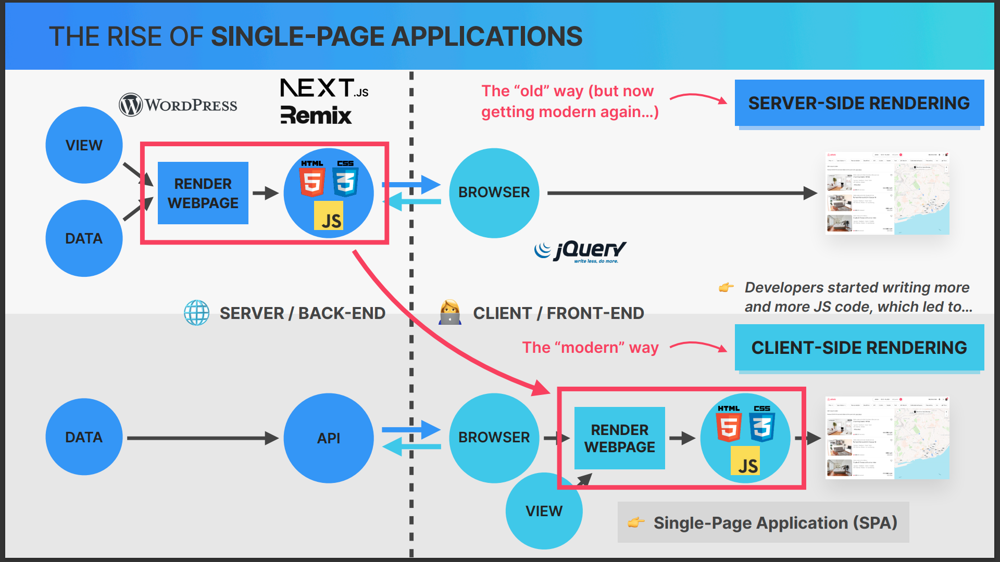
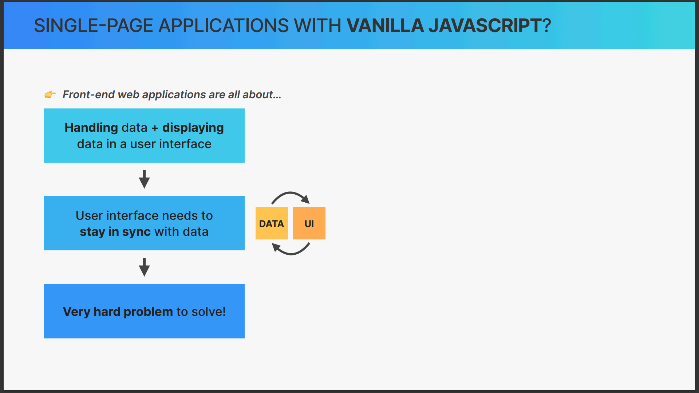
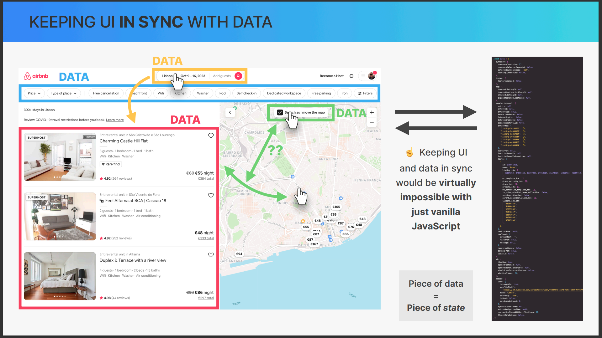
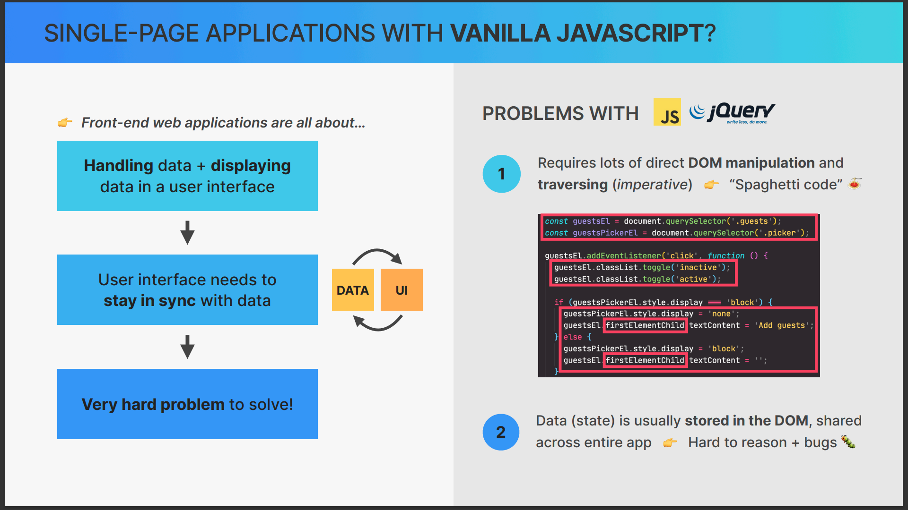
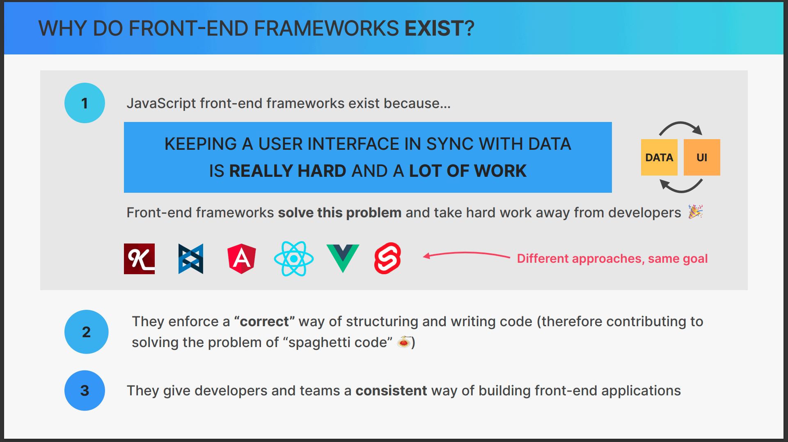

# 1.PART_REACT_FUNDAMENTALS

- [1.PART\_REACT\_FUNDAMENTALS](#1part_react_fundamentals)
  - [Introduction](#introduction)
  - [Before SPA(Single Page Application)](#before-spasingle-page-application)
  - [What is SPA(Single Page Application) ?](#what-is-spasingle-page-application-)
  - [writing a single page application with vanilla JavaScript](#writing-a-single-page-application-with-vanilla-javascript)
    - [writing a single page application with vanilla JavaScript compare to react ?](#writing-a-single-page-application-with-vanilla-javascript-compare-to-react-)
    - [why do front end frameworks exists ?](#why-do-front-end-frameworks-exists-)

## Introduction



## Before SPA(Single Page Application)

Before the advent of Single Page Applications (SPAs), websites were typically Multi-Page Applications (MPAs). Here's how they worked:

1. **Request-Response Cycle**: Every time a user clicked on a link or submitted a form on a webpage, a new HTTP request was sent to the server. The server would then process the request, generate a new HTML page, and send it back to the client. This is known as the request-response cycle.

2. **Page Reload**: Each request-response cycle resulted in a full page reload. This means that the entire webpage (including all HTML, CSS, and JavaScript) had to be downloaded and rendered again, even if only a small part of the page actually changed.

3. **Server-Side Rendering**: In MPAs, most of the application logic, including rendering the HTML, was typically handled on the server-side. This means that the server was responsible for generating the HTML that was sent to the client.

4. **State Management**: State management in MPAs was often handled through server-side sessions and cookies. When a user logged in, for example, a session would be created on the server, and a cookie with the session ID would be sent to the client. This cookie would then be included in every subsequent request to the server, allowing the server to identify the user and maintain their session.

5. **Navigation**: Navigation between pages in an MPA resulted in a completely new page being sent from the server. This could lead to a noticeable delay as the new page was downloaded and rendered, especially on slower internet connections.

In contrast, SPAs avoid full page reloads by using JavaScript to update only the parts of the page that change, leading to a smoother and more app-like user experience.

## What is SPA(Single Page Application) ?

A Single Page Application (SPA) is a type of web application or website that interacts with the user by dynamically rewriting the current web page with new data from the web server, instead of the default method of the browser loading entire new pages. The goal is faster transitions that make the website feel more like a native app.

In an SPA, all necessary HTML, CSS, and JavaScript code is either retrieved by the browser with a single page load, or the appropriate resources are dynamically loaded and added to the page as necessary, usually in response to user actions.

Here are some key characteristics of SPAs:

1. **No Page Reload**: In an SPA, most resources (HTML, CSS, JavaScript) are only loaded once throughout the lifespan of the application. Only data is transmitted back and forth.

2. **Client-Side Rendering**: SPAs primarily render pages in the browser. This means that the server is freed from the job of rendering HTML. Instead, it's primarily focused on serving and processing data, such as JSON, that the client (JavaScript in the browser) can use to generate the HTML.

3. **State Management**: In an SPA, state is managed on the client side. This means that information about the user's interaction with the app, such as which routes they've visited and what data they've entered, is stored in the browser.

4. **Routing**: SPAs use client-side routing. This means that when a user navigates through the application, the URL in the browser changes, but no actual request is sent to the server. Instead, JavaScript is used to manipulate the history and the content of the page.

5. **Performance**: Because SPAs don't require full page reloads, they can provide a smoother and faster user experience. However, they can also be more complex to build and maintain, and they require JavaScript to be enabled in the browser.

Examples of SPAs include Google Maps, Facebook, Twitter, Gmail, and many others.

## writing a single page application with vanilla JavaScript

### writing a single page application with vanilla JavaScript compare to react ?






Writing a Single Page Application (SPA) with vanilla JavaScript involves manually handling many aspects that frameworks like React abstract away. Here's a comparison of the two approaches:

1. **DOM Manipulation**: In vanilla JavaScript, you have to manually select DOM elements and update them. In React, this is handled by the virtual DOM, which optimizes rendering and improves performance.

2. **State Management**: In vanilla JavaScript, you have to manually manage the state of your application. React provides a built-in state management system, and there are also libraries like Redux for more complex state management.

3. **Component-Based Architecture**: React promotes a component-based architecture, which makes code more reusable and easier to manage. In vanilla JavaScript, you would have to implement this architecture yourself.

4. **Lifecycle Methods**: React components have lifecycle methods that allow you to control what happens when a component mounts, updates, and unmounts. In vanilla JavaScript, you would have to implement this functionality yourself.

5. **Routing**: React has libraries like React Router for client-side routing. In vanilla JavaScript, you would have to manually update the URL and handle history navigation.

Here's a simple example of a SPA in vanilla JavaScript:

```javascript
// HTML
<body>
  <div id="app"></div>
  <script src="app.js"></script>
</body>
```

```javascript
// JavaScript (app.js)
let state = {
  view: 'home',
  data: {}
};

function render() {
  const { view } = state;
  const app = document.getElementById('app');

  if (view === 'home') {
    app.innerHTML = '<h1>Home</h1><button onclick="navigate(\'about\')">Go to About</button>';
  } else if (view === 'about') {
    app.innerHTML = '<h1>About</h1><button onclick="navigate(\'home\')">Go to Home</button>';
  }
}

function navigate(view) {
  state.view = view;
  render();
}

render();
```

And here's how you might achieve the same functionality with React:

```jsx
// JavaScript (App.js)
import React, { useState } from 'react';

function App() {
  const [view, setView] = useState('home');

  if (view === 'home') {
    return (
      <div>
        <h1>Home</h1>
        <button onClick={() => setView('about')}>Go to About</button>
      </div>
    );
  } else if (view === 'about') {
    return (
      <div>
        <h1>About</h1>
        <button onClick={() => setView('home')}>Go to Home</button>
      </div>
    );
  }
}

export default App;
```

In both examples, clicking the button changes the view from 'home' to 'about' and vice versa. However, the React version is more declarative and easier to understand, especially as the application grows in complexity.

### why do front end frameworks exists ?



Front-end frameworks exist to simplify and streamline web development. They provide a structured and organized way to build web applications and handle common tasks, which can significantly reduce the amount of code that developers have to write. Here are some reasons why front-end frameworks like React, Angular, and Vue.js exist:

1. **Code Organization**: Front-end frameworks provide a structured way to organize code. They often follow design patterns like MVC (Model-View-Controller) or MVVM (Model-View-ViewModel) that separate concerns and make code easier to manage.

2. **Efficiency**: Front-end frameworks come with built-in methods and functions to perform common tasks, which can save developers a lot of time. They also often include tools for tasks like routing, state management, and form handling.

3. **Reusability**: Front-end frameworks promote the use of reusable components. This means that you can build a component once (like a button or a form field), and use it throughout your application, which can lead to more consistent and maintainable code.

4. **Performance**: Many front-end frameworks use techniques like virtual DOM diffing to improve performance. This means that they only update the parts of the page that need to change, rather than reloading the entire page.

5. **Community and Ecosystem**: Popular front-end frameworks have large communities and ecosystems. This means that there are plenty of resources available for learning and troubleshooting, as well as libraries and plugins to extend the functionality of the framework.

6. **Scalability**: Front-end frameworks are designed to be scalable. They provide patterns and structures that make it easier to grow an application over time.

In summary, front-end frameworks exist to help developers build complex web applications more efficiently and effectively. They provide structure, enforce best practices, and come with built-in tools and features that can save developers a lot of time and effort.
