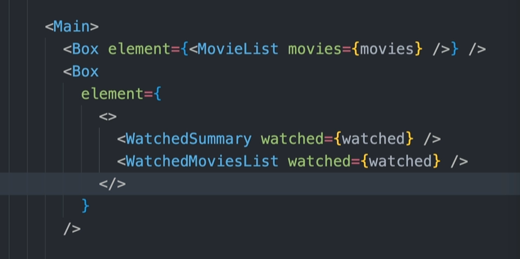

# 10 - Thinking in React Components, Composition, and Reusability

- [10 - Thinking in React Components, Composition, and Reusability](#10---thinking-in-react-components-composition-and-reusability)
  - [001 Section Overview](#001-section-overview)
  - [002 Setting Up the usePopcorn Project](#002-setting-up-the-usepopcorn-project)
  - [003 How to Split a UI Into Components](#003-how-to-split-a-ui-into-components)
    - [**Why Does Component Size Matter?**](#why-does-component-size-matter)
    - [**Small Components: Pros and Cons**](#small-components-pros-and-cons)
      - [**Pros** of Small Components:](#pros-of-small-components)
      - [**Cons** of Small Components:](#cons-of-small-components)
      - [**Example of Small Components**](#example-of-small-components)
        - [**Overly Small Components:**](#overly-small-components)
    - [**Large Components: Pros and Cons**](#large-components-pros-and-cons)
      - [**Pros** of Large Components:](#pros-of-large-components)
      - [**Cons** of Large Components:](#cons-of-large-components)
      - [**Example of a Large Component**](#example-of-a-large-component)
        - [**Overly Large Component:**](#overly-large-component)
    - [**Finding the Right Balance: The Middle Ground**](#finding-the-right-balance-the-middle-ground)
      - [**The Ideal Component Size**](#the-ideal-component-size)
      - [**Balanced Example: Product Card**](#balanced-example-product-card)
    - [**Guidelines for Deciding Component Size**](#guidelines-for-deciding-component-size)
    - [**Conclusion: Finding the Sweet Spot**](#conclusion-finding-the-sweet-spot)
    - [**The 4 Criteria for Splitting a UI into Components**](#the-4-criteria-for-splitting-a-ui-into-components)
    - [**1. Logical Separation of Content/Layout**](#1-logical-separation-of-contentlayout)
      - [**Example: Product Listing Component**](#example-product-listing-component)
      - [**Before: A Single Component**](#before-a-single-component)
      - [**After: Logical Separation of Content**](#after-logical-separation-of-content)
    - [**2. Reusability**](#2-reusability)
      - [**Example: Reusable Buttons**](#example-reusable-buttons)
      - [**Before: Hardcoded Buttons**](#before-hardcoded-buttons)
      - [**After: Reusable Button Component**](#after-reusable-button-component)
    - [**3. Responsibilities / Complexity**](#3-responsibilities--complexity)
      - [**Example: Handling Both State and UI in One Component**](#example-handling-both-state-and-ui-in-one-component)
      - [**Before: A Component with Too Many Responsibilities**](#before-a-component-with-too-many-responsibilities)
      - [**After: Separating Logic and UI**](#after-separating-logic-and-ui)
    - [**4. Personal Coding Style**](#4-personal-coding-style)
      - [**Example: Breaking Down Layout Components**](#example-breaking-down-layout-components)
      - [**Row and Column Components**](#row-and-column-components)
    - [**Conclusion: How to Split UI into Components**](#conclusion-how-to-split-ui-into-components)
    - [1. **Creating a New Component Creates a New Abstraction**](#1-creating-a-new-component-creates-a-new-abstraction)
      - [**Example**:](#example)
    - [2. **Name a Component According to What It Does or Displays**](#2-name-a-component-according-to-what-it-does-or-displays)
      - [**Example**:](#example-1)
    - [3. **Never Declare a New Component Inside Another Component**](#3-never-declare-a-new-component-inside-another-component)
      - [**Example**:](#example-2)
    - [4. **Co-locate Related Components Inside the Same File**](#4-co-locate-related-components-inside-the-same-file)
      - [**Example**:](#example-3)
    - [5. **It’s Normal for an App to Have Components of Different Sizes**](#5-its-normal-for-an-app-to-have-components-of-different-sizes)
      - [**Example**:](#example-4)
    - [**Conclusion**](#conclusion)
  - [004 Splitting Components in Practice](#004-splitting-components-in-practice)
  - [005 Component Categories](#005-component-categories)
    - [**1. Stateless/Presentational Components**](#1-statelesspresentational-components)
      - [**Example**:](#example-5)
      - [**Advantages**:](#advantages)
    - [**2. Stateful Components**](#2-stateful-components)
      - [**Example**:](#example-6)
      - [**Advantages**:](#advantages-1)
    - [**3. Structural Components**](#3-structural-components)
      - [**Example**:](#example-7)
      - [**Advantages**:](#advantages-2)
    - [**Summary of Categories**:](#summary-of-categories)
  - [006 Prop Drilling](#006-prop-drilling)
  - [**1. Understanding Prop Drilling**](#1-understanding-prop-drilling)
    - [**Simplified Example**](#simplified-example)
  - [**2. Why Prop Drilling Can Be Problematic**](#2-why-prop-drilling-can-be-problematic)
    - [**Issues with Prop Drilling**](#issues-with-prop-drilling)
  - [**3. Practical Examples Illustrating Prop Drilling**](#3-practical-examples-illustrating-prop-drilling)
    - [**Example Scenario**](#example-scenario)
    - [**Implementing Prop Drilling**](#implementing-prop-drilling)
      - [**1. `App` Component**](#1-app-component)
      - [**2. `Dashboard` Component**](#2-dashboard-component)
      - [**3. `Sidebar` Component**](#3-sidebar-component)
      - [**4. `UserMenu` Component**](#4-usermenu-component)
      - [**Issues Highlighted**](#issues-highlighted)
  - [**4. Solutions to Avoid Prop Drilling**](#4-solutions-to-avoid-prop-drilling)
    - [**1. Using the React Context API**](#1-using-the-react-context-api)
      - [**Steps to Use Context API**](#steps-to-use-context-api)
      - [**Advantages**](#advantages-3)
      - [**Updated Component Hierarchy**](#updated-component-hierarchy)
      - [**Visualization:**](#visualization)
    - [**2. Using State Management Libraries**](#2-using-state-management-libraries)
      - [**Pros:**](#pros)
      - [**Cons:**](#cons)
    - [**3. Render Props and Higher-Order Components (HOCs)**](#3-render-props-and-higher-order-components-hocs)
      - [**Render Props Example**](#render-props-example)
      - [**HOC Example**](#hoc-example)
    - [**4. Composition Patterns**](#4-composition-patterns)
      - [**Example**](#example-8)
  - [**Conclusion**](#conclusion-1)
  - [007 Component Composition](#007-component-composition)
    - [Left Side (Using a Component - **Not Reusable**)](#left-side-using-a-component---not-reusable)
    - [Example of this approach:](#example-of-this-approach)
    - [Right Side (Using **Component Composition** - **Reusable**)](#right-side-using-component-composition---reusable)
    - [Example of this approach (Component Composition):](#example-of-this-approach-component-composition)
    - [**Benefits of Component Composition**:](#benefits-of-component-composition)
    - [**Key Concepts:**](#key-concepts)
    - [**Conclusion:**](#conclusion-2)
    - [**What is Component Composition?**](#what-is-component-composition)
    - [**Understanding the Example in the Image**](#understanding-the-example-in-the-image)
      - [**The `Modal` Component**](#the-modal-component)
      - [**The `Error` Component**](#the-error-component)
    - [**Using Component Composition**](#using-component-composition)
    - [**Key Points:**](#key-points)
    - [**Advantages of Component Composition**](#advantages-of-component-composition)
    - [**A Real-World Example**](#a-real-world-example)
      - [**Confirmation Modal Example:**](#confirmation-modal-example)
      - [**Form in Modal Example:**](#form-in-modal-example)
    - [**Conclusion**](#conclusion-3)
  - [008 Fixing Prop Drilling With Composition (And Building a Layout)](#008-fixing-prop-drilling-with-composition-and-building-a-layout)
  - [Introduction](#introduction)
  - [What is Prop Drilling?](#what-is-prop-drilling)
  - [Understanding Composition in React](#understanding-composition-in-react)
  - [Fixing Prop Drilling with Composition](#fixing-prop-drilling-with-composition)
    - [Refactoring the Example with Composition](#refactoring-the-example-with-composition)
  - [Building a Layout with Composition](#building-a-layout-with-composition)
    - [Step 1: Define the Layout Components](#step-1-define-the-layout-components)
    - [Step 2: Compose the Layout in the App Component](#step-2-compose-the-layout-in-the-app-component)
    - [Explanation](#explanation)
    - [Benefits of This Approach](#benefits-of-this-approach)
  - [Advanced Composition Techniques](#advanced-composition-techniques)
    - [Using Render Props](#using-render-props)
    - [Using Higher-Order Components (HOC)](#using-higher-order-components-hoc)
  - [When to Use Context API](#when-to-use-context-api)
  - [Conclusion](#conclusion-4)
  - [Additional Resources](#additional-resources)
  - [009 Using Composition to Make a Reusable Box](#009-using-composition-to-make-a-reusable-box)
  - [Introduction](#introduction-1)
  - [Overview of the Code](#overview-of-the-code)
  - [Detailed Explanation](#detailed-explanation)
    - [Type Definitions](#type-definitions)
      - [`TTempMovieData`](#ttempmoviedata)
      - [`TTempWatchedData`](#ttempwatcheddata)
    - [Temporary Data Initialization](#temporary-data-initialization)
      - [`tempMovieData`](#tempmoviedata)
      - [`tempWatchedData`](#tempwatcheddata)
    - [The `App` Component](#the-app-component)
      - [Importing Dependencies](#importing-dependencies)
      - [State Initialization](#state-initialization)
      - [Return Statement](#return-statement)
  - [Understanding Composition in This Code](#understanding-composition-in-this-code)
    - [`NavBar` Component](#navbar-component)
    - [`Main` Component](#main-component)
  - [Avoiding Prop Drilling](#avoiding-prop-drilling)
  - [Detailed Breakdown of Components](#detailed-breakdown-of-components)
    - [`NavBar` Component](#navbar-component-1)
    - [`SearchBar` Component](#searchbar-component)
    - [`NumResults` Component](#numresults-component)
    - [`Main` Component](#main-component-1)
    - [`Box` Component](#box-component)
    - [`MovieList` Component](#movielist-component)
    - [`WatchSummery` Component](#watchsummery-component)
    - [`WatchedMovieList` Component](#watchedmovielist-component)
  - [Benefits of This Approach](#benefits-of-this-approach-1)
    - [Enhanced Readability](#enhanced-readability)
    - [Improved Maintainability](#improved-maintainability)
    - [Increased Reusability](#increased-reusability)
    - [Avoidance of Prop Drilling](#avoidance-of-prop-drilling)
  - [Applying the Concepts: An Example Scenario](#applying-the-concepts-an-example-scenario)
    - [Scenario](#scenario)
    - [Implementation Steps](#implementation-steps)
    - [Composition Benefits in This Scenario](#composition-benefits-in-this-scenario)
  - [Further Enhancements with Context API](#further-enhancements-with-context-api)
    - [When to Use Context](#when-to-use-context)
    - [Implementing Context in This App](#implementing-context-in-this-app)
  - [Conclusion](#conclusion-5)
  - [Key Takeaways](#key-takeaways)
  - [Additional Examples](#additional-examples)
    - [Example 1: Extending `NavBar` with User Info](#example-1-extending-navbar-with-user-info)
      - [Update `NavBar` Component](#update-navbar-component)
      - [Pass `watchedCount` from `App`](#pass-watchedcount-from-app)
    - [Example 2: Adding a Theme Context](#example-2-adding-a-theme-context)
      - [Create Theme Context](#create-theme-context)
      - [Provide Theme in `App`](#provide-theme-in-app)
      - [Consume Theme in Components](#consume-theme-in-components)
  - [Final Thoughts](#final-thoughts)
  - [010 Passing Elements as Props (Alternative to children)](#010-passing-elements-as-props-alternative-to-children)
  - [Introduction](#introduction-2)
  - [Understanding `children` in React](#understanding-children-in-react)
    - [Basic Usage of `children`](#basic-usage-of-children)
    - [Limitations of `children`](#limitations-of-children)
  - [Passing Elements as Props](#passing-elements-as-props)
    - [How It Works](#how-it-works)
  - [Deep Dive into Examples](#deep-dive-into-examples)
    - [Example 1: Building a Custom Card Component](#example-1-building-a-custom-card-component)
      - [Using `children`:](#using-children)
      - [Using Elements as Props:](#using-elements-as-props)
    - [Example 2: Modal Component with Customizable Header and Footer](#example-2-modal-component-with-customizable-header-and-footer)
      - [Using `children` and Additional Props:](#using-children-and-additional-props)
      - [Using Elements as Props for All Sections:](#using-elements-as-props-for-all-sections)
  - [Benefits of Passing Elements as Props](#benefits-of-passing-elements-as-props)
  - [When to Use Elements as Props](#when-to-use-elements-as-props)
    - [Suitable Scenarios](#suitable-scenarios)
    - [Less Suitable Scenarios](#less-suitable-scenarios)
  - [Comparison with `children`](#comparison-with-children)
    - [Using `children`](#using-children-1)
    - [Passing Elements as Props](#passing-elements-as-props-1)
  - [Advanced Examples](#advanced-examples)
    - [Example 3: Form Component with Customizable Inputs](#example-3-form-component-with-customizable-inputs)
      - [Using `children`:](#using-children-2)
      - [Using Elements as Props:](#using-elements-as-props-1)
    - [Example 4: Tabs Component with Explicit Panels](#example-4-tabs-component-with-explicit-panels)
      - [Using `children`:](#using-children-3)
      - [Using Elements as Props:](#using-elements-as-props-2)
  - [TypeScript Considerations](#typescript-considerations)
    - [Defining Prop Types](#defining-prop-types)
    - [Enforcing Specific Element Types](#enforcing-specific-element-types)
  - [Potential Drawbacks](#potential-drawbacks)
  - [Best Practices](#best-practices)
  - [Conclusion](#conclusion-6)
  - [Additional Resources](#additional-resources-1)
  - [Experiment and Explore](#experiment-and-explore)
  - [011 Building a Reusable Star Rating Component](#011-building-a-reusable-star-rating-component)
  - [Introduction](#introduction-3)
  - [Overview of the Code](#overview-of-the-code-1)
  - [Importing Dependencies](#importing-dependencies-1)
  - [Defining Styles](#defining-styles)
    - [StarContainer Style](#starcontainer-style)
    - [StarList Style](#starlist-style)
    - [TextStyle Style](#textstyle-style)
  - [Defining the Component](#defining-the-component)
    - [TypeScript Props Interface](#typescript-props-interface)
    - [StarRating Component Declaration](#starrating-component-declaration)
  - [Rendering Logic](#rendering-logic)
    - [Component Return Statement](#component-return-statement)
    - [Generating the Stars](#generating-the-stars)
    - [Displaying the Rating Value](#displaying-the-rating-value)
  - [Exporting the Component](#exporting-the-component)
  - [Putting It All Together](#putting-it-all-together)
  - [Example Usage](#example-usage)
    - [Importing and Using the `StarRating` Component](#importing-and-using-the-starrating-component)
    - [Expected Output](#expected-output)
  - [Enhancing the Component](#enhancing-the-component)
    - [Making the Rating Dynamic](#making-the-rating-dynamic)
      - [Updated Props Interface](#updated-props-interface)
      - [Updating the Component Logic](#updating-the-component-logic)
      - [Updated Example Usage](#updated-example-usage)
      - [Expected Output](#expected-output-1)
  - [Adding Interactivity](#adding-interactivity)
    - [Updating the Component](#updating-the-component)
      - [Props Interface with Callback](#props-interface-with-callback)
      - [Component Logic with State](#component-logic-with-state)
    - [Using the Interactive Component](#using-the-interactive-component)
    - [Expected Behavior](#expected-behavior)
  - [Handling Hover Effects](#handling-hover-effects)
    - [Implementing Hover Effects](#implementing-hover-effects)
      - [Component Logic with Hover State](#component-logic-with-hover-state)
    - [Expected Behavior](#expected-behavior-1)
  - [Final Component Code](#final-component-code)
  - [Styling Considerations](#styling-considerations)
    - [Using CSS Classes](#using-css-classes)
    - [Updated Component with Class Names](#updated-component-with-class-names)
  - [Conclusion](#conclusion-7)
  - [Key Takeaways](#key-takeaways-1)
  - [Further Exploration](#further-exploration)
  - [Additional Resources](#additional-resources-2)
  - [012 Creating the Stars](#012-creating-the-stars)
  - [Introduction](#introduction-4)
  - [Overview of the Code](#overview-of-the-code-2)
  - [Detailed Explanation](#detailed-explanation-1)
    - [1. The `Star` Component (`Star.tsx`)](#1-the-star-component-startsx)
      - [Importing Dependencies](#importing-dependencies-2)
      - [Component Definition](#component-definition)
      - [SVG Icons](#svg-icons)
      - [Summary of `Star` Component](#summary-of-star-component)
    - [2. The `StarRating` Component (`StarRating.tsx`)](#2-the-starrating-component-starratingtsx)
      - [Importing Dependencies](#importing-dependencies-3)
      - [Styling Objects](#styling-objects)
      - [Props Interface](#props-interface)
      - [Component Definition](#component-definition-1)
      - [State Management](#state-management)
      - [Event Handler](#event-handler)
      - [Rendering the Component](#rendering-the-component)
      - [Summary of `StarRating` Component](#summary-of-starrating-component)
  - [How the Components Work Together](#how-the-components-work-together)
  - [Example Usage](#example-usage-1)
    - [App Component (`App.tsx`)](#app-component-apptsx)
    - [Expected Behavior](#expected-behavior-2)
  - [Enhancing the Component](#enhancing-the-component-1)
    - [Adding Hover Effects](#adding-hover-effects)
      - [Update `StarRating` Component](#update-starrating-component)
    - [Expected Behavior with Hover Effects](#expected-behavior-with-hover-effects)
  - [Possible Enhancements](#possible-enhancements)
    - [Customizing Star Colors](#customizing-star-colors)
      - [Update Props Interface](#update-props-interface)
      - [Pass Colors to `Star` Component](#pass-colors-to-star-component)
      - [Update `Star` Component to Use Colors](#update-star-component-to-use-colors)
    - [Using External Stylesheets or CSS Modules](#using-external-stylesheets-or-css-modules)
  - [Conclusion](#conclusion-8)
  - [Additional Examples](#additional-examples-1)
    - [Example: Using the Component with Custom Colors](#example-using-the-component-with-custom-colors)
    - [Example: Handling Rating Changes](#example-handling-rating-changes)
    - [Modifying the `StarRating` Component to Accept `onRatingChange`](#modifying-the-starrating-component-to-accept-onratingchange)
      - [Update Props Interface](#update-props-interface-1)
      - [Update `handleRating` Function](#update-handlerating-function)
  - [Key Takeaways](#key-takeaways-2)
  - [Further Exploration](#further-exploration-1)
  - [Additional Resources](#additional-resources-3)
  - [013 Handling Hover Events](#013-handling-hover-events)
  - [Introduction](#introduction-5)
  - [Overview of the Code](#overview-of-the-code-3)
  - [Detailed Explanation](#detailed-explanation-2)
    - [1. The `StarRating` Component (`StarRating.tsx`)](#1-the-starrating-component-starratingtsx)
      - [Importing Dependencies](#importing-dependencies-4)
      - [Styling Objects](#styling-objects-1)
      - [Props Interface](#props-interface-1)
      - [Component Definition](#component-definition-2)
      - [State Management](#state-management-1)
      - [Event Handlers](#event-handlers)
      - [Rendering the Component](#rendering-the-component-1)
      - [Summary of `StarRating` Component](#summary-of-starrating-component-1)
    - [2. The `Star` Component (`Star.tsx`)](#2-the-star-component-startsx)
      - [Expected `Star` Component Interface](#expected-star-component-interface)
      - [Expected `Star` Component Structure](#expected-star-component-structure)
      - [SVG Icons](#svg-icons-1)
  - [How the Components Work Together](#how-the-components-work-together-1)
  - [Example Usage](#example-usage-2)
    - [App Component (`App.tsx`)](#app-component-apptsx-1)
    - [Expected Behavior](#expected-behavior-3)
  - [Enhancing the Component](#enhancing-the-component-2)
    - [Adding Customization Options](#adding-customization-options)
      - [Updating the Props Interface](#updating-the-props-interface)
      - [Modifying the Component](#modifying-the-component)
      - [Example Usage with External Rating Management](#example-usage-with-external-rating-management)
    - [Customizing Star Appearance](#customizing-star-appearance)
      - [Adding Color Props](#adding-color-props)
      - [Updating the `Star` Component](#updating-the-star-component)
      - [Example Usage with Custom Colors](#example-usage-with-custom-colors)
  - [Handling Edge Cases and Accessibility](#handling-edge-cases-and-accessibility)
    - [Edge Cases](#edge-cases)
    - [Accessibility Enhancements](#accessibility-enhancements)
      - [Example Accessibility Implementation](#example-accessibility-implementation)
  - [Conclusion](#conclusion-9)
  - [Key Takeaways](#key-takeaways-3)
  - [Further Exploration](#further-exploration-2)
  - [Additional Resources](#additional-resources-4)
  - [014 Props as a Component API](#014-props-as-a-component-api)
  - [015 Improving Reusability With Props](#015-improving-reusability-with-props)
  - [016 PropTypes](#016-proptypes)
  - [017 CHALLENGE #1 Text Expander Component](#017-challenge-1-text-expander-component)

## 001 Section Overview

## 002 Setting Up the usePopcorn Project
## 003 How to Split a UI Into Components


The image you've provided illustrates a very important concept in React development: **Component Size Matters**. It highlights the balance developers need to strike between creating components that are either **too small** or **too large**. Both extremes have drawbacks, and the goal is to find a middle ground that allows for reusability, maintainability, and clarity.

Let’s break this concept down in detail and discuss why component size matters and how to approach this issue with examples.

---

### **Why Does Component Size Matter?**

React encourages **component-based architecture**, where you build your UI by combining smaller, reusable pieces (components). However, deciding how big or small a component should be is a crucial part of development. Components that are **too small** or **too big** lead to various problems, as explained in the image.

---

### **Small Components: Pros and Cons**

#### **Pros** of Small Components:
- **Reusability**: Small components are often easier to reuse in different parts of the application.
- **Single Responsibility**: Following the **Single Responsibility Principle** means that small components are focused on doing one thing and doing it well.

#### **Cons** of Small Components:
- **Too Many Components**: If you break everything down into very small pieces, your codebase could end up with **hundreds of tiny components**. This can make the codebase difficult to navigate and maintain.
- **Over-Abstraction**: Sometimes, breaking things down too much can abstract the logic too much, making it hard to understand how different pieces fit together. Each component may hide too many details of the overall implementation.
- **Confusing Codebase**: As the number of components grows, it can be hard for new developers (or even yourself later on) to figure out where certain logic is implemented because it’s spread out across many files and components.

#### **Example of Small Components**

Let’s consider an example where you have a product card that displays an image, title, and price.

##### **Overly Small Components:**
```jsx
const ProductImage = ({ src }) => ;
const ProductTitle = ({ title }) => <h3>{title}</h3>;
const ProductPrice = ({ price }) => <p>{price}</p>;

const ProductCard = ({ product }) => (
  <div>
    <ProductImage src={product.image} />
    <ProductTitle title={product.title} />
    <ProductPrice price={product.price} />
  </div>
);
```

In this example:
- The `ProductImage`, `ProductTitle`, and `ProductPrice` components are too granular.
- While this approach offers flexibility and reusability, it creates a lot of unnecessary small components, which can make the code harder to manage, especially if these components are not reused elsewhere.

---

### **Large Components: Pros and Cons**

#### **Pros** of Large Components:
- **Easier to Understand Locally**: When components are larger, it’s easier to see all related logic in one place.
- **Less Component Overhead**: Fewer components mean less overhead in terms of managing and navigating the component tree, making it easier to trace functionality when debugging.

#### **Cons** of Large Components:
- **Too Many Responsibilities**: Large components often end up violating the **Single Responsibility Principle** because they handle too many concerns at once (e.g., managing state, rendering UI, handling side effects). This makes the component harder to reason about, test, and maintain.
- **Hard to Reuse**: When a component does too many things, it becomes difficult to reuse it in different parts of the application because its logic and structure are tightly coupled.
- **Complex Code**: With large components, the internal logic can become complex and hard to understand. It becomes harder to know what each part of the component does without a lot of investigation.

#### **Example of a Large Component**

Let’s consider a product card again but this time with too much logic inside one component.

##### **Overly Large Component:**
```jsx
const ProductCard = ({ product }) => {
  const addToCart = () => {
    // Add the product to the cart
  };

  return (
    <div>
      
      <h3>{product.title}</h3>
      <p>{product.price}</p>
      <button onClick={addToCart}>Add to Cart</button>
    </div>
  );
};
```

In this example:
- The `ProductCard` handles both the rendering of the product details and the logic for adding the product to the cart.
- This tightly couples the rendering logic with the functionality of adding to the cart, making it harder to reuse this component if the cart functionality changes or moves elsewhere.

---

### **Finding the Right Balance: The Middle Ground**

The key takeaway from the image is that **we need to find the right balance** between breaking components down into many small pieces and grouping too many responsibilities in one large component.

#### **The Ideal Component Size**

A good rule of thumb is that a component should:
- **Handle one responsibility** or a **cohesive part of the UI**.
- Be **easy to reuse** but not overly abstracted.
- Be **easy to test** in isolation.
- Be **easy to maintain**, with clear boundaries between concerns.

#### **Balanced Example: Product Card**

Here’s a more balanced approach to creating the `ProductCard` component:

```jsx
const ProductDetails = ({ product }) => (
  <div>
    
    <h3>{product.title}</h3>
    <p>{product.price}</p>
  </div>
);

const AddToCartButton = ({ onAdd }) => (
  <button onClick={onAdd}>Add to Cart</button>
);

const ProductCard = ({ product, onAddToCart }) => (
  <div>
    <ProductDetails product={product} />
    <AddToCartButton onAdd={() => onAddToCart(product)} />
  </div>
);
```

- The `ProductDetails` component is responsible for rendering the product information.
- The `AddToCartButton` is a reusable button that handles the "add to cart" action.
- The `ProductCard` component brings them together but delegates the specific responsibilities to smaller, more focused components.

This approach keeps components **small enough to be reusable** but **large enough to handle a meaningful part of the UI** without splitting it into too many trivial pieces.

---

### **Guidelines for Deciding Component Size**

1. **Single Responsibility Principle (SRP)**:
   - Each component should handle one responsibility. If you notice a component doing too many things (e.g., managing state, handling side effects, rendering UI), consider breaking it down into smaller components.

2. **Reusability**:
   - If a part of your component can be reused in multiple places, consider making it a separate component. However, avoid breaking things down into overly granular components if they are unlikely to be reused.

3. **Component Composition**:
   - Think in terms of **component composition**: larger components should be composed of smaller components that handle distinct pieces of the logic/UI. This allows for better readability, maintainability, and testability.

4. **Prop Drilling**:
   - If you find yourself passing too many props through several components, it may be a sign that a component is taking on too many responsibilities or is not positioned correctly in the component hierarchy.

---

### **Conclusion: Finding the Sweet Spot**

There’s no strict rule for how big or small a component should be, but finding the **right balance** is crucial for creating maintainable and scalable applications. 

- **Too many small components** can lead to a fragmented and confusing codebase with too much abstraction.
- **Too large components** can become hard to maintain, understand, and reuse.

Aim for a middle ground where each component has a clear responsibility, is easy to understand, and can be reused where appropriate. By following this approach, you can build more maintainable and scalable React applications.

The image you've provided outlines the key principles for **splitting a user interface (UI) into components** in React. These guidelines are essential for maintaining a clean, reusable, and easy-to-understand codebase. Let’s go through these criteria in depth with examples to illustrate how you should think about breaking down a UI into components.

---

### **The 4 Criteria for Splitting a UI into Components**

1. **Logical Separation of Content/Layout**
2. **Reusability**
3. **Responsibilities/Complexity**
4. **Personal Coding Style**

Let's break down each criterion and understand how to apply it effectively.

---

### **1. Logical Separation of Content/Layout**

The first criterion is ensuring that your components have a **logical separation** between content and layout. This means that each component should represent a distinct part of the UI and handle one specific task or layout element.

#### **Example: Product Listing Component**

Imagine you have a product listing with the following structure:

- Image of the product
- Product title
- Product description
- Price and availability
- Buttons like "Add to Cart" or "Wishlist"

You could structure this as one large component, but that wouldn’t have a logical separation of content. Instead, you could split it up like this:

#### **Before: A Single Component**

```jsx
const ProductCard = ({ product }) => (
  <div>
    
    <h3>{product.title}</h3>
    <p>{product.description}</p>
    <p>{product.price}</p>
    <button>Add to Cart</button>
    <button>Wishlist</button>
  </div>
);
```

This component is doing **too much**. It handles the image, text, and buttons in a single place, which is harder to maintain and reuse.

#### **After: Logical Separation of Content**

```jsx
const ProductImage = ({ image, title }) => ;
const ProductDetails = ({ title, description, price }) => (
  <div>
    <h3>{title}</h3>
    <p>{description}</p>
    <p>{price}</p>
  </div>
);
const ProductActions = () => (
  <div>
    <button>Add to Cart</button>
    <button>Wishlist</button>
  </div>
);
const ProductCard = ({ product }) => (
  <div>
    <ProductImage image={product.image} title={product.title} />
    <ProductDetails title={product.title} description={product.description} price={product.price} />
    <ProductActions />
  </div>
);
```

By splitting the content into distinct parts (`ProductImage`, `ProductDetails`, `ProductActions`), you achieve **logical separation**, making it easier to maintain and reuse individual components.

---

### **2. Reusability**

The second criterion is **reusability**. When building components, think about whether they can be reused in different parts of the application. A reusable component is generic and flexible enough to be used in multiple places without needing to modify the core logic.

#### **Example: Reusable Buttons**

In your application, you may have buttons for various actions like "Add to Cart," "Submit," or "Save." Rather than hardcoding these buttons in each place, you can create a **reusable Button component**.

#### **Before: Hardcoded Buttons**

```jsx
const ProductCard = () => (
  <div>
    <button>Add to Cart</button>
    <button>Wishlist</button>
  </div>
);
```

This is not reusable because the button text and behavior are hardcoded.

#### **After: Reusable Button Component**

```jsx
const Button = ({ label, onClick }) => (
  <button onClick={onClick}>{label}</button>
);
const ProductActions = () => (
  <div>
    <Button label="Add to Cart" onClick={() => console.log('Added to cart')} />
    <Button label="Wishlist" onClick={() => console.log('Added to wishlist')} />
  </div>
);
```

Now, the `Button` component can be reused for different actions throughout your app by simply passing different `label` and `onClick` props.

---

### **3. Responsibilities / Complexity**

The third criterion focuses on reducing complexity and ensuring that components follow the **Single Responsibility Principle (SRP)**. A component should have **one responsibility** and do that well. This makes components easier to test, debug, and maintain.

#### **Example: Handling Both State and UI in One Component**

Let’s consider a form component that is responsible for both rendering the form UI and managing form state.

#### **Before: A Component with Too Many Responsibilities**

```jsx
const Form = () => {
  const [name, setName] = useState('');
  const handleSubmit = () => {
    console.log('Form submitted:', name);
  };

  return (
    <form onSubmit={handleSubmit}>
      <input value={name} onChange={e => setName(e.target.value)} />
      <button type="submit">Submit</button>
    </form>
  );
};
```

Here, the `Form` component is managing state and rendering the form UI, which makes it harder to maintain and reuse.

#### **After: Separating Logic and UI**

```jsx
const useForm = () => {
  const [name, setName] = useState('');
  const handleSubmit = () => {
    console.log('Form submitted:', name);
  };
  return { name, setName, handleSubmit };
};

const Form = ({ name, setName, handleSubmit }) => (
  <form onSubmit={handleSubmit}>
    <input value={name} onChange={e => setName(e.target.value)} />
    <button type="submit">Submit</button>
  </form>
);

const App = () => {
  const { name, setName, handleSubmit } = useForm();
  return <Form name={name} setName={setName} handleSubmit={handleSubmit} />;
};
```

By splitting the form logic into the `useForm` custom hook, the `Form` component becomes responsible only for rendering the UI, while the `useForm` hook handles the state and logic.

---

### **4. Personal Coding Style**

While the first three criteria are more objective, **personal coding style** plays a role in how you break down components. Different developers have different approaches based on their preferences, team conventions, or specific project requirements.

#### **Example: Breaking Down Layout Components**

Some developers may prefer to create layout components for things like rows, columns, or containers.

#### **Row and Column Components**

```jsx
const Row = ({ children }) => <div style={{ display: 'flex' }}>{children}</div>;
const Column = ({ children }) => <div style={{ flex: 1 }}>{children}</div>;

const LayoutExample = () => (
  <Row>
    <Column>Left Content</Column>
    <Column>Right Content</Column>
  </Row>
);
```

Other developers might prefer to use simpler HTML structures without abstracting them into layout components. In this case, personal coding style dictates how granular you get with component creation.

---

### **Conclusion: How to Split UI into Components**

In React development, splitting the UI into components is not just about breaking things down but doing so thoughtfully and strategically. Following these four criteria helps you avoid common pitfalls and create a scalable, maintainable application:

1. **Logical Separation of Content/Layout**: Break components down based on their role in the UI, separating concerns like layout and content.
2. **Reusability**: Look for opportunities to make components generic and reusable across different parts of the app.
3. **Responsibilities/Complexity**: Ensure each component follows the Single Responsibility Principle (SRP) and isn’t overloaded with too much logic or too many concerns.
4. **Personal Coding Style**: Consider your own preferences and team conventions when deciding how granular or abstract your components should be.

By keeping these principles in mind, you can build a well-structured React app that is easy to maintain, extend, and scale.


Let's go through each of the general guidelines presented in the image, breaking them down with examples to illustrate their importance in React development:

### 1. **Creating a New Component Creates a New Abstraction**

- **Explanation**: When you create a new component, you are introducing a new level of abstraction in your code. Abstractions are useful, but they come at a cost: switching back and forth between too many components can increase the complexity of understanding the app.
- **Mental Cost**: More components mean more mental energy required to keep track of what each component does and how they interact with each other. 
- **Best Practice**: Don’t create new components too early in the development process. Only introduce a new component when there’s a clear need for it (e.g., when you want to reuse it in multiple places, or to improve readability by separating concerns).

#### **Example**:

- **Too Many Components Too Early**:
  ```jsx
  const Title = ({ text }) => <h1>{text}</h1>;
  const Description = ({ text }) => <p>{text}</p>;

  const ProductCard = ({ product }) => (
    <div>
      <Title text={product.title} />
      <Description text={product.description} />
    </div>
  );
  ```

  Here, `Title` and `Description` might be overkill if they’re only used in this `ProductCard` and don’t add significant complexity to the component. Creating them adds unnecessary abstraction.

- **Simpler Approach**:
  ```jsx
  const ProductCard = ({ product }) => (
    <div>
      <h1>{product.title}</h1>
      <p>{product.description}</p>
    </div>
  );
  ```

  By keeping everything in one component, you reduce abstraction and make the code easier to follow.

---

### 2. **Name a Component According to What It Does or Displays**

- **Explanation**: Naming is crucial to making your code easy to understand. Components should have clear, descriptive names that indicate what they do or display. Don’t hesitate to use longer names if it improves clarity.
- **Avoid Short or Vague Names**: Using names like `Box` or `Wrapper` doesn’t provide enough information about what the component actually does.
- **Best Practice**: Give components names like `ProductCard`, `UserProfile`, or `NavigationBar`, which clearly describe the purpose of the component.

#### **Example**:

- **Poor Naming**:
  ```jsx
  const Box = ({ children }) => <div>{children}</div>;
  ```

  The name `Box` is too generic and doesn’t tell us much about what the component does.

- **Better Naming**:
  ```jsx
  const ProductCard = ({ product }) => (
    <div>
      <h1>{product.title}</h1>
      <p>{product.description}</p>
    </div>
  );
  ```

  `ProductCard` is much clearer. It tells us this component is responsible for displaying product information.

---

### 3. **Never Declare a New Component Inside Another Component**

- **Explanation**: Declaring components inside other components causes React to recreate the component on every render, which can lead to performance issues and unnecessary re-renders.
- **Separation of Concerns**: Components should have their own scope and should not be declared inside other components to maintain clear boundaries.
- **Best Practice**: Always declare components outside of other components.

#### **Example**:

- **Incorrect**:
  ```jsx
  const ParentComponent = () => {
    const ChildComponent = () => <div>Child</div>;
    return <ChildComponent />;
  };
  ```

  In this example, `ChildComponent` is recreated every time `ParentComponent` renders, which can degrade performance.

- **Correct**:
  ```jsx
  const ChildComponent = () => <div>Child</div>;

  const ParentComponent = () => <ChildComponent />;
  ```

  By moving `ChildComponent` outside, we prevent it from being recreated unnecessarily.

---

### 4. **Co-locate Related Components Inside the Same File**

- **Explanation**: Components that are closely related (e.g., a `ProductImage` component and a `ProductDetails` component used inside a `ProductCard`) can be kept in the same file. This practice makes the code easier to follow and maintain.
- **Don’t Separate Too Early**: Don’t split components into different files prematurely. It’s okay to colocate components until the code becomes too large or too complex.
- **Best Practice**: Co-locate related components, especially if they will only be used together. Later, you can move them to separate files if needed.

#### **Example**:

- **Co-locating Components**:
  ```jsx
  // ProductCard.js
  const ProductImage = ({ image }) => ;
  const ProductDetails = ({ title, description }) => (
    <div>
      <h1>{title}</h1>
      <p>{description}</p>
    </div>
  );

  const ProductCard = ({ product }) => (
    <div>
      <ProductImage image={product.image} />
      <ProductDetails title={product.title} description={product.description} />
    </div>
  );
  ```

  In this example, the related components (`ProductImage`, `ProductDetails`, and `ProductCard`) are kept in the same file because they belong to the same logical grouping. Only move them to separate files if they grow in complexity or are used in other parts of the app.

---

### 5. **It’s Normal for an App to Have Components of Different Sizes**

- **Explanation**: Not all components need to be the same size. Some components will be small and focused (like a `Button`), while others might be larger and more complex (like a `Dashboard` component). This variation is normal and expected.
- **Small vs. Large Components**: Small components handle specific tasks, while larger components might manage more complex layouts or combine multiple smaller components.
- **Best Practice**: Don’t worry if some components are large as long as they are managing complexity appropriately. If a component becomes too large, look for ways to refactor it into smaller pieces.

#### **Example**:

- **Small Component**:
  ```jsx
  const Button = ({ label, onClick }) => (
    <button onClick={onClick}>{label}</button>
  );
  ```

  This is a small, focused component that handles a specific task (rendering a button).

- **Larger Component**:
  ```jsx
  const Dashboard = ({ user, stats }) => (
    <div>
      <h1>Welcome, {user.name}</h1>
      <Stats stats={stats} />
      <RecentActivity activities={user.activities} />
    </div>
  );
  ```

  The `Dashboard` component is larger because it combines multiple smaller components (`Stats`, `RecentActivity`) to display a complex UI. This is perfectly fine as long as it’s managing the complexity appropriately.

---

### **Conclusion**

These guidelines are key to building maintainable, scalable React applications:

1. **New abstractions** (new components) should be created only when necessary to avoid over-complicating the app.
2. **Component names** should be descriptive of what the component does or displays.
3. **Components should not be declared inside other components** to avoid performance issues and maintain separation of concerns.
4. **Related components should be co-located** until complexity warrants separation.
5. **It’s natural for some components to be small and others to be large**—don’t feel like all components need to be the same size.

By following these guidelines, your components will be easier to understand, maintain, and scale in a React application.

## 004 Splitting Components in Practice
```
App
├── NavBar
│   ├── Logo
│   ├── SearchBar
│   ├── NumResults
├── Main
│   ├── ListBox
│   │   ├── MovieList
│   │   │   ├── Movie
│   ├── WatchBox
│   │   ├── WatchedMovieList
│   │   │   ├── WatchedMovie
│   │   ├── WatchSummery
```

## 005 Component Categories

The image you’ve shared highlights three main categories of React components: **Stateless/Presentational components**, **Stateful components**, and **Structural components**. Let’s go through each category in depth with examples to understand how to categorize your components and when to use each type.

---

### **1. Stateless/Presentational Components**

- **Description**: These components do not manage any state internally. They are "dumb" components that receive **props** and simply **display content** or render UI based on those props. They are often small, focused, and reusable because they handle only presentation logic and not business logic.

- **Key Characteristics**:
  - **No internal state**: They don’t manage state themselves. All data comes through props.
  - **Reusability**: They are often small and easy to reuse in different parts of the application.
  - **Focus on presentation**: Their only job is to display something based on the data provided.

#### **Example**:

Let’s say you have a movie app where you need to display a list of movies.

```tsx
const Movie = ({ title, year }) => (
  <div>
    <h2>{title}</h2>
    <p>{year}</p>
  </div>
);

const MovieList = ({ movies }) => (
  <div>
    {movies.map(movie => (
      <Movie key={movie.id} title={movie.title} year={movie.year} />
    ))}
  </div>
);
```

In this example:
- The `Movie` component is stateless. It simply displays the title and year of a movie, and it does not manage any internal state.
- The `MovieList` component is also stateless. It just loops through an array of movies and renders the `Movie` component for each one.

#### **Advantages**:
- **Reusable**: These components are often highly reusable in different parts of your application.
- **Easy to test**: Since they don’t have internal logic or state, they are easy to test.
- **Separation of concerns**: They handle only UI rendering, keeping the logic separate from the view.

---

### **2. Stateful Components**

- **Description**: These components manage **internal state**. They usually contain business logic or state management logic that affects what is rendered. While they can still be reusable, their role is to manage dynamic data or interactions, such as form inputs, toggles, and filtering.

- **Key Characteristics**:
  - **Have state**: They use React’s `useState` (or other hooks) to manage state.
  - **Can still be reusable**: Though they manage state, they can still be reused if they are designed generically.
  - **Interactive**: Often used for handling user interactions or data updates.

#### **Example**:

Let’s say you want a search bar that allows users to filter a list of movies.

```tsx
const SearchBar = ({ onSearch }) => {
  const [query, setQuery] = useState("");

  const handleChange = (e) => {
    setQuery(e.target.value);
    onSearch(e.target.value);
  };

  return (
    <input
      type="text"
      value={query}
      onChange={handleChange}
      placeholder="Search movies..."
    />
  );
};
```

In this example:
- `SearchBar` is a **stateful component** because it manages the `query` state, which represents the user’s input.
- As the user types, the state (`query`) is updated and passed back to the parent through the `onSearch` prop.

#### **Advantages**:
- **Handles user input**: Ideal for components that manage user input or need to respond to changes.
- **Manages internal logic**: Great for handling dynamic data and updating the UI based on the state.
- **Still reusable**: If designed carefully, stateful components can still be reusable, for instance, by passing the state-modifying function (`onSearch`) as props to make them flexible.

---

### **3. Structural Components**

- **Description**: These components represent **larger, structural pieces of your application**, such as pages, layouts, or entire screens. They often **compose multiple smaller components** together. While they can be reusable (e.g., layouts), they are sometimes more specific and **non-reusable**. For example, a component that handles the entire layout of a dashboard might not be reused elsewhere.

- **Key Characteristics**:
  - **Composed of other components**: They combine presentational and stateful components to form larger sections or pages.
  - **Can be large and non-reusable**: Some of these components may be highly specific to a single part of your app, like a homepage layout or a dashboard.
  - **Define application structure**: They help organize the overall layout and flow of the application.

#### **Example**:

Consider a movie app where you display both a list of movies and a section showing movies the user has watched.

```tsx
const MainPage = () => (
  <div>
    <SearchBar />
    <MovieList movies={movies} />
    <WatchedMovies watchedMovies={watchedMovies} />
  </div>
);
```

In this example:
- `MainPage` is a **structural component** that combines smaller presentational and stateful components (`SearchBar`, `MovieList`, and `WatchedMovies`).
- It handles the overall layout of the page but doesn’t handle much logic itself, delegating that to its child components.

#### **Advantages**:
- **Composition**: These components help bring together multiple smaller components, maintaining the structure of the page.
- **Keeps the app organized**: Larger apps need structural components to divide the app into manageable sections or pages.
- **Clear separation of concerns**: Structural components keep the logic and presentation separate by delegating tasks to smaller components.

---

### **Summary of Categories**:

1. **Stateless/Presentational Components**:
   - No state, receives data via props, focused on rendering UI.
   - Small, reusable, and easy to test.
   
2. **Stateful Components**:
   - Manage internal state, can be reusable but more focused on interactions or data updates.
   - Handle user input or dynamic data.

3. **Structural Components**:
   - Larger components that structure the layout or pages of the app.
   - Composed of other components and can be non-reusable but provide important structure to the app.

---

By understanding these three categories, you can better organize your React code and build more maintainable applications. Use **stateless components** for simple UI rendering, **stateful components** for managing data and interactions, and **structural components** for defining the overall layout and structure of your app.
## 006 Prop Drilling

**Prop Drilling** is a term commonly used in React (and other component-based UI libraries) to describe the process of passing data from a parent component down to child components through props, especially when the data is needed by a deeply nested child component. This often involves passing the data through intermediate components that do not need or use it, solely to get it to the component that does.

While prop drilling is a straightforward way to pass data, it can lead to code that is hard to read, maintain, and scale, especially in large applications with deeply nested component trees.

In this comprehensive explanation, we'll delve into:

1. What prop drilling is.
2. Why it can be problematic.
3. Practical examples illustrating prop drilling.
4. Solutions to avoid prop drilling.

---

## **1. Understanding Prop Drilling**

At its core, prop drilling is about passing props through multiple layers of components to reach a specific child component. This happens when data held at a higher level in the component hierarchy is needed by components several levels deep.

### **Simplified Example**

Consider a simple component hierarchy:

- `App`
  - `Parent`
    - `Child`
      - `Grandchild`

Suppose `App` holds some data or state that `Grandchild` needs. With prop drilling, `App` would pass the data to `Parent`, which would pass it to `Child`, which would then pass it to `Grandchild`.

**Visualization:**

```
App (data) --> Parent (data) --> Child (data) --> Grandchild (uses data)
```

**Key Points:**

- **Intermediate Components:** `Parent` and `Child` receive `data` via props but may not use it.
- **Redundancy:** Passing props through components that don't need them introduces unnecessary code.
- **Maintenance Challenges:** Adding, removing, or reordering components requires updating prop passing.

---

## **2. Why Prop Drilling Can Be Problematic**

While prop drilling works for small applications or shallow component trees, it introduces several issues in more complex scenarios.

### **Issues with Prop Drilling**

1. **Boilerplate Code:**

   - **Repetition:** Repeatedly passing props through multiple layers leads to repetitive code.
   - **Verbosity:** The codebase becomes verbose, making it harder to read and understand.

2. **Tight Coupling:**

   - **Component Dependence:** Intermediate components become tightly coupled with data they don't use.
   - **Reusability Reduction:** Components are less reusable because they rely on specific props.

3. **Maintenance Overhead:**

   - **Fragility:** Changing the component hierarchy requires updating all the prop passing.
   - **Error-Prone:** Increased likelihood of bugs due to missed or incorrectly passed props.

4. **Reduced Readability:**

   - **Complexity:** It's harder to trace where data is coming from and how it's being used.
   - **Cognitive Load:** Developers need to keep track of props across multiple components.

---

## **3. Practical Examples Illustrating Prop Drilling**

Let's explore a more detailed example to see prop drilling in action.

### **Example Scenario**

Imagine a React application where we want to display a user's name in a deeply nested component. The component hierarchy is as follows:

- `App` (holds user data)
  - `Dashboard`
    - `Sidebar`
      - `UserMenu` (needs user data)
    - `Content`
      - `Feed`

### **Implementing Prop Drilling**

#### **1. `App` Component**

```jsx
// App.js
import React from 'react';
import Dashboard from './Dashboard';

function App() {
  const user = { name: 'Alice', id: 1 };

  return <Dashboard user={user} />;
}

export default App;
```

#### **2. `Dashboard` Component**

```jsx
// Dashboard.js
import React from 'react';
import Sidebar from './Sidebar';
import Content from './Content';

function Dashboard({ user }) {
  return (
    <div className="dashboard">
      <Sidebar user={user} />
      <Content />
    </div>
  );
}

export default Dashboard;
```

#### **3. `Sidebar` Component**

```jsx
// Sidebar.js
import React from 'react';
import UserMenu from './UserMenu';

function Sidebar({ user }) {
  return (
    <div className="sidebar">
      <UserMenu user={user} />
    </div>
  );
}

export default Sidebar;
```

#### **4. `UserMenu` Component**

```jsx
// UserMenu.js
import React from 'react';

function UserMenu({ user }) {
  return (
    <div className="user-menu">
      <p>Welcome, {user.name}!</p>
    </div>
  );
}

export default UserMenu;
```

#### **Issues Highlighted**

- **Unnecessary Prop Passing:** `Dashboard` and `Sidebar` pass down `user` but don't use it.
- **Scaling Problems:** If more components need `user`, we need to pass it through more props.
- **Maintenance Burden:** Changing the structure (e.g., inserting a new component) requires updating the props.

---

## **4. Solutions to Avoid Prop Drilling**

To mitigate the drawbacks of prop drilling, we can use several strategies:

1. **React Context API**
2. **State Management Libraries (e.g., Redux)**
3. **Render Props and Higher-Order Components (HOCs)**
4. **Composition Patterns**

### **1. Using the React Context API**

The React Context API provides a way to share values between components without explicitly passing props through every level.

#### **Steps to Use Context API**

1. **Create a Context:**

   ```jsx
   // UserContext.js
   import React from 'react';

   const UserContext = React.createContext();

   export default UserContext;
   ```

2. **Provide the Context Value:**

   ```jsx
   // App.js
   import React from 'react';
   import Dashboard from './Dashboard';
   import UserContext from './UserContext';

   function App() {
     const user = { name: 'Alice', id: 1 };

     return (
       <UserContext.Provider value={user}>
         <Dashboard />
       </UserContext.Provider>
     );
   }

   export default App;
   ```

3. **Consume the Context Value:**

   ```jsx
   // UserMenu.js
   import React, { useContext } from 'react';
   import UserContext from './UserContext';

   function UserMenu() {
     const user = useContext(UserContext);

     return (
       <div className="user-menu">
         <p>Welcome, {user.name}!</p>
       </div>
     );
   }

   export default UserMenu;
   ```

#### **Advantages**

- **Eliminates Prop Drilling:** Intermediate components no longer need to pass down props they don't use.
- **Improves Readability:** Components consume only the data they need.
- **Enhances Maintainability:** Changes to the component tree don't require updating prop passing.

#### **Updated Component Hierarchy**

- `App` (provides user data via `UserContext`)
  - `Dashboard`
    - `Sidebar`
      - `UserMenu` (consumes user data from `UserContext`)

#### **Visualization:**

```
App (UserContext Provider)
|
--> Dashboard
     |
     --> Sidebar
          |
          --> UserMenu (consumes user data via useContext)
```

### **2. Using State Management Libraries**

Libraries like **Redux** or **MobX** provide a global state that can be accessed by any component.

#### **Pros:**

- **Centralized State:** All application state is in one place.
- **Predictability:** State changes are predictable and traceable.

#### **Cons:**

- **Complexity:** Adds additional layers of abstraction.
- **Boilerplate:** Requires more setup and code.

### **3. Render Props and Higher-Order Components (HOCs)**

These patterns allow components to share logic and data without prop drilling.

#### **Render Props Example**

```jsx
// DataProvider.js
function DataProvider({ render }) {
  const data = { /* some data */ };
  return render(data);
}

// Usage
<DataProvider render={(data) => <ChildComponent data={data} />} />
```

#### **HOC Example**

```jsx
function withUser(Component) {
  return function WrappedComponent(props) {
    const user = /* get user data */;
    return <Component {...props} user={user} />;
  };
}

// Usage
const UserMenuWithUser = withUser(UserMenu);
```

### **4. Composition Patterns**

Use composition to pass components as children or props, reducing the need to pass down data explicitly.

#### **Example**

```jsx
// Instead of passing data, pass components
function Sidebar({ userMenu }) {
  return (
    <div className="sidebar">
      {userMenu}
    </div>
  );
}

// Usage
<Sidebar userMenu={<UserMenu />} />
```

---

## **Conclusion**

Prop drilling is a common pattern that can lead to issues in larger applications. By understanding its drawbacks and employing strategies like the React Context API or state management libraries, you can write cleaner, more maintainable, and scalable code.

**Key Takeaways:**

- **Assess the Need:** Prop drilling is acceptable for small, simple cases.
- **Use Context Wisely:** Context API is powerful but should be used judiciously to avoid over-complicating the app.
- **Optimize for Readability:** Always aim for code that's easy to read and maintain.

---

**Final Thoughts:**

Understanding prop drilling and its alternatives is crucial for building robust React applications. By thoughtfully managing how data flows through your components, you can create applications that are not only functional but also easy to work with and extend.

## 007 Component Composition

This image illustrates the concept of **Component Composition** in React, which is a key pattern used to build reusable components. Component Composition allows us to combine multiple components together in a flexible way, rather than hard-coding components inside one another.

### Left Side (Using a Component - **Not Reusable**)

In the left-side example:
- A `Modal` component is defined, and it directly renders a `Success` component inside it.
- This creates a **tight coupling** between `Modal` and `Success`. In this case, `Success` is **hardcoded** inside `Modal`, meaning that every time `Modal` is used, it will always display the `Success` component. This limits the flexibility and reusability of the `Modal` component, as you cannot use `Modal` to display anything else.
- **Problem:** If you wanted to use `Modal` to display different types of content (for example, an error message or any other component), you would need to modify the `Modal` component itself each time.

### Example of this approach:

```jsx
function Modal() {
  return (
    <div className="modal">
      <Success />
    </div>
  );
}

function Success() {
  return <p>Well done!</p>;
}
```

In this approach:
- Every time the `Modal` component is used, it will always display the `Success` message.
- **No Reusability:** You cannot easily reuse the `Modal` component to display different content.

### Right Side (Using **Component Composition** - **Reusable**)

In the right-side example:
- The `Modal` component is designed to accept **children** props. This allows you to pass any component as the content of `Modal`, making `Modal` more **flexible** and **reusable**.
- The `Modal` no longer directly renders a specific component (like `Success`), but instead uses `{children}`, allowing different components to be passed inside it.

### Example of this approach (Component Composition):

```jsx
function Modal({ children }) {
  return (
    <div className="modal">
      {children}
    </div>
  );
}

function Success() {
  return <p>Well done!</p>;
}

function Error() {
  return <p>This went wrong!</p>;
}
```

Now, `Modal` can be used to display any content passed as `children`. For example:

```jsx
// Use Modal to display Success
<Modal>
  <Success />
</Modal>

// Use Modal to display Error
<Modal>
  <Error />
</Modal>
```

### **Benefits of Component Composition**:

1. **Reusability**: 
   - The `Modal` component can now be reused for different types of content, not just for displaying `Success`. This reduces the need to duplicate similar code or create different versions of `Modal`.

2. **Flexibility**: 
   - You can use the `Modal` component to display a wide variety of content by passing different components as its children. For example, you can pass in forms, text, error messages, images, etc.

3. **Separation of Concerns**:
   - The `Modal` component doesn’t need to know what it’s displaying—it only handles the layout (modal styling), while the content is passed from outside. This separation makes it easier to manage and maintain the components.

---

### **Key Concepts:**

1. **Children Prop:**
   - In React, the `children` prop is a special prop that allows developers to pass JSX elements or components between the opening and closing tags of a component. In the case of `Modal`, `{children}` acts as a placeholder for whatever is passed between `<Modal>` and `</Modal>` tags.

2. **Component Composition Pattern:**
   - Composition is one of React’s most powerful features. It allows us to combine different components together, passing them as children or as props, rather than hardcoding dependencies. This creates more scalable and modular applications.

---

### **Conclusion:**
The example on the right side shows a better design practice through **Component Composition**, which maximizes reusability and flexibility. You can reuse the `Modal` component to show a wide range of content (success, error, or anything else) by passing different components as children. This pattern is fundamental when building scalable React applications.


The image demonstrates the **Component Composition** pattern in React, with a focus on using the `children` prop to create more flexible and reusable components. Let’s dive into this concept and why it is crucial for building scalable and maintainable applications.

### **What is Component Composition?**
Component composition in React refers to combining components in such a way that one component can act as a container for other components, typically through the `children` prop. This allows the parent component to display any arbitrary content, without needing to know the specifics of that content ahead of time.

This technique is used to create highly reusable components. Instead of hard-coding components inside a parent, composition allows you to pass children or other components as props, which is a powerful way to build flexible UIs.

---

### **Understanding the Example in the Image**

On the left side of the image, the code snippet shows how to pass different components (like `Success` and `Error`) into a `Modal` component using the `children` prop. This approach allows for **component reuse** and keeps the code modular.

#### **The `Modal` Component**

```jsx
function Modal({ children }) {
  return (
    <div className="modal">
      {children}
    </div>
  );
}
```

- The `Modal` component receives a `children` prop, which represents any content passed between its opening and closing tags.
- `{children}` acts as a placeholder for whatever content is passed to the `Modal` component.
- This makes `Modal` independent of the specific content it displays, increasing its reusability.

#### **The `Error` Component**

```jsx
function Error() {
  return <p>This went wrong!</p>;
}
```

- The `Error` component is a simple component that returns an error message.
- Similarly, you might have a `Success` component that returns a success message, like so:

```jsx
function Success() {
  return <p>Well done!</p>;
}
```

---

### **Using Component Composition**

Here’s how you can use the `Modal` component with either the `Success` or `Error` components as its children:

```jsx
// Use Modal with Success component as child
<Modal>
  <Success />
</Modal>

// Use Modal with Error component as child
<Modal>
  <Error />
</Modal>
```

### **Key Points:**

1. **The Modal component is reusable**: 
   - `Modal` does not need to know whether it will display a success message or an error message. It simply renders whatever content is passed to it via the `children` prop.
   
2. **Component flexibility**: 
   - The `Modal` component can handle any content, not just predefined components like `Success` or `Error`. This could be a form, an image, or any other JSX element.

3. **Loose coupling**: 
   - The `Modal` component is **loosely coupled** to its children, which means it is not dependent on any specific content. This is a key principle in software development because it allows components to be reused in different contexts without modification.

---

### **Advantages of Component Composition**

1. **Reusable and Flexible Components**:
   - By using the `children` prop, the `Modal` component can be reused across the application for various purposes (showing different messages, forms, etc.) without any changes to its internal implementation. This increases code modularity.

2. **Avoiding Prop Drilling**:
   - Component composition helps to avoid prop drilling, where props need to be passed through several layers of components that don’t need them. Instead, you can pass the necessary content directly into a component via its `children`, making it much more efficient, especially in layouts and UIs that require dynamic content.

3. **Separation of Concerns**:
   - The `Modal` component is only concerned with the layout or structure (such as how the modal looks), while the content (such as success or error messages) is passed in from outside. This separation makes it easier to maintain both the layout and the content independently.

---

### **A Real-World Example**

Imagine you have a web application where you need to display modals for various purposes: confirmation dialogs, error messages, success notifications, and even forms.

With component composition, you can use the same `Modal` component to handle all these cases, simply by passing different content to it.

#### **Confirmation Modal Example:**

```jsx
<Modal>
  <p>Are you sure you want to delete this item?</p>
  <button>Confirm</button>
  <button>Cancel</button>
</Modal>
```

#### **Form in Modal Example:**

```jsx
<Modal>
  <form>
    <label>Name:</label>
    <input type="text" />
    <button>Submit</button>
  </form>
</Modal>
```

In both cases, the `Modal` component remains unchanged, but the content passed as `children` is different, showcasing its flexibility.

---

### **Conclusion**

Component Composition, especially when using the `children` prop, is a powerful tool in React that allows developers to create flexible, reusable components. The `Modal` component in the examples doesn’t need to know about its children in advance, making it capable of displaying any type of content.

This approach reduces coupling between components, prevents unnecessary prop drilling, and makes the codebase easier to maintain and extend. It is a fundamental pattern in React and essential for building scalable UIs.

If you continue to apply composition patterns in your React applications, you’ll find your components become easier to manage, test, and reuse across different parts of your app.


## 008 Fixing Prop Drilling With Composition (And Building a Layout)

```tsx

export default function App() {
    const [movies, setMovies] = useState<TTempMovieData[]>(tempMovieData);

    return (
        <>
            <NavBar>
                <SearchBar/>
                <NumResults movies={movies}/>
            </NavBar>
            <Main>
                <ListBox>
                    <MovieList movies={movies}/>
                </ListBox>
            </Main>
        </>
    );
}
```
## Introduction

In React development, **prop drilling** is a common issue that arises when you need to pass data from a parent component to deeply nested child components. This involves passing props through multiple intermediate components that do not necessarily need the data themselves. While prop drilling is a straightforward way to pass data, it can lead to cluttered code and make components less reusable and harder to maintain.

One effective way to address prop drilling is through **composition**, a design principle that allows you to build complex UIs by combining simpler components. By leveraging composition, you can create a more maintainable and scalable codebase.

In this article, we'll dive deep into how to fix prop drilling using composition while building a layout. We'll explore practical examples to illustrate how composition can simplify your React applications.

---

## What is Prop Drilling?

Prop drilling occurs when you pass data through several nested components to reach the component that actually needs it. This can make your codebase:

- **Difficult to maintain**: Intermediate components become cluttered with props they don't use.
- **Less reusable**: Components become tightly coupled to specific data shapes.
- **Hard to read**: The flow of data becomes obscured, making it difficult for developers to understand how data moves through the application.

**Example of Prop Drilling:**

```jsx
// App.js
function App() {
  const user = { name: 'Alice', age: 30 };

  return <Parent user={user} />;
}

// Parent.js
function Parent({ user }) {
  return <Child user={user} />;
}

// Child.js
function Child({ user }) {
  return <GrandChild user={user} />;
}

// GrandChild.js
function GrandChild({ user }) {
  return <div>{user.name}</div>;
}
```

In this example, the `user` prop is passed through `Parent` and `Child` components that don't use it, just to get it to `GrandChild`.

---

## Understanding Composition in React

**Composition** is a fundamental concept in React that allows you to build components by combining simpler ones. Instead of inheritance, React encourages composition as a more straightforward and powerful way to build components.

Benefits of composition:

- **Reusability**: Components are more modular and easier to reuse.
- **Maintainability**: Simplifies the codebase by reducing unnecessary props passing.
- **Flexibility**: Allows for more dynamic and flexible UI structures.

---

## Fixing Prop Drilling with Composition

To fix prop drilling, we can restructure our components to use composition. There are several strategies to achieve this:

1. **Lifting State Up**: Move the state to the closest common ancestor.
2. **Using Context API**: Share data without passing props through every level.
3. **Composition via Props**: Pass components as props to achieve more flexible compositions.

For this article, we'll focus on using composition via props.

### Refactoring the Example with Composition

Let's refactor the earlier example using composition.

**Original Structure with Prop Drilling:**

```jsx
function App() {
  const user = { name: 'Alice', age: 30 };

  return <Parent user={user} />;
}

function Parent({ user }) {
  return <Child user={user} />;
}

function Child({ user }) {
  return <GrandChild user={user} />;
}

function GrandChild({ user }) {
  return <div>{user.name}</div>;
}
```

**Refactored Structure Using Composition:**

```jsx
function App() {
  const user = { name: 'Alice', age: 30 };

  return (
    <Parent>
      <Child>
        <GrandChild user={user} />
      </Child>
    </Parent>
  );
}

function Parent({ children }) {
  return <div>{children}</div>;
}

function Child({ children }) {
  return <section>{children}</section>;
}

function GrandChild({ user }) {
  return <div>{user.name}</div>;
}
```

In this refactored version:

- We pass `user` directly to `GrandChild` where it's needed.
- `Parent` and `Child` components now accept `children` props, making them more generic and reusable.
- This eliminates the need for `Parent` and `Child` to handle the `user` prop they don't use.

---

## Building a Layout with Composition

Let's apply composition to build a layout for a web application. We'll create a `Layout` component that composes other components like `Header`, `Content`, and `Footer`.

### Step 1: Define the Layout Components

**Layout.js**

```jsx
function Layout({ header, content, footer }) {
  return (
    <div className="layout">
      {header}
      {content}
      {footer}
    </div>
  );
}
```

**Header.js**

```jsx
function Header() {
  return <header>Header Section</header>;
}
```

**Content.js**

```jsx
function Content({ children }) {
  return <main>{children}</main>;
}
```

**Footer.js**

```jsx
function Footer() {
  return <footer>Footer Section</footer>;
}
```

### Step 2: Compose the Layout in the App Component

**App.js**

```jsx
function App() {
  const user = { name: 'Alice', age: 30 };

  return (
    <Layout
      header={<Header />}
      content={
        <Content>
          <UserProfile user={user} />
        </Content>
      }
      footer={<Footer />}
    />
  );
}
```

**UserProfile.js**

```jsx
function UserProfile({ user }) {
  return (
    <div>
      <h2>User Profile</h2>
      <p>Name: {user.name}</p>
      <p>Age: {user.age}</p>
    </div>
  );
}
```

### Explanation

- The `Layout` component accepts `header`, `content`, and `footer` as props, each expected to be a React element.
- This approach allows you to compose the layout by injecting components where they belong without prop drilling.
- The `Content` component accepts `children`, making it flexible to render any content passed to it.
- The `UserProfile` component receives the `user` prop directly from `App`, where the data originates.

### Benefits of This Approach

- **Decoupling Components**: Each component is independent and doesn't need to know about the others' internal workings.
- **Reusability**: Components like `Header`, `Footer`, and `Layout` can be reused across different pages.
- **Flexibility**: You can easily change the composition by swapping out components or rearranging them without modifying the `Layout` component itself.

---

## Advanced Composition Techniques

### Using Render Props

Render props is a technique for sharing code between components using a prop whose value is a function.

**DataProvider.js**

```jsx
function DataProvider({ render }) {
  const data = { name: 'Alice', age: 30 };

  return render(data);
}
```

**App.js**

```jsx
function App() {
  return (
    <DataProvider
      render={(data) => (
        <Layout
          header={<Header />}
          content={
            <Content>
              <UserProfile user={data} />
            </Content>
          }
          footer={<Footer />}
        />
      )}
    />
  );
}
```

In this example, `DataProvider` provides data to its children via a render prop, avoiding prop drilling and keeping components clean.

### Using Higher-Order Components (HOC)

An HOC is a function that takes a component and returns a new component.

**withUser.js**

```jsx
function withUser(Component) {
  return function WrappedComponent(props) {
    const user = { name: 'Alice', age: 30 };
    return <Component {...props} user={user} />;
  };
}
```

**UserProfile.js**

```jsx
function UserProfile({ user }) {
  return (
    <div>
      <h2>User Profile</h2>
      <p>Name: {user.name}</p>
      <p>Age: {user.age}</p>
    </div>
  );
}

export default withUser(UserProfile);
```

In this scenario, `UserProfile` is wrapped with `withUser`, injecting the `user` prop without prop drilling.

---

## When to Use Context API

While composition is powerful, there are cases where the Context API is more appropriate, especially when:

- **Deeply Nested Data**: When data needs to be accessible by many components at different nesting levels.
- **Theming**: Sharing theme data like colors and fonts.
- **Localization**: Providing localized strings throughout the app.

However, overusing context can make components less reusable and harder to test. It's essential to balance between composition and context based on your application's needs.

---

## Conclusion

Prop drilling can lead to bloated and less maintainable code. By leveraging composition in React, you can create more flexible and reusable components while avoiding the pitfalls of prop drilling. Composition allows you to:

- Pass components as props to build complex UIs.
- Use children props to render nested components.
- Enhance components with additional data or functionality without modifying them directly.

By thoughtfully applying composition patterns, you can build scalable and maintainable React applications that are easier to read and extend.

---

## Additional Resources

- [Official React Documentation on Composition vs Inheritance](https://reactjs.org/docs/composition-vs-inheritance.html)
- [Understanding the React Context API](https://reactjs.org/docs/context.html)
- [Advanced React Patterns: Render Props](https://reactjs.org/docs/render-props.html)
- [Higher-Order Components](https://reactjs.org/docs/higher-order-components.html)

---

Feel free to experiment with these patterns in your projects to see how they can improve your codebase. Happy coding!
## 009 Using Composition to Make a Reusable Box

```tsx
import NavBar from "./components/NavBar";
import Main from "./page/Main";
import {useState} from "react";
import SearchBar from "./components/SearchBar";
import NumResults from "./components/NumResults";
import Box from "./page/Box";
import MovieList from "./components/MovieList";
import WatchSummery from "./components/WatchSummery";
import WatchedMovieList from "./components/WatchedMovieList";

export type TTempMovieData = {
    imdbID: string;
    Title: string;
    Year: string;
    Poster: string;
};

export type TTempWatchedData = {
    imdbID: string;
    Title: string;
    Year: string;
    Poster: string;
    runtime: number;
    imdbRating: number;
    userRating: number;
};


const tempMovieData: TTempMovieData[] = [
    {
        imdbID: "tt1375666",
        Title: "Inception",
        Year: "2010",
        Poster:
            "https://m.media-amazon.com/images/M/MV5BMjAxMzY3NjcxNF5BMl5BanBnXkFtZTcwNTI5OTM0Mw@@._V1_SX300.jpg",
    },
    {
        imdbID: "tt0133093",
        Title: "The Matrix",
        Year: "1999",
        Poster:
            "https://m.media-amazon.com/images/M/MV5BNzQzOTk3OTAtNDQ0Zi00ZTVkLWI0MTEtMDllZjNkYzNjNTc4L2ltYWdlXkEyXkFqcGdeQXVyNjU0OTQ0OTY@._V1_SX300.jpg",
    },
    {
        imdbID: "tt6751668",
        Title: "Parasite",
        Year: "2019",
        Poster:
            "https://m.media-amazon.com/images/M/MV5BYWZjMjk3ZTItODQ2ZC00NTY5LWE0ZDYtZTI3MjcwN2Q5NTVkXkEyXkFqcGdeQXVyODk4OTc3MTY@._V1_SX300.jpg",
    },
];

export const tempWatchedData: TTempWatchedData[] = [
    {
        imdbID: "tt1375666",
        Title: "Inception",
        Year: "2010",
        Poster:
            "https://m.media-amazon.com/images/M/MV5BMjAxMzY3NjcxNF5BMl5BanBnXkFtZTcwNTI5OTM0Mw@@._V1_SX300.jpg",
        runtime: 148,
        imdbRating: 8.8,
        userRating: 10,
    },
    {
        imdbID: "tt0088763",
        Title: "Back to the Future",
        Year: "1985",
        Poster:
            "https://m.media-amazon.com/images/M/MV5BZmU0M2Y1OGUtZjIxNi00ZjBkLTg1MjgtOWIyNThiZWIwYjRiXkEyXkFqcGdeQXVyMTQxNzMzNDI@._V1_SX300.jpg",
        runtime: 116,
        imdbRating: 8.5,
        userRating: 9,
    },
];


export default function App() {
    const [movies, setMovies] = useState<TTempMovieData[]>(tempMovieData);
    const [watched, setWatched] = useState<TTempWatchedData[]>(tempWatchedData);
    return (
        <>
            <NavBar>
                <SearchBar/>
                <NumResults movies={movies}/>
            </NavBar>
            <Main>
                <Box>
                    <MovieList movies={movies}/>
                </Box>
                <Box>
                    <WatchSummery watched={watched}/>
                    <WatchedMovieList watched={watched}/>
                </Box>
            </Main>
        </>
    );
}

```
## Introduction

In this response, we'll delve deeply into the provided React code, explaining each part and how it relates to fixing prop drilling with composition while building a layout. We'll explore how the code utilizes composition to manage state and props effectively, avoiding unnecessary prop drilling. We'll also provide examples and explanations to ensure a thorough understanding.

---

## Overview of the Code

The provided code is a React application that:

- Imports several components like `NavBar`, `Main`, `SearchBar`, `NumResults`, `Box`, `MovieList`, `WatchSummery`, and `WatchedMovieList`.
- Defines two types, `TTempMovieData` and `TTempWatchedData`, which represent the shape of movie data and watched movie data, respectively.
- Initializes some temporary movie data (`tempMovieData`) and watched data (`tempWatchedData`).
- Defines the main `App` component, which uses React's `useState` hook to manage the state of `movies` and `watched`.
- Composes the application layout by nesting components and passing data where necessary.

---

## Detailed Explanation

### Type Definitions

#### `TTempMovieData`

```typescript
export type TTempMovieData = {
  imdbID: string;
  Title: string;
  Year: string;
  Poster: string;
};
```

- This type defines the structure of a movie object in the temporary movie data.
- Properties:
  - `imdbID`: Unique identifier for the movie.
  - `Title`: Title of the movie.
  - `Year`: Release year.
  - `Poster`: URL to the movie poster image.

#### `TTempWatchedData`

```typescript
export type TTempWatchedData = {
  imdbID: string;
  Title: string;
  Year: string;
  Poster: string;
  runtime: number;
  imdbRating: number;
  userRating: number;
};
```

- This type extends `TTempMovieData` by adding additional properties relevant to watched movies.
- Additional Properties:
  - `runtime`: Duration of the movie in minutes.
  - `imdbRating`: IMDb rating of the movie.
  - `userRating`: Rating given by the user.

### Temporary Data Initialization

#### `tempMovieData`

```typescript
const tempMovieData: TTempMovieData[] = [
  {
    imdbID: "tt1375666",
    Title: "Inception",
    Year: "2010",
    Poster: "https://.../Inception.jpg",
  },
  // ...other movies
];
```

- An array of movies conforming to `TTempMovieData`.
- Used to simulate fetched movie data.

#### `tempWatchedData`

```typescript
export const tempWatchedData: TTempWatchedData[] = [
  {
    imdbID: "tt1375666",
    Title: "Inception",
    Year: "2010",
    Poster: "https://.../Inception.jpg",
    runtime: 148,
    imdbRating: 8.8,
    userRating: 10,
  },
  // ...other watched movies
];
```

- An array of watched movies conforming to `TTempWatchedData`.
- Used to simulate user's watched movie list.

### The `App` Component

#### Importing Dependencies

```javascript
import { useState } from "react";
```

- Imports the `useState` hook from React for state management.

#### State Initialization

```javascript
const [movies, setMovies] = useState<TTempMovieData[]>(tempMovieData);
const [watched, setWatched] = useState<TTempWatchedData[]>(tempWatchedData);
```

- Initializes two state variables:
  - `movies`: Holds the list of movies to display.
  - `watched`: Holds the list of movies the user has watched.

#### Return Statement

```jsx
return (
  <>
    <NavBar>
      <SearchBar />
      <NumResults movies={movies} />
    </NavBar>
    <Main>
      <Box>
        <MovieList movies={movies} />
      </Box>
      <Box>
        <WatchSummery watched={watched} />
        <WatchedMovieList watched={watched} />
      </Box>
    </Main>
  </>
);
```

- The `App` component returns a JSX fragment that composes the application's layout.
- Uses composition by nesting components and passing props directly where needed.

---

## Understanding Composition in This Code

### `NavBar` Component

```jsx
<NavBar>
  <SearchBar />
  <NumResults movies={movies} />
</NavBar>
```

- The `NavBar` component composes `SearchBar` and `NumResults` as its children.
- **Composition Advantage**:
  - `NavBar` doesn't need to know about `movies`; it simply renders its children.
  - `NumResults` receives `movies` directly from `App`, avoiding prop drilling through `NavBar`.

### `Main` Component

```jsx
<Main>
  <Box>
    <MovieList movies={movies} />
  </Box>
  <Box>
    <WatchSummery watched={watched} />
    <WatchedMovieList watched={watched} />
  </Box>
</Main>
```

- The `Main` component composes two `Box` components as its children.
- Each `Box` contains components that receive the necessary props directly.
- **Composition Advantage**:
  - `Main` and `Box` components remain generic and reusable.
  - Data (`movies` and `watched`) is passed directly to components that need it, like `MovieList` and `WatchSummery`.

---

## Avoiding Prop Drilling

In traditional prop drilling, we might have passed `movies` and `watched` down through multiple components that don't need them. For example:

```jsx
function App() {
  // state variables
  return (
    <NavBar movies={movies}>
      <SearchBar />
      <NumResults />
    </NavBar>
    // ...
  );
}

function NavBar({ movies, children }) {
  return (
    <nav>
      {children}
      {/* NavBar doesn't use movies but passes it down */}
    </nav>
  );
}

function NumResults({ movies }) {
  return <div>{movies.length} Results</div>;
}
```

- Here, `NavBar` receives `movies` only to pass it to `NumResults`.
- This leads to unnecessary coupling and cluttered code.

**In the provided code**, by using composition:

- `App` passes `movies` directly to `NumResults`.
- `NavBar` remains unaware of `movies`, keeping it clean and reusable.

---

## Detailed Breakdown of Components

### `NavBar` Component

Assuming `NavBar` is defined as:

```jsx
function NavBar({ children }) {
  return <nav>{children}</nav>;
}
```

- **Purpose**: Provides a container for navigation-related components.
- **Composition**: Accepts `children`, allowing any components to be nested inside.
- **Benefit**: Makes `NavBar` flexible and reusable in different contexts.

### `SearchBar` Component

```jsx
function SearchBar() {
  // ...component logic
  return <input type="text" placeholder="Search movies..." />;
}
```

- **Purpose**: Allows users to search for movies.
- **Props**: None in this context, but could be extended to handle search input.

### `NumResults` Component

```jsx
function NumResults({ movies }) {
  return <div>{movies.length} movies found</div>;
}
```

- **Purpose**: Displays the number of movies found.
- **Props**:
  - `movies`: The array of movies to count.
- **Data Flow**:
  - Receives `movies` directly from `App`, avoiding prop drilling through `NavBar`.

### `Main` Component

```jsx
function Main({ children }) {
  return <main>{children}</main>;
}
```

- **Purpose**: Acts as the main content area of the application.
- **Composition**: Uses `children` to render nested components.
- **Benefit**: Keeps `Main` generic and focused on layout rather than data.

### `Box` Component

```jsx
function Box({ children }) {
  return <div className="box">{children}</div>;
}
```

- **Purpose**: Provides a styled container for grouping components.
- **Composition**: Accepts `children`, enabling flexible content inside.
- **Benefit**: Enhances reusability and separation of concerns.

### `MovieList` Component

```jsx
function MovieList({ movies }) {
  return (
    <ul>
      {movies.map((movie) => (
        <li key={movie.imdbID}>{movie.Title}</li>
      ))}
    </ul>
  );
}
```

- **Purpose**: Displays a list of movies.
- **Props**:
  - `movies`: Array of movie objects to display.
- **Data Flow**:
  - Receives `movies` directly from `App`, ensuring it has the data it needs without intermediary components.

### `WatchSummery` Component

```jsx
function WatchSummery({ watched }) {
  const totalMovies = watched.length;
  const averageRating =
    watched.reduce((sum, movie) => sum + movie.userRating, 0) / totalMovies;

  return (
    <div>
      <p>Total Movies Watched: {totalMovies}</p>
      <p>Average Rating: {averageRating.toFixed(1)}</p>
    </div>
  );
}
```

- **Purpose**: Summarizes the watched movies.
- **Props**:
  - `watched`: Array of watched movie objects.
- **Data Calculations**:
  - Calculates total movies watched.
  - Computes the average user rating.

### `WatchedMovieList` Component

```jsx
function WatchedMovieList({ watched }) {
  return (
    <ul>
      {watched.map((movie) => (
        <li key={movie.imdbID}>
          {movie.Title} - Rating: {movie.userRating}
        </li>
      ))}
    </ul>
  );
}
```

- **Purpose**: Displays a list of watched movies with user ratings.
- **Props**:
  - `watched`: Array of watched movie objects.
- **Data Flow**:
  - Receives `watched` directly from `App`.

---

## Benefits of This Approach

### Enhanced Readability

- By passing data directly to the components that need it, the code becomes easier to read and understand.
- Developers can see where data originates and where it is used without tracing through multiple components.

### Improved Maintainability

- Components are decoupled and have a single responsibility.
- Changes in one component have minimal impact on others.

### Increased Reusability

- Components like `NavBar`, `Main`, and `Box` are generic and can be reused in different parts of the application or in other projects.

### Avoidance of Prop Drilling

- Data is not unnecessarily passed through components that don't need it.
- This reduces the complexity and potential for bugs.

---

## Applying the Concepts: An Example Scenario

### Scenario

Suppose we want to add a feature that allows users to add a movie to their watched list directly from the `MovieList` component.

### Implementation Steps

1. **Update `MovieList` Component**

   - Add a button to each movie item to handle adding to the watched list.
   - Since `MovieList` needs to update the `watched` state, we'll need to pass a handler function.

   ```jsx
   function MovieList({ movies, onAddToWatched }) {
     return (
       <ul>
         {movies.map((movie) => (
           <li key={movie.imdbID}>
             {movie.Title}
             <button onClick={() => onAddToWatched(movie)}>Watch</button>
           </li>
         ))}
       </ul>
     );
   }
   ```

2. **Pass Handler from `App` to `MovieList`**

   - Define the `handleAddToWatched` function in `App`.
   - Pass it to `MovieList`.

   ```jsx
   export default function App() {
     // ...state variables

     const handleAddToWatched = (movie) => {
       setWatched([...watched, { ...movie, userRating: 0 }]);
     };

     return (
       // ...
       <Main>
         <Box>
           <MovieList movies={movies} onAddToWatched={handleAddToWatched} />
         </Box>
         // ...
       </Main>
     );
   }
   ```

3. **Update Components Accordingly**

   - Now, `MovieList` can add movies to the watched list without prop drilling.
   - `MovieList` remains focused on its role and only receives the necessary props.

### Composition Benefits in This Scenario

- **Direct Data Flow**: `handleAddToWatched` is defined where the `watched` state exists (`App`) and passed directly to `MovieList`.
- **No Prop Drilling**: Intermediate components like `Box` and `Main` are not involved in passing `handleAddToWatched`.
- **Maintainability**: Easy to track where state updates occur, simplifying debugging and future enhancements.

---

## Further Enhancements with Context API

While composition solves many issues with prop drilling, there are cases where the Context API is beneficial.

### When to Use Context

- **Global State**: When certain data needs to be accessible by many components at various levels.
- **Theming and Localization**: Sharing themes or language settings.

### Implementing Context in This App

Suppose the user's authentication status needs to be accessed by multiple components.

1. **Create Context**

   ```jsx
   import { createContext } from "react";

   export const UserContext = createContext(null);
   ```

2. **Provide Context in `App`**

   ```jsx
   export default function App() {
     const user = { name: "John Doe", isLoggedIn: true };

     return (
       <UserContext.Provider value={user}>
         {/* ...rest of the app */}
       </UserContext.Provider>
     );
   }
   ```

3. **Consume Context in a Component**

   ```jsx
   import { useContext } from "react";
   import { UserContext } from "./UserContext";

   function NavBar({ children }) {
     const user = useContext(UserContext);

     return (
       <nav>
         <span>Welcome, {user.name}</span>
         {children}
       </nav>
     );
   }
   ```

- **Benefit**: Components like `NavBar` can access `user` data without prop drilling or altering the composition structure.

---

## Conclusion

The provided code exemplifies how to effectively use composition to build a React application while avoiding prop drilling. By:

- **Passing props directly** to components that need them.
- **Using composition** to nest components and build the layout.
- **Keeping components generic** and reusable by utilizing `children` and composition patterns.

This approach leads to cleaner, more maintainable code that is easier to read and extend.

---

## Key Takeaways

- **Composition over Prop Drilling**: Structure your components to pass data directly where needed.
- **Generic Components**: Use `children` props to create flexible and reusable components.
- **State Management**: Keep state close to where it's relevant and pass handler functions as needed.
- **Avoid Unnecessary Coupling**: Don't pass props through components that don't use them.

---

## Additional Examples

### Example 1: Extending `NavBar` with User Info

Suppose we want `NavBar` to display the number of watched movies.

#### Update `NavBar` Component

```jsx
function NavBar({ children, watchedCount }) {
  return (
    <nav>
      {children}
      <div>Watched Movies: {watchedCount}</div>
    </nav>
  );
}
```

#### Pass `watchedCount` from `App`

```jsx
<NavBar watchedCount={watched.length}>
  <SearchBar />
  <NumResults movies={movies} />
</NavBar>
```

- **Direct Prop Passing**: `App` passes `watched.length` directly to `NavBar`.
- **No Prop Drilling**: Intermediate components are not involved.

### Example 2: Adding a Theme Context

#### Create Theme Context

```jsx
export const ThemeContext = createContext("light");
```

#### Provide Theme in `App`

```jsx
export default function App() {
  return (
    <ThemeContext.Provider value="dark">
      {/* ...rest of the app */}
    </ThemeContext.Provider>
  );
}
```

#### Consume Theme in Components

```jsx
function Box({ children }) {
  const theme = useContext(ThemeContext);
  return <div className={`box ${theme}`}>{children}</div>;
}
```

- **Benefit**: All `Box` components can adapt to the theme without prop drilling.

---

## Final Thoughts

By embracing composition and thoughtful state management, you can create React applications that are both scalable and easy to maintain. Remember to:

- **Identify the minimal necessary data** each component needs.
- **Pass data directly** to those components.
- **Use composition** to build your UI, nesting components as needed.
- **Leverage context wisely** for truly global data, but avoid overusing it to prevent unnecessary complexity.

Happy coding!

## 010 Passing Elements as Props (Alternative to children)


## Introduction

In React, components are the building blocks of the user interface. One common pattern for composing components is using the `children` prop, which allows you to pass nested elements directly between the opening and closing tags of a component. However, there are scenarios where passing elements as explicit props can offer more flexibility and clarity.

In this article, we'll dive deep into the concept of passing elements as props—an alternative to using `children`—and explore how it can enhance your component composition patterns. We'll provide detailed explanations and practical examples to illustrate the benefits and use cases of this approach.

---

## Understanding `children` in React

Before we delve into passing elements as props, let's briefly revisit how the `children` prop works in React.

### Basic Usage of `children`

When you nest JSX elements within a component's tags, React automatically passes those elements to the component as the `children` prop.

**Example:**

```jsx
function Container({ children }) {
  return <div className="container">{children}</div>;
}

function App() {
  return (
    <Container>
      <p>This is a child element.</p>
    </Container>
  );
}
```

In this example:

- The `<p>` element is passed to `Container` via the `children` prop.
- `Container` renders the `children` inside a `<div>`.

### Limitations of `children`

While the `children` prop is powerful, it has some limitations:

1. **Implicitness**: It's not always clear what `children` should contain, especially when the component expects specific elements.
2. **Single Slot**: By default, `children` provides a single slot for content. Managing multiple content areas requires additional patterns.
3. **Readability**: Passing complex structures as `children` can sometimes make the code harder to read and maintain.

---

## Passing Elements as Props

Passing elements as props is an alternative approach where you explicitly pass React elements to a component via named props, not just `children`.

### How It Works

Instead of relying on `children`, you define props that are expected to be React elements and pass them explicitly when rendering the component.

**Example:**

```jsx
function Dialog({ title, content, actions }) {
  return (
    <div className="dialog">
      <div className="dialog-title">{title}</div>
      <div className="dialog-content">{content}</div>
      <div className="dialog-actions">{actions}</div>
    </div>
  );
}

function App() {
  return (
    <Dialog
      title={<h2>Dialog Title</h2>}
      content={<p>This is the dialog content.</p>}
      actions={
        <>
          <button>Cancel</button>
          <button>OK</button>
        </>
      }
    />
  );
}
```

In this example:

- `Dialog` accepts `title`, `content`, and `actions` as props, each expected to be a React element.
- `App` passes elements to these props explicitly.
- This approach makes the structure and expected content of `Dialog` clear.

---

## Deep Dive into Examples

Let's explore more detailed examples to understand the nuances of passing elements as props.

### Example 1: Building a Custom Card Component

Suppose we want to create a `Card` component that displays an image, title, and description.

#### Using `children`:

```jsx
function Card({ children }) {
  return <div className="card">{children}</div>;
}

function App() {
  return (
    <Card>
      
      <h3>Card Title</h3>
      <p>Card description goes here.</p>
    </Card>
  );
}
```

- **Issues:**
  - The `Card` component doesn't enforce any structure.
  - Consumers need to know the expected order and types of children.

#### Using Elements as Props:

```jsx
function Card({ image, title, description }) {
  return (
    <div className="card">
      <div className="card-image">{image}</div>
      <div className="card-content">
        <h3>{title}</h3>
        <p>{description}</p>
      </div>
    </div>
  );
}

function App() {
  return (
    <Card
      image={}
      title="Card Title"
      description="Card description goes here."
    />
  );
}
```

- **Benefits:**
  - The `Card` component clearly defines what it expects.
  - Consumers pass content explicitly, improving readability.
  - The component can enforce structure and styling.

### Example 2: Modal Component with Customizable Header and Footer

#### Using `children` and Additional Props:

```jsx
function Modal({ children, footer }) {
  return (
    <div className="modal">
      <div className="modal-content">{children}</div>
      {footer && <div className="modal-footer">{footer}</div>}
    </div>
  );
}

function App() {
  return (
    <Modal
      footer={
        <>
          <button>Close</button>
          <button>Save changes</button>
        </>
      }
    >
      <h2>Modal Header</h2>
      <p>Some content for the modal body.</p>
    </Modal>
  );
}
```

- **Combines `children` and a prop for `footer`.**

#### Using Elements as Props for All Sections:

```jsx
function Modal({ header, body, footer }) {
  return (
    <div className="modal">
      {header && <div className="modal-header">{header}</div>}
      <div className="modal-body">{body}</div>
      {footer && <div className="modal-footer">{footer}</div>}
    </div>
  );
}

function App() {
  return (
    <Modal
      header={<h2>Modal Header</h2>}
      body={<p>Some content for the modal body.</p>}
      footer={
        <>
          <button>Close</button>
          <button>Save changes</button>
        </>
      }
    />
  );
}
```

- **Advantages:**
  - The `Modal` component has a consistent API.
  - Each section is explicitly defined.
  - Easier to manage optional sections (e.g., header, footer).

---

## Benefits of Passing Elements as Props

1. **Clarity and Explicitness**

   - Components clearly define what content they expect.
   - Props names describe their purpose (`header`, `body`, `footer`).

2. **Enforcing Structure**

   - Components can enforce a specific structure.
   - Reduces the chance of incorrect usage.

3. **Better Type Checking**

   - With TypeScript or PropTypes, you can specify expected prop types.
   - Improves developer experience with better autocomplete and warnings.

4. **Easier Maintenance**

   - Changes to component structure are localized.
   - Consumers of the component have a clear contract.

---

## When to Use Elements as Props

While passing elements as props can be beneficial, it's important to know when to use this pattern.

### Suitable Scenarios

- **Components with Multiple Slots**

  - When a component has multiple distinct content areas (e.g., header, body, footer).
  - Passing elements as props allows for clear separation.

- **Enforcing Layout**

  - When you want to enforce a specific layout or structure.
  - Helps maintain consistent UI patterns.

- **Optional Sections**

  - When some sections are optional.
  - You can conditionally render sections based on the presence of props.

### Less Suitable Scenarios

- **Simple Wrappers**

  - For components that simply wrap content without additional structure, `children` may suffice.

- **Highly Dynamic Content**

  - When the content is highly dynamic or deeply nested, `children` might be more appropriate.

---

## Comparison with `children`

Let's compare both approaches to highlight their differences.

### Using `children`

- **Pros:**
  - Flexible for passing any nested content.
  - Ideal for components that act as wrappers.

- **Cons:**
  - Less explicit about expected content.
  - Can become unwieldy with multiple content areas.

### Passing Elements as Props

- **Pros:**
  - Explicit about what content is expected.
  - Easier to enforce component structure.
  - Better for components with multiple distinct content areas.

- **Cons:**
  - Slightly more verbose when passing multiple elements.
  - May require additional props for deeply nested structures.

---

## Advanced Examples

### Example 3: Form Component with Customizable Inputs

Suppose we have a `Form` component that needs to accept customizable input fields.

#### Using `children`:

```jsx
function Form({ children }) {
  return <form>{children}</form>;
}

function App() {
  return (
    <Form>
      <label>
        Name:
        <input type="text" name="name" />
      </label>
      <label>
        Email:
        <input type="email" name="email" />
      </label>
      <button type="submit">Submit</button>
    </Form>
  );
}
```

- **Flexible but Lacks Structure**: The `Form` component doesn't control the structure or order of inputs.

#### Using Elements as Props:

```jsx
function Form({ inputs, actions }) {
  return (
    <form>
      <div className="form-inputs">{inputs}</div>
      <div className="form-actions">{actions}</div>
    </form>
  );
}

function App() {
  return (
    <Form
      inputs={
        <>
          <label>
            Name:
            <input type="text" name="name" />
          </label>
          <label>
            Email:
            <input type="email" name="email" />
          </label>
        </>
      }
      actions={<button type="submit">Submit</button>}
    />
  );
}
```

- **Advantages:**
  - Clear separation between inputs and actions.
  - `Form` can enforce styling and layout for inputs and actions sections.

---

### Example 4: Tabs Component with Explicit Panels

Suppose we need a `Tabs` component that manages multiple tab panels.

#### Using `children`:

```jsx
function Tabs({ children }) {
  const [activeIndex, setActiveIndex] = useState(0);

  return (
    <div className="tabs">
      <div className="tab-buttons">
        {React.Children.map(children, (child, index) => (
          <button onClick={() => setActiveIndex(index)}>
            {child.props.title}
          </button>
        ))}
      </div>
      <div className="tab-panels">{children[activeIndex]}</div>
    </div>
  );
}

function App() {
  return (
    <Tabs>
      <div title="Tab 1">Content of Tab 1</div>
      <div title="Tab 2">Content of Tab 2</div>
      <div title="Tab 3">Content of Tab 3</div>
    </Tabs>
  );
}
```

- **Relies on `children` and props on child elements.**

#### Using Elements as Props:

```jsx
function Tabs({ tabs }) {
  const [activeIndex, setActiveIndex] = useState(0);

  return (
    <div className="tabs">
      <div className="tab-buttons">
        {tabs.map((tab, index) => (
          <button key={index} onClick={() => setActiveIndex(index)}>
            {tab.title}
          </button>
        ))}
      </div>
      <div className="tab-panels">{tabs[activeIndex].content}</div>
    </div>
  );
}

function App() {
  const tabsData = [
    { title: "Tab 1", content: <div>Content of Tab 1</div> },
    { title: "Tab 2", content: <div>Content of Tab 2</div> },
    { title: "Tab 3", content: <div>Content of Tab 3</div> },
  ];

  return <Tabs tabs={tabsData} />;
}
```

- **Benefits:**
  - `Tabs` component has a clear API with `tabs` prop.
  - Easier to manage and manipulate tab data.
  - Avoids the need to inspect `children` and their props.

---

## TypeScript Considerations

When using TypeScript, passing elements as props can enhance type safety.

### Defining Prop Types

```typescript
interface DialogProps {
  title: React.ReactNode;
  content: React.ReactNode;
  actions: React.ReactNode;
}

function Dialog({ title, content, actions }: DialogProps) {
  // ...
}
```

- **Benefits:**
  - Explicitly defines the expected types.
  - Provides better IntelliSense support in IDEs.
  - Catches type errors at compile time.

### Enforcing Specific Element Types

You can enforce that certain props are specific React elements.

```typescript
interface CardProps {
  image: React.ReactElement<'img'>;
  title: string;
  description: string;
}

function Card({ image, title, description }: CardProps) {
  // ...
}
```

- **This enforces that `image` must be an `` element.**

---

## Potential Drawbacks

While passing elements as props offers many advantages, it's important to be aware of potential drawbacks.

1. **Verbosity**

   - Passing multiple elements as props can make the component invocation verbose.
   - May require wrapping elements in fragments (`<>...</>`) when passing multiple children.

2. **Prop Drilling**

   - If elements need access to data or functions from higher up, you might end up passing many props down.
   - This can be mitigated with context or higher-order components.

3. **Complexity for Simple Cases**

   - For simple components that act as wrappers, using `children` is more straightforward.

---

## Best Practices

1. **Use Meaningful Prop Names**

   - Name props according to their purpose (`header`, `footer`, `actions`).

2. **Document Component API**

   - Clearly document what each prop is expected to contain.

3. **Leverage Type Checking**

   - Use TypeScript or PropTypes to enforce prop types.

4. **Balance with `children`**

   - Use `children` when the content is a single block or when flexibility is needed.
   - Use elements as props when you need more control over structure.

---

## Conclusion

Passing elements as props is a powerful pattern in React that provides greater control and clarity over component composition. By explicitly defining the expected content through props, you can:

- Enforce component structure.
- Improve readability and maintainability.
- Enhance type safety with better prop definitions.

While `children` remains a fundamental and useful feature in React, understanding when and how to pass elements as props equips you with additional tools to create robust and scalable applications.

---

## Additional Resources

- [React Documentation: Composition vs Inheritance](https://reactjs.org/docs/composition-vs-inheritance.html)
- [TypeScript Handbook: React & JSX](https://www.typescriptlang.org/docs/handbook/jsx.html)
- [Advanced React Patterns](https://reactpatterns.com/)

---

## Experiment and Explore

Try refactoring some of your existing components to use elements as props and observe how it affects your codebase. Consider the trade-offs and decide which approach best suits each scenario. Happy coding!

## 011 Building a Reusable Star Rating Component

```tsx
import {FC} from "react";

const StarContainer = {
    display: "flex",
    gap: "16px",
    alignItems: "center",
};

const StarList = {
    display: "flex",
    gap: "4px",
}

const TextStyle = {
    lineHeight: "1",
    margin: "0",
}

const StarRating: FC<StarRatingProps> = ({maxSize = 10}) => {
    return (
        <div style={StarContainer}>
            <div style={StarList}>
                {
                    Array.from({length: maxSize}, (_, i) => (
                        <span key={i}>★</span>
                    ))
                }
            </div>
            <p style={TextStyle}>10</p>
        </div>
    );

}

export default StarRating;

type StarRatingProps = {
    maxSize?: number;
};
```

## Introduction

In this explanation, we'll dive deep into the provided React code for a `StarRating` component. We'll break down each part of the code, explain how it works, and provide examples to illustrate its usage. The `StarRating` component is designed to display a star rating system, commonly used in applications to represent ratings out of a maximum value.

---

## Overview of the Code

The code defines a functional React component using TypeScript that:

- Displays a row of stars based on a maximum size.
- Uses inline styling for component layout.
- Accepts a prop to customize the maximum number of stars displayed.

Let's break down each section to understand how it works.

---

## Importing Dependencies

```typescript
import { FC } from "react";
```

- **Purpose**: Imports the `FC` (Function Component) type from React, which is used to type the `StarRating` component.
- **Explanation**:
  - `FC` is a TypeScript type that represents a functional component in React.
  - It provides type-checking for the component's props and return value.

---

## Defining Styles

### StarContainer Style

```typescript
const StarContainer = {
  display: "flex",
  gap: "16px",
  alignItems: "center",
};
```

- **Purpose**: Defines an inline style object for the container that holds the stars and the rating text.
- **Properties**:
  - `display: "flex"`: Sets the container to use flexbox layout.
  - `gap: "16px"`: Adds 16 pixels of space between child elements.
  - `alignItems: "center"`: Vertically centers the items along the cross-axis.

### StarList Style

```typescript
const StarList = {
  display: "flex",
  gap: "4px",
};
```

- **Purpose**: Defines an inline style object for the container that holds the stars.
- **Properties**:
  - `display: "flex"`: Uses flexbox to layout the stars horizontally.
  - `gap: "4px"`: Adds 4 pixels of space between each star.

### TextStyle Style

```typescript
const TextStyle = {
  lineHeight: "1",
  margin: "0",
};
```

- **Purpose**: Defines an inline style object for the text displaying the rating value.
- **Properties**:
  - `lineHeight: "1"`: Sets the line height to 1, ensuring the text height matches the font size.
  - `margin: "0"`: Removes default margins from the `<p>` element.

---

## Defining the Component

### TypeScript Props Interface

```typescript
type StarRatingProps = {
  maxSize?: number;
};
```

- **Purpose**: Defines the shape of the props that the `StarRating` component accepts.
- **Properties**:
  - `maxSize?: number`: An optional prop (`?` denotes optional) that specifies the maximum number of stars to display.

### StarRating Component Declaration

```typescript
const StarRating: FC<StarRatingProps> = ({ maxSize = 10 }) => {
  // Component logic
};
```

- **Purpose**: Declares the `StarRating` component as a functional component (`FC`) with `StarRatingProps` as its props type.
- **Props Destructuring**:
  - `{ maxSize = 10 }`: Destructures `maxSize` from props and sets a default value of `10` if it's not provided.
- **Explanation**:
  - Using TypeScript's type annotations ensures type safety and better developer experience with IntelliSense.
  - Setting a default value allows the component to function even if `maxSize` isn't specified.

---

## Rendering Logic

### Component Return Statement

```jsx
return (
  <div style={StarContainer}>
    <div style={StarList}>
      {Array.from({ length: maxSize }, (_, i) => (
        <span key={i}>★</span>
      ))}
    </div>
    <p style={TextStyle}>10</p>
  </div>
);
```

- **Structure**:
  - The component returns a `<div>` styled with `StarContainer` that contains:
    - A `<div>` for the star icons, styled with `StarList`.
    - A `<p>` element displaying the numeric rating.

### Generating the Stars

```jsx
{Array.from({ length: maxSize }, (_, i) => (
  <span key={i}>★</span>
))}
```

- **Explanation**:
  - `Array.from({ length: maxSize })`: Creates an array with `maxSize` elements.
  - `(_, i) =>`: Uses the index `i` since the first argument (the current value) is not needed (hence the underscore `_`).
  - `<span key={i}>★</span>`: Renders a star icon for each element in the array.
    - `key={i}`: Assigns a unique key to each `<span>` based on the index to satisfy React's key requirement for lists.

### Displaying the Rating Value

```jsx
<p style={TextStyle}>10</p>
```

- **Explanation**:
  - Displays the numeric rating value.
  - Currently hardcoded as `10`, but in a dynamic application, this could be replaced with a prop or state value representing the user's rating.

---

## Exporting the Component

```typescript
export default StarRating;
```

- **Purpose**: Exports the `StarRating` component as the default export from the module, allowing it to be imported and used in other parts of the application.

---

## Putting It All Together

Here's the complete code with comments for clarity:

```typescript
import { FC } from "react";

// Inline styles for the container holding the stars and rating text
const StarContainer = {
  display: "flex",
  gap: "16px",
  alignItems: "center",
};

// Inline styles for the list of stars
const StarList = {
  display: "flex",
  gap: "4px",
};

// Inline styles for the rating text
const TextStyle = {
  lineHeight: "1",
  margin: "0",
};

// Type definition for the component props
type StarRatingProps = {
  maxSize?: number; // Optional prop with default value
};

// Functional component definition
const StarRating: FC<StarRatingProps> = ({ maxSize = 10 }) => {
  return (
    <div style={StarContainer}>
      <div style={StarList}>
        {Array.from({ length: maxSize }, (_, i) => (
          <span key={i}>★</span> // Render a star for each element
        ))}
      </div>
      <p style={TextStyle}>10</p> {/* Display the rating value */}
    </div>
  );
};

export default StarRating;
```

---

## Example Usage

### Importing and Using the `StarRating` Component

```jsx
import React from "react";
import StarRating from "./StarRating";

function App() {
  return (
    <div>
      <h1>Product Review</h1>
      <StarRating maxSize={5} />
    </div>
  );
}

export default App;
```

- **Explanation**:
  - Imports the `StarRating` component.
  - Uses it within the `App` component, specifying `maxSize={5}` to display 5 stars.

### Expected Output

- The application will display:
  - A heading: "Product Review".
  - A row of 5 stars (★ ★ ★ ★ ★) followed by the number "10".

---

## Enhancing the Component

Currently, the `StarRating` component:

- Displays a fixed number of stars based on `maxSize`.
- Shows a hardcoded rating value of `10`.

### Making the Rating Dynamic

To improve the component, we can:

1. **Accept a `rating` prop** to display the current rating.
2. **Highlight the stars based on the rating**.

#### Updated Props Interface

```typescript
type StarRatingProps = {
  maxSize?: number;
  rating?: number;
};
```

- **Adds**:
  - `rating?: number`: An optional prop representing the current rating value.

#### Updating the Component Logic

```jsx
const StarRating: FC<StarRatingProps> = ({ maxSize = 10, rating = 0 }) => {
  return (
    <div style={StarContainer}>
      <div style={StarList}>
        {Array.from({ length: maxSize }, (_, i) => (
          <span key={i} style={{ color: i < rating ? "gold" : "gray" }}>
            ★
          </span>
        ))}
      </div>
      <p style={TextStyle}>{rating}</p>
    </div>
  );
};
```

- **Changes**:
  - Adds a `rating` prop with a default value of `0`.
  - Updates the star rendering to conditionally style stars:
    - If the index `i` is less than `rating`, the star is colored gold.
    - Otherwise, the star is gray.
  - Updates the `<p>` element to display the `rating` value dynamically.

#### Updated Example Usage

```jsx
function App() {
  return (
    <div>
      <h1>Product Review</h1>
      <StarRating maxSize={5} rating={3} />
    </div>
  );
}
```

- **Explanation**:
  - Sets `rating={3}` to indicate a 3-star rating.
  - The component will display 3 gold stars and 2 gray stars.

#### Expected Output

- A row of stars where:
  - The first 3 stars are gold (★).
  - The remaining 2 stars are gray (★).
- The number "3" displayed next to the stars.

---

## Adding Interactivity

To make the `StarRating` component interactive, we can:

1. Allow users to select a rating by clicking on stars.
2. Use a state variable to track the selected rating.
3. Trigger a callback when the rating changes.

### Updating the Component

#### Props Interface with Callback

```typescript
type StarRatingProps = {
  maxSize?: number;
  rating?: number;
  onRatingChange?: (rating: number) => void;
};
```

- **Adds**:
  - `onRatingChange?`: An optional callback function to notify when the rating changes.

#### Component Logic with State

```jsx
import { FC, useState } from "react";

const StarRating: FC<StarRatingProps> = ({ maxSize = 10, rating = 0, onRatingChange }) => {
  const [currentRating, setCurrentRating] = useState(rating);

  const handleClick = (index: number) => {
    setCurrentRating(index + 1);
    if (onRatingChange) {
      onRatingChange(index + 1);
    }
  };

  return (
    <div style={StarContainer}>
      <div style={StarList}>
        {Array.from({ length: maxSize }, (_, i) => (
          <span
            key={i}
            style={{ color: i < currentRating ? "gold" : "gray", cursor: "pointer" }}
            onClick={() => handleClick(i)}
          >
            ★
          </span>
        ))}
      </div>
      <p style={TextStyle}>{currentRating}</p>
    </div>
  );
};
```

- **Changes**:
  - Imports `useState` to manage the `currentRating` state.
  - Defines `handleClick` to update the rating when a star is clicked.
  - Updates the `onClick` handler on each star.
  - Adds `cursor: "pointer"` to indicate that stars are clickable.

### Using the Interactive Component

```jsx
function App() {
  const handleRatingChange = (newRating: number) => {
    console.log("New Rating:", newRating);
    // Perform any additional actions, such as updating the server or state
  };

  return (
    <div>
      <h1>Rate this Product</h1>
      <StarRating maxSize={5} onRatingChange={handleRatingChange} />
    </div>
  );
}
```

- **Explanation**:
  - Defines `handleRatingChange` to handle the new rating value.
  - Passes `onRatingChange` prop to `StarRating`.

### Expected Behavior

- When a user clicks on a star:
  - The `currentRating` updates.
  - The stars reflect the new rating.
  - The rating number updates.
  - `handleRatingChange` is called with the new rating.

---

## Handling Hover Effects

To enhance the user experience, we can:

- Add hover effects to preview the rating before clicking.
- Update the stars on hover to indicate the potential rating.

### Implementing Hover Effects

#### Component Logic with Hover State

```jsx
const StarRating: FC<StarRatingProps> = ({ maxSize = 10, rating = 0, onRatingChange }) => {
  const [currentRating, setCurrentRating] = useState(rating);
  const [hoverRating, setHoverRating] = useState(0);

  const handleClick = (index: number) => {
    setCurrentRating(index + 1);
    if (onRatingChange) {
      onRatingChange(index + 1);
    }
  };

  const handleMouseEnter = (index: number) => {
    setHoverRating(index + 1);
  };

  const handleMouseLeave = () => {
    setHoverRating(0);
  };

  return (
    <div style={StarContainer}>
      <div style={StarList}>
        {Array.from({ length: maxSize }, (_, i) => (
          <span
            key={i}
            style={{
              color: (hoverRating || currentRating) > i ? "gold" : "gray",
              cursor: "pointer",
            }}
            onClick={() => handleClick(i)}
            onMouseEnter={() => handleMouseEnter(i)}
            onMouseLeave={handleMouseLeave}
          >
            ★
          </span>
        ))}
      </div>
      <p style={TextStyle}>{hoverRating || currentRating}</p>
    </div>
  );
};
```

- **Changes**:
  - Adds `hoverRating` state to track the rating during hover.
  - Updates star color based on `hoverRating` or `currentRating`.
  - Adds `onMouseEnter` and `onMouseLeave` handlers to each star.

### Expected Behavior

- When a user hovers over a star:
  - The stars up to that star highlight in gold.
  - The rating number updates to reflect the hovered rating.
- When the user moves the mouse away:
  - The stars revert to the `currentRating`.
  - The rating number reverts to `currentRating`.
- Clicking a star sets the `currentRating`.

---

## Final Component Code

Here's the updated `StarRating` component with interactivity and hover effects:

```typescript
import { FC, useState } from "react";

const StarContainer = {
  display: "flex",
  gap: "16px",
  alignItems: "center",
};

const StarList = {
  display: "flex",
  gap: "4px",
};

const TextStyle = {
  lineHeight: "1",
  margin: "0",
};

type StarRatingProps = {
  maxSize?: number;
  rating?: number;
  onRatingChange?: (rating: number) => void;
};

const StarRating: FC<StarRatingProps> = ({ maxSize = 10, rating = 0, onRatingChange }) => {
  const [currentRating, setCurrentRating] = useState(rating);
  const [hoverRating, setHoverRating] = useState(0);

  const handleClick = (index: number) => {
    const newRating = index + 1;
    setCurrentRating(newRating);
    if (onRatingChange) {
      onRatingChange(newRating);
    }
  };

  const handleMouseEnter = (index: number) => {
    setHoverRating(index + 1);
  };

  const handleMouseLeave = () => {
    setHoverRating(0);
  };

  return (
    <div style={StarContainer}>
      <div style={StarList}>
        {Array.from({ length: maxSize }, (_, i) => (
          <span
            key={i}
            style={{
              color: (hoverRating || currentRating) > i ? "gold" : "gray",
              cursor: "pointer",
            }}
            onClick={() => handleClick(i)}
            onMouseEnter={() => handleMouseEnter(i)}
            onMouseLeave={handleMouseLeave}
          >
            ★
          </span>
        ))}
      </div>
      <p style={TextStyle}>{hoverRating || currentRating}</p>
    </div>
  );
};

export default StarRating;
```

---

## Styling Considerations

While inline styles are convenient for simple components, consider using CSS classes or styled-components for larger applications.

### Using CSS Classes

```css
/* styles.css */
.star-container {
  display: flex;
  gap: 16px;
  align-items: center;
}

.star-list {
  display: flex;
  gap: 4px;
}

.text-style {
  line-height: 1;
  margin: 0;
}

.star {
  cursor: pointer;
  color: gray;
}

.star.highlighted {
  color: gold;
}
```

### Updated Component with Class Names

```jsx
import "./styles.css";

const StarRating: FC<StarRatingProps> = ({ /* ... */ }) => {
  // Component logic remains the same

  return (
    <div className="star-container">
      <div className="star-list">
        {Array.from({ length: maxSize }, (_, i) => (
          <span
            key={i}
            className={`star ${(hoverRating || currentRating) > i ? "highlighted" : ""}`}
            onClick={() => handleClick(i)}
            onMouseEnter={() => handleMouseEnter(i)}
            onMouseLeave={handleMouseLeave}
          >
            ★
          </span>
        ))}
      </div>
      <p className="text-style">{hoverRating || currentRating}</p>
    </div>
  );
};
```

- **Advantages**:
  - Separates styling from logic.
  - Easier to maintain and scale styles.
  - Can leverage CSS features like animations and media queries.

---

## Conclusion

The `StarRating` component is a versatile and interactive React component that:

- Displays a customizable number of stars based on the `maxSize` prop.
- Allows users to select a rating by clicking on stars.
- Provides visual feedback during hover to enhance user experience.
- Can notify parent components of rating changes via a callback.

By understanding each part of the code and progressively enhancing the component, we've built a functional and interactive star rating system suitable for various applications.

---

## Key Takeaways

- **Component Structure**: Start with a simple component and gradually add features.
- **Props and State**: Use props for configurable values and state for dynamic data.
- **Interactivity**: Enhance user experience by adding event handlers and visual feedback.
- **Styling**: Consider the scale of your application when choosing between inline styles and external stylesheets.
- **TypeScript**: Leverage TypeScript for type safety and better developer tooling.

---

## Further Exploration

- **Accessibility**: Improve the component by adding ARIA attributes for better accessibility.
- **Customization**: Allow customization of star icons, such as using SVGs or different symbols.
- **Fractional Ratings**: Support half-stars or decimal ratings.
- **Server Integration**: Connect the component to a backend to save and retrieve ratings.

---

## Additional Resources

- [React Documentation: TypeScript with React](https://reactjs.org/docs/static-type-checking.html#typescript)
- [TypeScript Handbook: React & JSX](https://www.typescriptlang.org/docs/handbook/jsx.html)
- [CSS-Tricks: Star Rating Component](https://css-tricks.com/star-rating-component-using-flexbox/)

---

By thoroughly understanding the code and its enhancements, you can adapt the `StarRating` component to suit your application's needs and provide a better experience for your users. Happy coding!

## 012 Creating the Stars

```tsx
import {FC} from "react";


const Star: FC<StarProps> = ({filled, onRating}) => {
    return (
        <span onClick={onRating} style={{
            width: "48px",
            height: "48px",
        }}>
            {
                filled ? filledStar : emptyStar

            }
        </span>
    )
}

export default Star;

type StarProps = {
    filled: boolean;
    onRating: () => void;
}

const emptyStar = <svg
    xmlns="http://www.w3.org/2000/svg"
    fill="none"
    viewBox="0 0 24 24"
    stroke="#000"
>
    <path
        strokeLinecap="round"
        strokeLinejoin="round"
        strokeWidth="{2}"
        d="M11.049 2.927c.3-.921 1.603-.921 1.902 0l1.519 4.674a1 1 0 00.95.69h4.915c.969 0 1.371 1.24.588 1.81l-3.976 2.888a1 1 0 00-.363 1.118l1.518 4.674c.3.922-.755 1.688-1.538 1.118l-3.976-2.888a1 1 0 00-1.176 0l-3.976 2.888c-.783.57-1.838-.197-1.538-1.118l1.518-4.674a1 1 0 00-.363-1.118l-3.976-2.888c-.784-.57-.38-1.81.588-1.81h4.914a1 1 0 00.951-.69l1.519-4.674z"
    />
</svg>;

const filledStar = <svg
    xmlns="http://www.w3.org/2000/svg"
    viewBox="0 0 20 20"
    fill="#000"
    stroke="#000"
>
    <path
        d="M9.049 2.927c.3-.921 1.603-.921 1.902 0l1.07 3.292a1 1 0 00.95.69h3.462c.969 0 1.371 1.24.588 1.81l-2.8 2.034a1 1 0 00-.364 1.118l1.07 3.292c.3.921-.755 1.688-1.54 1.118l-2.8-2.034a1 1 0 00-1.175 0l-2.8 2.034c-.784.57-1.838-.197-1.539-1.118l1.07-3.292a1 1 0 00-.364-1.118L2.98 8.72c-.783-.57-.38-1.81.588-1.81h3.461a1 1 0 00.951-.69l1.07-3.292z"
    />
</svg>;

```

## Introduction

In this explanation, we'll delve deeply into the provided React code that implements a star rating component using TypeScript and functional components (`FC`). We'll break down the code into two main parts:

1. **The `Star` Component**: Represents an individual star, which can be either filled or empty.
2. **The `StarRating` Component**: Utilizes the `Star` component to create a dynamic star rating system where users can select a rating.

We'll explain each component line by line, discuss how they interact, and provide examples to illustrate their usage. By the end, you'll have a comprehensive understanding of how to build and use a star rating component in React.

---

## Overview of the Code

The code is split into two files:

1. **`Star.tsx`**: Defines the `Star` component.
2. **`StarRating.tsx`**: Defines the `StarRating` component, which uses the `Star` component.

---

## Detailed Explanation

### 1. The `Star` Component (`Star.tsx`)

#### Importing Dependencies

```typescript
import { FC } from "react";
```

- **Purpose**: Imports the `FC` (Function Component) type from React, which is used to define the component with proper typing in TypeScript.

#### Component Definition

```typescript
const Star: FC<StarProps> = ({ filled, onRating }) => {
  return (
    <span
      onClick={onRating}
      style={{
        width: "48px",
        height: "48px",
      }}
    >
      {filled ? filledStar : emptyStar}
    </span>
  );
};

export default Star;
```

- **`StarProps` Interface**:

  ```typescript
  type StarProps = {
    filled: boolean;
    onRating: () => void;
  };
  ```

  - **`filled`**: A boolean indicating whether the star is filled (active) or empty (inactive).
  - **`onRating`**: A function to handle the click event when the star is clicked.

- **Component Breakdown**:
  - **`<span>` Element**:
    - **`onClick={onRating}`**: Attaches the `onRating` handler to the click event.
    - **`style`**: Sets the width and height of the span to create a consistent size for the star.
  - **Conditional Rendering**:
    - **`filled ? filledStar : emptyStar`**: Renders the filled or empty SVG based on the `filled` prop.

#### SVG Icons

- **Empty Star (`emptyStar`)**:

  ```jsx
  const emptyStar = (
    <svg xmlns="http://www.w3.org/2000/svg" fill="none" viewBox="0 0 24 24" stroke="#000">
      <path
        strokeLinecap="round"
        strokeLinejoin="round"
        strokeWidth="{2}"
        d="M11.049 2.927c... (path data)"
      />
    </svg>
  );
  ```

- **Filled Star (`filledStar`)**:

  ```jsx
  const filledStar = (
    <svg xmlns="http://www.w3.org/2000/svg" viewBox="0 0 20 20" fill="#000" stroke="#000">
      <path d="M9.049 2.927c... (path data)" />
    </svg>
  );
  ```

- **Explanation**:
  - These constants define the SVG representations of the empty and filled stars.
  - The SVGs are stored in variables so they can be easily inserted into the JSX based on the `filled` prop.

#### Summary of `Star` Component

- The `Star` component is a clickable star icon.
- It displays a filled or empty star based on the `filled` prop.
- When clicked, it calls the `onRating` function passed via props.

---

### 2. The `StarRating` Component (`StarRating.tsx`)

#### Importing Dependencies

```typescript
import { FC, useState } from "react";
import Star from "./Star";
```

- **Imports**:
  - `FC` and `useState` from React.
  - The `Star` component from the local file.

#### Styling Objects

```typescript
const StarContainer = {
  display: "flex",
  gap: "16px",
  alignItems: "center",
};

const StarList = {
  display: "flex",
  gap: "4px",
};

const TextStyle = {
  lineHeight: "1",
  margin: "0",
};
```

- **Explanation**:
  - `StarContainer`: Styles the container holding the stars and the rating text.
    - `display: "flex"`: Uses flexbox layout.
    - `gap: "16px"`: Adds space between child elements.
    - `alignItems: "center"`: Vertically centers items.
  - `StarList`: Styles the container for the list of stars.
    - `gap: "4px"`: Adds space between each star.
  - `TextStyle`: Styles the rating text.
    - `lineHeight: "1"`: Sets the line height.
    - `margin: "0"`: Removes default margins.

#### Props Interface

```typescript
type StarRatingProps = {
  maxSize?: number;
};
```

- **`maxSize`**:
  - An optional prop defining the maximum number of stars.
  - Defaults to `10` if not provided.

#### Component Definition

```typescript
const StarRating: FC<StarRatingProps> = ({ maxSize = 10 }) => {
  // Component logic
};
```

- **Explanation**:
  - Defines the `StarRating` component as a functional component with props typed as `StarRatingProps`.
  - Destructures `maxSize` from props with a default value of `10`.

#### State Management

```typescript
const [rating, setRating] = useState<number | string>("");
```

- **`rating`**:
  - Holds the current rating selected by the user.
  - Initialized as an empty string (`""`), indicating no rating selected.
  - The type is `number | string` to accommodate both the initial empty string and numeric values.

#### Event Handler

```typescript
const handleRating = (rate: number) => {
  setRating(rate);
};
```

- **Explanation**:
  - Updates the `rating` state when a star is clicked.
  - `rate`: The rating value corresponding to the star clicked.

#### Rendering the Component

```jsx
return (
  <div style={StarContainer}>
    <div style={StarList}>
      {Array.from({ length: maxSize }, (_, i) => {
        return (
          <Star
            filled={typeof rating === "number" ? rating >= i + 1 : false}
            onRating={() => handleRating(i + 1)}
            key={i}
          />
        );
      })}
    </div>
    <p style={TextStyle}>{rating}</p>
  </div>
);
```

- **Star Generation**:
  - Uses `Array.from` to create an array of length `maxSize`.
  - Iterates over the array to render `Star` components.
  - **`filled` Prop**:
    - Determines if each star should be filled.
    - `rating >= i + 1`: Checks if the current rating is greater than or equal to the star's position.
  - **`onRating` Prop**:
    - Passes a function to handle rating selection.
    - `handleRating(i + 1)`: Sets the rating to the star's position (1-indexed).
  - **`key` Prop**:
    - Assigns a unique key to each `Star` component for React's reconciliation.

- **Rating Display**:
  - `<p style={TextStyle}>{rating}</p>`: Displays the current rating next to the stars.

#### Summary of `StarRating` Component

- The `StarRating` component renders a list of `Star` components based on `maxSize`.
- Manages the selected rating using the `rating` state.
- Updates the filled state of each star based on the current rating.
- Displays the numeric rating value.

---

## How the Components Work Together

1. **User Interaction**:
   - When a user clicks on a star, the `onRating` function of that `Star` component is called.
   - This function calls `handleRating` in the `StarRating` component with the selected rating.

2. **State Update**:
   - `handleRating` updates the `rating` state with the new rating value.

3. **Re-rendering**:
   - React re-renders the `StarRating` component due to the state change.
   - During rendering, each `Star` component receives a new `filled` prop based on the updated `rating`.

4. **Visual Update**:
   - Stars up to the selected rating are displayed as filled.
   - The numeric rating is updated and displayed next to the stars.

---

## Example Usage

Assuming you have set up a React project with TypeScript, here's how you might use the `StarRating` component.

### App Component (`App.tsx`)

```jsx
import React from "react";
import StarRating from "./StarRating";

function App() {
  return (
    <div>
      <h1>Rate Our Service</h1>
      <StarRating maxSize={5} />
    </div>
  );
}

export default App;
```

- **Explanation**:
  - Imports the `StarRating` component.
  - Uses it within the `App` component.
  - Sets `maxSize={5}` to display 5 stars.

### Expected Behavior

- The application displays a heading "Rate Our Service".
- Below the heading, it shows 5 empty stars.
- When a user clicks on a star:
  - The stars up to that point become filled.
  - The number corresponding to the rating appears next to the stars.

---

## Enhancing the Component

### Adding Hover Effects

To improve user experience, you might want to add hover effects so users can see which rating they're about to select.

#### Update `StarRating` Component

Add hover state:

```typescript
const [hoverRating, setHoverRating] = useState(0);
```

Modify the `Star` component rendering:

```jsx
<Star
  filled={
    hoverRating
      ? hoverRating >= i + 1
      : typeof rating === "number"
      ? rating >= i + 1
      : false
  }
  onRating={() => handleRating(i + 1)}
  onMouseEnter={() => setHoverRating(i + 1)}
  onMouseLeave={() => setHoverRating(0)}
  key={i}
/>
```

- **Explanation**:
  - When the user hovers over a star, `hoverRating` is updated.
  - The `filled` prop checks `hoverRating` first; if it's non-zero, it uses it to determine which stars are filled.
  - When the mouse leaves a star, `hoverRating` is reset to `0`.

Modify the `Star` component to accept `onMouseEnter` and `onMouseLeave` props:

```typescript
type StarProps = {
  filled: boolean;
  onRating: () => void;
  onMouseEnter: () => void;
  onMouseLeave: () => void;
};

const Star: FC<StarProps> = ({ filled, onRating, onMouseEnter, onMouseLeave }) => {
  return (
    <span
      onClick={onRating}
      onMouseEnter={onMouseEnter}
      onMouseLeave={onMouseLeave}
      style={{
        width: "48px",
        height: "48px",
        cursor: "pointer",
      }}
    >
      {filled ? filledStar : emptyStar}
    </span>
  );
};
```

- **Note**: Remember to update the `Star` component's props interface to include the new event handlers.

### Expected Behavior with Hover Effects

- When the user moves the mouse over the stars:
  - Stars up to the hovered one become filled.
  - The numeric value updates to show the potential rating.
- When the user moves the mouse away without clicking:
  - The stars return to the state based on the `rating`.
  - The numeric value returns to the selected rating.

---

## Possible Enhancements

### Customizing Star Colors

You can allow customization of star colors via props.

#### Update Props Interface

```typescript
type StarRatingProps = {
  maxSize?: number;
  filledColor?: string;
  emptyColor?: string;
};
```

#### Pass Colors to `Star` Component

```jsx
<Star
  filled={
    hoverRating
      ? hoverRating >= i + 1
      : typeof rating === "number"
      ? rating >= i + 1
      : false
  }
  filledColor={filledColor}
  emptyColor={emptyColor}
  onRating={() => handleRating(i + 1)}
  onMouseEnter={() => setHoverRating(i + 1)}
  onMouseLeave={() => setHoverRating(0)}
  key={i}
/>
```

#### Update `Star` Component to Use Colors

```typescript
type StarProps = {
  filled: boolean;
  filledColor?: string;
  emptyColor?: string;
  onRating: () => void;
  onMouseEnter: () => void;
  onMouseLeave: () => void;
};

const Star: FC<StarProps> = ({
  filled,
  filledColor = "#000",
  emptyColor = "#000",
  onRating,
  onMouseEnter,
  onMouseLeave,
}) => {
  const starIcon = (
    <svg
      xmlns="http://www.w3.org/2000/svg"
      fill={filled ? filledColor : "none"}
      stroke={filled ? filledColor : emptyColor}
      viewBox="0 0 24 24"
    >
      {/* ...path data... */}
    </svg>
  );

  return (
    <span
      onClick={onRating}
      onMouseEnter={onMouseEnter}
      onMouseLeave={onMouseLeave}
      style={{
        width: "48px",
        height: "48px",
        cursor: "pointer",
      }}
    >
      {starIcon}
    </span>
  );
};
```

- **Explanation**:
  - The `Star` component now uses `filledColor` and `emptyColor` to determine the fill and stroke colors of the star.
  - Default colors are set to `#000` (black) if not provided.

### Using External Stylesheets or CSS Modules

For better maintainability, consider moving styles into a separate CSS file or using CSS modules.

---

## Conclusion

The provided code demonstrates how to create a reusable and interactive star rating component in React using TypeScript. By breaking the functionality into two components—`Star` and `StarRating`—we achieve a clean separation of concerns:

- **`Star` Component**:
  - Handles the rendering of individual stars.
  - Manages click and hover events.
  - Can be customized for appearance.

- **`StarRating` Component**:
  - Manages the overall rating state.
  - Renders a list of `Star` components based on `maxSize`.
  - Handles the logic for updating the rating and hover effects.

By understanding each component's role and how they interact, you can customize and extend the functionality to suit your application's needs. This modular approach also makes it easier to maintain and test your components.

---

## Additional Examples

### Example: Using the Component with Custom Colors

```jsx
function App() {
  return (
    <div>
      <h1>Rate Our Service</h1>
      <StarRating maxSize={5} filledColor="#FFD700" emptyColor="#C0C0C0" />
    </div>
  );
}

export default App;
```

- **Explanation**:
  - Sets `filledColor` to gold (`#FFD700`).
  - Sets `emptyColor` to silver (`#C0C0C0`).
  - Enhances the visual appeal of the rating component.

### Example: Handling Rating Changes

```jsx
function App() {
  const [userRating, setUserRating] = useState(0);

  const handleRatingChange = (rating: number) => {
    setUserRating(rating);
    // Perform additional actions, e.g., send rating to a server
  };

  return (
    <div>
      <h1>Rate Our Product</h1>
      <StarRating maxSize={5} rating={userRating} onRatingChange={handleRatingChange} />
      <p>Your rating: {userRating}</p>
    </div>
  );
}
```

- **Explanation**:
  - Maintains the rating in the `App` component's state.
  - Updates the state when the rating changes in `StarRating`.
  - Displays the user's rating below the component.

### Modifying the `StarRating` Component to Accept `onRatingChange`

#### Update Props Interface

```typescript
type StarRatingProps = {
  maxSize?: number;
  rating?: number;
  onRatingChange?: (rating: number) => void;
};
```

#### Update `handleRating` Function

```typescript
const handleRating = (rate: number) => {
  setRating(rate);
  if (onRatingChange) {
    onRatingChange(rate);
  }
};
```

- **Explanation**:
  - Calls `onRatingChange` prop if provided, allowing parent components to respond to rating changes.

---

## Key Takeaways

- **Component Modularity**: Splitting functionality into smaller components promotes reusability and easier maintenance.
- **TypeScript Benefits**: Using TypeScript enhances code reliability through type checking and better tooling support.
- **Interactivity**: Managing state and events in React allows for creating interactive UI components.
- **Customization**: Designing components with customizable props (e.g., colors, sizes) makes them more versatile.
- **User Experience**: Adding hover effects and visual feedback improves the user interface and engagement.

---

## Further Exploration

- **Accessibility**: Enhance the component to be accessible via keyboard navigation and screen readers.
- **Animations**: Add animations to the stars when they change state (e.g., scaling up when hovered).
- **Fractional Ratings**: Support half-star ratings or more granular rating values.
- **Server Integration**: Connect the component to a backend to save and retrieve user ratings.

---

## Additional Resources

- **React Documentation**: [React – A JavaScript library for building user interfaces](https://reactjs.org/)
- **TypeScript Handbook**: [TypeScript: Documentation - JSX](https://www.typescriptlang.org/docs/handbook/jsx.html)
- **MDN Web Docs**: [Using SVG in HTML](https://developer.mozilla.org/en-US/docs/Web/SVG/Tutorial/SVG_in_HTML)
- **CSS Flexbox Guide**: [A Complete Guide to Flexbox | CSS-Tricks](https://css-tricks.com/snippets/css/a-guide-to-flexbox/)

---

By thoroughly understanding and experimenting with the provided code and examples, you'll be well-equipped to implement and customize star rating components in your React applications. Happy coding!

## 013 Handling Hover Events

```tsx
import {FC, useState} from "react";
import Star from "./Star";

const StarContainer = {
    display: "flex",
    gap: "16px",
    alignItems: "center",
};

const StarList = {
    display: "flex",
    gap: "4px",
}

const TextStyle = {
    lineHeight: "1",
    margin: "0",
}

const StarRating: FC<StarRatingProps> = ({maxSize = 10}) => {

    const [rating, setRating] = useState<number>();
    const [tempRating, setTempRating] = useState<number>();
    const handleRating = (rate: number) => {
        setRating(rate);
    }

    return (
        <div style={StarContainer}>
            <div style={StarList}>
                {
                    Array.from({length: maxSize}, (_, i) => {
                        return (
                            <Star onHoverIn={() => setTempRating(i + 1)} onHoverOut={() => setTempRating(0)}
                                  filled={tempRating && tempRating >= i + 1 || typeof rating === 'number' && rating >= i + 1}
                                  onRating={() => handleRating(i + 1)} key={i}/>
                        );
                    })
                }
            </div>
            <p style={TextStyle}>{tempRating || rating || ""}</p>
        </div>
    );

}

export default StarRating;

type StarRatingProps = {
    maxSize?: number;
};
```
## Introduction

In this explanation, we'll dive deep into the provided React code that implements a star rating component using TypeScript and functional components (`FC`). The code consists of two main parts:

1. **The `Star` Component**: Represents an individual star that can be filled or empty, with hover effects.
2. **The `StarRating` Component**: Utilizes the `Star` component to create an interactive star rating system where users can select and preview a rating.

We'll break down each component line by line, explain how they interact, and provide examples to illustrate their usage. By the end, you'll have a comprehensive understanding of how to build and use an interactive star rating component in React.

---

## Overview of the Code

The code is split into two files:

1. **`Star.tsx`**: Defines the `Star` component (provided in previous code snippets).
2. **`StarRating.tsx`**: Defines the `StarRating` component, which uses the `Star` component.

In this explanation, we'll focus on the `StarRating` component, which adds hover effects to the star rating system, allowing users to preview a rating before selecting it.

---

## Detailed Explanation

### 1. The `StarRating` Component (`StarRating.tsx`)

#### Importing Dependencies

```typescript
import { FC, useState } from "react";
import Star from "./Star";
```

- **`FC`**: The Function Component type from React, used to type the component.
- **`useState`**: A React hook for managing state within functional components.
- **`Star`**: The `Star` component imported from a local file, representing individual stars.

#### Styling Objects

```typescript
const StarContainer = {
  display: "flex",
  gap: "16px",
  alignItems: "center",
};

const StarList = {
  display: "flex",
  gap: "4px",
};

const TextStyle = {
  lineHeight: "1",
  margin: "0",
};
```

- **`StarContainer`**: Styles the container holding the stars and the rating text.
  - `display: "flex"`: Uses flexbox layout.
  - `gap: "16px"`: Adds space between child elements.
  - `alignItems: "center"`: Vertically centers items.
- **`StarList`**: Styles the container for the list of stars.
  - `gap: "4px"`: Adds space between each star.
- **`TextStyle`**: Styles the rating text.
  - `lineHeight: "1"`: Sets the line height.
  - `margin: "0"`: Removes default margins.

#### Props Interface

```typescript
type StarRatingProps = {
  maxSize?: number;
};
```

- **`maxSize`**:
  - An optional prop defining the maximum number of stars.
  - Defaults to `10` if not provided.

#### Component Definition

```typescript
const StarRating: FC<StarRatingProps> = ({ maxSize = 10 }) => {
  // Component logic
};
```

- **Explanation**:
  - Defines the `StarRating` component as a functional component with props typed as `StarRatingProps`.
  - Destructures `maxSize` from props with a default value of `10`.

#### State Management

```typescript
const [rating, setRating] = useState<number>();
const [tempRating, setTempRating] = useState<number>();
```

- **`rating`**:
  - Holds the current rating selected by the user.
  - Initially undefined, indicating no rating selected.
- **`tempRating`**:
  - Holds the temporary rating when the user hovers over a star.
  - Allows the component to display a preview of the rating.

#### Event Handlers

```typescript
const handleRating = (rate: number) => {
  setRating(rate);
};
```

- **`handleRating`**:
  - Updates the `rating` state when a star is clicked.
  - `rate`: The rating value corresponding to the star clicked.

#### Rendering the Component

```jsx
return (
  <div style={StarContainer}>
    <div style={StarList}>
      {Array.from({ length: maxSize }, (_, i) => {
        return (
          <Star
            onHoverIn={() => setTempRating(i + 1)}
            onHoverOut={() => setTempRating(0)}
            filled={
              (tempRating && tempRating >= i + 1) ||
              (typeof rating === "number" && rating >= i + 1)
            }
            onRating={() => handleRating(i + 1)}
            key={i}
          />
        );
      })}
    </div>
    <p style={TextStyle}>{tempRating || rating || ""}</p>
  </div>
);
```

- **Star Generation**:
  - Uses `Array.from` to create an array of length `maxSize`.
  - Iterates over the array to render `Star` components.
- **Props Passed to `Star`**:
  - **`onHoverIn`**:
    - Sets `tempRating` to the star's index plus one when hovered.
    - Allows the component to display the preview rating.
  - **`onHoverOut`**:
    - Resets `tempRating` to `0` when the mouse leaves the star.
  - **`filled`**:
    - Determines if each star should be filled.
    - Fills stars based on `tempRating` when hovering or `rating` when selected.
    - Logic:
      - `tempRating && tempRating >= i + 1`: If hovering, fill up to `tempRating`.
      - `typeof rating === 'number' && rating >= i + 1`: If not hovering, fill up to `rating`.
  - **`onRating`**:
    - Calls `handleRating` with the star's index plus one when clicked.
  - **`key`**:
    - Assigns a unique key to each `Star` component for React's reconciliation.

- **Rating Display**:
  - `<p style={TextStyle}>{tempRating || rating || ""}</p>`:
    - Displays `tempRating` if hovering.
    - Displays `rating` if not hovering.
    - Displays an empty string if neither is set.

#### Summary of `StarRating` Component

- The `StarRating` component renders a list of `Star` components based on `maxSize`.
- Manages the selected rating (`rating`) and the temporary rating (`tempRating`) for hover effects.
- Updates the filled state of each star based on the current rating or hover state.
- Displays the numeric rating value, reflecting the hover state when applicable.

---

### 2. The `Star` Component (`Star.tsx`)

While the code for the `Star` component is not provided in this snippet, based on the usage in `StarRating`, we can infer its structure.

#### Expected `Star` Component Interface

```typescript
type StarProps = {
  filled: boolean;
  onRating: () => void;
  onHoverIn: () => void;
  onHoverOut: () => void;
};
```

- **Props**:
  - **`filled`**: Indicates whether the star is filled or empty.
  - **`onRating`**: Function to handle when the star is clicked.
  - **`onHoverIn`**: Function to handle when the mouse enters the star.
  - **`onHoverOut`**: Function to handle when the mouse leaves the star.

#### Expected `Star` Component Structure

```jsx
const Star: FC<StarProps> = ({ filled, onRating, onHoverIn, onHoverOut }) => {
  return (
    <span
      onClick={onRating}
      onMouseEnter={onHoverIn}
      onMouseLeave={onHoverOut}
      style={{
        width: "48px",
        height: "48px",
        cursor: "pointer",
      }}
    >
      {filled ? filledStar : emptyStar}
    </span>
  );
};

export default Star;
```

- **Event Handlers**:
  - **`onClick`**: Calls `onRating` when the star is clicked.
  - **`onMouseEnter`**: Calls `onHoverIn` when the mouse enters the star.
  - **`onMouseLeave`**: Calls `onHoverOut` when the mouse leaves the star.
- **Rendering**:
  - Conditionally renders the filled or empty star SVG based on the `filled` prop.

#### SVG Icons

- **Filled Star (`filledStar`)** and **Empty Star (`emptyStar`)**:
  - SVG elements representing the visual state of the star.
  - Stored in constants and used within the component.

---

## How the Components Work Together

1. **User Interaction**:
   - When a user hovers over a star, the `onHoverIn` function is called, setting `tempRating` to the star's index plus one.
   - When the user moves the mouse away from the star, `onHoverOut` resets `tempRating` to `0`.
   - Clicking a star triggers `onRating`, which updates `rating`.

2. **State Update**:
   - **Hovering**:
     - `tempRating` is updated to reflect the hovered star.
   - **Clicking**:
     - `rating` is updated to reflect the selected rating.

3. **Re-rendering**:
   - React re-renders the `StarRating` component when `rating` or `tempRating` changes.
   - Each `Star` component receives updated props based on the new state.

4. **Visual Update**:
   - Stars up to `tempRating` (when hovering) or `rating` (when not hovering) are displayed as filled.
   - The numeric rating is updated and displayed next to the stars.

---

## Example Usage

Assuming you have set up a React project with TypeScript, here's how you might use the `StarRating` component.

### App Component (`App.tsx`)

```jsx
import React from "react";
import StarRating from "./StarRating";

function App() {
  return (
    <div>
      <h1>Rate Our Service</h1>
      <StarRating maxSize={5} />
    </div>
  );
}

export default App;
```

- **Explanation**:
  - Imports the `StarRating` component.
  - Uses it within the `App` component.
  - Sets `maxSize={5}` to display 5 stars.

### Expected Behavior

- The application displays a heading "Rate Our Service".
- Below the heading, it shows 5 empty stars.
- **Hovering Over Stars**:
  - When a user moves the mouse over a star, all stars up to that one become filled.
  - The numeric rating next to the stars updates to reflect the hovered rating.
- **Clicking a Star**:
  - The stars up to the clicked one remain filled, indicating the selected rating.
  - The `rating` state is updated.
- **Moving the Mouse Away**:
  - If the user moves the mouse away without clicking, the stars revert to the previous state based on `rating`.

---

## Enhancing the Component

### Adding Customization Options

You can enhance the `StarRating` component by adding props for customization, such as colors, sizes, or handling rating changes externally.

#### Updating the Props Interface

```typescript
type StarRatingProps = {
  maxSize?: number;
  initialRating?: number;
  onRatingChange?: (rating: number) => void;
};
```

- **`initialRating`**:
  - Allows setting an initial rating value.
- **`onRatingChange`**:
  - A callback function to notify when the rating changes.

#### Modifying the Component

```typescript
const StarRating: FC<StarRatingProps> = ({
  maxSize = 10,
  initialRating = 0,
  onRatingChange,
}) => {
  const [rating, setRating] = useState<number>(initialRating);
  const [tempRating, setTempRating] = useState<number>();

  const handleRating = (rate: number) => {
    setRating(rate);
    if (onRatingChange) {
      onRatingChange(rate);
    }
  };

  // Rest of the component remains the same
};
```

- **Explanation**:
  - Initializes `rating` with `initialRating`.
  - Calls `onRatingChange` when the rating is updated.

#### Example Usage with External Rating Management

```jsx
function App() {
  const [userRating, setUserRating] = useState<number>(3);

  const handleRatingChange = (newRating: number) => {
    setUserRating(newRating);
    // Additional actions, e.g., send to server
  };

  return (
    <div>
      <h1>Rate Our Service</h1>
      <StarRating
        maxSize={5}
        initialRating={userRating}
        onRatingChange={handleRatingChange}
      />
      <p>Your rating: {userRating}</p>
    </div>
  );
}

export default App;
```

- **Explanation**:
  - Manages the rating state in the `App` component.
  - Passes `initialRating` and `onRatingChange` to `StarRating`.
  - Updates `userRating` when the rating changes.

### Customizing Star Appearance

You can customize the appearance of the stars by passing additional props or modifying the styles.

#### Adding Color Props

```typescript
type StarRatingProps = {
  maxSize?: number;
  // ...other props
  filledColor?: string;
  emptyColor?: string;
};
```

#### Updating the `Star` Component

```typescript
type StarProps = {
  filled: boolean;
  onRating: () => void;
  onHoverIn: () => void;
  onHoverOut: () => void;
  filledColor?: string;
  emptyColor?: string;
};

const Star: FC<StarProps> = ({
  filled,
  onRating,
  onHoverIn,
  onHoverOut,
  filledColor = "gold",
  emptyColor = "gray",
}) => {
  const starStyle = {
    width: "48px",
    height: "48px",
    cursor: "pointer",
    color: filled ? filledColor : emptyColor,
  };

  return (
    <span
      onClick={onRating}
      onMouseEnter={onHoverIn}
      onMouseLeave={onHoverOut}
      style={starStyle}
    >
      {filled ? "★" : "☆"}
    </span>
  );
};

export default Star;
```

- **Explanation**:
  - Uses Unicode characters for stars for simplicity.
  - Applies `filledColor` or `emptyColor` based on the `filled` prop.

#### Example Usage with Custom Colors

```jsx
function App() {
  return (
    <div>
      <h1>Rate Our Service</h1>
      <StarRating maxSize={5} filledColor="red" emptyColor="black" />
    </div>
  );
}

export default App;
```

---

## Handling Edge Cases and Accessibility

### Edge Cases

- **No `maxSize` Provided**:
  - Defaults to 10 stars due to the default prop value.
- **Invalid `maxSize`**:
  - Ensure that `maxSize` is a positive integer to avoid rendering issues.

### Accessibility Enhancements

- **Keyboard Navigation**:
  - Allow users to select a rating using keyboard events (e.g., arrow keys).
- **Screen Reader Support**:
  - Add `aria-label` or `aria-labelledby` attributes to provide descriptive labels.
- **Focus Indicators**:
  - Add visual indicators when a star is focused for users navigating via keyboard.

#### Example Accessibility Implementation

```jsx
const Star: FC<StarProps> = ({
  filled,
  onRating,
  onHoverIn,
  onHoverOut,
  filledColor = "gold",
  emptyColor = "gray",
}) => {
  return (
    <button
      onClick={onRating}
      onMouseEnter={onHoverIn}
      onMouseLeave={onHoverOut}
      style={{
        background: "none",
        border: "none",
        padding: 0,
        cursor: "pointer",
        color: filled ? filledColor : emptyColor,
        fontSize: "24px",
      }}
      aria-label={`Rate ${filled ? "filled" : "empty"} star`}
    >
      {filled ? "★" : "☆"}
    </button>
  );
};
```

- **Changes**:
  - Uses a `<button>` element instead of a `<span>` for better accessibility.
  - Removes default button styling.
  - Adds `aria-label` for screen readers.
  - Ensures the component is focusable and operable via keyboard.

---

## Conclusion

The provided code demonstrates how to create an interactive and customizable star rating component in React using TypeScript. By:

- **Managing State**:
  - Using `useState` to track the selected and temporary ratings.
- **Handling Events**:
  - Implementing click and hover event handlers for interactivity.
- **Modular Components**:
  - Separating the `Star` and `StarRating` components for reusability and clarity.
- **Customization**:
  - Allowing props to customize appearance and behavior.
- **Accessibility**:
  - Considering accessibility best practices to make the component usable by all users.

You can adapt and extend this component to fit various use cases, such as product reviews, feedback forms, or rating systems in applications.

---

## Key Takeaways

- **Component Composition**: Building complex components from smaller, reusable pieces improves maintainability.
- **State Management**: React hooks like `useState` simplify managing component state.
- **Interactivity**: Handling user events enhances the user experience.
- **Customization**: Allowing props for customization makes components flexible.
- **Accessibility**: Designing with accessibility in mind ensures inclusivity.

---

## Further Exploration

- **Fractional Ratings**:
  - Support half-stars or more precise ratings.
- **Animations**:
  - Add animations when stars change state for a smoother experience.
- **Persisting Ratings**:
  - Save the rating to a server or local storage.
- **Unit Testing**:
  - Write tests to ensure the component behaves as expected.

---

## Additional Resources

- **React Documentation**: [React – A JavaScript library for building user interfaces](https://reactjs.org/)
- **TypeScript Handbook**: [TypeScript: Documentation - JSX](https://www.typescriptlang.org/docs/handbook/jsx.html)
- **Accessibility Guidelines**: [Web Content Accessibility Guidelines (WCAG) 2.1](https://www.w3.org/TR/WCAG21/)
- **CSS Flexbox Guide**: [A Complete Guide to Flexbox | CSS-Tricks](https://css-tricks.com/snippets/css/a-guide-to-flexbox/)

---

By thoroughly understanding and experimenting with the provided code and examples, you'll be well-equipped to implement and customize star rating components in your React applications. Happy coding!
## 014 Props as a Component API
## 015 Improving Reusability With Props
## 016 PropTypes
## 017 CHALLENGE #1 Text Expander Component