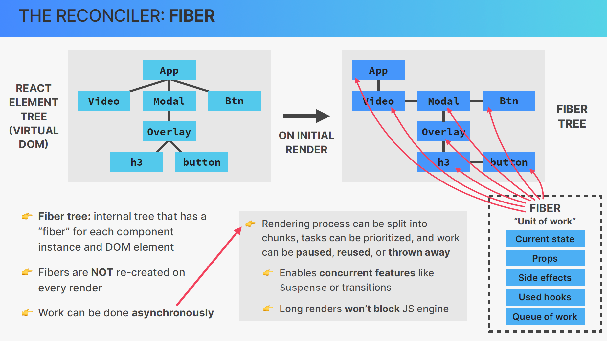

# 11 - How React Works Behind the Scenes

## 001 Section Overview

## 002 Project Setup and Walkthrough

```jsx
import { useState } from "react";

const content = [
  {
    summary: "React is a library for building UIs",
    details:
      "Dolor in reprehenderit in voluptate velit esse cillum dolore eu fugiat nulla pariatur. Occaecat cupidatat non proident, sunt in culpa qui officia deserunt mollit anim id est laborum.",
  },
  {
    summary: "State management is like giving state a home",
    details:
      "Lorem ipsum dolor sit amet, consectetur adipisicing elit, sed do eiusmod tempor incididunt ut labore et dolore magna aliqua. Excepteur sint occaecat cupidatat non proident, sunt in culpa qui officia deserunt mollit anim id est laborum.",
  },
  {
    summary: "We can think of props as the component API",
    details:
      "Ut enim ad minim veniam, quis nostrud exercitation ullamco laboris nisi ut aliquip ex ea commodo consequat. Duis aute irure dolor in reprehenderit in voluptate velit esse cillum dolore eu fugiat nulla pariatur.",
  },
];

export default function App() {
  return (
    <div>
      <Tabbed content={content} />
    </div>
  );
}

function Tabbed({ content }) {
  const [activeTab, setActiveTab] = useState(0);

  return (
    <div>
      <div className="tabs">
        <Tab num={0} activeTab={activeTab} onClick={setActiveTab} />
        <Tab num={1} activeTab={activeTab} onClick={setActiveTab} />
        <Tab num={2} activeTab={activeTab} onClick={setActiveTab} />
        <Tab num={3} activeTab={activeTab} onClick={setActiveTab} />
      </div>

      {activeTab <= 2 ? (
        <TabContent item={content.at(activeTab)} />
      ) : (
        <DifferentContent />
      )}
    </div>
  );
}

function Tab({ num, activeTab, onClick }) {
  return (
    <button
      className={activeTab === num ? "tab active" : "tab"}
      onClick={() => onClick(num)}
    >
      Tab {num + 1}
    </button>
  );
}

function TabContent({ item }) {
  const [showDetails, setShowDetails] = useState(true);
  const [likes, setLikes] = useState(0);

  function handleInc() {
    setLikes(likes + 1);
  }

  return (
    <div className="tab-content">
      <h4>{item.summary}</h4>
      {showDetails && <p>{item.details}</p>}

      <div className="tab-actions">
        <button onClick={() => setShowDetails((h) => !h)}>
          {showDetails ? "Hide" : "Show"} details
        </button>

        <div className="hearts-counter">
          <span>{likes} ❤️</span>
          <button onClick={handleInc}>+</button>
          <button>+++</button>
        </div>
      </div>

      <div className="tab-undo">
        <button>Undo</button>
        <button>Undo in 2s</button>
      </div>
    </div>
  );
}

function DifferentContent() {
  return (
    <div className="tab-content">
      <h4>I'm a DIFFERENT tab, so I reset state 💣💥</h4>
    </div>
  );
}

```
# Understanding the Tabbed Interface in React: A Deep Dive with Examples

## Introduction

In this article, we'll delve deeply into the provided React code that implements a tabbed interface with dynamic content. We'll break down each component, explain how they interact, and provide examples to illustrate their functionality. By the end of this explanation, you'll have a comprehensive understanding of how to create a tabbed UI in React, manage state effectively, and enhance user experience.

---

## Overview of the Code

The code consists of several components:

1. **App**: The root component that renders the `Tabbed` component.
2. **Tabbed**: Manages the active tab state and renders tabs and their content.
3. **Tab**: Represents an individual tab button.
4. **TabContent**: Displays the content associated with the active tab.
5. **DifferentContent**: Displays content when a specific tab is active.

Additionally, there's a `content` array that holds summary and detail information for the tabs.

---

## Detailed Breakdown

### 1. The `content` Array

```jsx
const content = [
  {
    summary: "React is a library for building UIs",
    details: "Dolor in reprehenderit in voluptate velit esse cillum dolore eu fugiat nulla pariatur...",
  },
  {
    summary: "State management is like giving state a home",
    details: "Lorem ipsum dolor sit amet, consectetur adipisicing elit, sed do eiusmod tempor incididunt...",
  },
  {
    summary: "We can think of props as the component API",
    details: "Ut enim ad minim veniam, quis nostrud exercitation ullamco laboris nisi ut aliquip ex ea commodo consequat...",
  },
];
```

- **Purpose**: Holds the content for the first three tabs.
- **Structure**: An array of objects, each with a `summary` and `details` property.
- **Usage**: Passed to the `Tabbed` component to render content dynamically.

### 2. The `App` Component

```jsx
export default function App() {
  return (
    <div>
      <Tabbed content={content} />
    </div>
  );
}
```

- **Purpose**: Serves as the root component of the application.
- **Functionality**:
  - Renders the `Tabbed` component.
  - Passes the `content` array as a prop to `Tabbed`.

### 3. The `Tabbed` Component

```jsx
function Tabbed({ content }) {
  const [activeTab, setActiveTab] = useState(0);

  return (
    <div>
      <div className="tabs">
        <Tab num={0} activeTab={activeTab} onClick={setActiveTab} />
        <Tab num={1} activeTab={activeTab} onClick={setActiveTab} />
        <Tab num={2} activeTab={activeTab} onClick={setActiveTab} />
        <Tab num={3} activeTab={activeTab} onClick={setActiveTab} />
      </div>

      {activeTab <= 2 ? (
        <TabContent item={content.at(activeTab)} />
      ) : (
        <DifferentContent />
      )}
    </div>
  );
}
```

#### Explanation:

- **State Management**:
  - `const [activeTab, setActiveTab] = useState(0);`
    - Initializes the active tab index to `0`.
    - `activeTab`: The index of the currently active tab.
    - `setActiveTab`: Function to update the active tab index.

- **Rendering Tabs**:
  - Renders four `Tab` components with `num` from `0` to `3`.
  - Passes `activeTab` and `setActiveTab` to each `Tab` component.

- **Conditional Rendering of Content**:
  - `{activeTab <= 2 ? <TabContent item={content.at(activeTab)} /> : <DifferentContent />}`
    - If `activeTab` is `0`, `1`, or `2`, renders `TabContent` with the corresponding content.
    - If `activeTab` is `3`, renders `DifferentContent`.

#### Usage of `content.at(activeTab)`

- `content.at(activeTab)`:
  - Accesses the content at the index of the active tab.
  - The `at` method is a newer way to access array elements (alternative to `content[activeTab]`).

### 4. The `Tab` Component

```jsx
function Tab({ num, activeTab, onClick }) {
  return (
    <button
      className={activeTab === num ? "tab active" : "tab"}
      onClick={() => onClick(num)}
    >
      Tab {num + 1}
    </button>
  );
}
```

#### Explanation:

- **Props**:
  - `num`: The index number of the tab.
  - `activeTab`: The current active tab index.
  - `onClick`: Function to set the active tab.

- **Functionality**:
  - Renders a `<button>` representing a tab.
  - The button's class name changes based on whether it's the active tab:
    - If `activeTab === num`, the class is `"tab active"`.
    - Else, the class is `"tab"`.

- **Event Handling**:
  - `onClick={() => onClick(num)}`:
    - When clicked, it calls the `onClick` function passed from `Tabbed` (which is `setActiveTab`), setting the active tab to `num`.

- **Display**:
  - `Tab {num + 1}`:
    - Displays the tab number starting from `1` instead of `0`.

### 5. The `TabContent` Component

```jsx
function TabContent({ item }) {
  const [showDetails, setShowDetails] = useState(true);
  const [likes, setLikes] = useState(0);

  function handleInc() {
    setLikes(likes + 1);
  }

  return (
    <div className="tab-content">
      <h4>{item.summary}</h4>
      {showDetails && <p>{item.details}</p>}

      <div className="tab-actions">
        <button onClick={() => setShowDetails((h) => !h)}>
          {showDetails ? "Hide" : "Show"} details
        </button>

        <div className="hearts-counter">
          <span>{likes} ❤️</span>
          <button onClick={handleInc}>+</button>
          <button>+++</button>
        </div>
      </div>

      <div className="tab-undo">
        <button>Undo</button>
        <button>Undo in 2s</button>
      </div>
    </div>
  );
}
```

#### Explanation:

- **Props**:
  - `item`: The content object for the active tab, containing `summary` and `details`.

- **State Management**:
  - `showDetails`:
    - Controls whether to display the `details` text.
    - Initialized to `true`.
  - `likes`:
    - Keeps track of the number of likes (hearts).
    - Initialized to `0`.

- **Event Handlers**:
  - `handleInc()`:
    - Increments the `likes` state by `1`.

- **Rendering Content**:
  - Displays the `summary` in an `<h4>`.
  - Conditionally displays the `details` in a `<p>` if `showDetails` is `true`.

- **Actions**:
  - **Toggle Details**:
    - Button to show or hide details.
    - Toggles `showDetails` state.
  - **Likes Counter**:
    - Displays the number of likes with a heart symbol.
    - "+" Button:
      - Calls `handleInc` to increment `likes`.
    - "+++" Button:
      - Present but no functionality is attached (could be extended to increment likes by more).

- **Undo Buttons**:
  - **"Undo" Button**:
    - Present but no functionality is attached.
  - **"Undo in 2s" Button**:
    - Present but no functionality is attached.

#### Potential Enhancements:

- **Implement Undo Functionality**:
  - Attach event handlers to the "Undo" buttons to reverse actions like decrementing `likes` or resetting `showDetails`.

### 6. The `DifferentContent` Component

```jsx
function DifferentContent() {
  return (
    <div className="tab-content">
      <h4>I'm a DIFFERENT tab, so I reset state 💣💥</h4>
    </div>
  );
}
```

#### Explanation:

- **Purpose**:
  - Displays content when the fourth tab (index `3`) is active.
  - Indicates that it resets state compared to `TabContent`.

- **State Management**:
  - Since `DifferentContent` is a separate component, it doesn't share state with `TabContent`.
  - Any state in `TabContent` (like `likes` or `showDetails`) doesn't persist when switching to `DifferentContent`.

---

## Understanding Component Interactions

### State Isolation

- **Component-Level State**:
  - `TabContent` and `DifferentContent` maintain their own state independently.
  - When switching tabs, the state within `TabContent` persists for the same tab indices (`0`, `1`, `2`).

- **State Reset**:
  - Switching to the fourth tab (`activeTab === 3`) renders `DifferentContent`, which doesn't have the state of `TabContent`.
  - Returning to `TabContent` tabs retains the previous state because `TabContent` is re-rendered with the same state.

### Managing Active Tabs

- **Active Tab Index**:
  - Managed by `Tabbed` component using `activeTab` state.
  - Clicking on a `Tab` updates `activeTab`, which triggers re-rendering of the content.

### Passing Props and Functions

- **Prop Drilling**:
  - The `onClick` function (`setActiveTab`) is passed from `Tabbed` to `Tab` components.
  - Each `Tab` receives `activeTab`, `num`, and `onClick` props.

- **Avoiding Prop Drilling**:
  - In this example, prop drilling is minimal and manageable.
  - For larger applications, consider using context or state management libraries to avoid excessive prop drilling.

---

## Example Scenario

Let's simulate user interactions to understand how the application behaves.

### Initial Render

- **Active Tab**: 0
- **Displayed Content**:
  - `TabContent` shows the summary and details for `content[0]`.
  - `showDetails` is `true`; details are visible.
  - `likes` is `0`.

### User Clicks "Hide Details"

- **Action**: Click the "Hide details" button.
- **State Change**:
  - `showDetails` toggles to `false`.
- **Displayed Content**:
  - Details are hidden.
  - Button text changes to "Show details".

### User Clicks "+"

- **Action**: Click the "+" button in the hearts counter.
- **State Change**:
  - `likes` increments to `1`.
- **Displayed Content**:
  - Likes counter shows "1 ❤️".

### User Switches to Tab 2

- **Action**: Click "Tab 2" (`num = 1`).
- **Active Tab**: 1
- **Displayed Content**:
  - `TabContent` shows summary and details for `content[1]`.
  - `showDetails` is `true` (initial state for this tab).
  - `likes` is `0` (initial state for this tab).

### User Returns to Tab 1

- **Action**: Click "Tab 1" (`num = 0`).
- **Active Tab**: 0
- **Displayed Content**:
  - `TabContent` retains previous state:
    - `showDetails` is `false` (as toggled earlier).
    - `likes` is `1` (as incremented earlier).
  - This demonstrates that state within `TabContent` persists for each tab index.

### User Switches to Tab 4

- **Action**: Click "Tab 4" (`num = 3`).
- **Active Tab**: 3
- **Displayed Content**:
  - `DifferentContent` is displayed.
  - State from `TabContent` is not present.

### User Returns to Tab 1 Again

- **Action**: Click "Tab 1" (`num = 0`).
- **Active Tab**: 0
- **Displayed Content**:
  - `TabContent` restores with the state preserved:
    - `showDetails` is still `false`.
    - `likes` is still `1`.

---

## Key Concepts Illustrated

### 1. Component State Persistence

- **State within Components**:
  - State in React components persists as long as the component instance is mounted.
  - Switching between components (like `TabContent` and `DifferentContent`) unmounts the previous component, potentially losing its state unless managed elsewhere.

### 2. Conditional Rendering

- **Using Ternary Operators**:
  - `{activeTab <= 2 ? <TabContent item={content.at(activeTab)} /> : <DifferentContent />}`
  - Determines which component to render based on `activeTab`.

### 3. Event Handling

- **Button Clicks**:
  - Functions like `handleInc`, `setShowDetails`, and `setActiveTab` handle user interactions.
  - Event handlers are passed to components via props or defined within components.

### 4. Prop Passing

- **Passing Functions and State**:
  - `Tabbed` passes `activeTab` and `setActiveTab` to `Tab`.
  - `Tab` uses `onClick={() => onClick(num)}` to invoke `setActiveTab`.

### 5. Component Reusability

- **Reusable Components**:
  - `Tab` and `TabContent` are designed to be reusable with different data.
  - They accept props to customize their behavior and display.

---

## Potential Improvements

### 1. Dynamically Generating Tabs

Currently, the tabs are hardcoded:

```jsx
<Tab num={0} activeTab={activeTab} onClick={setActiveTab} />
<Tab num={1} activeTab={activeTab} onClick={setActiveTab} />
<Tab num={2} activeTab={activeTab} onClick={setActiveTab} />
<Tab num={3} activeTab={activeTab} onClick={setActiveTab} />
```

**Improvement**:

- Generate tabs dynamically based on the `content` array.

**Implementation**:

```jsx
<div className="tabs">
  {content.map((_, index) => (
    <Tab key={index} num={index} activeTab={activeTab} onClick={setActiveTab} />
  ))}
  {/* Adding the DifferentContent tab */}
  <Tab num={content.length} activeTab={activeTab} onClick={setActiveTab} />
</div>
```

### 2. Handling More Tabs

- If more content items are added to the `content` array, the application can scale without additional changes.
- Adjust the conditional rendering in `Tabbed`:

```jsx
{activeTab < content.length ? (
  <TabContent item={content.at(activeTab)} />
) : (
  <DifferentContent />
)}
```

### 3. Implementing Undo Functionality

- **Undo Button**:
  - Could revert the last action, such as decrementing `likes` or toggling `showDetails`.
- **Undo in 2s Button**:
  - Could set a timeout to perform the undo action after 2 seconds.

**Implementation Example**:

```jsx
function TabContent({ item }) {
  // ...existing state and handlers

  const [actionHistory, setActionHistory] = useState([]);

  function handleUndo() {
    const lastAction = actionHistory.pop();
    if (lastAction === "incrementLikes") {
      setLikes((l) => l - 1);
    }
    setActionHistory([...actionHistory]);
  }

  function handleInc() {
    setLikes((l) => l + 1);
    setActionHistory([...actionHistory, "incrementLikes"]);
  }

  // ...rest of the component
}
```

### 4. Styling and User Experience

- **Add CSS Classes**:
  - Apply styles to make the tabs and content visually appealing.
- **Responsive Design**:
  - Ensure the layout works well on different screen sizes.
- **Accessibility**:
  - Add ARIA roles and labels to improve accessibility for users with assistive technologies.

---

## Conclusion

The provided code demonstrates a fundamental approach to building a tabbed interface in React. By managing state within components, passing props, and using conditional rendering, you can create interactive and dynamic UIs.

**Key Takeaways**:

- **State Management**: Understanding how state persists in components and how it can be reset when components unmount.
- **Component Composition**: Building reusable components that accept props to customize their behavior.
- **Event Handling**: Implementing user interactions through event handlers.
- **Conditional Rendering**: Displaying different components based on application state.

---

## Additional Resources

- **React Documentation**: [Main Concepts – React](https://reactjs.org/docs/hello-world.html)
- **State and Lifecycle**: [State and Lifecycle – React](https://reactjs.org/docs/state-and-lifecycle.html)
- **Conditional Rendering**: [Conditional Rendering – React](https://reactjs.org/docs/conditional-rendering.html)
- **Lists and Keys**: [Lists and Keys – React](https://reactjs.org/docs/lists-and-keys.html)
- **Handling Events**: [Handling Events – React](https://reactjs.org/docs/handling-events.html)

---

By exploring and experimenting with the code, you can extend its functionality, improve the user interface, and gain a deeper understanding of React's capabilities in building dynamic web applications. Happy coding!

## 003 Components, Instances, and Elements


The image you shared explains **React Components**, which are the fundamental building blocks in a React application. Let’s break down the key ideas mentioned in the image with examples for a deeper understanding.

### React Component:
- A **React Component** is essentially a **JavaScript function** that returns **React elements**, which describe the UI structure. These components can be thought of as **"blueprints" or "templates"** for the UI. They encapsulate reusable pieces of UI and logic.

### Key Points from the Image:

1. **Description of a piece of UI**:
   - A component describes a specific part of the user interface (UI). It can be as small as a button or as complex as an entire form. When a component is rendered, it outputs **React elements** (which can be HTML-like structures known as JSX).
   
2. **Components as Functions**:
   - In React, components are usually functions that return a **React element tree**. This means they define the structure of what should be displayed on the screen.
   
3. **Blueprint or Template**:
   - A React component serves as a **template** or **blueprint** for the UI. Each component can be reused, making your code more modular and maintainable.

### Example 1: Basic Component

Let’s start with a simple example similar to what’s shown in the image:

```jsx
function Tab({ item }) {
  return (
    <div className="tab-content">
      <h4>{item.title}</h4>
      <p>{item.description}</p>
    </div>
  );
}
```

Here, the **Tab** component is a **function** that:
- Accepts a prop (`item`).
- Returns a piece of JSX (`<div>`, `<h4>`, and `<p>` elements).
- The JSX describes the structure of the UI: it contains a header and a paragraph displaying the content passed through `item.title` and `item.description`.

This component can be reused with different content:

```jsx
<Tab item={{ title: "All contacts", description: "Your post will be visible" }} />
<Tab item={{ title: "Profile settings", description: "Change your preferences" }} />
```

The **Tab** component acts as a **blueprint**, rendering different UI elements based on the data passed to it.

### Example 2: Stateful Component

You can make a React component more interactive by introducing **state**. For instance, let’s modify the `Tab` component to display additional content when clicked:

```jsx
import { useState } from "react";

function Tab({ item }) {
  const [isExpanded, setIsExpanded] = useState(false);

  return (
    <div className="tab-content">
      <h4>{item.title}</h4>
      {isExpanded ? <p>{item.description}</p> : <p>Click to read more...</p>}
      <button onClick={() => setIsExpanded(!isExpanded)}>
        {isExpanded ? "Collapse" : "Expand"}
      </button>
    </div>
  );
}
```

Here’s what’s happening:
- **State**: The `useState` hook is used to manage whether the content is expanded or collapsed. The state variable `isExpanded` determines whether to show the full description or a "Click to read more..." message.
- **Event Handling**: Clicking the button toggles the state (`isExpanded`) between `true` and `false`, and the UI updates accordingly.

### Example 3: Class Component

React components can also be created using ES6 **classes**, especially if you want to use lifecycle methods. However, this is less common nowadays with the introduction of React hooks.

Here’s how a similar component might look as a class:

```jsx
import React, { Component } from "react";

class Tab extends Component {
  constructor(props) {
    super(props);
    this.state = { isExpanded: false };
  }

  toggleExpand = () => {
    this.setState({ isExpanded: !this.state.isExpanded });
  };

  render() {
    const { title, description } = this.props.item;
    const { isExpanded } = this.state;

    return (
      <div className="tab-content">
        <h4>{title}</h4>
        {isExpanded ? <p>{description}</p> : <p>Click to read more...</p>}
        <button onClick={this.toggleExpand}>
          {isExpanded ? "Collapse" : "Expand"}
        </button>
      </div>
    );
  }
}

export default Tab;
```

This **class-based** component achieves the same result as the function-based component but is more verbose.

### Why Use Components?

- **Reusability**: Components can be reused across different parts of your application, saving you from duplicating code.
- **Separation of Concerns**: Each component can manage its own logic and state, keeping the code clean and maintainable.
- **Modularity**: Breaking down your UI into smaller components makes the code easier to manage, especially in large applications.

### Conclusion:

- A **React component** is a reusable template that can describe part of the UI.
- Components can be **functional** or **class-based**, though functional components with hooks are more common in modern React development.
- Components can be passed **props** to customize their behavior and content, allowing for flexible and dynamic UI creation.
- As shown in the image, the `Tab` component is a simple example of how React components work, by returning JSX and describing a part of the UI.

This design philosophy makes React a powerful tool for building complex user interfaces.


The image explains the concept of **Component Instances** in React. Here's a deep dive into the idea:

### Core Concepts:
1. **Component vs. Component Instance**:
   - **Component**: A React component is like a blueprint or template for UI elements. It defines the structure, behavior, and rendering logic of a part of the UI.
   - **Component Instance**: When you actually use a component in your React code (for example, by writing `<Tab />`), React creates an instance of that component. This instance is the "physical" manifestation of the component and can have its own unique **state** and **props**.

### Lifecycle of a Component Instance:
- **Born**: When a component instance is created (mounted), React runs its constructor and possibly some other lifecycle methods (like `componentDidMount` for class components or `useEffect` for functional components).
- **Live**: The component instance lives and reacts to prop or state changes during its life in the DOM.
- **Die**: When the component is no longer needed, React removes it (unmounts it), and its lifecycle ends.

### Breakdown of the Image:

#### Example Scenario:
In the image, the `App` component is rendering **multiple instances** of the `Tab` component. These instances are created by React whenever the `App` component renders them, specifically when the `App()` function returns JSX containing `<Tab item={content[0]} />`, `<Tab item={content[1]} />`, and `<Tab item={content[2]} />`.

- **Instances are created when we "use" components**:
  Every time you use the component (e.g., `<Tab item={content[0]} />`), React internally calls the `Tab` function and creates an instance of that component with its own unique props and potentially state.

- **React internally calls the component function (Tab)**:
  The `Tab` function is called by React, and it renders its output based on the `item` prop passed to it. Each instance of `Tab` gets its own separate data (in this case, the `item` prop).

- **Physical manifestation**:
  When you render multiple components, React creates separate instances of them. Each instance represents a different part of the DOM with its own state, props, and lifecycle. In the diagram, the `Tab` component is instantiated three times, each with different props.

- **Has its own state and props**:
  Each instance of the `Tab` component can maintain its own state and receive different props. For example, if one instance of `Tab` holds a collapsed/expanded state, that state is specific to that instance and does not affect the others.

### Detailed Example:

```jsx
function Tab({ item }) {
  return (
    <div className="tab-content">
      <h4>{item.title}</h4>
      <p>{item.description}</p>
    </div>
  );
}

function App() {
  const content = [
    { title: "First Tab", description: "Content for the first tab" },
    { title: "Second Tab", description: "Content for the second tab" },
    { title: "Third Tab", description: "Content for the third tab" }
  ];

  return (
    <div className="tabs">
      <Tab item={content[0]} />
      <Tab item={content[1]} />
      <Tab item={content[2]} />
    </div>
  );
}
```

In this example:
- The `App` component creates **three instances** of the `Tab` component.
- Each instance is passed a different `item` prop (`content[0]`, `content[1]`, `content[2]`).
- While the `Tab` component itself is the blueprint, each instance of the `Tab` component renders with its own unique content.

### Component Lifecycle:
Each instance of a component has a lifecycle. Let’s take a deeper look:

1. **Mounting**:
   When a component is first added to the DOM, it goes through the mounting phase. In class components, methods like `constructor()`, `render()`, and `componentDidMount()` are invoked.
   
   In function components, hooks like `useState` or `useEffect` can be used for similar functionality.

2. **Updating**:
   If the props or state of a component change, React re-renders the component. The component's state is re-evaluated, and the UI is updated accordingly.
   
   Hooks like `useEffect` can trigger side effects during updates, while in class components, methods like `componentDidUpdate()` handle this.

3. **Unmounting**:
   When a component is removed from the DOM, React cleans up any side effects (e.g., by running cleanup functions in `useEffect` for function components or `componentWillUnmount()` in class components).

### Example with State and Lifecycle:

```jsx
import { useState, useEffect } from "react";

function Tab({ item }) {
  const [isVisible, setIsVisible] = useState(true);

  useEffect(() => {
    console.log(`${item.title} is mounted`);

    return () => {
      console.log(`${item.title} is unmounted`);
    };
  }, [item.title]);

  return (
    <div className="tab-content">
      <h4>{item.title}</h4>
      {isVisible ? <p>{item.description}</p> : <p>Content hidden</p>}
      <button onClick={() => setIsVisible(!isVisible)}>
        {isVisible ? "Hide" : "Show"} Content
      </button>
    </div>
  );
}

function App() {
  const content = [
    { title: "First Tab", description: "Content for the first tab" },
    { title: "Second Tab", description: "Content for the second tab" },
    { title: "Third Tab", description: "Content for the third tab" }
  ];

  return (
    <div className="tabs">
      <Tab item={content[0]} />
      <Tab item={content[1]} />
      <Tab item={content[2]} />
    </div>
  );
}
```

Here’s what happens:
- The **`Tab`** component manages its own internal state (`isVisible`), which controls whether the tab's content is visible or hidden.
- When the component is mounted, it logs a message in the `useEffect` hook, and it also logs a message when it's unmounted (when the component is removed from the DOM).

### Conclusion:
- A **component instance** is the actual realization of a component when it's rendered in the DOM.
- Each instance can have its own state, props, and lifecycle.
- Multiple instances of the same component can exist simultaneously, each behaving independently based on their props and state.
- React manages the creation and destruction of these instances efficiently using its reconciliation algorithm.

This separation between component blueprints and instances allows for highly modular and reusable code in React applications.


The image explains the differences between **Components**, **Component Instances**, and **React Elements** in React. Here's a detailed breakdown of these concepts with examples.

### 1. **Component**:
A **Component** in React is a **blueprint** or **template** that defines what a portion of the UI should look like. A component is typically a function (or class) that returns JSX, which is ultimately transformed into **React elements**. Components can be reusable and can accept **props** to render dynamic content.

#### Example:
```jsx
function Tab({ item }) {
  return (
    <div className="tab-content">
      <h4>All contacts</h4>
      <p>Your post will be visible</p>
    </div>
  );
}
```
Here, `Tab` is a React **component**. It defines the structure of a part of the UI using JSX. It can receive `props`, in this case, the `item` prop, to display dynamic content. The component itself is just a definition—it's not yet rendered on the screen.

### 2. **Component Instance**:
A **Component Instance** is created whenever you **use** the component in your JSX, for example, when you write `<Tab />`. Every time you render a component, React creates a new instance of it. Each instance can have its own state and props, even if multiple instances of the same component are rendered.

When the component is used, React will internally call the function (`Tab()`) and return a **React element**.

#### Example:
```jsx
function App() {
  return (
    <div className="tabs">
      <Tab item={content[0]} />
      <Tab item={content[1]} />
      <Tab item={content[2]} />
    </div>
  );
}
```
In this example, the `App` component is rendering **three instances** of the `Tab` component. Each instance has its own `item` prop (content from an array). Even though they are based on the same `Tab` component, each instance will display different content depending on the `item` prop passed to it.

### 3. **React Element**:
A **React Element** is the **result** of calling a React component (or a DOM element) with JSX. When JSX is written in the component, React internally uses `React.createElement()` to transform it into an element.

React elements are the lightweight descriptions of what the DOM should look like. They contain the type of the element (e.g., `div`, `h4`, `p`), its props, and its children.

#### Conversion Process:
When you write this JSX inside the `Tab` component:
```jsx
return (
  <div className="tab-content">
    <h4>All contacts</h4>
    <p>Your post will be visible</p>
  </div>
);
```

React converts this JSX to `React.createElement()` calls:

```javascript
React.createElement(
  'div',
  { className: 'tab-content' },
  React.createElement('h4', null, 'All contacts'),
  React.createElement('p', null, 'Your post will be visible')
);
```

Each JSX tag (like `<div>`, `<h4>`, `<p>`) is converted into a React element object. These React elements are **descriptions** of what the UI should look like—they don't directly interact with the DOM. React uses them to figure out how to update the DOM efficiently.

### Example of a React Element:

After the JSX is processed by React, it creates a **React element** which looks like this (as shown in the image):

```javascript
{
  $$typeof: Symbol(react.element),
  type: 'div',
  key: null,
  ref: null,
  props: {
    className: 'tab-content',
    children: [
      {
        $$typeof: Symbol(react.element),
        type: 'h4',
        key: null,
        ref: null,
        props: { children: 'All contacts' },
        ...
      },
      {
        $$typeof: Symbol(react.element),
        type: 'p',
        key: null,
        ref: null,
        props: { children: 'Your post will be visible' },
        ...
      }
    ]
  },
  ...
}
```

This object is what React uses to manage the virtual DOM. It contains:
- The type of the element (`div`, `h4`, `p`).
- The props (`className`, `children`).
- Nested children React elements for `h4` and `p`.

### Summary:
1. **Component**: The blueprint or template. In this case, `Tab` is a component that describes the structure of the UI using JSX.
2. **Component Instance**: Every time the component is used (e.g., `<Tab />`), a new instance of the component is created with its own state and props.
3. **React Element**: The output of a component (or JSX), which is an object describing the structure of the UI. React uses this element to decide how to update the real DOM efficiently.

### Key Points:
- **JSX** is syntactic sugar for `React.createElement()`. It gets transformed into function calls that return React elements.
- A **React Element** is the result of these `React.createElement()` function calls. It describes the DOM structure that React needs to render.
- React uses **React elements** to create and manage the DOM elements that we see on the screen.
  
This process allows React to efficiently update the UI, by comparing previous React elements with new ones (through the diffing algorithm) and only updating what has changed.


This image outlines the flow of how a **React Component** transforms into a **DOM element** on the webpage by showing the journey from component creation to its actual visual representation in the browser.

### The Process Overview:
1. **Component**: This is the blueprint or template written by the developer. In the example, the `Tab` component is written as:
   ```jsx
   <Tab />
   ```
   This is the starting point—a reusable, functional definition of the UI.

2. **Component Instance**: When the `Tab` component is used inside JSX (for example, in the `App` component), React creates an **instance** of this component. Each time you render `<Tab />` in JSX, React internally calls the component function (or class) to create this instance.

3. **React Element**: After the component instance is created, React uses the JSX inside the component to generate a **React element**. This React element is a lightweight object that represents the desired UI but is not yet inserted into the real DOM.

   - For example, the JSX:
     ```jsx
     return (
       <div className="tab-content">
         <h4>All contacts</h4>
         <p>Your post will be visible</p>
       </div>
     );
     ```
     gets transformed into a **React element** like:
     ```javascript
     React.createElement(
       'div',
       { className: 'tab-content' },
       React.createElement('h4', null, 'All contacts'),
       React.createElement('p', null, 'Your post will be visible')
     );
     ```

4. **DOM Element (HTML)**: After React creates the React elements, it will eventually insert them into the real **DOM** (Document Object Model). The DOM is what browsers use to render the visual elements on the screen. Once inserted into the DOM, the `Tab` component visually appears in the browser as a native HTML structure:
   ```html
   <div class="tab-content">
     <h4>All contacts</h4>
     <p>Your post will be visible</p>
   </div>
   ```

### Deep Dive Into Each Concept:

#### 1. **Component (Blueprint)**:
   - A **component** in React is a function (or a class in older versions) that defines a piece of the UI. It describes what should appear on the page and can accept **props** to customize the content dynamically.
   - Example component:
     ```jsx
     function Tab() {
       return (
         <div className="tab-content">
           <h4>All contacts</h4>
           <p>Your post will be visible</p>
         </div>
       );
     }
     ```

#### 2. **Component Instance (Use of Component)**:
   - When you write `<Tab />` inside another component, React **instantiates** the component by calling the `Tab` function. This creates a new **instance** of the `Tab` component.
   - Each component instance is unique, meaning it can have its own state, props, and lifecycle. When React calls the component, it generates a new version with the current state and props.

   Example usage:
   ```jsx
   function App() {
     return (
       <div>
         <Tab />
       </div>
     );
   }
   ```

#### 3. **React Element**:
   - The output of calling a React component (or creating DOM elements directly) is a **React element**.
   - React elements are **lightweight JavaScript objects** that describe what the DOM should look like. They are created through the JSX syntax or through explicit `React.createElement()` calls behind the scenes.
   - React uses these elements to figure out what changes need to be made to the actual DOM, allowing React to efficiently update only the parts of the DOM that have changed (instead of re-rendering the entire page).

#### 4. **DOM Element (HTML)**:
   - The final step of this process is when the **React element** is transformed into real **DOM elements** that are visible in the browser. These DOM elements are the actual HTML elements that the browser renders visually.
   - The browser understands HTML and CSS, so React must eventually translate its virtual structure (React elements) into real HTML.

#### Putting it All Together (Example):
Consider this example in an app:

```jsx
function Tab() {
  return (
    <div className="tab-content">
      <h4>All contacts</h4>
      <p>Your post will be visible</p>
    </div>
  );
}

function App() {
  return (
    <div>
      <Tab />
      <Tab />
    </div>
  );
}
```

- **Component**: `Tab` is a reusable component.
- **Component Instance**: When `<Tab />` is used twice inside `App`, two **instances** of `Tab` are created.
- **React Element**: For each `Tab`, React creates a React element (via JSX or `React.createElement()`).
- **DOM Element (HTML)**: These React elements are inserted into the real DOM, resulting in:
  ```html
  <div class="tab-content">
    <h4>All contacts</h4>
    <p>Your post will be visible</p>
  </div>
  <div class="tab-content">
    <h4>All contacts</h4>
    <p>Your post will be visible</p>
  </div>
  ```

### Conclusion:
- **Component**: Defines the UI structure.
- **Component Instance**: Created when a component is used (instantiated).
- **React Element**: The JavaScript object representing the UI, generated from the component instance.
- **DOM Element**: The actual HTML element inserted into the DOM and rendered in the browser.

This process of translating components into actual DOM elements is what makes React efficient, by allowing it to work with virtual representations and only updating the parts of the real DOM that need to change.

## 004 Instances and Elements in Practice

## Understanding the Difference Between Logging a React Element and Invoking a Component Function

### Introduction

In React, there's a fundamental difference between a **React element** and a **component function**. When you log a React element or the result of invoking a component function, you'll get different outputs. This is because:

- **A React element** is an object representation of a UI element, which describes what you want to see on the screen.
- **A component function** is a JavaScript function that returns a React element (or a tree of React elements).

Your question revolves around understanding the difference between these two when you log them to the console. Let's break down the outputs you provided and explain why they are different.

---

### The Outputs

1. **First Output:**

   ```json
   {
     "key": null,
     "ref": null,
     "props": {
       "test": 21212
     },
     "_owner": null,
     "_store": {}
   }
   ```

2. **Second Output:**

   ```json
   {
     "type": "div",
     "key": null,
     "ref": null,
     "props": {
       "className": "tab-content",
       "children": {
         "type": "h4",
         "key": null,
         "ref": null,
         "props": {
           "children": "I'm a DIFFERENT tab, so I reset state 💣💥"
         },
         "_owner": null,
         "_store": {}
       }
     },
     "_owner": null,
     "_store": {}
   }
   ```

   (Note: You mentioned the second output appears twice, but it's essentially the same.)

---

### The Commands That Produced the Outputs

You ran the following commands:

1. `console.log(<DifferentContent test={21212} />);`
2. `console.log(DifferentContent());`

Let's understand what each command does.

---

### 1. Logging `<DifferentContent test={21212} />`

#### What Happens Here?

- **Creation of a React Element:**
  - `<DifferentContent test={21212} />` is JSX syntax that gets transpiled to `React.createElement(DifferentContent, { test: 21212 })`.
  - This creates a React element object with the following structure:
    - `type`: The component function `DifferentContent`.
    - `props`: An object containing `{ test: 21212 }`.

#### The Output Explained

- **The Logged Object:**

  ```json
  {
    "key": null,
    "ref": null,
    "props": {
      "test": 21212
    },
    "_owner": null,
    "_store": {}
  }
  ```

- **Why Does It Look Like This?**
  - Since you're logging the React element before it's rendered, it doesn't contain the output of the `DifferentContent` component.
  - The `type` field, which would point to the `DifferentContent` function, is not displayed in your console output (depending on how the console serializes functions).
  - The `props` field shows the props passed to the component, which is `{ test: 21212 }`.

---

### 2. Logging `DifferentContent()`

#### What Happens Here?

- **Invoking the Component Function:**
  - `DifferentContent()` calls the `DifferentContent` function, which is your React component.
  - The component function returns a React element (usually created via JSX).

#### The Component Definition

```jsx
function DifferentContent() {
  return (
    <div className="tab-content">
      <h4>I'm a DIFFERENT tab, so I reset state 💣💥</h4>
    </div>
  );
}
```

- **Return Value:**
  - The function returns a React element representing a `div` with a class of `"tab-content"`, containing an `h4` element with some text.

#### The Output Explained

- **The Logged Object:**

  ```json
  {
    "type": "div",
    "key": null,
    "ref": null,
    "props": {
      "className": "tab-content",
      "children": {
        "type": "h4",
        "key": null,
        "ref": null,
        "props": {
          "children": "I'm a DIFFERENT tab, so I reset state 💣💥"
        },
        "_owner": null,
        "_store": {}
      }
    },
    "_owner": null,
    "_store": {}
  }
  ```

- **Why Does It Look Like This?**
  - The logged object is the React element returned by the `DifferentContent` function.
  - It represents the actual UI structure that will be rendered to the DOM.
  - The `type` field is `"div"`, indicating that the top-level element is a `div`.
  - The `props` include:
    - `className`: `"tab-content"`.
    - `children`: The nested `h4` element with its own `type`, `props`, and so on.

---

### Summary of Differences

1. **Logging `<DifferentContent test={21212} />`:**
   - You're logging a React element whose `type` is the `DifferentContent` function itself.
   - The `props` are `{ test: 21212 }`.
   - This element hasn't been rendered or processed by React yet.
   - It represents an instruction to React to render the `DifferentContent` component with the given props.

2. **Logging `DifferentContent()`:**
   - You're invoking the `DifferentContent` function, which executes its code and returns a React element.
   - The returned React element represents the UI structure defined inside the `DifferentContent` component.
   - This element can then be rendered by React to produce actual DOM nodes.

---

### Visualizing the Process

#### 1. React Element Creation

- **Code:**

  ```jsx
  const element = <DifferentContent test={21212} />;
  ```

- **Equivalent to:**

  ```jsx
  const element = React.createElement(DifferentContent, { test: 21212 });
  ```

- **Result:**
  - A React element object with:
    - `type`: `DifferentContent` (the component function).
    - `props`: `{ test: 21212 }`.

#### 2. Component Invocation

- **Code:**

  ```jsx
  const renderedElement = DifferentContent();
  ```

- **Result:**
  - The `DifferentContent` function runs and returns a React element representing the UI it defines.
  - This returned element is what React uses to construct the virtual DOM and eventually render to the real DOM.

---

### Key Points

- **React Elements vs. Component Functions:**
  - A **React element** is a plain object that describes what to render.
  - A **component function** is a function that returns a React element.

- **Logging Behavior:**
  - When you log a React element (e.g., `<DifferentContent />`), you see the `type` (component function) and `props`.
  - When you log the result of a component function (e.g., `DifferentContent()`), you see the React element(s) that the component returns.

- **Rendering Process:**
  - React uses the element tree returned by component functions to build the virtual DOM.
  - The virtual DOM is then compared to the previous version to determine what needs to be updated in the real DOM.

---

### Additional Example

Consider the following simple component:

```jsx
function Greeting({ name }) {
  return <p>Hello, {name}!</p>;
}
```

- **Logging the React Element:**

  ```jsx
  console.log(<Greeting name="Alice" />);
  ```

  - Output:

    ```json
    {
      "key": null,
      "ref": null,
      "props": {
        "name": "Alice"
      },
      "_owner": null,
      "_store": {}
    }
    ```

- **Logging the Result of Invoking the Component Function:**

  ```jsx
  console.log(Greeting({ name: "Alice" }));
  ```

  - Output:

    ```json
    {
      "type": "p",
      "key": null,
      "ref": null,
      "props": {
        "children": ["Hello, ", "Alice", "!"]
      },
      "_owner": null,
      "_store": {}
    }
    ```

---

### Why Does the `type` Field Appear Differently?

- **When Logging the Element `<DifferentContent />`:**
  - The `type` is the `DifferentContent` function itself.
  - However, depending on your environment or console, the `type` may not be displayed when it's a function, or it may show as `null` or `undefined` if the console can't serialize functions.

- **When Logging the Result of `DifferentContent()`:**
  - The `type` is the string `"div"`, because the component returns a React element where the top-level element is a `<div>`.

---

### Practical Implications

- **Understanding React's Rendering Flow:**
  - Recognizing the difference between React elements and the output of component functions helps in debugging and understanding how React builds the UI.

- **Debugging Components:**
  - Logging the result of invoking a component can help you see what it's rendering, which is useful for debugging issues related to the component's output.

- **Avoid Directly Invoking Components in Production Code:**
  - In practice, you should not manually invoke component functions like `DifferentContent()`.
  - React handles the invocation and rendering of components based on the element tree.

---

### Conclusion

- **Difference in Outputs:**
  - **First Output:** Represents the React element created by JSX, with `type` being the component function and `props` containing the passed props.
  - **Second Output:** Represents the React element returned by the component function, which is the actual UI structure to be rendered.

- **Understanding the Distinction:**
  - Knowing the difference between a React element and the result of a component function is crucial for React developers.
  - It clarifies how components are instantiated and how their output contributes to the overall UI.

---

### Additional Notes

- **Why `test` Prop Doesn't Appear in the Second Output:**
  - The `DifferentContent` component doesn't accept or use any props, so when you call `DifferentContent()`, the `test` prop isn't used or passed down.
  - Therefore, the output of `DifferentContent()` doesn't include the `test` prop.

- **Best Practices:**
  - Use JSX syntax to define elements and let React handle the component lifecycle.
  - Use `console.log` wisely to inspect elements and component outputs during development.

---

### Example in a Development Environment

If you were to write this in a React application:

```jsx
function DifferentContent() {
  return (
    <div className="tab-content">
      <h4>I'm a DIFFERENT tab, so I reset state 💣💥</h4>
    </div>
  );
}

console.log(<DifferentContent test={21212} />);
console.log(DifferentContent());
```

- **First `console.log`:**

  - Logs the element representing the `DifferentContent` component with `props: { test: 21212 }`.

- **Second `console.log`:**

  - Logs the React element tree starting with the `div` returned by `DifferentContent()`.

---

### Final Thoughts

Understanding the difference between a React element and the result of a component function invocation is fundamental to mastering React. It helps you grasp how components are composed, how props are passed, and how the virtual DOM is constructed.

By logging both the element and the component's output, you can see:

- How React elements encapsulate the information needed to render components.
- How component functions generate the UI structure based on their implementation.

This knowledge is invaluable for debugging, optimizing, and effectively building React applications.


## 005 How Rendering Works Overview

The image explains the process of how **React components** are transformed into the **user interface (UI)** on the screen, showing the flow from **component** to **DOM elements** (HTML) and finally to the visible UI. Let’s break this down step-by-step with examples.

### 1. **Component**
A **React component** is essentially a function or class that defines what a part of the user interface should look like. It serves as a **template** for creating UI elements dynamically based on props and state.

#### Example:
```jsx
function ComponentA() {
  return (
    <div className="box">
      <h1>Hello from Component A</h1>
      <p>This is some content inside Component A.</p>
    </div>
  );
}
```
Here, `ComponentA` is a simple React function component. It returns JSX, which defines the structure of the UI for this component.

### 2. **Component Instances**
When React renders a component, it creates **instances** of that component. For example, if you use `ComponentA` in your application multiple times, each usage creates a new **instance** of the component, potentially with different props or state.

#### Example of Multiple Component Instances:
```jsx
function App() {
  return (
    <div>
      <ComponentA />
      <ComponentA />
      <ComponentA />
    </div>
  );
}
```
In this `App` component, there are three instances of `ComponentA`. Each time `<ComponentA />` is used, a **new instance** of `ComponentA` is created.

### 3. **React Element**
A **React element** is the **object representation** of the UI. When React calls a component (like `ComponentA()`), it doesn’t directly render HTML. Instead, it creates a **React element**, which is a lightweight JavaScript object that describes what the DOM should look like.

The React element generated from the JSX in `ComponentA` will look something like this:
```javascript
{
  type: 'div',
  props: { className: 'box', children: [
    { type: 'h1', props: { children: 'Hello from Component A' } },
    { type: 'p', props: { children: 'This is some content inside Component A.' } }
  ]}
}
```

This React element contains the **type** (`div`, `h1`, `p`), **props** (like `className`, `children`), and nested React elements for the children elements (`h1` and `p`).

### 4. **DOM Element (HTML)**
Once React has created a **React element**, it **converts** that React element into an actual **DOM element** in the browser using the browser’s DOM API. This is where the HTML structure is inserted into the page.

React inserts the following HTML into the browser’s DOM:
```html
<div class="box">
  <h1>Hello from Component A</h1>
  <p>This is some content inside Component A.</p>
</div>
```

This is the HTML representation of `ComponentA`, which the browser uses to render the content on the screen.

### 5. **User Interface on the Screen**
Finally, after the DOM elements have been inserted into the browser’s document, the content is displayed visually as the **user interface (UI)**. In this case, the browser renders a box containing a heading and a paragraph, as defined by the JSX inside `ComponentA`.

### Deeper Dive into the Process:
- **Component A**: This is a reusable template or blueprint. Multiple instances of the component can be created.
- **Component Instances**: Each time you use a component (like `<ComponentA />`), React creates a **new instance** of that component, potentially with different props or state. For example, you might pass different data to each instance:
  ```jsx
  function App() {
    return (
      <div>
        <ComponentA text="First instance" />
        <ComponentA text="Second instance" />
        <ComponentA text="Third instance" />
      </div>
    );
  }
  ```
  In this case, three instances of `ComponentA` are created, each with different `text` props.

- **React Element**: For each component instance, React generates a **React element**, which is a JavaScript object that represents the UI structure. It’s not yet inserted into the DOM.
  
- **DOM Element (HTML)**: React takes the React elements and converts them into **actual DOM elements** using the DOM API. These DOM elements are what the browser uses to render the UI on the screen.

### How This Process Actually Works (React’s Virtual DOM):
1. **Initial Rendering**:
   - When the application is first rendered, React creates instances of each component, converts them to React elements, and inserts them into the DOM.
   - React uses a **virtual DOM** to keep track of these elements. The virtual DOM is a lightweight, in-memory representation of the actual DOM. This allows React to efficiently manage updates.

2. **Updates**:
   - When the state or props of a component change, React **re-renders** the component, creating new React elements based on the updated data.
   - React then **compares** the new React elements with the old ones (using a process called **reconciliation**).
   - Only the parts of the DOM that have changed are updated, which makes React very efficient.

3. **Reconciliation**:
   - When React compares the new React elements with the previous ones, it uses a **diffing algorithm** to figure out what has changed. If only one component or DOM element has changed, React will only update that specific part of the DOM, leaving the rest of the page unchanged.

### Conclusion:
- **Component**: Defines the structure and behavior of the UI.
- **Component Instances**: Multiple instances can be created, each with its own state and props.
- **React Element**: A lightweight JavaScript object that represents the structure of the UI.
- **DOM Element**: The actual HTML that gets inserted into the DOM and rendered by the browser.
- **User Interface**: The final visual representation on the screen that users interact with.

React’s efficiency comes from this process, where it uses a **virtual DOM** to minimize the number of changes needed to the actual DOM, making updates fast and smooth.

The image illustrates the lifecycle of how React components are displayed on the screen, broken down into different **phases**: from triggering a render to the final browser paint. It highlights how React processes updates and renders the UI.

### Overview of the Rendering Process:

1. **Render is Triggered**:
   - In React, the render process is typically triggered when the **state** or **props** of a component change. This change could happen, for example, if the user interacts with the interface (such as clicking a button) or if new data is fetched from a server.

   **Example**:
   ```jsx
   function App() {
     const [count, setCount] = React.useState(0);

     return (
       <div>
         <p>{count}</p>
         <button onClick={() => setCount(count + 1)}>Increment</button>
       </div>
     );
   }
   ```
   In this example, clicking the "Increment" button triggers an update to the `count` state, which causes React to **re-render** the component.

2. **Render Phase**:
   - The **Render Phase** is when React processes the updated component and determines what the new UI should look like. React **re-evaluates** the component by calling its function (or `render` method, in the case of class components), returning new **React elements** based on the updated state or props.
   - Importantly, during the Render Phase, **no changes** are made to the actual DOM. This phase is purely about calculating what the new UI should be.
   
   **Example**:
   Continuing from the example above, when `setCount(count + 1)` is called, React triggers a re-render:
   ```jsx
   function App() {
     return (
       <div>
         <p>{count}</p> // React calculates that this should display the new count.
         <button onClick={() => setCount(count + 1)}>Increment</button>
       </div>
     );
   }
   ```
   React generates a new React element with the updated `count`. For example, if the button is clicked once, React calculates that `count` is now `1` and needs to reflect this change.

3. **Commit Phase**:
   - In this phase, React actually **commits** the updates to the DOM. It updates, inserts, or deletes DOM elements based on the differences between the previous and new React elements (this process is called **reconciliation**).
   - React efficiently updates only the parts of the DOM that have changed. It doesn’t re-render the entire UI, but only the specific elements that need to be changed.
   
   **Example**:
   After React processes the updated React element in the Render Phase, it commits the changes to the DOM:
   ```html
   <div>
     <p>1</p> <!-- The DOM is updated to reflect the new count -->
     <button>Increment</button>
   </div>
   ```
   The `<p>` tag, which previously displayed `0`, is updated to display `1`.

4. **Browser Paint**:
   - After the DOM is updated, the browser handles the **painting** of the new changes on the screen. This is the actual visual update that the user sees. The browser recalculates the layout, draws the pixels, and makes the updated UI visible to the user.

   In our example, after the `count` is updated, the browser displays the new UI with the updated count value:
   ```
   1
   ```
   The user sees the number on the screen change from `0` to `1`.

### Key Points to Understand:
1. **Render Phase vs. Commit Phase**:
   - The **Render Phase** is when React figures out what needs to change, but no actual changes are made to the DOM at this stage. The calculations happen internally within React.
   - The **Commit Phase** is when React makes the actual updates to the DOM based on what was determined during the Render Phase.

2. **Rendering Doesn’t Directly Mean Visual Changes**:
   - When React triggers a render, it doesn’t immediately update the DOM or produce visual changes. It calculates the necessary changes in the Render Phase. Only when the Commit Phase is executed does React make actual changes to the DOM, followed by the browser updating the screen.

### Detailed Example:
Let's walk through an example to see how this works:

```jsx
function Counter() {
  const [count, setCount] = React.useState(0);

  function handleClick() {
    setCount(count + 1);
  }

  return (
    <div>
      <p>{count}</p>
      <button onClick={handleClick}>Increment</button>
    </div>
  );
}
```

#### Process:
1. **Initial Render**:
   - Initially, when the `Counter` component is first rendered, React sets `count` to `0`.
   - **Render Phase**: React processes the JSX and creates a React element:
     ```javascript
     {
       type: 'div',
       props: {
         children: [
           { type: 'p', props: { children: '0' } },
           { type: 'button', props: { children: 'Increment', onClick: handleClick } }
         ]
       }
     }
     ```
   - **Commit Phase**: React inserts the corresponding DOM elements into the actual DOM:
     ```html
     <div>
       <p>0</p>
       <button>Increment</button>
     </div>
     ```
   - **Browser Paint**: The browser renders this UI on the screen.

2. **Click Event – Re-render Triggered**:
   - When the user clicks the "Increment" button, `handleClick()` is executed, which updates the state (`setCount(count + 1)`).
   - **Render is Triggered**: The state update triggers a re-render, causing React to re-evaluate the `Counter` component with the new value of `count`.

3. **Render Phase**:
   - React calculates the new React element based on the updated `count`:
     ```javascript
     {
       type: 'div',
       props: {
         children: [
           { type: 'p', props: { children: '1' } },
           { type: 'button', props: { children: 'Increment', onClick: handleClick } }
         ]
       }
     }
     ```

4. **Commit Phase**:
   - React compares the new React element with the previous one and determines that only the `<p>` tag has changed (from `0` to `1`). It updates the DOM accordingly:
     ```html
     <div>
       <p>1</p>  <!-- DOM update happens here -->
       <button>Increment</button>
     </div>
     ```

5. **Browser Paint**:
   - The browser repaints the UI to reflect the updated DOM. The number `1` now appears on the screen, replacing `0`.

### Conclusion:
- **Rendering in React** is split into two phases: the **Render Phase** (calculating what should change) and the **Commit Phase** (updating the DOM).
- **Render Phase**: React calculates the changes but doesn’t yet modify the DOM. This step is all about figuring out what needs to change internally.
- **Commit Phase**: React updates the DOM, inserting, updating, or deleting elements based on what was determined during the Render Phase.
- **Browser Paint**: The browser updates the visual display after React modifies the DOM.

This split between the Render Phase and Commit Phase makes React efficient because it allows React to make precise updates to the DOM, only changing the parts that need to be updated, rather than re-rendering the entire page.

The image describes **how renders are triggered** in React. It focuses on the two main scenarios that can initiate the rendering process in a React application, along with some deeper insights into how rendering actually works behind the scenes. Let’s break this down in detail with examples.

### Two Scenarios That Trigger Renders:

1. **Initial Render of the Application**:
   - When the application is first loaded, React performs an **initial render**. This is when the entire application is rendered for the first time based on the initial state of all components.

2. **State is Updated in One or More Component Instances (Re-render)**:
   - Anytime a component’s **state** or **props** change, React will trigger a **re-render** for that component (or its children, depending on the structure of the component tree). This process is called a **re-render**.

### Example: Initial Render and Re-render

#### Step 1: Initial Render
When the application first loads, React performs the initial render.

**Example Component:**
```jsx
function Counter() {
  const [count, setCount] = React.useState(0);

  return (
    <div>
      <p>Count: {count}</p>
      <button onClick={() => setCount(count + 1)}>Increment</button>
    </div>
  );
}

function App() {
  return (
    <div>
      <Counter />
    </div>
  );
}
```

- When this application is loaded for the first time, React performs the **initial render**. It calculates the necessary UI, generates the required **React elements**, and commits them to the DOM.
- The initial `count` is `0`, so React renders the following UI:
  ```html
  <div>
    <p>Count: 0</p>
    <button>Increment</button>
  </div>
  ```

#### Step 2: Re-render
A **re-render** is triggered when a state or prop changes.

- When the "Increment" button is clicked, it updates the `count` state with `setCount(count + 1)`. This triggers a **re-render** because React needs to update the UI to reflect the new `count` value.
- React will **recalculate** the component's output (Render Phase) and update the DOM accordingly (Commit Phase).
- After the button is clicked once, React re-renders the component and updates the UI to show:
  ```html
  <p>Count: 1</p>
  ```

### Key Insights from the Image:

1. **The Render Process Is Triggered for the Entire Application**:
   - When React starts rendering, it begins with the **root component** (typically `App` in many React applications). The entire tree of components is processed from top to bottom. However, just because the rendering process is triggered for the entire application doesn’t mean the entire DOM gets updated. React optimizes performance by only updating the parts of the DOM that have actually changed.

2. **In Practice, It Looks Like Only the Component Where the State Changed Is Re-rendered**:
   - To the developer, it might appear as though only the component where the state change occurred is re-rendered. For example, in the `Counter` example above, it seems like only the `<Counter />` component re-renders when the state changes. However, React is actually processing the entire component tree, starting from the root component.
   - This doesn’t mean that every component re-renders. React performs an efficient diffing process (via the **virtual DOM**) to identify which components actually need to re-render based on changes to their state or props.

3. **Renders Are Not Triggered Immediately**:
   - Even though you might update the state multiple times, React doesn’t immediately re-render the UI for each individual state change. Instead, React schedules the render to happen when the JavaScript engine has some "free time." This improves performance by batching multiple updates together and avoiding unnecessary renders.
   - For example, if you have multiple state updates in a single event handler, React will **batch** them together and trigger a single re-render after the event handler has finished executing.

   **Example: Batching Multiple State Updates**
   ```jsx
   function Counter() {
     const [count, setCount] = React.useState(0);
     const [clicks, setClicks] = React.useState(0);

     function handleClick() {
       setCount(count + 1);
       setClicks(clicks + 1);
     }

     return (
       <div>
         <p>Count: {count}</p>
         <p>Clicks: {clicks}</p>
         <button onClick={handleClick}>Increment</button>
       </div>
     );
   }
   ```

   In this example, both `count` and `clicks` are updated when the button is clicked. Even though there are two `setState` calls (`setCount` and `setClicks`), React will batch these updates together and trigger **one re-render** instead of two.

4. **Behind the Scenes: Batching and Scheduling**:
   - React’s reconciliation algorithm works behind the scenes to ensure that only the minimal set of changes is applied to the DOM. The process involves:
     - **Batching** multiple state updates together.
     - **Scheduling** the render when the JavaScript engine has time to process it.
     - **Diffing** the old virtual DOM with the new one to identify exactly which parts of the DOM need to change.
     - **Committing** the minimal updates to the actual DOM.
   - This makes React both **fast** and **efficient**, minimizing unnecessary updates and re-renders.

### Summary:

- **Render Triggers**: There are two key triggers for rendering in React:
  1. **Initial Render**: When the app first loads, React renders all components based on their initial state and props.
  2. **Re-render**: A re-render occurs when the state or props of a component change. React re-evaluates the component and updates the UI accordingly.
  
- **Scheduled Rendering**: React doesn’t immediately re-render after every state update. It batches multiple state updates together and schedules them to optimize performance.
  
- **Efficient Updates**: Even though it seems like only one component is re-rendering, React actually processes the entire component tree. However, it only updates the DOM where changes have occurred, thanks to the virtual DOM and React’s diffing algorithm.

This process makes React highly efficient, ensuring that only the necessary parts of the UI are updated in response to changes, without causing unnecessary re-renders.
## 006 How Rendering Works The Render Phase

The image explains the mechanics of **state in React** and how the rendering and re-rendering processes are triggered when the state is updated. Let’s break down this process in detail, step by step, to understand how React handles state changes, renders, and updates the view.

### Overview of the Mechanics of State:

#### Key Steps:
1. **Event Handler Triggers State Update**:
   - Typically, a **user interaction** (such as clicking a button) triggers an event handler that updates the component’s state using `setState` (in class components) or the `useState` hook (in functional components).
   
   **Example**:
   ```jsx
   function Counter() {
     const [count, setCount] = React.useState(0);

     function incrementCount() {
       setCount(count + 1); // This updates the state.
     }

     return (
       <div>
         <p>{count}</p>
         <button onClick={incrementCount}>Increment</button>
       </div>
     );
   }
   ```
   In this example:
   - When the user clicks the **Increment** button, the `incrementCount` function is called.
   - Inside the function, `setCount` is used to update the `count` state.

2. **Update State**:
   - When `setCount` (or any state updating function) is called, React schedules a **re-render** of the component. The state is updated internally, but the actual UI on the screen hasn’t changed yet.
   - **React does not immediately update the DOM**. Instead, it prepares to re-render the component with the new state.

3. **Render/Re-render**:
   - Once the state is updated, React enters the **Render Phase**. React re-evaluates the component based on the new state and determines what the updated UI should look like.
   - Importantly, during this render phase, React is **not directly updating the DOM**. It’s calculating what changes are needed based on the new state.

4. **Updated View**:
   - After React completes the Render Phase, it enters the **Commit Phase**, where the necessary changes to the DOM are made.
   - React updates only the parts of the DOM that have changed. It doesn’t throw away the entire DOM and re-render it from scratch, but rather it applies minimal updates to the existing DOM (thanks to the virtual DOM diffing algorithm).

In our `Counter` example:
- Initially, `count` is `0`, so the DOM looks like this:
  ```html
  <p>0</p>
  <button>Increment</button>
  ```
- When the **Increment** button is clicked:
  1. The state (`count`) is updated to `1`.
  2. React re-renders the component and determines that only the `<p>` tag needs to change from `0` to `1`.
  3. React updates the DOM:
     ```html
     <p>1</p>
     ```
  4. The new view with `count` now displaying `1` is shown to the user.

### Clarifying Two Common Misconceptions:

1. **Misconception #1: Rendering is Updating the Screen/DOM**:
   - **Not true**: Rendering in React does **not** directly update the DOM or the screen. During the render phase, React calculates what the UI should look like based on the updated state, but it does **not** interact with the DOM at this stage. The actual update to the DOM happens during the **Commit Phase**, which follows the Render Phase.

   - **Correct Understanding**: The **render** phase is purely computational—it’s where React **figures out** what needs to change, but no visual updates are made until React commits those changes to the DOM.

2. **Misconception #2: React Completely Discards the Old View (DOM) on Re-render**:
   - **Not true**: When React re-renders, it does **not** throw away the old DOM and completely rebuild it. Instead, React efficiently updates only the parts of the DOM that need to change, leaving the rest of the DOM untouched.

   - **Correct Understanding**: React uses the **virtual DOM** to compare the previous view with the new view (a process called **reconciliation**). It calculates the minimal set of changes that need to be made to the actual DOM and applies only those updates.

   **Example**:
   - In the `Counter` example, React doesn’t discard the entire DOM when `count` changes. It simply updates the `<p>` tag to reflect the new value, leaving the `<button>` tag and other elements unchanged.

### Example Breakdown:

Let’s go through a more detailed example to demonstrate this flow:

#### Step-by-step Flow:

```jsx
function Message() {
  const [text, setText] = React.useState("Hello!");

  function updateMessage() {
    setText("Goodbye!"); // Update state
  }

  return (
    <div>
      <p>{text}</p>
      <button onClick={updateMessage}>Change Message</button>
    </div>
  );
}
```

1. **Initial State (Initial Render)**:
   - The initial state is `text = "Hello!"`, so React renders:
     ```html
     <div>
       <p>Hello!</p>
       <button>Change Message</button>
     </div>
     ```

2. **Event Handler Triggers State Update**:
   - When the user clicks the **Change Message** button, the `updateMessage` function is called.
   - Inside `updateMessage`, `setText` is used to change the state from `"Hello!"` to `"Goodbye!"`.
   - This **triggers a re-render**.

3. **Render Phase (Re-render)**:
   - React re-evaluates the `Message` component. Based on the new state (`text = "Goodbye!"`), React generates a new React element:
     ```javascript
     {
       type: 'div',
       props: {
         children: [
           { type: 'p', props: { children: 'Goodbye!' } },
           { type: 'button', props: { onClick: updateMessage, children: 'Change Message' } }
         ]
       }
     }
     ```
   - **No DOM changes happen at this stage**. React is still in the computational phase, determining what changes are needed.

4. **Commit Phase (Update the DOM)**:
   - React compares the new React element with the previous one using the **virtual DOM**.
   - It determines that only the `<p>` tag needs to be updated (from `"Hello!"` to `"Goodbye!"`).
   - React **commits** the change to the DOM:
     ```html
     <p>Goodbye!</p>
     ```

5. **Updated View**:
   - The browser now displays the updated UI with the new message:
     ```
     Goodbye!
     ```

### Conclusion:

- **State Updates**: State changes trigger re-renders in React. When the state is updated, React re-renders the component based on the new state.
- **Render Phase**: During the render phase, React calculates what the updated UI should look like but doesn’t directly modify the DOM.
- **Commit Phase**: In the commit phase, React applies the minimal set of changes to the DOM based on what was calculated in the render phase.
- **Efficient Updates**: React does not throw away the entire DOM and re-build it. Instead, it compares the old and new virtual DOM representations and updates only the parts that need to change.

This process allows React to efficiently manage updates and re-renders while minimizing unnecessary changes to the DOM, leading to better performance and a smoother user experience.

The image explains the **Render Phase** in React, which is a crucial part of how React updates the user interface when there is a change in the component's state or props.

Let's dive deep into the steps involved in the **Render Phase** and understand how React processes changes and prepares for updating the DOM.

### What Happens During the Render Phase?

#### Step 1: **Component Instances Trigger Re-render**
   - The **Render Phase** begins when a change in state or props occurs in a component instance. This change could be triggered by an event (like clicking a button) or by some external data (like receiving new data from a server).
   - React **re-evaluates** the component that triggered the update, as well as any child components that depend on that updated data.

#### Example:
   ```jsx
   function Counter() {
     const [count, setCount] = React.useState(0);

     function handleClick() {
       setCount(count + 1);  // This triggers a re-render
     }

     return (
       <div>
         <p>{count}</p>
         <button onClick={handleClick}>Increment</button>
       </div>
     );
   }
   ```
   - When the user clicks the **Increment** button, the `setCount` function is called, which triggers a state update in the `Counter` component.
   - This state change signals to React that it needs to re-render the `Counter` component. This starts the Render Phase.

#### Step 2: **React Elements**
   - In the Render Phase, React processes the updated state and re-executes the component's function (or `render` method, if it is a class component).
   - The output of the component function (JSX) is translated into **React elements**. These are **lightweight objects** that describe the intended structure of the user interface, but they don’t interact directly with the DOM.

   **For example**:
   - Before clicking the button, React generated this React element based on `count = 0`:
     ```jsx
     {
       type: 'div',
       props: {
         children: [
           { type: 'p', props: { children: '0' } },
           { type: 'button', props: { onClick: handleClick, children: 'Increment' } }
         ]
       }
     }
     ```
   - After clicking the button, `count` becomes `1`, and React now generates the following updated React element:
     ```jsx
     {
       type: 'div',
       props: {
         children: [
           { type: 'p', props: { children: '1' } },
           { type: 'button', props: { onClick: handleClick, children: 'Increment' } }
         ]
       }
     }
     ```

#### Step 3: **New Virtual DOM**
   - The React elements generated from the component are used to create a new **Virtual DOM**. The Virtual DOM is an in-memory representation of what the real DOM should look like after the changes.
   - React compares the newly created Virtual DOM to the previous Virtual DOM (from the previous render) to determine what has changed. This process is called **reconciliation**.

   - In our example:
     - Before the button was clicked, the Virtual DOM looked like this:
       ```html
       <div>
         <p>0</p>
         <button>Increment</button>
       </div>
       ```
     - After clicking the button, React generates a new Virtual DOM:
       ```html
       <div>
         <p>1</p>
         <button>Increment</button>
       </div>
       ```
     - React now knows that the only change is that the `<p>` tag should display `1` instead of `0`.

### Key Insights into the Render Phase:
1. **Render Phase Is Purely Computational**:
   - The Render Phase is all about **computing** what the updated UI should look like. During this phase, React is calculating what needs to change in the DOM, but it does **not** make any actual updates to the DOM itself.
   - The output of this phase is a new Virtual DOM, which is then passed to the **Commit Phase** for actual DOM updates.

2. **Virtual DOM for Efficiency**:
   - The use of the Virtual DOM allows React to efficiently compute the minimal set of changes that need to be applied to the real DOM. This makes React fast, as it avoids unnecessary DOM manipulations, which are expensive in terms of performance.
   - React elements and the Virtual DOM are **lightweight** objects that are used internally by React to calculate differences between renders. They are not part of the actual DOM.

3. **Reconciliation**:
   - During reconciliation, React compares the new Virtual DOM to the previous one. It identifies what has changed and marks those areas for updates.
   - In our example, React would identify that the content of the `<p>` tag has changed and only update that part of the DOM during the Commit Phase.

### Example of Re-rendering:

Let’s take another example to see how this works for a more complex UI.

```jsx
function App() {
  const [message, setMessage] = React.useState("Hello");

  function changeMessage() {
    setMessage("Goodbye");
  }

  return (
    <div>
      <p>{message}</p>
      <button onClick={changeMessage}>Change Message</button>
    </div>
  );
}
```

#### Initial Render:
- When the `App` component first renders, React creates the following React elements:
  ```jsx
  {
    type: 'div',
    props: {
      children: [
        { type: 'p', props: { children: 'Hello' } },
        { type: 'button', props: { onClick: changeMessage, children: 'Change Message' } }
      ]
    }
  }
  ```
- This is used to create the initial Virtual DOM:
  ```html
  <div>
    <p>Hello</p>
    <button>Change Message</button>
  </div>
  ```

#### Re-render:
- When the user clicks the **Change Message** button, `setMessage("Goodbye")` is called, triggering a re-render of the `App` component.
- During the Render Phase, React calculates the updated React elements:
  ```jsx
  {
    type: 'div',
    props: {
      children: [
        { type: 'p', props: { children: 'Goodbye' } },
        { type: 'button', props: { onClick: changeMessage, children: 'Change Message' } }
      ]
    }
  }
  ```
- A new Virtual DOM is created:
  ```html
  <div>
    <p>Goodbye</p>
    <button>Change Message</button>
  </div>
  ```
- React compares the old Virtual DOM to the new Virtual DOM and identifies that only the text in the `<p>` tag has changed.

### Conclusion:
- The **Render Phase** in React is where the magic of re-rendering happens. This phase involves re-evaluating components, generating new React elements, and creating an updated Virtual DOM.
- The Virtual DOM allows React to efficiently compute changes without touching the actual DOM during this phase. This is what makes React fast and optimized for performance.
- After the Render Phase, React moves to the **Commit Phase**, where it applies the necessary changes to the real DOM. Only the parts of the DOM that have changed are updated, which ensures minimal, efficient DOM manipulation.

The image provides an in-depth look at the **Virtual DOM** in React, which is central to how React efficiently handles updates to the user interface. It compares the **component tree** (the logical structure of components) with the **React element tree** (which is the Virtual DOM, or how React tracks the UI structure).

### Understanding the Virtual DOM in React:

1. **Component Tree**: 
   - The **component tree** represents the hierarchy of React components in an application. Each component is a reusable unit of the UI and may contain other components (children).
   - For example, if you have a component `A` that contains components `B`, `C`, and `D`, and `D` further contains two `E` components, the component tree would look like this:
     ```
     A
     ├── B
     ├── C
     └── D
         ├── E
         └── E
     ```

2. **Virtual DOM (React Element Tree)**:
   - The **Virtual DOM** is a lightweight in-memory representation of the actual DOM elements. It mirrors the real DOM structure but exists as JavaScript objects.
   - React uses this Virtual DOM to **calculate the minimal changes** that need to be made to the actual DOM. It’s much faster to manipulate and work with the Virtual DOM because it doesn't directly interact with the browser, making updates to the UI efficient.
   - When a component’s state or props change, React generates a new Virtual DOM, compares it with the previous one, and identifies the parts that need to be updated (this is called **reconciliation**).

3. **How the Render Process Works**:
   - **Initial Render**: 
     - When the app is first rendered, React builds the **initial Virtual DOM** based on the component tree.
     - Every component and its children are rendered, and the Virtual DOM tree is created. This tree represents what the real DOM should look like.

     In the example, the initial component tree and the corresponding React element tree might look like this:
     ```
     A (div)
     ├── B (div)
     ├── C (div)
     └── D (div)
         ├── E (span)
         └── E (span)
     ```

     This React element tree corresponds to the structure of the UI and is used to generate the actual DOM elements that the browser renders.

   - **Re-renders** (After State Update):
     - When the state of a component changes, React triggers a **re-render**. During this re-render, React creates a new Virtual DOM for the component that updated and its children. It then **compares** the new Virtual DOM with the previous one to identify what has changed.
     - React then updates only the parts of the real DOM that have changed, making the update process much more efficient compared to re-rendering the entire UI.

     In the example, if `A`'s state updates, the entire subtree of `A` (including `B`, `C`, and `D`) will be re-rendered, but React will only update the parts of the DOM where changes occurred.

4. **Key Features of the Virtual DOM**:

   - **Cheap and Fast**: 
     - Creating and comparing Virtual DOM trees is **cheap** in terms of performance because React only creates lightweight objects in memory. These trees are not real DOM elements, so manipulating them is much faster than manipulating actual DOM elements.

   - **Efficient Updates**: 
     - After creating the new Virtual DOM tree, React compares it with the previous Virtual DOM tree. This comparison process, called **reconciliation**, allows React to figure out the minimal set of changes required to update the actual DOM.
     - Once the changes are determined, React updates only those parts of the real DOM, avoiding unnecessary re-renders and boosting performance.

   - **Re-rendering Children**: 
     - **Important note**: When React renders a component, it also re-renders **all its child components**. This happens even if the child components’ props or state haven’t changed. However, thanks to React’s Virtual DOM and reconciliation process, only the components that actually need to update (because their props or state changed) will have their corresponding DOM elements updated.

   **Example**:
   ```jsx
   function App() {
     return (
       <div>
         <Header />
         <Content />
         <Footer />
       </div>
     );
   }

   function Header() {
     return <h1>Header</h1>;
   }

   function Content() {
     return <p>Content goes here</p>;
   }

   function Footer() {
     return <p>Footer goes here</p>;
   }
   ```
   - In this example, `App` contains `Header`, `Content`, and `Footer`. If the state of `App` changes, React will re-render all three child components. However, React’s Virtual DOM will detect if the child components actually need to update. For example, if only `Content` needs to change, React will only update that part of the DOM.

### Common Misconceptions:

- **Virtual DOM vs. Shadow DOM**: 
   - The Virtual DOM is sometimes confused with the **Shadow DOM**, but they are different concepts.
   - **Virtual DOM**: A lightweight JavaScript object used by React to improve rendering performance. It’s an abstraction of the real DOM that React uses to optimize updates.
   - **Shadow DOM**: A browser technology used to encapsulate the implementation of web components. It allows developers to create isolated DOM trees and styles within a component, preventing styles from leaking out and affecting other parts of the page.

### Deep Example of the Render Process:

Imagine you have a component tree structured like this:
```jsx
function A() {
  return (
    <div>
      <B />
      <C />
      <D />
    </div>
  );
}

function B() {
  return <p>This is B</p>;
}

function C() {
  return <p>This is C</p>;
}

function D() {
  return (
    <div>
      <E />
      <E />
    </div>
  );
}

function E() {
  return <span>This is E</span>;
}
```

- **Initial Render**:
  - When the app is first rendered, React creates the Virtual DOM tree:
    ```
    A
    ├── B
    ├── C
    └── D
        ├── E
        └── E
    ```
  - This is the structure that React uses to generate the actual DOM elements, which are:
    ```html
    <div>
      <p>This is B</p>
      <p>This is C</p>
      <div>
        <span>This is E</span>
        <span>This is E</span>
      </div>
    </div>
    ```

- **Re-render After State Update**:
  - Now, if `A` has some state that updates (e.g., a counter or user input), React triggers a re-render. During this process, React re-evaluates `A`, `B`, `C`, `D`, and both `E` components.
  - However, React will only update the parts of the DOM that have actually changed. If only `B` needs to be updated, React will re-render the entire component tree, but the Virtual DOM will help React determine that only `B` has changed, and the real DOM will only update the `<p>This is B</p>` element.

### Summary:

- **Virtual DOM**: A key concept in React that allows React to efficiently manage updates to the user interface.
- **Initial Render**: When React first renders a component tree, it creates a Virtual DOM that mirrors the structure of the actual DOM.
- **Re-rendering**: When a state or prop change triggers a re-render, React creates a new Virtual DOM and compares it to the previous one to determine the minimal changes needed in the real DOM.
- **Efficiency**: The Virtual DOM allows React to update only the necessary parts of the UI, improving performance and reducing unnecessary DOM manipulations.

The image illustrates the concept of the **Virtual DOM** (React Element Tree) in React, which is a key aspect of how React efficiently handles UI updates. The Virtual DOM allows React to minimize direct DOM manipulations and re-renders, thereby improving the performance of the application. Let's break this down step by step, with examples.

### Overview of the Virtual DOM:

1. **Virtual DOM (React Element Tree)**:
   - The **Virtual DOM** is a lightweight, in-memory representation of the actual DOM. It is a **React element tree** that mirrors the structure of the real DOM, but is much faster and easier to manipulate than the actual DOM.
   - React creates and updates the Virtual DOM to determine what changes need to be made to the real DOM. The Virtual DOM helps React avoid expensive and inefficient direct manipulations of the real DOM.

2. **Initial Render**:
   - During the **initial render**, React builds the Virtual DOM based on the **component tree**. This initial render involves creating the structure of all components and their children as a tree.
   - The React element tree (Virtual DOM) is generated based on this component structure and represents what the real DOM will look like.
   
   **Example**:
   ```jsx
   function App() {
     return (
       <div>
         <Header />
         <Content />
         <Footer />
       </div>
     );
   }

   function Header() {
     return <h1>Header</h1>;
   }

   function Content() {
     return <p>This is the content</p>;
   }

   function Footer() {
     return <footer>Footer text</footer>;
   }
   ```
   - The **component tree** for this example:
     ```
     App
     ├── Header
     ├── Content
     └── Footer
     ```
   - This component tree is used to generate the initial **Virtual DOM**, which might look like:
     ```html
     <div>
       <h1>Header</h1>
       <p>This is the content</p>
       <footer>Footer text</footer>
     </div>
     ```
   - React uses this Virtual DOM to create the actual DOM elements that are rendered in the browser.

3. **State Update and Re-renders**:
   - When a **state** or **prop** changes in a component, React triggers a **re-render** of that component. This starts the process of creating a new Virtual DOM to reflect the updated state.
   - **Reconciliation**: React compares the new Virtual DOM with the previous Virtual DOM to determine which parts of the real DOM need to be updated. This process is called **reconciliation**.

   **Example**:
   ```jsx
   function App() {
     const [message, setMessage] = React.useState("Hello");

     return (
       <div>
         <Header />
         <Content message={message} />
         <Footer />
         <button onClick={() => setMessage("Goodbye")}>Change Message</button>
       </div>
     );
   }

   function Header() {
     return <h1>Header</h1>;
   }

   function Content({ message }) {
     return <p>{message}</p>;
   }

   function Footer() {
     return <footer>Footer text</footer>;
   }
   ```
   - Initially, the `Content` component renders `"Hello"`. When the button is clicked, the `message` state updates to `"Goodbye"`, triggering a re-render of the `App` component and its children (`Header`, `Content`, and `Footer`).
   
   - After the state update, the new Virtual DOM looks like:
     ```html
     <div>
       <h1>Header</h1>
       <p>Goodbye</p>
       <footer>Footer text</footer>
       <button>Change Message</button>
     </div>
     ```
   - React compares this new Virtual DOM with the previous one. It identifies that only the text inside the `<p>` tag has changed (from "Hello" to "Goodbye") and updates only that part of the real DOM, leaving the rest of the DOM unchanged.

4. **Rendering Child Components**:
   - The image points out that **rendering a component will cause all of its child components to be rendered as well**, regardless of whether the props of the child components changed.
   - This happens because React doesn’t know upfront whether the state or props changes in the parent component will affect the child components, so it re-renders the entire subtree. However, thanks to the Virtual DOM, React can optimize this process and only update the parts of the DOM that actually changed.

   **Example**:
   ```jsx
   function Parent() {
     const [counter, setCounter] = React.useState(0);

     return (
       <div>
         <ChildA />
         <ChildB />
         <button onClick={() => setCounter(counter + 1)}>Increment</button>
       </div>
     );
   }

   function ChildA() {
     return <p>Child A</p>;
   }

   function ChildB() {
     return <p>Child B</p>;
   }
   ```
   - In this example, when the button is clicked, `Parent` re-renders because its state (`counter`) has changed.
   - Even though `ChildA` and `ChildB` are **not affected by the state update** (because their props did not change), React will still re-render them. 
   - However, during reconciliation, React compares the new Virtual DOM with the previous one and sees that nothing inside `ChildA` or `ChildB` has changed. So, it does **not update the actual DOM** for these components. This optimization makes React’s rendering process efficient.

5. **Virtual DOM vs. Real DOM**:
   - The **Virtual DOM** is not the same as the **real DOM** (the actual structure rendered by the browser). Instead, the Virtual DOM is an abstraction used by React to determine the minimal changes needed to update the real DOM.
   - Because interacting with the real DOM is slow, React uses the Virtual DOM to avoid unnecessary updates and minimize the number of changes it makes to the real DOM.

### Summary:
- **Virtual DOM**: The Virtual DOM (React element tree) is a lightweight, in-memory representation of the actual DOM. React uses it to determine what changes need to be made to the real DOM.
- **Initial Render**: When React renders a component for the first time, it builds the Virtual DOM from the component tree.
- **Re-renders**: When a component's state or props change, React triggers a re-render. It creates a new Virtual DOM, compares it with the previous Virtual DOM, and only updates the parts of the real DOM that have changed.
- **Child Re-renders**: When a component re-renders, React will re-render all of its children, regardless of whether their props changed. However, React optimizes the process by only updating the actual DOM if something has changed.

The Virtual DOM allows React to handle updates efficiently, ensuring that even complex applications with many components can update smoothly and quickly without unnecessary DOM manipulations.

The image explains the **Render Phase** in React, with a focus on the **Fiber architecture** and the process of **reconciliation** and **diffing**. Let's go through the entire process in detail, using examples to better understand how React uses the Virtual DOM and Fiber architecture to efficiently update the UI.

### The Render Phase in React:

When a component triggers a **re-render** due to a state or prop change, React goes through the **Render Phase**. During this phase, React computes what the new user interface should look like by generating a new Virtual DOM and comparing it with the previous Virtual DOM. The ultimate goal is to figure out which parts of the DOM need to be updated.

#### Key Steps:

1. **Component Instances that Triggered Re-render**:
   - The process begins when a component (or multiple components) triggers a **re-render** due to a state update.
   - React re-executes the component function (for functional components) or re-invokes the `render` method (for class components) to generate a new set of **React elements** based on the updated state or props.

   **Example**:
   ```jsx
   function Counter() {
     const [count, setCount] = React.useState(0);

     return (
       <div>
         <p>{count}</p>
         <button onClick={() => setCount(count + 1)}>Increment</button>
       </div>
     );
   }
   ```
   - In this `Counter` example, when the button is clicked, the state (`count`) is updated. This triggers a re-render, and React begins to compute what the updated UI should look like.

2. **React Elements and New Virtual DOM**:
   - React elements are JavaScript objects that represent the structure of the UI. These elements are used to create the **Virtual DOM**, which is an in-memory representation of what the actual DOM should look like.
   - React generates a **new Virtual DOM** based on the updated state or props during this step.
   
   **Before the state update** (initial render):
   ```html
   <div>
     <p>0</p>
     <button>Increment</button>
   </div>
   ```

   **After the state update** (re-render):
   ```html
   <div>
     <p>1</p>
     <button>Increment</button>
   </div>
   ```
   - The new Virtual DOM reflects the changes in the UI. In this case, the only difference between the old and new Virtual DOMs is the value of the `<p>` tag (`0` → `1`).

3. **Current Fiber Tree (Before State Update)**:
   - React's Fiber architecture tracks the current state of the component tree using a **Fiber tree**. The Fiber tree is a data structure that represents each component as a "fiber" node, containing information about the component, such as its type, props, state, and references to its children and siblings.
   - The **current Fiber tree** (before the state update) holds the structure of the component tree **before** the re-render. 

   - In our example, the Fiber tree might look like this before the state update:
     ```
     Fiber Tree:
     A (div)
     ├── B (p) - "0"
     └── C (button)
     ```

4. **Reconciler (Fiber)**:
   - The **reconciler** is responsible for comparing the old Virtual DOM (or Fiber tree) with the new Virtual DOM. In React, this process is handled by the **Fiber architecture**. Fiber allows React to split rendering work into smaller units, making the rendering process more efficient and interruptible (i.e., React can pause and resume rendering as needed).
   - The reconciler identifies which parts of the component tree have changed (using **diffing**) and marks the components that need to be updated.

5. **Reconciliation and Diffing**:
   - During **reconciliation**, React performs a **diffing algorithm** to compare the new Virtual DOM with the current Fiber tree.
   - React efficiently identifies the differences between the two trees and determines the minimal set of changes needed to update the real DOM.
   - In our `Counter` example:
     - React detects that only the text content of the `<p>` tag has changed from `0` to `1`. Therefore, only this part of the DOM will be updated, while the rest of the DOM remains unchanged.

6. **Updated Fiber Tree**:
   - After the reconciliation process, React updates the **Fiber tree** to reflect the changes made during the re-render.
   - The **updated Fiber tree** contains the new state of the component tree after the re-render.

   **Updated Fiber Tree** after the state update:
     ```
     Updated Fiber Tree:
     A (div)
     ├── B (p) - "1"
     └── C (button)
     ```

7. **Commit Phase** (Not Shown in the Diagram):
   - Once React has updated the Fiber tree, it proceeds to the **Commit Phase**, where it applies the necessary changes to the actual DOM.
   - React updates the real DOM to reflect the changes identified during reconciliation. In our example, React would update the `<p>` tag to display the new value (`1`).

---

### Fiber Architecture in React:

- **What is Fiber?**: Fiber is a new reconciliation algorithm introduced in React 16 that enables incremental rendering and fine-grained control over updates. Fiber breaks the rendering work into small units of work, allowing React to prioritize updates, pause and resume rendering, and handle complex updates more efficiently.
  
- **Fiber Tree**: Each component in React has a corresponding "fiber" node in the Fiber tree. This Fiber tree keeps track of the current state of the component tree, including component instances, props, state, and children. When an update occurs, React creates a new Fiber tree (after reconciliation) that reflects the changes.

- **Benefits of Fiber**:
  - **Interruptible Rendering**: React can pause rendering to prioritize more urgent tasks (like responding to user input), improving performance in complex applications.
  - **Efficient Reconciliation**: Fiber enables more efficient reconciliation by diffing the new and old Fiber trees and applying the minimal set of changes needed.
  - **Better Performance**: The ability to prioritize updates and break rendering into smaller chunks makes Fiber especially beneficial for large or complex UIs.

### Example: Fiber Reconciliation Process:

Let’s take a larger example to understand the reconciliation and Fiber process:

```jsx
function App() {
  const [text, setText] = React.useState("Hello");

  return (
    <div>
      <Header />
      <Content text={text} />
      <Footer />
      <button onClick={() => setText("Goodbye")}>Change Text</button>
    </div>
  );
}

function Header() {
  return <h1>Header</h1>;
}

function Content({ text }) {
  return <p>{text}</p>;
}

function Footer() {
  return <footer>Footer</footer>;
}
```

1. **Initial Render**:
   - The initial Fiber tree and Virtual DOM represent the entire component tree:
     ```
     Fiber Tree:
     App (div)
     ├── Header (h1)
     ├── Content (p) - "Hello"
     └── Footer (footer)
     ```

2. **State Update**:
   - When the user clicks the "Change Text" button, the state in the `App` component is updated (`text` changes from `"Hello"` to `"Goodbye"`), triggering a re-render.
   - React generates a new Virtual DOM based on the updated state.

3. **Reconciliation**:
   - React compares the new Virtual DOM with the previous Fiber tree.
   - During the **diffing** process, React identifies that the `<p>` tag inside the `Content` component has changed (from `"Hello"` to `"Goodbye"`).
   - Only this part of the DOM needs to be updated.

4. **Updated Fiber Tree**:
   - After reconciliation, React creates an updated Fiber tree:
     ```
     Updated Fiber Tree:
     App (div)
     ├── Header (h1)
     ├── Content (p) - "Goodbye"
     └── Footer (footer)
     ```

5. **Commit Phase**:
   - React updates the real DOM based on the changes identified during reconciliation. In this case, it updates the text inside the `<p>` tag to `"Goodbye"`.

---

### Conclusion:

The **Render Phase** in React involves several steps that enable React to efficiently update the UI without unnecessarily re-rendering the entire component tree. Key aspects include:

- **React Elements and Virtual DOM**: React generates a new Virtual DOM based on updated state or props, which is compared with the previous state.
- **Fiber Architecture**: The Fiber tree represents the current state of the component tree, and React uses Fiber to perform efficient reconciliation.
- **Reconciliation and Diffing**: React identifies the minimal set of changes needed to update the real DOM by comparing the old and new Virtual DOM (or Fiber trees).
- **Efficient Updates**: React updates only the parts of the DOM that have changed, thanks to its efficient reconciliation and Fiber architecture.

This process allows React to handle updates in a performant and optimized manner, especially in large or complex applications.

The image explains **reconciliation** in React, which is the process React uses to efficiently update the DOM by deciding which elements need to be inserted, deleted, or updated after a state change. Let’s go through the concept of reconciliation in depth with examples.

### Why Not Update the Entire DOM Every Time a Change Occurs?

When the state of a component changes in a React application, React needs to update the user interface to reflect the new state. A naïve approach would be to re-render the **entire DOM** each time the state changes. However, this approach is highly **inefficient** for two main reasons:

1. **Writing to the DOM is Slow**:
   - Interacting with the DOM is one of the slowest operations in web development. Making unnecessary updates to the entire DOM each time a small part of the UI changes would significantly hurt the performance of the application.

2. **Most State Changes Affect Only Small Parts of the DOM**:
   - In most cases, only a small part of the UI needs to change when the state is updated. Updating the entire DOM is wasteful when only a few elements have actually changed.

### What Does React Do Instead? 

React solves this problem using a process called **reconciliation**. The goal of reconciliation is to **minimize the number of changes** React makes to the real DOM by updating only the parts of the DOM that have changed. Here’s how it works:

- React maintains an in-memory representation of the DOM called the **Virtual DOM**. When the state of a component changes, React creates a new Virtual DOM that reflects the updated UI.
- React then **compares** the new Virtual DOM with the previous one using a **diffing algorithm** to identify which parts of the Virtual DOM have changed.
- After identifying the changes, React updates only the affected parts of the real DOM, leaving the rest of the DOM untouched.

### Example of Reconciliation in Action

Let’s consider a real-world example similar to the one shown in the image:

#### Scenario:

You are watching a video on a course platform (such as Udemy). At one point, you decide to leave a rating for the course. When you click the "Leave a rating" button, a modal window pops up with a 5-star rating system for you to submit your feedback.

Here’s the key flow:

1. **Initial State (showModal = false)**:
   - Before the user clicks the button, the modal is hidden (`showModal = false`). The UI looks like this:
     ```html
     <div>
       <header>
         <button>Leave a rating</button>
       </header>
       <main>
         <video></video>
       </main>
     </div>
     ```

2. **State Update (showModal = true)**:
   - When the user clicks the "Leave a rating" button, the `showModal` state changes to `true`, triggering a re-render.
   - React creates a new Virtual DOM that includes the modal, and the real DOM needs to be updated to reflect this change.

     New Virtual DOM:
     ```html
     <div>
       <header>
         <button>Leave a rating</button>
       </header>
       <main>
         <video></video>
       </main>
       <div class="modal">
         <h2>How would you rate this course?</h2>
         <div class="stars">
           ★ ★ ★ ★ ★
         </div>
       </div>
     </div>
     ```

3. **Reconciliation**:
   - React compares the old Virtual DOM (without the modal) with the new Virtual DOM (with the modal).
   - It detects that only the modal is new, and everything else (the header, button, video, etc.) is unchanged.
   
4. **DOM Update**:
   - Instead of re-rendering the entire DOM, React only inserts the new **modal** elements into the DOM. The rest of the UI stays the same, making the update much more efficient.

   Updated DOM:
   ```html
   <div>
     <header>
       <button>Leave a rating</button>
     </header>
     <main>
       <video></video>
     </main>
     <div class="modal">
       <h2>How would you rate this course?</h2>
       <div class="stars">
         ★ ★ ★ ★ ★
       </div>
     </div>
   </div>
   ```

### Benefits of Reconciliation:

1. **Improved Performance**:
   - By updating only the parts of the DOM that have actually changed, React minimizes expensive DOM operations, leading to better performance, especially in complex UIs with many components.

2. **Reusability of the Existing DOM**:
   - React reuses as much of the existing DOM as possible. For example, in the scenario above, the header and video elements remain untouched, while only the modal is inserted.

### How Does React Perform Reconciliation?

1. **Virtual DOM**:
   - React keeps an in-memory representation of the UI called the **Virtual DOM**. This is a lightweight copy of the real DOM that React uses to track changes to the UI.
   
2. **Diffing Algorithm**:
   - React uses an efficient **diffing algorithm** to compare the new Virtual DOM with the previous one. This algorithm works in two main steps:
     - **Element Type Comparison**: React first compares the types of elements (e.g., `div`, `button`, `p`). If the element type has changed (e.g., from `div` to `span`), React replaces the entire element.
     - **Props and Children Comparison**: If the element type is the same, React compares the element's props (e.g., attributes like `className`, `id`, etc.) and its children. React updates only the props or children that have changed.

3. **Keyed Lists**:
   - When rendering lists of elements, React uses **keys** to keep track of which elements have been added, removed, or reordered. The `key` prop helps React efficiently update lists by identifying each element uniquely.

   **Example of Using Keys**:
   ```jsx
   function ItemList({ items }) {
     return (
       <ul>
         {items.map((item) => (
           <li key={item.id}>{item.name}</li>
         ))}
       </ul>
     );
   }
   ```
   - By providing a `key` for each list item, React can track which items have changed and update only those items instead of re-rendering the entire list.

### Why Do We Need Reconciliation?

As the image suggests, updating the entire DOM every time a state changes would be highly **inefficient**. Here’s why:

1. **The DOM is Slow**: 
   - Writing to the DOM is a relatively slow process, especially when compared to in-memory operations. DOM updates can involve complex layout calculations, repainting, and reflowing the page, which can negatively impact performance, especially in large applications.

2. **Only Small Parts of the UI Change**:
   - In most cases, a state change affects only a small portion of the UI. For example, if you update a single form input or toggle a modal, most of the page remains unchanged. Re-rendering the entire DOM in such cases would be wasteful.

3. **Reconciliation Saves Resources**:
   - React’s reconciliation process is efficient because it **minimizes DOM manipulations**. By updating only the parts of the DOM that have changed, React reduces the number of expensive DOM operations, leading to faster and more responsive UIs.

### Conclusion:

**Reconciliation** is a core part of React’s rendering process. It ensures that updates to the DOM are efficient by:

- **Diffing the Virtual DOM**: React compares the new and old Virtual DOMs to determine what has changed.
- **Minimizing DOM Updates**: React updates only the parts of the DOM that have actually changed, reusing the existing DOM where possible.
- **Improving Performance**: By reducing the number of DOM manipulations, React ensures that applications remain fast and responsive, even as they grow in complexity.

This process allows React to maintain high performance while keeping the code declarative and easy to reason about.

The image provides an explanation of **Fiber**, the new reconciliation engine introduced in React 16. React Fiber allows React to handle rendering updates in a more efficient and flexible way, especially for complex user interfaces.

### What is Fiber?

**Fiber** is React’s **reconciliation algorithm** that enables **asynchronous rendering**, breaking the rendering process into **smaller units of work** that can be **paused, resumed, or discarded**. This helps React handle updates efficiently, even in large or complex applications. It allows React to prioritize more urgent updates (like user interactions) over less urgent ones (like background data loading), and it helps React avoid blocking the main JavaScript thread.

In simpler terms, Fiber allows React to **pause rendering** to handle more important tasks, preventing the UI from freezing.

### Key Concepts of Fiber:

1. **Fiber Tree**:
   - The **Fiber tree** is an internal data structure that represents each component in a React app.
   - Each component (or DOM element) has a corresponding **fiber**, which holds information about its **current state**, **props**, **hooks**, and **side effects**.
   - Unlike the Virtual DOM, the **Fiber tree is persistent** across renders and is not recreated on every update. Instead, it is updated based on changes in state or props.

2. **Fiber as a Unit of Work**:
   - A **fiber** is a unit of work that contains the current state and props of a component, along with any side effects or hooks that are being used.
   - When React begins rendering a component tree, each **fiber** is processed as a task in the work queue. This task is small and can be paused or resumed later.
   - By breaking the rendering process into smaller units (fibers), React can work on the rendering in **small chunks**, rather than doing everything in one go, which is what allows for **asynchronous rendering**.

3. **Asynchronous Rendering**:
   - One of the main advantages of Fiber is that it allows rendering to be split into **chunks** of work that can be paused and resumed later. This means that long-running tasks like rendering large component trees won’t block the main JavaScript thread and can be **interrupted** to handle more important tasks, like user input.
   - **Example**: Imagine you have a large form with many input fields. If the user types into an input, React can **pause** rendering the rest of the form to update the input field immediately, providing a smoother user experience.

4. **Work Can Be Done Asynchronously**:
   - React’s Fiber architecture allows **work to be done asynchronously**. This means that React doesn’t have to render the entire component tree at once. It can render parts of the tree, pause rendering, handle user interactions or other high-priority tasks, and then resume rendering later.
   - For example, if a user clicks a button while React is rendering a long list of items, React can pause rendering the list to handle the button click.

### Initial Render and Fiber Tree:

- **Initial Render**: On the first render, React builds the entire **Fiber tree** based on the components in the app.
  - In the image’s example, the component tree consists of components such as `App`, `Video`, `Modal`, `Button`, `Overlay`, `h3`, and `button`.
  - The **Virtual DOM** is used to represent the structure of the UI, but the **Fiber tree** is what React uses internally to manage the rendering and state of each component.

- **Fiber Tree on Initial Render**:
  - For each component or element in the component tree, React creates a corresponding fiber.
  - The fiber holds information such as:
    - The **current state** of the component (e.g., what the props or hooks contain).
    - The **props** passed to the component.
    - Any **side effects** that need to be applied (e.g., DOM updates, network requests).
    - A **queue of work**, which contains tasks that React needs to process (e.g., state updates, re-render requests).

### Example of Fiber in Action:

Let’s walk through a practical example of how Fiber handles rendering in an app with asynchronous tasks.

```jsx
function App() {
  const [showModal, setShowModal] = React.useState(false);

  return (
    <div>
      <VideoPlayer />
      {showModal && <Modal />}
      <button onClick={() => setShowModal(true)}>Open Modal</button>
    </div>
  );
}

function VideoPlayer() {
  return <video src="video.mp4" controls />;
}

function Modal() {
  return (
    <div className="modal">
      <h3>Modal Title</h3>
      <button>Close</button>
    </div>
  );
}
```

1. **Initial Render**:
   - The app initially renders the `VideoPlayer` component and the button.
   - The **fiber tree** looks like this:
     ```
     App
     ├── VideoPlayer (video)
     └── Button (button)
     ```

2. **User Interaction**:
   - When the user clicks the button, the state `showModal` changes to `true`, and React triggers a re-render.
   - React starts rendering the `Modal` component. During this re-render, React might pause the rendering process to handle another user interaction, such as a new button click or a form submission.

3. **Asynchronous Work**:
   - React uses Fiber to split the rendering work into chunks. For example, it might:
     - Render the `Modal` component partially.
     - Pause rendering to handle a more urgent task (e.g., the user clicks another button).
     - Resume rendering the rest of the `Modal` component.

### Concurrent Features with Fiber:

- **Concurrent Rendering**: Fiber enables features like **Concurrent Rendering**, where React can start rendering parts of the UI without blocking the main thread.
  - For example, when loading a large list of items, React can render the visible items first and then progressively load the rest in the background.

- **Suspense** and **Transitions**: Fiber also allows React to implement features like **Suspense** and **Transitions**. Suspense lets React pause rendering until certain data has loaded, while transitions allow for smooth UI updates during state changes.

   **Suspense Example**:
   ```jsx
   const DataFetchingComponent = React.lazy(() => import('./DataFetchingComponent'));

   function App() {
     return (
       <div>
         <Suspense fallback={<LoadingSpinner />}>
           <DataFetchingComponent />
         </Suspense>
       </div>
     );
   }
   ```
   - In this example, React can **pause** rendering the `DataFetchingComponent` until it has finished loading and display the `LoadingSpinner` in the meantime.

### Fiber’s Benefits:

1. **Task Prioritization**:
   - With Fiber, React can prioritize certain updates over others. For example, user interactions (like typing in an input field) are given higher priority than background updates (like fetching data).
   
2. **Pausing and Resuming Work**:
   - Fiber enables React to **pause** rendering tasks that take too long and **resume** them later, preventing the main thread from being blocked by long-running tasks.
   
3. **Efficient Reconciliation**:
   - Fiber allows React to split reconciliation into smaller tasks, ensuring that large updates don’t block the main thread.

### How Fiber Handles Long-Running Renders:

In traditional rendering, a long-running task (like rendering a complex UI) would block the main JavaScript thread. This means the user interface could become unresponsive during the rendering process.

With Fiber, React can **pause** the rendering process and allow other tasks (like user interactions) to take place. This makes the app more responsive, even during heavy rendering operations.

---

### Conclusion:

React’s **Fiber** architecture introduces several performance optimizations, especially for complex applications with many components and frequent state updates. Key features of Fiber include:

- **Asynchronous rendering**: Fiber allows React to break up rendering work into small units that can be paused and resumed, making the app more responsive.
- **Task prioritization**: Fiber lets React prioritize user interactions and other high-priority tasks over less urgent tasks like background updates.
- **Concurrent features**: Fiber enables advanced features like **Suspense**, **Concurrent Rendering**, and **Transitions**, improving the overall user experience.

Overall, Fiber is crucial for modern React applications because it enables more efficient rendering, especially for apps with complex UIs or heavy data processing.

The image explains **reconciliation in action** in React, showcasing how the Fiber architecture efficiently handles updates to the DOM when state changes occur. Let’s go deeper into how React performs reconciliation with examples.

### What is Reconciliation?

**Reconciliation** is the process React uses to compare the previous state of the Virtual DOM with the new state and then update only the parts of the real DOM that have changed. The key point is that React does not re-render the entire DOM but rather calculates the minimal set of changes required to update the UI efficiently.

### Key Concepts in the Image:

1. **Current Fiber Tree**:
   - The current state of the React components is represented by the **Fiber tree**. It is a persistent data structure that holds information about each component's current state and props, as well as references to child components.
   
   In the example, we have:
   - A root component (`App`), which contains:
     - A `Video` component.
     - A `Modal` component, which contains:
       - An `Overlay` component, with `h3` and `button` elements.
     - A `Btn` component (a button).

2. **State Update**:
   - A state update occurs when the `showModal` flag changes. In the example, there is a `showModal` state inside the `App` component that determines whether the `Modal` component should be rendered or not.
   
   The two states are:
   - **showModal = true**: The modal is shown with all its child elements (`h3`, `button`, etc.).
   - **showModal = false**: The modal is not shown, and only the `Video` and `Btn` components are rendered.

3. **New Virtual DOM**:
   - After the state change (from `showModal = true` to `showModal = false`), React creates a **new Virtual DOM** reflecting the updated UI.
   - The new Virtual DOM no longer contains the `Modal` and its child components, as the modal has been removed from the UI.
   
   The new structure looks like this:
   ```
   App
   ├── Video
   └── Btn
   ```

4. **Reconciliation and Diffing**:
   - React performs **reconciliation** by comparing the new Virtual DOM with the current one. It identifies which parts of the component tree have changed (i.e., the `Modal` component and its children).
   - React then **diffs** the two versions of the Virtual DOM to figure out the minimal set of changes needed to update the real DOM. The comparison is based on the **position of elements in the tree**. If an element has moved, been added, or been removed, React will update the DOM accordingly.
   
   In this case, the `Modal` and its child elements (`Overlay`, `h3`, and `button`) are **removed**, and the text content of the `Btn` component is updated.

5. **Updated Fiber Tree**:
   - After the reconciliation process, React updates the **Fiber tree** to reflect the new state of the application. The Fiber tree now corresponds to the updated Virtual DOM structure, which no longer includes the `Modal` component.
   - React also applies the **necessary DOM updates**:
     - **DOM Deletions**: The `Modal` and its child components (`h3`, `button`, etc.) are removed from the DOM.
     - **DOM Updates**: The text of the `Btn` component is updated to reflect the new state (e.g., changing from "Hide" to "Rate").

### Example Walkthrough:

Let’s break this down with a practical example similar to what’s shown in the image:

```jsx
function App() {
  const [showModal, setShowModal] = React.useState(false);

  return (
    <div>
      <Video />
      {showModal && (
        <Modal>
          <Overlay>
            <h3>Rate the course!</h3>
            <button>5 ★</button>
          </Overlay>
        </Modal>
      )}
      <Btn onClick={() => setShowModal(!showModal)}>
        {showModal ? 'Hide' : 'Rate'}
      </Btn>
    </div>
  );
}

function Video() {
  return <video src="course.mp4" controls />;
}

function Btn({ onClick, children }) {
  return <button onClick={onClick}>{children}</button>;
}
```

### Step-by-Step Explanation:

1. **Initial Render (showModal = false)**:
   - Initially, the `showModal` state is `false`. The `App` component renders only the `Video` component and the `Btn` component. 
   - The `Btn` component displays the text **"Rate"** because `showModal` is `false`.
   - The current **Fiber tree** would look like this:
     ```
     App
     ├── Video
     └── Btn
     ```

2. **State Change (showModal = true)**:
   - When the user clicks the "Rate" button, the `showModal` state changes to `true`.
   - React triggers a re-render. In the new state, the `Modal` and its child components (`Overlay`, `h3`, and `button`) are added to the component tree, and the text of the `Btn` component changes to **"Hide"**.

   The **new Virtual DOM** looks like this:
   ```
   App
   ├── Video
   ├── Modal
   │   └── Overlay
   │       ├── h3
   │       └── button
   └── Btn ("Hide")
   ```

3. **Reconciliation and DOM Update**:
   - React performs reconciliation by comparing the current Virtual DOM with the new Virtual DOM.
   - It identifies that the `Modal` and its child components are new, so they need to be **inserted into the DOM**.
   - The text of the `Btn` component changes from "Rate" to "Hide".

4. **Second State Change (showModal = false)**:
   - When the user clicks the "Hide" button, the `showModal` state changes back to `false`.
   - React creates a new Virtual DOM without the `Modal` and its child components, as the modal is no longer rendered.

   The **updated Virtual DOM** looks like this:
   ```
   App
   ├── Video
   └── Btn ("Rate")
   ```

5. **Reconciliation and DOM Deletion**:
   - React compares the new Virtual DOM with the previous one and determines that the `Modal`, `Overlay`, `h3`, and `button` components need to be **removed** from the DOM.
   - It updates the text of the `Btn` component from "Hide" back to "Rate".
   
6. **Updated Fiber Tree**:
   - After the reconciliation process, the Fiber tree is updated to reflect the new state of the application. The Fiber tree no longer includes the `Modal` and its children.

### Key Takeaways from the Example:

- **State-Driven Rendering**: React uses the component’s state (in this case, `showModal`) to decide what to render. When the state changes, React triggers a re-render.
- **Efficient Updates with Reconciliation**: Instead of re-rendering the entire DOM, React calculates the minimal changes required (i.e., adding or removing the `Modal` component and updating the button’s text).
- **Fiber Tree Updates**: React keeps an internal data structure (the Fiber tree) that it updates as the application’s state changes. This allows React to efficiently manage the UI and perform updates only when necessary.

### Conclusion:

The reconciliation process is a fundamental part of React’s rendering system. It ensures that the real DOM is updated efficiently when the component state changes. With Fiber, React can perform this process in an optimized way, ensuring smooth updates even in complex applications.

- **Reconciliation** compares the current and new Virtual DOM and calculates the minimal set of changes needed to update the real DOM.
- **Fiber** allows React to split rendering into smaller units of work, enabling React to prioritize updates and handle complex rendering tasks efficiently.
  
By using reconciliation and Fiber together, React ensures that applications remain performant, even as they grow in complexity.

The image you provided explains the "Render Phase" in React, specifically focusing on the reconciliation process involving the virtual DOM and Fiber.

Here’s a deep explanation with examples:

### The Render Phase in React

In React, the **render phase** is when the framework updates the UI in response to state or props changes. This is an internal process involving the creation of new virtual DOM elements and updating the actual DOM through a series of steps. The diagram focuses on this process using React's Fiber architecture.

### 1. **Component Instances that Trigger Re-render**
React components re-render when there is a change in their state or props. For example:

```jsx
function Counter() {
  const [count, setCount] = React.useState(0);

  return (
    <div>
      <p>{count}</p>
      <button onClick={() => setCount(count + 1)}>Increment</button>
    </div>
  );
}
```

In this example, when the user clicks the button, `setCount` updates the `count` state. This triggers a re-render of the `Counter` component, which begins the render phase.

### 2. **React Elements**
The re-rendered component produces a tree of **React Elements**. React elements are lightweight objects that describe the UI (such as `<div>`, `<p>`, and `<button>` in the example).

In the example above, React elements describe a `<div>` containing a `<p>` (for displaying the count) and a `<button>` (for incrementing the count).

### 3. **New Virtual DOM**
React creates a **Virtual DOM**—a representation of the actual DOM structure. In the Virtual DOM, React creates a new tree based on the current component state and compares it with the previous tree.

For example, after the first click, the `Virtual DOM` will now represent:
```jsx
<div>
  <p>1</p>  // Updated to reflect new count
  <button>Increment</button>
</div>
```

This updated virtual DOM tree will be reconciled with the previous version to determine what has changed.

### 4. **Reconciler Called “Fiber”**
React uses the **Fiber reconciler** to determine what has changed between the old Virtual DOM tree and the new one.

The Fiber architecture allows React to break down the rendering work into units of work, allowing it to prioritize and pause tasks as necessary. This makes updates more efficient and avoids blocking the main thread, which is important for performance in complex UIs.

### 5. **Current Fiber Tree**
The **Fiber tree** represents the current state of the rendered UI. The reconciler compares the **current Fiber tree** (before the state update) with the new virtual DOM to calculate the differences.

For example:
- Old Fiber Tree: `<p>0</p>`
- New Fiber Tree: `<p>1</p>`

React determines that only the text inside the `<p>` element has changed.

### 6. **Reconciliation + Diffing**
The process of comparing the current Fiber tree and the new virtual DOM is called **reconciliation**. React uses a process called **diffing** to find the minimal set of changes required to update the DOM.

In the example, the diffing process determines that only the text node inside the `<p>` element needs to be updated, while the rest of the DOM (the `<div>` and `<button>`) remains the same.

### 7. **Updated Fiber Tree**
Once reconciliation is complete, the Fiber tree is updated to reflect the new state of the UI. This updated Fiber tree represents the new state of the React application after the changes have been applied.

### 8. **List of DOM Updates**
React creates a list of effects (changes to be made to the actual DOM). This includes any elements that need to be added, removed, or modified.

In our example, the only update would be to change the text inside the `<p>` element from `0` to `1`.

### Example of DOM Updates
```jsx
<p>1</p>
```

Only this change is applied to the real DOM, resulting in minimal updates, which improves the overall performance of React applications.

### Summary of the Render Phase:
- **React Elements**: Describes the structure of the UI.
- **Virtual DOM**: An in-memory representation of the DOM.
- **Fiber**: React’s mechanism for efficiently reconciling and scheduling updates.
- **Reconciliation and Diffing**: The process of determining the changes between the old and new virtual DOM.
- **DOM Updates**: The minimal changes applied to the actual DOM to reflect the new UI state.

This process ensures that React apps remain performant, even with complex UI updates.
## 007 How Rendering Works The Commit Phase

The image provides an explanation of the **Commit Phase** and **Browser Paint** in React’s rendering process. These phases occur after the **Render Phase**, and they represent how React updates the actual DOM and paints the new UI onto the screen.

### The Commit Phase:

The **Commit Phase** occurs after the **Render Phase** and is responsible for applying the calculated changes to the real DOM. Here’s a breakdown of what happens during this phase:

1. **List of DOM Updates**:
   - After React finishes the **Render Phase**, it has a **list of updates** that need to be applied to the actual DOM. These updates include:
     - **Insertions**: Adding new DOM elements (e.g., inserting a new component or element into the DOM).
     - **Deletions**: Removing existing DOM elements (e.g., when a component is no longer rendered).
     - **Updates**: Changing existing DOM elements (e.g., updating the content of a button or modifying an attribute).

2. **Synchronous DOM Updates**:
   - During the **Commit Phase**, React writes these updates to the actual DOM using the **ReactDOM** library.
   - This process is **synchronous**, meaning that all changes are applied in one go. This ensures that the DOM is updated consistently, without showing partial updates.
   - The synchronous nature of this phase is important because React needs to make sure that the UI is always in sync with the application’s state.

3. **Consistency**:
   - By updating the DOM all at once, React ensures that the user interface does not display incomplete or incorrect data at any point. The **Commit Phase** guarantees that the changes are applied in a way that the UI remains in sync with the component’s state.

4. **workInProgress Fiber Tree**:
   - After the **Commit Phase** is complete, the **workInProgress** Fiber tree (the tree that was created during the Render Phase) becomes the **current** Fiber tree.
   - This updated Fiber tree will be used in the next render cycle to track further changes.

### Browser Paint:

After React has finished updating the DOM in the Commit Phase, the browser needs to repaint the screen to reflect the changes made to the DOM. This is known as the **Browser Paint** phase.

1. **Updated UI on Screen**:
   - After the DOM has been updated, the browser paints the new UI onto the screen. This is the moment when the user sees the changes reflected in the web page.
   - Depending on the browser, this painting process will happen using the browser’s rendering engine (e.g., Chrome uses Blink, Firefox uses Gecko).

2. **Browser Rendering**:
   - All modern browsers (like Chrome, Safari, Firefox, Edge) will handle this process efficiently, ensuring the changes in the DOM are reflected visually as fast as possible.

### Example of the Commit Phase and Browser Paint in Action:

Let’s walk through an example using a React component:

```jsx
function App() {
  const [showModal, setShowModal] = React.useState(false);

  return (
    <div>
      <button onClick={() => setShowModal(!showModal)}>
        {showModal ? "Hide Modal" : "Show Modal"}
      </button>
      {showModal && (
        <div className="modal">
          <h2>Modal Title</h2>
          <p>This is the modal content.</p>
        </div>
      )}
    </div>
  );
}
```

1. **Initial Render**:
   - When the app first renders, the `showModal` state is `false`, so only the button is rendered.
   - The DOM looks like this:
     ```html
     <div>
       <button>Show Modal</button>
     </div>
     ```

2. **State Change (showModal = true)**:
   - When the user clicks the button, the `showModal` state changes to `true`, and React triggers a re-render.
   - In the **Render Phase**, React generates a new Virtual DOM that includes the modal elements:
     ```html
     <div>
       <button>Hide Modal</button>
       <div class="modal">
         <h2>Modal Title</h2>
         <p>This is the modal content.</p>
       </div>
     </div>
     ```

3. **Commit Phase**:
   - In the **Commit Phase**, React applies the changes to the actual DOM:
     - It updates the button text from "Show Modal" to "Hide Modal".
     - It inserts the modal elements (`div`, `h2`, `p`) into the DOM.
   - The DOM now looks like this:
     ```html
     <div>
       <button>Hide Modal</button>
       <div class="modal">
         <h2>Modal Title</h2>
         <p>This is the modal content.</p>
       </div>
     </div>
     ```

4. **Browser Paint**:
   - After React finishes the **Commit Phase**, the browser repaints the screen, displaying the updated UI with the modal.
   - The user sees the modal on the screen for the first time.

### Why is the Commit Phase Synchronous?

The Commit Phase needs to be synchronous because partial updates to the DOM could lead to inconsistent or broken user interfaces. For example, if React updated only part of the DOM (e.g., changed the button text but didn’t add the modal content), the UI could appear incorrect or incomplete to the user. By making the DOM updates synchronous, React ensures that the entire update is applied at once, keeping the UI consistent and accurate.

### Summary:

1. **Render Phase**: React creates a list of updates to the DOM, which includes changes like inserting, deleting, or updating elements.
2. **Commit Phase**: React applies these updates to the actual DOM in a synchronous operation, ensuring that the UI remains consistent.
3. **Browser Paint**: After the DOM is updated, the browser repaints the screen, displaying the updated UI to the user.

By breaking the rendering process into these phases, React ensures efficient updates to the UI while maintaining a consistent and responsive user experience.

The image you uploaded focuses on the **Commit Phase** and **Browser Paint** stages in React's update lifecycle. Let’s break this down with a deeper explanation and examples.

### The Commit Phase and Browser Paint

After the **render phase**, React prepares a list of updates that need to be applied to the actual DOM. These updates are processed during the **commit phase** and displayed to the user during the **browser paint**.

### 1. **Commit Phase**

#### What happens during the commit phase?

- The **commit phase** is responsible for applying the calculated changes (from the render phase) to the actual **DOM** (or equivalent structures for mobile/native apps).
- **React itself does not modify the DOM** directly. Instead, React renders virtual DOM elements, and specialized **renderers** like `ReactDOM` or `React Native` take care of updating the appropriate platform-specific structure (e.g., DOM for the web, native components for mobile).

#### Key Point: React's Renderers
React is flexible in where it can run, thanks to the concept of **renderers**:
- **ReactDOM** is the renderer for **web** platforms.
- **React Native** is the renderer for **iOS** and **Android** mobile platforms.
- **Remotion** is a renderer for generating videos based on React components.
- Many other renderers exist, or can be created, for specialized environments (e.g., **React PDF**, **Figma**, etc.).

These renderers commit the result of the render phase to the actual platform, whether it’s a web page, mobile app, or even a video.

#### Example 1 (Web with ReactDOM):
Consider a simple web application with a counter:

```jsx
function Counter() {
  const [count, setCount] = React.useState(0);

  return (
    <div>
      <p>{count}</p>
      <button onClick={() => setCount(count + 1)}>Increment</button>
    </div>
  );
}
```

In the **render phase**, React detects that the `<p>` tag needs to be updated when `setCount` is triggered (e.g., from `0` to `1`). The **commit phase** uses `ReactDOM` to actually update the DOM.

```html
<!-- Updated DOM -->
<div>
  <p>1</p>
  <button>Increment</button>
</div>
```

The updated DOM is now available for the browser to display.

#### Example 2 (Mobile with React Native):
If the same component were built using React Native, it wouldn’t be rendering a web page, but rather native components like `<View>`, `<Text>`, and `<Button>`. Here, the **commit phase** uses **React Native** to update the corresponding mobile UI elements (e.g., updating a `<Text>` element with the new counter value).

### 2. **Browser Paint**

Once the updates are applied to the DOM (in web) or native components (in mobile), the final step is **painting** the updated UI on the screen. This involves:

1. The **renderer** (ReactDOM, React Native, etc.) has already applied the DOM changes.
2. The **browser’s rendering engine** (in the case of the web) or the **operating system** (for mobile apps) handles the actual painting of the updated UI on the screen.

#### Example 3 (Web - Browser Paint):
Once the `<p>` element in our counter app is updated from `0` to `1`, the **browser paint** process is triggered. This is the final step where the browser takes the updated DOM and draws it on the screen.

For a web application, the supported browsers (Chrome, Safari, Firefox, Edge, etc.) render the updated DOM on the user's screen, showing the user the updated value.

#### Example 4 (Mobile - UI Update):
For a mobile app built using React Native, after the commit phase updates the `<Text>` component, the mobile device's operating system (iOS/Android) updates the visible screen to reflect the new value.

### React Renderers Across Platforms

- **ReactDOM**: Updates the browser DOM for web-based apps.
- **React Native**: Updates native components for iOS/Android.
- **Remotion**: Updates video files based on React components.
- **React PDF**: Generates PDF documents using React components.
- **Figma Renderer**: Updates UI elements in design tools like Figma.

Each renderer specializes in committing the updates to its specific platform, making React a versatile tool that can run on different hosts.

### Summary of the Process

1. **Render Phase**: React calculates the necessary changes to the virtual DOM.
2. **Commit Phase**: The calculated updates are applied to the platform-specific DOM (e.g., web DOM for ReactDOM, native UI for React Native).
3. **Browser Paint**: The browser (or native platform) renders the updated UI on the screen for the user to see.

In essence, the **commit phase** is the crucial step where React's abstract representation of the UI (the virtual DOM) becomes a reality on the target platform, and the **browser paint** is the final step where the user visually experiences the changes.

This image illustrates the React component lifecycle from trigger to the final rendering on the browser screen. Let’s break it down in depth, phase by phase, with examples.

### 1. **Trigger Phase**
This is where the lifecycle starts. React will re-render components when there are changes to state or props. The initial trigger can happen due to:
- A state change (via `setState()` or `useState` hooks in functional components).
- A prop update (when a parent component passes new data to a child).

#### Example:
```javascript
function MyComponent() {
  const [count, setCount] = React.useState(0);
  
  return (
    <div>
      <p>{count}</p>
      <button onClick={() => setCount(count + 1)}>Increment</button>
    </div>
  );
}
```
In this example, when you click the button, it triggers a state change by updating the `count` variable. This sets off a React re-render.

### 2. **Render Phase**
After the trigger, React enters the render phase. This phase builds the **Virtual DOM**, a lightweight JavaScript object that represents the UI structure. It’s compared against the current DOM to determine what has changed using the process of **Reconciliation** and **Diffing**.

#### Reconciliation and Diffing
React compares the new virtual DOM with the previous one to determine the minimal set of updates. For instance, if only one part of the UI has changed, React will isolate that and apply updates only to that specific element in the real DOM.

#### Example:
Suppose your previous DOM looked like this:

```html
<div>
  <p>0</p>
  <button>Increment</button>
</div>
```

After clicking the button, the updated virtual DOM will change only the count value:
```html
<div>
  <p>1</p>
  <button>Increment</button>
</div>
```

During this render phase, React doesn’t immediately update the UI. It prepares changes in memory (virtual DOM) and will only apply them after the reconciliation process.

### 3. **Commit Phase**
Once React determines which parts of the DOM need to be updated, it enters the **commit phase**. During this phase, React applies the calculated changes from the updated virtual DOM to the actual DOM.

In the example above, after clicking the "Increment" button, React will commit the update for just the `<p>` tag from `0` to `1` without re-rendering the entire component. This makes React fast and efficient.

The updates happen synchronously in this phase, meaning that the DOM is updated in a single go, keeping the UI consistent.

### 4. **Browser Paint**
After the DOM is updated, the browser paints the changes to the screen. This is the final visual output that users see.

#### Example Recap:
1. **Trigger**: User clicks the button, and `setCount` is called.
2. **Render Phase**: A new virtual DOM is created with the count updated from `0` to `1`.
3. **Reconciliation + Diffing**: React compares the old and new virtual DOM, determining that only the `<p>` tag needs to be updated.
4. **Commit Phase**: The real DOM updates, replacing `0` with `1` in the `<p>` tag.
5. **Browser Paint**: The updated UI is now visible to the user.

### Key Aspects:
- **Asynchronous**: The render phase can be broken down into small chunks and paused or resumed based on browser priority (e.g., user interactions or animations), making React more performant.
- **Synchronous Commit**: The updates to the real DOM occur all at once to prevent inconsistent UI states.

This process is how React efficiently updates the UI, ensuring only minimal DOM changes are made while keeping the user experience smooth.

Let me know if you'd like to dive deeper into any of these steps!
## 008 How Diffing Works


The image explains how **diffing** works in React, which is part of the **Reconciliation** process. Diffing is essential because it helps React determine what has changed in the Virtual DOM, and it allows React to update only the parts of the actual DOM that need to be changed, rather than re-rendering the entire DOM. Let’s break this down:

### Diffing: 2 Fundamental Assumptions (Rules)
React’s diffing algorithm is built on two key assumptions:

1. **Elements of Different Types Will Produce Different Trees**:
   - If two elements in the same position have different types (for example, a `<div>` changing to a `<header>`), React assumes that the entire subtree of that element needs to be rebuilt.
   - This is because React cannot guarantee that the new element will share anything in common with the previous one.
   - **Example**:
     ```jsx
     <div>
       <SearchBar />
     </div>
     ```
     changes to:
     ```jsx
     <header>
       <SearchBar />
     </header>
     ```
     - React will see that the `<div>` has changed to a `<header>`, so it will destroy the previous `<div>` along with its children (including `SearchBar`), and replace it with the `<header>` and its children.

2. **Elements with a Stable Key Prop Stay the Same Across Renders**:
   - Elements that have a stable `key` prop are assumed to be the same across renders, even if they appear in different orders or positions.
   - This allows React to keep track of elements in a list and only update the ones that have changed, rather than re-rendering the entire list.

### Example of Diffing in Action:

Consider the following example of a React component:

**Initial Render:**
```jsx
function App() {
  return (
    <div>
      <SearchBar />
    </div>
  );
}
```
The Virtual DOM for this initial render might look like this:
```html
<div>
  <SearchBar />
</div>
```

Now, let’s say we update the component to use a `<header>` instead of a `<div>`:

**Updated Render:**
```jsx
function App() {
  return (
    <header>
      <SearchBar />
    </header>
  );
}
```
The updated Virtual DOM would look like this:
```html
<header>
  <SearchBar />
</header>
```

#### What Happens in the Diffing Process?
- React notices that the **tag** at the same position in the tree has changed from a `<div>` to a `<header>`.
- React assumes that the entire subtree under the `<div>` (including the `SearchBar` component) is no longer valid and should be destroyed.
- React will destroy the `<div>` and all of its children (including `SearchBar`), and create a new `<header>` element with the new `SearchBar` component.
- Even though `SearchBar` might be the same component, React still destroys and recreates it because its parent has changed from `<div>` to `<header>`.

### Why React Rebuilds the Subtree
React rebuilds the subtree because it makes an assumption that different element types (such as `<div>` and `<header>`) will have entirely different structures, and there may not be an efficient way to reconcile them. This approach simplifies the process, but it can sometimes result in React destroying and recreating more elements than necessary.

#### Key Points:
- **Same Position, Different Element**: If two elements in the same position in the component tree have different types, React will destroy the old element and all of its children.
- **Old Components Destroyed**: The old components (and their state) are destroyed, and the new components are rendered from scratch.
- **State is Reset**: If the components in the subtree had state, that state will be lost when the components are destroyed.

### Example of Component Type Change (Same Position, Different Element):
Let’s say you have the following component tree:

```jsx
function App() {
  return (
    <div>
      <SearchBar />
      <main>Some content here</main>
    </div>
  );
}
```

Now you update it to this:
```jsx
function App() {
  return (
    <header>
      <SearchBar />
      <main>Some content here</main>
    </header>
  );
}
```

React will see that the `<div>` has changed to a `<header>`, and it will assume that the entire subtree (including `SearchBar` and `main`) needs to be rebuilt. It will destroy the existing `<div>`, `SearchBar`, and `main`, and replace them with a new `<header>`, `SearchBar`, and `main`.

### Optimization with Keys:
React can optimize re-rendering of lists or components by using the `key` prop. If elements in the list have the same `key` across renders, React can avoid unnecessary re-renders and only update the elements that have actually changed.

For example:
```jsx
function List({ items }) {
  return (
    <ul>
      {items.map(item => (
        <li key={item.id}>{item.text}</li>
      ))}
    </ul>
  );
}
```
In this example, React uses the `key` prop to identify each `<li>` element. If an item’s `id` stays the same between renders, React will assume that the item hasn’t changed and will avoid re-rendering it.

### Conclusion:
React’s diffing algorithm works by comparing elements in the Virtual DOM and making assumptions based on the type of elements and their keys. By following the two key rules — that elements of different types produce different trees, and that elements with a stable key remain the same across renders — React can efficiently update the DOM without needing to re-render the entire tree.

- **Different Element, Same Position**: React assumes the entire subtree is invalid and needs to be replaced.
- **Stable Keys**: React can reuse elements with stable keys, avoiding unnecessary re-renders.

This diffing process allows React to be efficient, even for large applications with many elements.

The image explains the concept of how React’s **diffing algorithm** works and its two fundamental assumptions, particularly focusing on how React optimizes re-renders. Let’s break it down with examples and deeper insights:

### React Diffing Algorithm
React's **diffing algorithm** is essential for efficiently updating the DOM. When React needs to update the UI, it doesn’t replace the entire DOM but updates only what has changed. It compares the previous and the current Virtual DOMs to figure out the minimal set of changes that need to be applied to the actual DOM.

React makes two **fundamental assumptions** during this process:

### 1. **Elements of Different Types Produce Different Trees**
If two elements have different types (e.g., a `<div>` vs. a `<span>`), React will treat them as completely different and discard the old tree, building a new one. This helps React to optimize by avoiding unnecessary updates when different elements are involved.

**Example:**
```jsx
// Initial render
return <div>Hello, world!</div>;

// Updated render
return <span>Hello, world!</span>;
```
In this case, React will recognize that `<div>` and `<span>` are different elements and will not attempt to update the `<div>`. Instead, it will destroy the old `<div>` and create a new `<span>`.

### 2. **Elements with Stable `key` Props Stay the Same Across Renders**
React assumes that elements with the same `key` prop are the same element across renders. The `key` helps React identify which elements have changed, been added, or removed. When a key is stable, React reuses the element instead of creating a new one, thus improving performance.

**Example:**
```jsx
// Initial render
const items = [<div key="1">Item 1</div>, <div key="2">Item 2</div>];

// Updated render
const items = [<div key="1">Item 1</div>, <div key="2">Item 2 Updated</div>];
```
React will see that both `<div>` elements have the same keys (`"1"` and `"2"`), and it will update only the content of the second `<div>` without creating new elements.

### How This Relates to the Image:

#### Same Position, Same Element:
The image highlights how React treats elements that appear in the same position but may have some changes in their attributes or props:

1. **Same DOM Element (First Row)**:
   - Initially, there is a `<div className="hidden">`.
   - After the update, the `className` changes to `"active"`.
   - React identifies that both elements are in the same position and are the same DOM element (`<div>`). It does not destroy or create a new DOM element; instead, it updates the attribute (`className`) and reuses the same element.

   **Key Concept:** The DOM node remains the same, but React updates the props/attributes (like `className`) if they change between renders.

   **Example:**
   ```jsx
   // Initial render
   <div className="hidden"><SearchBar /></div>;

   // Updated render
   <div className="active"><SearchBar /></div>;
   ```

2. **Same React Element (Second Row)**:
   - Initially, there is a `<SearchBar wait={1} />` component.
   - After the update, the `wait` prop changes to `{5}`.
   - React recognizes that this is the same component (`<SearchBar />`), so it doesn't destroy the component; it simply updates the prop `wait`.

   **Key Concept:** The component instance remains the same (React does not re-instantiate `SearchBar`), but it passes the updated `wait` prop during re-render.

   **Example:**
   ```jsx
   // Initial render
   <SearchBar wait={1} />;
   
   // Updated render
   <SearchBar wait={5} />;
   ```

### Additional Notes:
1. **React Keeps State Intact**: 
   In both cases, React keeps the state of the elements intact. For instance, if the `SearchBar` component has internal state (e.g., an input field value), that state will be preserved across renders unless you force React to reset it by changing the component's key or unmounting it.

2. **Key Prop for Performance**: 
   The `key` prop is crucial for lists or dynamic elements. Without it, React may fail to efficiently update elements, leading to issues like stale state, unnecessary re-renders, or performance bottlenecks.

   **Example of Correct Key Usage:**
   ```jsx
   const items = [
     { id: 1, text: "Item 1" },
     { id: 2, text: "Item 2" }
   ];

   return (
     <ul>
       {items.map(item => <li key={item.id}>{item.text}</li>)}
     </ul>
   );
   ```
   By giving each `<li>` a stable key (based on the `id` of the item), React can efficiently update, add, or remove list items.

3. **Sometimes You Want to Force Re-rendering**:
   If you intentionally want React to treat an element as "new" even if its type and position are the same, you can use the `key` prop to force React to recreate it.

   **Example:**
   ```jsx
   // Initial render
   <SearchBar key="1" wait={1} />;
   
   // Updated render with a different key forces re-render
   <SearchBar key="2" wait={1} />;
   ```

### Summary of Benefits:
- **Efficient Updates**: React leverages the diffing algorithm to minimize DOM operations. By comparing the Virtual DOM before and after a render, React ensures only the necessary updates are made, leading to faster performance.
- **Predictable Component Lifecycle**: Because React only reuses components when their keys are the same, developers can predict when components will be updated, unmounted, or recreated, leading to better management of side effects.

## 009 Diffing Rules in Practice
## 010 The Key Prop
## 011 Resetting State With the Key Prop
## 012 Using the Key Prop to Fix Our Eat-'N-Split App
## 013 Rules for Render Logic Pure Components
## 014 State Update Batching
## 015 State Update Batching in Practice
## 016 How Events Work in React
## 017 Libraries vs. Frameworks & The React Ecosystem
## 018 Section Summary Practical Takeaways
