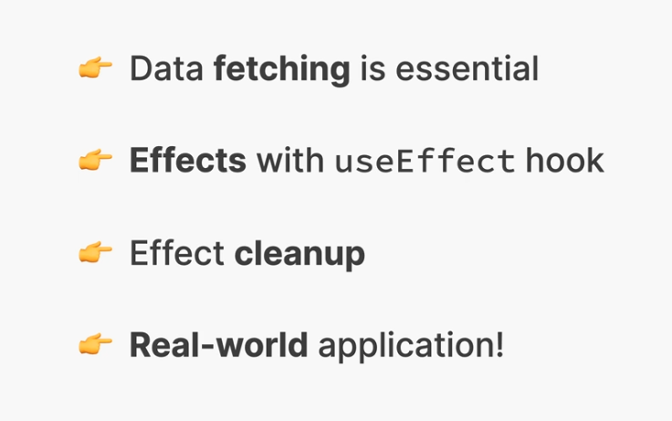

# 12 - Effects and Data Fetching


## 001 Section Overview

## 002 The Component Lifecycle
This image represents the **Component Lifecycle** in React, which refers to the different phases that a component goes through during its existence, from creation to destruction. These phases include mounting, updating (re-render), and unmounting.

### **Phases of the Component Lifecycle:**

1. **Mount / Initial Render:**
   - This is the phase where the component is created and rendered to the DOM for the first time.
   - In this phase, the component's state and props are initialized.
   - Lifecycle method examples in React:
     - **`componentDidMount()`** (for class components)
     - **`useEffect(() => {...}, [])`** (for functional components)

   **Example:**
   ```js
   import React, { useEffect } from 'react';

   function MyComponent() {
     useEffect(() => {
       console.log('Component mounted');
     }, []); // Empty dependency array to ensure this runs only once at mount

     return <div>Hello, World!</div>;
   }

   export default MyComponent;
   ```

   In the example above, the `useEffect` hook mimics the behavior of `componentDidMount()` for a functional component. It runs only when the component is mounted for the first time.

2. **Re-render (Update):**
   - This phase happens when the component is updated due to changes in **state**, **props**, **parent re-renders**, or **context**.
   - After these changes, the component is re-rendered with the updated data.

   **When re-render happens:**
   - **State changes**: If you change a component's state, it triggers a re-render.
   - **Props change**: If the parent component passes new props to the child, the child will re-render.
   - **Parent re-renders**: If the parent component re-renders, all its children will re-render unless optimized.
   - **Context changes**: If the context API changes values, it triggers re-renders for components consuming that context.

   **Example:**
   ```js
   import React, { useState } from 'react';

   function Counter() {
     const [count, setCount] = useState(0);

     return (
       <div>
         <p>Count: {count}</p>
         <button onClick={() => setCount(count + 1)}>Increment</button>
       </div>
     );
   }

   export default Counter;
   ```

   In the above example, clicking the button changes the state (`count`), which causes a re-render of the component to reflect the updated count value.

3. **Unmount:**
   - The **unmounting** phase occurs when a component is removed from the DOM. This is when a component is destroyed, and any associated resources or subscriptions (such as event listeners or intervals) should be cleaned up.
   - Lifecycle method examples in React:
     - **`componentWillUnmount()`** (for class components)
     - **`useEffect(() => { return () => {...}; }, [])`** (for functional components)

   **Example:**
   ```js
   import React, { useEffect } from 'react';

   function Timer() {
     useEffect(() => {
       const timerId = setInterval(() => {
         console.log('Timer running...');
       }, 1000);

       // Clean up the timer when the component is unmounted
       return () => {
         clearInterval(timerId);
         console.log('Component unmounted, timer cleaned up');
       };
     }, []); // Run only once on mount and clean up on unmount

     return <div>Timer Component</div>;
   }

   export default Timer;
   ```

   In this example, we set up an interval when the component mounts, and then we clean it up by clearing the interval when the component is unmounted. This is crucial to avoid memory leaks or unwanted behavior when the component is no longer in the DOM.

---

### **Component Lifecycle Overview in React:**

1. **Mounting**: 
   - The component is created, and the constructor (for class components) or `useState` (for functional components) initializes the state. Then the component is rendered for the first time.
   
2. **Re-rendering**: 
   - The component is re-rendered whenever its state, props, or context changes. This phase can happen multiple times throughout the lifecycle of the component.

3. **Unmounting**: 
   - The component is removed from the DOM, and any necessary cleanup is performed (e.g., removing event listeners, clearing intervals).

---

### **Conclusion**

The **React Component Lifecycle** helps you understand how React handles component updates and rendering under the hood. The three main phases—**Mounting**, **Re-render**, and **Unmounting**—provide hooks to run specific code at different stages in a component's life. By using lifecycle methods like `componentDidMount`, `componentWillUnmount`, or `useEffect` in functional components, you can control what happens when components are created, updated, or destroyed.


## 003 How NOT to Fetch Data in React
```tsx
import NavBar from "./components/NavBar";
import Main from "./page/Main";
import {useState} from "react";
import SearchBar from "./components/SearchBar";
import NumResults from "./components/NumResults";
import Box from "./page/Box";
import MovieList from "./components/MovieList";
import WatchSummery from "./components/WatchSummery";
import WatchedMovieList from "./components/WatchedMovieList";

export type TTempMovieData = {
    imdbID: string;
    Title: string;
    Year: string;
    Poster: string;
};

export type TTempWatchedData = {
    imdbID: string;
    Title: string;
    Year: string;
    Poster: string;
    runtime: number;
    imdbRating: number;
    userRating: number;
};


const tempMovieData: TTempMovieData[] = [
    {
        imdbID: "tt1375666",
        Title: "Inception",
        Year: "2010",
        Poster:
            "https://m.media-amazon.com/images/M/MV5BMjAxMzY3NjcxNF5BMl5BanBnXkFtZTcwNTI5OTM0Mw@@._V1_SX300.jpg",
    },
    {
        imdbID: "tt0133093",
        Title: "The Matrix",
        Year: "1999",
        Poster:
            "https://m.media-amazon.com/images/M/MV5BNzQzOTk3OTAtNDQ0Zi00ZTVkLWI0MTEtMDllZjNkYzNjNTc4L2ltYWdlXkEyXkFqcGdeQXVyNjU0OTQ0OTY@._V1_SX300.jpg",
    },
    {
        imdbID: "tt6751668",
        Title: "Parasite",
        Year: "2019",
        Poster:
            "https://m.media-amazon.com/images/M/MV5BYWZjMjk3ZTItODQ2ZC00NTY5LWE0ZDYtZTI3MjcwN2Q5NTVkXkEyXkFqcGdeQXVyODk4OTc3MTY@._V1_SX300.jpg",
    },
];

export const tempWatchedData: TTempWatchedData[] = [
    {
        imdbID: "tt1375666",
        Title: "Inception",
        Year: "2010",
        Poster:
            "https://m.media-amazon.com/images/M/MV5BMjAxMzY3NjcxNF5BMl5BanBnXkFtZTcwNTI5OTM0Mw@@._V1_SX300.jpg",
        runtime: 148,
        imdbRating: 8.8,
        userRating: 10,
    },
    {
        imdbID: "tt0088763",
        Title: "Back to the Future",
        Year: "1985",
        Poster:
            "https://m.media-amazon.com/images/M/MV5BZmU0M2Y1OGUtZjIxNi00ZjBkLTg1MjgtOWIyNThiZWIwYjRiXkEyXkFqcGdeQXVyMTQxNzMzNDI@._V1_SX300.jpg",
        runtime: 116,
        imdbRating: 8.5,
        userRating: 9,
    },
];

const KEY = "3ce56f7d"

export default function App() {
    const [movies, setMovies] = useState<TTempMovieData[]>([]);
    const [watched, setWatched] = useState<TTempWatchedData[]>(tempWatchedData);

    fetch(`http://www.omdbapi.com/?apikey=${KEY}&s=matrix`)
        .then((response) => response.json())
        .then((data) => {
            setMovies(data.Search);
        });

    setWatched([])
    return (
        <>
            <NavBar>
                <SearchBar/>
                <NumResults movies={movies}/>
            </NavBar>
            <Main>
                <Box>
                    <MovieList movies={movies}/>
                </Box>
                <Box>
                    <WatchSummery watched={watched}/>
                    <WatchedMovieList watched={watched}/>
                </Box>
            </Main>
        </>
    );
}
```

The error **"Too many re-renders. React limits the number of renders to prevent an infinite loop"** is thrown by React when it detects that a component is rendering over and over again, causing an **infinite rendering loop**. This usually happens when state updates occur inside the main body of the component, triggering the component to re-render continuously.

### **Understanding the Problem:**

React components re-render whenever their state or props change. If you update state or trigger a side effect (like fetching data) in such a way that it directly causes another render immediately, you can end up with an infinite loop.

### **Why Does This Happen?**

In React, any state update (via `setState`, `setSomething`, etc.) causes the component to re-render. If this state update is inside the component's rendering logic or occurs on every render, it will cause the component to re-render continuously, leading to the **too many re-renders** error.

---

### **Example of the Problem in Your Code:**

```js
fetch(`http://www.omdbapi.com/?apikey=${KEY}&s=matrix`)
  .then((response) => response.json())
  .then((data) => {
    setMovies(data.Search);  // This triggers a re-render
  });

setWatched([]);  // This also triggers a re-render
```

In the code above:
- **`fetch` and `setMovies`**: This fetch call and state update are being executed during every render, which results in continuous re-renders.
- **`setWatched([])`**: Every time the component renders, this line resets the `watched` state to an empty array, causing another re-render.

Both of these together are causing the infinite loop.

### **Solution: Use `useEffect` to Control Side Effects**

To prevent the component from re-rendering infinitely, you need to wrap any side-effect logic (like fetching data) and state updates in a **`useEffect` hook**. This ensures that side-effects only run once (or when certain dependencies change) instead of during every render.

### **Correcting the Code Using `useEffect`:**

```js
import { useState, useEffect } from "react";
import NavBar from "./components/NavBar";
import Main from "./page/Main";
import SearchBar from "./components/SearchBar";
import NumResults from "./components/NumResults";
import Box from "./page/Box";
import MovieList from "./components/MovieList";
import WatchSummery from "./components/WatchSummery";
import WatchedMovieList from "./components/WatchedMovieList";

export type TTempMovieData = {
  imdbID: string;
  Title: string;
  Year: string;
  Poster: string;
};

export type TTempWatchedData = {
  imdbID: string;
  Title: string;
  Year: string;
  Poster: string;
  runtime: number;
  imdbRating: number;
  userRating: number;
};

const tempWatchedData: TTempWatchedData[] = [
  {
    imdbID: "tt1375666",
    Title: "Inception",
    Year: "2010",
    Poster:
      "https://m.media-amazon.com/images/M/MV5BMjAxMzY3NjcxNF5BMl5BanBnXkFtZTcwNTI5OTM0Mw@@._V1_SX300.jpg",
    runtime: 148,
    imdbRating: 8.8,
    userRating: 10,
  },
  {
    imdbID: "tt0088763",
    Title: "Back to the Future",
    Year: "1985",
    Poster:
      "https://m.media-amazon.com/images/M/MV5BZmU0M2Y1OGUtZjIxNi00ZjBkLTg1MjgtOWIyNThiZWIwYjRiXkEyXkFqcGdeQXVyMTQxNzMzNDI@._V1_SX300.jpg",
    runtime: 116,
    imdbRating: 8.5,
    userRating: 9,
  },
];

const KEY = "3ce56f7d111";

export default function App() {
  const [movies, setMovies] = useState<TTempMovieData[]>([]);
  const [watched, setWatched] = useState<TTempWatchedData[]>(tempWatchedData);

  // Use useEffect to fetch movies only once when the component mounts
  useEffect(() => {
    fetch(`http://www.omdbapi.com/?apikey=${KEY}&s=matrix`)
      .then((response) => response.json())
      .then((data) => {
        setMovies(data.Search);
      });
  }, []); // Empty array ensures this runs only once on mount

  // Removing unnecessary setWatched([]) to prevent infinite re-renders
  // setWatched([]); <-- this line was causing infinite render

  return (
    <>
      <NavBar>
        <SearchBar />
        <NumResults movies={movies} />
      </NavBar>
      <Main>
        <Box>
          <MovieList movies={movies} />
        </Box>
        <Box>
          <WatchSummery watched={watched} />
          <WatchedMovieList watched={watched} />
        </Box>
      </Main>
    </>
  );
}
```

### **Explanation of the Fix:**

1. **`useEffect` to Fetch Data**:
   - The `fetch` call is now wrapped in a `useEffect` hook. This ensures that the data is fetched only once when the component mounts (as indicated by the empty dependency array `[]`).
   - Without `useEffect`, the `fetch` call would happen on every render, leading to infinite re-renders since `setMovies` triggers a re-render every time.

2. **Removed `setWatched([])`**:
   - The line `setWatched([])` was resetting the `watched` state on every render, which caused the component to re-render repeatedly. Removing this line prevents the infinite loop.
   - If you want to reset the `watched` state in a controlled manner, you can do it conditionally or based on an event.

---

### **Common Causes of "Too Many Re-Renders" Error**

1. **State Update Without Conditions**: 
   - Any time you call a `setState` or `setSomething` function inside the main body of a component, it causes a re-render. If this is done repeatedly without a condition, it leads to an infinite loop.
   
   Example of problematic code:
   ```js
   setCount(count + 1);  // Directly in render → infinite re-renders
   ```

2. **Not Using `useEffect` for Side Effects**:
   - When you fetch data or execute side effects (e.g., timers, subscriptions) without wrapping them in `useEffect`, they will run on every render, leading to an infinite loop.

   Solution:
   ```js
   useEffect(() => {
     fetchData();
   }, []);  // Use an empty dependency array to fetch data only once
   ```

3. **Rendering Components Conditionally but Triggering Updates Regardless**:
   - Sometimes, you render components conditionally but update state even when the component is not needed. This can cause re-renders if not handled carefully.

---

### **Best Practices to Avoid Too Many Re-renders**

1. **Use `useEffect` to Handle Side Effects**: If you need to fetch data or manipulate the DOM, use the `useEffect` hook and control when it runs using dependency arrays.

2. **Avoid Updating State Unconditionally**: State updates should be conditional and shouldn't be done during the render process unless they are part of an event handler or a controlled function.

3. **Check for State Changes Before Setting State**: 
   - Ensure that you're not unnecessarily triggering state updates that don't change the actual state value.

   Example:
   ```js
   if (count !== newCount) {
     setCount(newCount);  // Only update if the new count is different
   }
   ```

---

### **Conclusion**

The "Too many re-renders" error occurs when React detects an infinite rendering loop caused by state or props updating continuously. In your case, fetching data and updating state directly in the render process caused this error. Using `useEffect` properly and avoiding state updates in the render body will resolve this problem.
## 004 useEffect to the Rescue

## 005 A First Look at Effects

## 006 Using an async Function

## 007 Adding a Loading State

## 008 Handling Errors

## 009 The useEffect Dependency Array

## 010 Synchronizing Queries With Movie Data

## 011 Selecting a Movie

## 012 Loading Movie Details

## 013 Adding a Watched Movie

## 014 Adding a New Effect Changing Page Title

## 015 The useEffect Cleanup Function

## 016 Cleaning Up the Title

## 017 Cleaning Up Data Fetching

## 018 One More Effect Listening to a Keypress

## 019 CHALLENGE #1 Currency Converter

