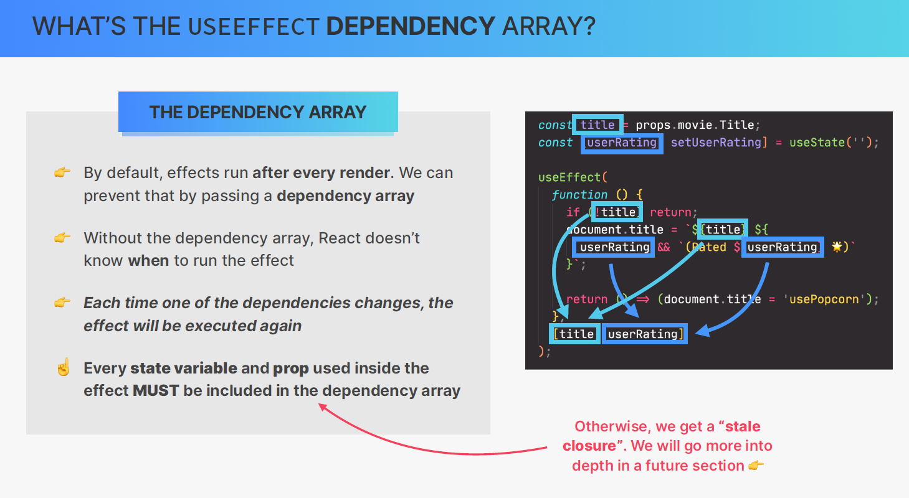
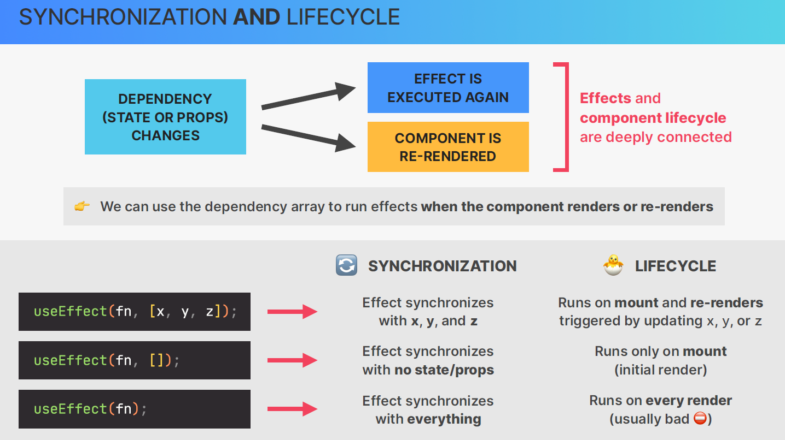
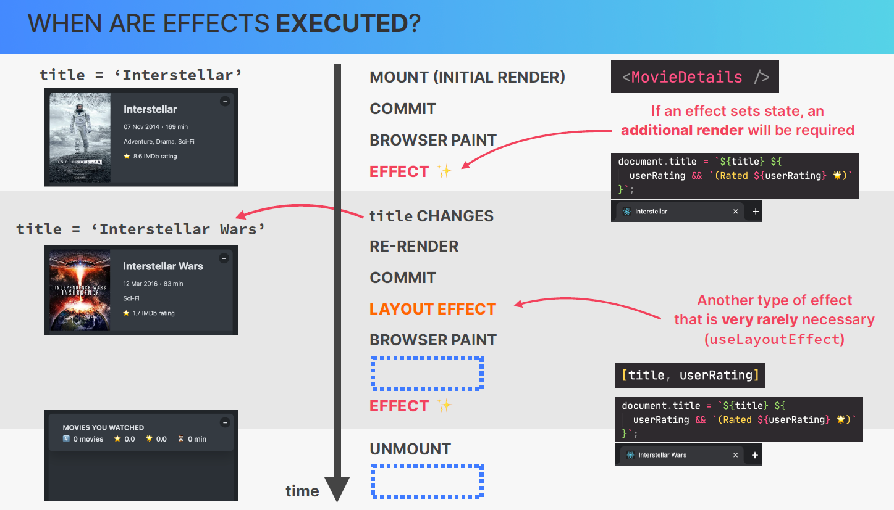
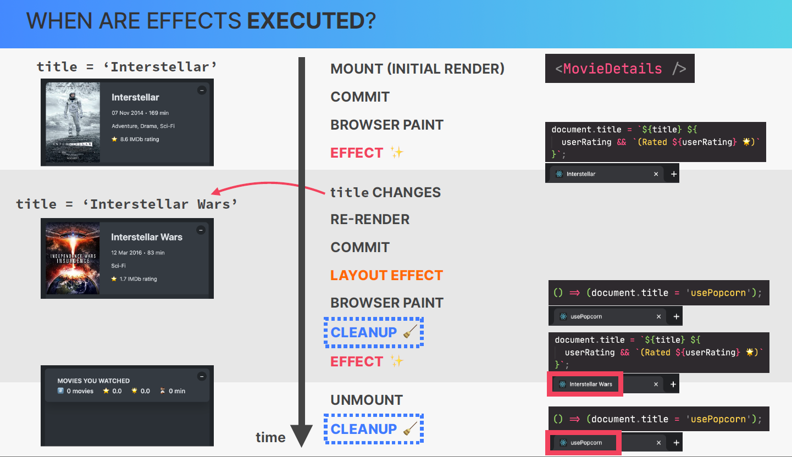
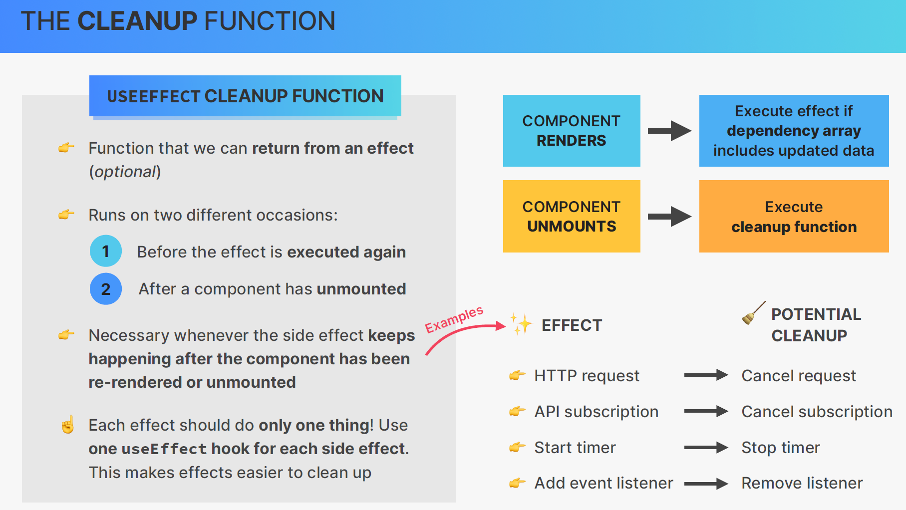

# 12 - Effects and Data Fetching


## 001 Section Overview

## 002 The Component Lifecycle
This image represents the **Component Lifecycle** in React, which refers to the different phases that a component goes through during its existence, from creation to destruction. These phases include mounting, updating (re-render), and unmounting.

### **Phases of the Component Lifecycle:**

1. **Mount / Initial Render:**
   - This is the phase where the component is created and rendered to the DOM for the first time.
   - In this phase, the component's state and props are initialized.
   - Lifecycle method examples in React:
     - **`componentDidMount()`** (for class components)
     - **`useEffect(() => {...}, [])`** (for functional components)

   **Example:**
   ```js
   import React, { useEffect } from 'react';

   function MyComponent() {
     useEffect(() => {
       console.log('Component mounted');
     }, []); // Empty dependency array to ensure this runs only once at mount

     return <div>Hello, World!</div>;
   }

   export default MyComponent;
   ```

   In the example above, the `useEffect` hook mimics the behavior of `componentDidMount()` for a functional component. It runs only when the component is mounted for the first time.

2. **Re-render (Update):**
   - This phase happens when the component is updated due to changes in **state**, **props**, **parent re-renders**, or **context**.
   - After these changes, the component is re-rendered with the updated data.

   **When re-render happens:**
   - **State changes**: If you change a component's state, it triggers a re-render.
   - **Props change**: If the parent component passes new props to the child, the child will re-render.
   - **Parent re-renders**: If the parent component re-renders, all its children will re-render unless optimized.
   - **Context changes**: If the context API changes values, it triggers re-renders for components consuming that context.

   **Example:**
   ```js
   import React, { useState } from 'react';

   function Counter() {
     const [count, setCount] = useState(0);

     return (
       <div>
         <p>Count: {count}</p>
         <button onClick={() => setCount(count + 1)}>Increment</button>
       </div>
     );
   }

   export default Counter;
   ```

   In the above example, clicking the button changes the state (`count`), which causes a re-render of the component to reflect the updated count value.

3. **Unmount:**
   - The **unmounting** phase occurs when a component is removed from the DOM. This is when a component is destroyed, and any associated resources or subscriptions (such as event listeners or intervals) should be cleaned up.
   - Lifecycle method examples in React:
     - **`componentWillUnmount()`** (for class components)
     - **`useEffect(() => { return () => {...}; }, [])`** (for functional components)

   **Example:**
   ```js
   import React, { useEffect } from 'react';

   function Timer() {
     useEffect(() => {
       const timerId = setInterval(() => {
         console.log('Timer running...');
       }, 1000);

       // Clean up the timer when the component is unmounted
       return () => {
         clearInterval(timerId);
         console.log('Component unmounted, timer cleaned up');
       };
     }, []); // Run only once on mount and clean up on unmount

     return <div>Timer Component</div>;
   }

   export default Timer;
   ```

   In this example, we set up an interval when the component mounts, and then we clean it up by clearing the interval when the component is unmounted. This is crucial to avoid memory leaks or unwanted behavior when the component is no longer in the DOM.

---

### **Component Lifecycle Overview in React:**

1. **Mounting**: 
   - The component is created, and the constructor (for class components) or `useState` (for functional components) initializes the state. Then the component is rendered for the first time.
   
2. **Re-rendering**: 
   - The component is re-rendered whenever its state, props, or context changes. This phase can happen multiple times throughout the lifecycle of the component.

3. **Unmounting**: 
   - The component is removed from the DOM, and any necessary cleanup is performed (e.g., removing event listeners, clearing intervals).

---

### **Conclusion**

The **React Component Lifecycle** helps you understand how React handles component updates and rendering under the hood. The three main phases—**Mounting**, **Re-render**, and **Unmounting**—provide hooks to run specific code at different stages in a component's life. By using lifecycle methods like `componentDidMount`, `componentWillUnmount`, or `useEffect` in functional components, you can control what happens when components are created, updated, or destroyed.


## 003 How NOT to Fetch Data in React
```tsx
import NavBar from "./components/NavBar";
import Main from "./page/Main";
import {useState} from "react";
import SearchBar from "./components/SearchBar";
import NumResults from "./components/NumResults";
import Box from "./page/Box";
import MovieList from "./components/MovieList";
import WatchSummery from "./components/WatchSummery";
import WatchedMovieList from "./components/WatchedMovieList";

export type TTempMovieData = {
    imdbID: string;
    Title: string;
    Year: string;
    Poster: string;
};

export type TTempWatchedData = {
    imdbID: string;
    Title: string;
    Year: string;
    Poster: string;
    runtime: number;
    imdbRating: number;
    userRating: number;
};


const tempMovieData: TTempMovieData[] = [
    {
        imdbID: "tt1375666",
        Title: "Inception",
        Year: "2010",
        Poster:
            "https://m.media-amazon.com/images/M/MV5BMjAxMzY3NjcxNF5BMl5BanBnXkFtZTcwNTI5OTM0Mw@@._V1_SX300.jpg",
    },
    {
        imdbID: "tt0133093",
        Title: "The Matrix",
        Year: "1999",
        Poster:
            "https://m.media-amazon.com/images/M/MV5BNzQzOTk3OTAtNDQ0Zi00ZTVkLWI0MTEtMDllZjNkYzNjNTc4L2ltYWdlXkEyXkFqcGdeQXVyNjU0OTQ0OTY@._V1_SX300.jpg",
    },
    {
        imdbID: "tt6751668",
        Title: "Parasite",
        Year: "2019",
        Poster:
            "https://m.media-amazon.com/images/M/MV5BYWZjMjk3ZTItODQ2ZC00NTY5LWE0ZDYtZTI3MjcwN2Q5NTVkXkEyXkFqcGdeQXVyODk4OTc3MTY@._V1_SX300.jpg",
    },
];

export const tempWatchedData: TTempWatchedData[] = [
    {
        imdbID: "tt1375666",
        Title: "Inception",
        Year: "2010",
        Poster:
            "https://m.media-amazon.com/images/M/MV5BMjAxMzY3NjcxNF5BMl5BanBnXkFtZTcwNTI5OTM0Mw@@._V1_SX300.jpg",
        runtime: 148,
        imdbRating: 8.8,
        userRating: 10,
    },
    {
        imdbID: "tt0088763",
        Title: "Back to the Future",
        Year: "1985",
        Poster:
            "https://m.media-amazon.com/images/M/MV5BZmU0M2Y1OGUtZjIxNi00ZjBkLTg1MjgtOWIyNThiZWIwYjRiXkEyXkFqcGdeQXVyMTQxNzMzNDI@._V1_SX300.jpg",
        runtime: 116,
        imdbRating: 8.5,
        userRating: 9,
    },
];

const KEY = "3ce56f7d"

export default function App() {
    const [movies, setMovies] = useState<TTempMovieData[]>([]);
    const [watched, setWatched] = useState<TTempWatchedData[]>(tempWatchedData);

    fetch(`http://www.omdbapi.com/?apikey=${KEY}&s=matrix`)
        .then((response) => response.json())
        .then((data) => {
            setMovies(data.Search);
        });

    setWatched([])
    return (
        <>
            <NavBar>
                <SearchBar/>
                <NumResults movies={movies}/>
            </NavBar>
            <Main>
                <Box>
                    <MovieList movies={movies}/>
                </Box>
                <Box>
                    <WatchSummery watched={watched}/>
                    <WatchedMovieList watched={watched}/>
                </Box>
            </Main>
        </>
    );
}
```

The error **"Too many re-renders. React limits the number of renders to prevent an infinite loop"** is thrown by React when it detects that a component is rendering over and over again, causing an **infinite rendering loop**. This usually happens when state updates occur inside the main body of the component, triggering the component to re-render continuously.

### **Understanding the Problem:**

React components re-render whenever their state or props change. If you update state or trigger a side effect (like fetching data) in such a way that it directly causes another render immediately, you can end up with an infinite loop.

### **Why Does This Happen?**

In React, any state update (via `setState`, `setSomething`, etc.) causes the component to re-render. If this state update is inside the component's rendering logic or occurs on every render, it will cause the component to re-render continuously, leading to the **too many re-renders** error.

---

### **Example of the Problem in Your Code:**

```js
fetch(`http://www.omdbapi.com/?apikey=${KEY}&s=matrix`)
  .then((response) => response.json())
  .then((data) => {
    setMovies(data.Search);  // This triggers a re-render
  });

setWatched([]);  // This also triggers a re-render
```

In the code above:
- **`fetch` and `setMovies`**: This fetch call and state update are being executed during every render, which results in continuous re-renders.
- **`setWatched([])`**: Every time the component renders, this line resets the `watched` state to an empty array, causing another re-render.

Both of these together are causing the infinite loop.

### **Solution: Use `useEffect` to Control Side Effects**

To prevent the component from re-rendering infinitely, you need to wrap any side-effect logic (like fetching data) and state updates in a **`useEffect` hook**. This ensures that side-effects only run once (or when certain dependencies change) instead of during every render.

### **Correcting the Code Using `useEffect`:**

```js
import { useState, useEffect } from "react";
import NavBar from "./components/NavBar";
import Main from "./page/Main";
import SearchBar from "./components/SearchBar";
import NumResults from "./components/NumResults";
import Box from "./page/Box";
import MovieList from "./components/MovieList";
import WatchSummery from "./components/WatchSummery";
import WatchedMovieList from "./components/WatchedMovieList";

export type TTempMovieData = {
  imdbID: string;
  Title: string;
  Year: string;
  Poster: string;
};

export type TTempWatchedData = {
  imdbID: string;
  Title: string;
  Year: string;
  Poster: string;
  runtime: number;
  imdbRating: number;
  userRating: number;
};

const tempWatchedData: TTempWatchedData[] = [
  {
    imdbID: "tt1375666",
    Title: "Inception",
    Year: "2010",
    Poster:
      "https://m.media-amazon.com/images/M/MV5BMjAxMzY3NjcxNF5BMl5BanBnXkFtZTcwNTI5OTM0Mw@@._V1_SX300.jpg",
    runtime: 148,
    imdbRating: 8.8,
    userRating: 10,
  },
  {
    imdbID: "tt0088763",
    Title: "Back to the Future",
    Year: "1985",
    Poster:
      "https://m.media-amazon.com/images/M/MV5BZmU0M2Y1OGUtZjIxNi00ZjBkLTg1MjgtOWIyNThiZWIwYjRiXkEyXkFqcGdeQXVyMTQxNzMzNDI@._V1_SX300.jpg",
    runtime: 116,
    imdbRating: 8.5,
    userRating: 9,
  },
];

const KEY = "3ce56f7d111";

export default function App() {
  const [movies, setMovies] = useState<TTempMovieData[]>([]);
  const [watched, setWatched] = useState<TTempWatchedData[]>(tempWatchedData);

  // Use useEffect to fetch movies only once when the component mounts
  useEffect(() => {
    fetch(`http://www.omdbapi.com/?apikey=${KEY}&s=matrix`)
      .then((response) => response.json())
      .then((data) => {
        setMovies(data.Search);
      });
  }, []); // Empty array ensures this runs only once on mount

  // Removing unnecessary setWatched([]) to prevent infinite re-renders
  // setWatched([]); <-- this line was causing infinite render

  return (
    <>
      <NavBar>
        <SearchBar />
        <NumResults movies={movies} />
      </NavBar>
      <Main>
        <Box>
          <MovieList movies={movies} />
        </Box>
        <Box>
          <WatchSummery watched={watched} />
          <WatchedMovieList watched={watched} />
        </Box>
      </Main>
    </>
  );
}
```

### **Explanation of the Fix:**

1. **`useEffect` to Fetch Data**:
   - The `fetch` call is now wrapped in a `useEffect` hook. This ensures that the data is fetched only once when the component mounts (as indicated by the empty dependency array `[]`).
   - Without `useEffect`, the `fetch` call would happen on every render, leading to infinite re-renders since `setMovies` triggers a re-render every time.

2. **Removed `setWatched([])`**:
   - The line `setWatched([])` was resetting the `watched` state on every render, which caused the component to re-render repeatedly. Removing this line prevents the infinite loop.
   - If you want to reset the `watched` state in a controlled manner, you can do it conditionally or based on an event.

---

### **Common Causes of "Too Many Re-Renders" Error**

1. **State Update Without Conditions**: 
   - Any time you call a `setState` or `setSomething` function inside the main body of a component, it causes a re-render. If this is done repeatedly without a condition, it leads to an infinite loop.
   
   Example of problematic code:
   ```js
   setCount(count + 1);  // Directly in render ‚Üí infinite re-renders
   ```

2. **Not Using `useEffect` for Side Effects**:
   - When you fetch data or execute side effects (e.g., timers, subscriptions) without wrapping them in `useEffect`, they will run on every render, leading to an infinite loop.

   Solution:
   ```js
   useEffect(() => {
     fetchData();
   }, []);  // Use an empty dependency array to fetch data only once
   ```

3. **Rendering Components Conditionally but Triggering Updates Regardless**:
   - Sometimes, you render components conditionally but update state even when the component is not needed. This can cause re-renders if not handled carefully.

---

### **Best Practices to Avoid Too Many Re-renders**

1. **Use `useEffect` to Handle Side Effects**: If you need to fetch data or manipulate the DOM, use the `useEffect` hook and control when it runs using dependency arrays.

2. **Avoid Updating State Unconditionally**: State updates should be conditional and shouldn't be done during the render process unless they are part of an event handler or a controlled function.

3. **Check for State Changes Before Setting State**: 
   - Ensure that you're not unnecessarily triggering state updates that don't change the actual state value.

   Example:
   ```js
   if (count !== newCount) {
     setCount(newCount);  // Only update if the new count is different
   }
   ```

---

### **Conclusion**

The "Too many re-renders" error occurs when React detects an infinite rendering loop caused by state or props updating continuously. In your case, fetching data and updating state directly in the render process caused this error. Using `useEffect` properly and avoiding state updates in the render body will resolve this problem.
## 004 useEffect to the Rescue
```tsx
export default function App() {
    const [movies, setMovies] = useState<TTempMovieData[]>([]);
    const [watched, setWatched] = useState<TTempWatchedData[]>(tempWatchedData);

    useEffect(() => {
        fetch(`http://www.omdbapi.com/?apikey=${KEY}&s=matrix`)
            .then((response) => response.json())
            .then((data) => {
                setMovies(data.Search);
            });

    }, [])
    return (
        <>
            <NavBar>
                <SearchBar/>
                <NumResults movies={movies}/>
            </NavBar>
            <Main>
                <Box>
                    <MovieList movies={movies}/>
                </Box>
                <Box>
                    <WatchSummery watched={watched}/>
                    <WatchedMovieList watched={watched}/>
                </Box>
            </Main>
        </>
    );
}

```
## 005 A First Look at Effects

The image explains **where to create side effects** in React applications and the difference between **event-triggered side effects** and **render-triggered side effects**.

### **Understanding Side Effects in React**

A **side effect** in React is any interaction between the component and the outside world that is not part of the rendering process. Side effects involve tasks like fetching data from an API, setting timers, manually manipulating the DOM, or subscriptions to external services.

React's render logic should remain pure, meaning it should not directly perform side effects. Instead, side effects should be triggered through **event handlers** or through the **useEffect** hook, depending on the requirement.

---

### **Event-Triggered Side Effects (Event Handlers)**

Side effects can be triggered by user events such as clicking a button, submitting a form, or hovering over an element. Event handlers in React handle these side effects.

#### **Example: Side Effect Triggered by an Event (onClick)**

```js
function FetchDataOnClick() {
  const [data, setData] = useState(null);

  const handleClick = () => {
    fetch('https://api.example.com/data')
      .then(response => response.json())
      .then(result => setData(result));
  };

  return (
    <div>
      <button onClick={handleClick}>Fetch Data</button>
      {data && <pre>{JSON.stringify(data, null, 2)}</pre>}
    </div>
  );
}
```

In this example:
- The side effect (fetching data from an API) happens only when the user clicks the **Fetch Data** button.
- The side effect is isolated within the **onClick** event handler and is not tied to the component's rendering.

**When to use event-triggered side effects:**
- When the side effect is dependent on user actions.
- For one-off side effects that do not need to run automatically during the component's lifecycle.

---

### **Render-Triggered Side Effects (useEffect)**

**`useEffect`** is a hook that allows you to manage side effects based on a component's lifecycle. With `useEffect`, you can control when side effects should occur, such as when the component mounts, updates (re-renders), or unmounts.

#### **Key Phases where `useEffect` Can be Used:**

1. **Mount (Initial Render)**: 
   - When the component is mounted (rendered for the first time), `useEffect` can trigger tasks like fetching data from an API.
   
2. **Re-render (Update)**: 
   - When state or props change, `useEffect` can re-run the side effect based on the dependency array.
   
3. **Unmount**: 
   - When the component is about to be destroyed, `useEffect` can clean up side effects like removing event listeners or cancelling network requests.

#### **Example: Side Effect Triggered by Rendering (useEffect)**

```js
import React, { useState, useEffect } from "react";

function FetchDataOnMount() {
  const [data, setData] = useState(null);

  useEffect(() => {
    // This effect runs when the component mounts (initial render)
    fetch('https://api.example.com/data')
      .then(response => response.json())
      .then(result => setData(result));

    return () => {
      // Clean-up logic if necessary (runs on unmount)
      console.log('Component unmounted');
    };
  }, []); // Empty array means this runs only once (on mount)

  return (
    <div>
      {data ? <pre>{JSON.stringify(data, null, 2)}</pre> : 'Loading...'}
    </div>
  );
}
```

In this example:
- **Initial Render**: The API call is triggered only once when the component is first mounted (`useEffect` with an empty dependency array `[]`).
- **Unmount**: You can return a clean-up function within `useEffect` to remove any listeners or stop timers when the component is removed.

**When to use render-triggered side effects (useEffect):**
- When side effects need to occur after the component renders (e.g., fetching data from an API).
- When side effects depend on specific dependencies (like state or props).
- When you need clean-up logic (e.g., cleaning up timers, subscriptions).

---

### **Comparison: Event Handlers vs. useEffect**

- **Event Handlers**: Used for user-triggered side effects. The side effect is performed as a direct response to an event, such as a button click or form submission.
  
- **useEffect**: Used for lifecycle-triggered side effects. Side effects are tied to the component's lifecycle and can run on mount, update, or unmount. This is useful for tasks like data fetching, setting up subscriptions, or making changes that should reflect in the DOM after the initial render.

---

### **Key Points from the Image:**

1. **Side Effects Can be Triggered by Events or Renders**:
   - **Event Handlers**: Trigger side effects in response to events like `onClick` or `onSubmit`.
   - **useEffect**: Triggers side effects based on the component’s lifecycle—when it mounts, re-renders, or unmounts.

2. **Side Effects are Essential**:
   - Applications often need side effects (such as fetching data) to interact with external APIs or systems. These effects should not be executed directly in render logic but handled in `useEffect` or event handlers.

3. **Different Timing**:
   - Side effects inside `useEffect` can be executed at different points: when the component first renders, when it updates, or when it unmounts. This allows you to manage your application's behavior more flexibly than using event handlers alone.

---

### **Review: What is a Side Effect?**

A side effect is any "interaction between a React component and the world outside the component." This includes:
- Fetching data from an API
- Updating the DOM directly
- Setting up timers or intervals
- Subscribing or unsubscribing from external services

In React, the ideal way to manage side effects is through event handlers (e.g., `onClick`) or through `useEffect`, depending on the specific requirements of the application.

---

### **Conclusion**

- Use **event handlers** (like `onClick`) for side effects triggered by user interactions.
- Use **useEffect** for side effects tied to a component's lifecycle, such as fetching data when the component mounts or performing clean-up tasks when it unmounts.

By carefully managing side effects in your React components, you ensure that your app behaves as expected without introducing bugs or performance issues caused by side effects in the rendering process.

The image compares two common methods of handling side effects in React: **Event Handlers** and **Effects (using `useEffect`)**. Both approaches can trigger the same result but under different circumstances and use cases.

### **1. Event Handlers**

- **Executed when the corresponding event happens**: 
  - Event handlers in React are functions that are executed when a user action triggers an event, such as a button click, form submission, or keyboard input.
  
- **Used to react to an event**: 
  - Event handlers are designed to handle user interactions and can be used to perform tasks like fetching data from an API when a button is clicked.

- **Preferred for creating side effects based on user actions**: 
  - Event handlers are ideal when a side effect should occur only when a specific event is triggered.

#### **Example: Fetching Data on Button Click**

```js
function FetchMovies() {
  const [movies, setMovies] = useState([]);

  const handleClick = () => {
    fetch(`http://www.omdbapi.com/?s=inception`)
      .then((response) => response.json())
      .then((data) => setMovies(data.Search));
  };

  return (
    <div>
      <button onClick={handleClick}>Fetch Movies</button>
      <ul>
        {movies.map((movie) => (
          <li key={movie.imdbID}>{movie.Title}</li>
        ))}
      </ul>
    </div>
  );
}
```

In this example:
- **Event handler** `handleClick` is tied to the button's `onClick` event.
- When the button is clicked, it fetches data from the API and updates the component's state (`movies`).
- The UI is updated only when the user interacts with the button.

---

### **2. Effects (useEffect)**

- **Executed after the component mounts**:
  - The `useEffect` hook is executed when the component first renders (mounts) and can be re-executed after subsequent renders if dependencies change.
  
- **Used to keep a component synchronized with external systems**:
  - `useEffect` is ideal when you want to synchronize the component with some external system or resource, such as fetching data from an API or interacting with a subscription service.

- **Cleanup function**: 
  - `useEffect` can return a cleanup function to clean up resources (like removing event listeners or cancelling timers) when the component unmounts or before it re-renders.

- **Dependency Array**: 
  - The dependency array controls when the `useEffect` hook re-runs. If the array is empty (`[]`), the effect only runs once when the component mounts. If there are dependencies, the effect runs whenever the dependencies change.

#### **Example: Fetching Data on Component Mount**

```js
import { useState, useEffect } from 'react';

function FetchMoviesOnMount() {
  const [movies, setMovies] = useState([]);

  useEffect(() => {
    // Fetch movies when the component mounts
    fetch(`http://www.omdbapi.com/?s=inception`)
      .then((response) => response.json())
      .then((data) => setMovies(data.Search));

    // Cleanup function, if necessary
    return () => {
      console.log('Component unmounted or re-rendered');
    };
  }, []); // Empty array ensures this runs only on mount

  return (
    <div>
      <ul>
        {movies.map((movie) => (
          <li key={movie.imdbID}>{movie.Title}</li>
        ))}
      </ul>
    </div>
  );
}
```

In this example:
- **Effect (useEffect)** is executed after the component renders for the first time.
- The API request is made inside `useEffect`, and the result is stored in the state (`movies`).
- The empty dependency array `[]` ensures the effect runs only once, during the initial render.
- A cleanup function is included (though optional), which would run when the component unmounts or if it re-renders due to changes in dependencies (none in this case).

---

### **Comparison Between Event Handlers and useEffect:**

1. **Timing**:
   - **Event Handlers**: Triggered by user events like clicks or form submissions. The side effect (e.g., data fetching) occurs only when the event happens.
   - **useEffect**: Automatically runs after the component is mounted (rendered) or when dependencies change. It's used for side effects tied to the component's lifecycle, not direct user actions.

2. **Purpose**:
   - **Event Handlers**: Suitable for side effects that are dependent on user interactions.
   - **useEffect**: Best for side effects that need to happen as part of the component’s lifecycle, such as fetching data when the component is first displayed.

3. **Re-runs**:
   - **Event Handlers**: Side effects run only when triggered by a specific event.
   - **useEffect**: Re-runs depending on the dependencies passed into the effect. With an empty dependency array, it runs only on mount, but with dependencies, it can run multiple times when those dependencies change.

4. **Cleanup**:
   - **Event Handlers**: No direct cleanup is needed for event handlers unless you're dealing with resources that persist after the event (e.g., timers).
   - **useEffect**: You can return a cleanup function in `useEffect`, which will run when the component unmounts or when the effect is re-executed.

---

### **When to Use Each Approach:**

- **Event Handlers**:
  - When side effects need to be triggered by user actions (like button clicks or form submissions).
  - Suitable for one-off actions that don't need to run automatically during the component's lifecycle.

- **useEffect**:
  - When side effects should be tied to the component’s lifecycle (mount, unmount, updates).
  - Suitable for actions like data fetching, setting up subscriptions, or working with external resources that need synchronization with the component.

---

### **Conclusion:**

- **Event Handlers** are perfect for side effects that need to be triggered by a specific event like clicking a button or submitting a form. 
- **useEffect** is useful for side effects that should run automatically when a component renders, re-renders, or unmounts, such as data fetching or setting up subscriptions.
- Both approaches handle side effects, but their usage depends on when the effect should be triggered: either by an event (event handler) or by the component's lifecycle (useEffect).

This distinction ensures you handle side effects at the right moments in your React application.
## 006 Using an async Function
This code demonstrates a **React TypeScript** application that fetches movie data from an API (OMDb) and displays a list of movies alongside a summary of movies that have been watched. The app follows the React pattern of using hooks for state management (`useState`) and side effects (`useEffect`). Below is a detailed explanation of the code and its functionality.

### **1. Types for Movie Data**

First, the code defines TypeScript types to describe the data structure of both movies and watched movies. TypeScript is used here to ensure type safety, helping catch errors during development by enforcing the structure of the objects.

```ts
export type TTempMovieData = {
    imdbID: string;
    Title: string;
    Year: string;
    Poster: string;
};

export type TTempWatchedData = {
    imdbID: string;
    Title: string;
    Year: string;
    Poster: string;
    runtime: number;
    imdbRating: number;
    userRating: number;
};
```

- `TTempMovieData`: This type defines the structure for movie data fetched from the OMDb API. Each movie has an `imdbID`, `Title`, `Year`, and `Poster` URL.
  
- `TTempWatchedData`: This extends `TTempMovieData` and adds additional properties like `runtime`, `imdbRating`, and `userRating` for movies that have already been watched.

### **2. Sample Watched Movies Data**

Next, the code defines a constant array `tempWatchedData` with some initial watched movie data:

```ts
export const tempWatchedData: TTempWatchedData[] = [
    {
        imdbID: "tt1375666",
        Title: "Inception",
        Year: "2010",
        Poster: "https://m.media-amazon.com/images/M/MV5BMjAxMzY3NjcxNF5BMl5BanBnXkFtZTcwNTI5OTM0Mw@@._V1_SX300.jpg",
        runtime: 148,
        imdbRating: 8.8,
        userRating: 10,
    },
    {
        imdbID: "tt0088763",
        Title: "Back to the Future",
        Year: "1985",
        Poster: "https://m.media-amazon.com/images/M/MV5BZmU0M2Y1OGUtZjIxNi00ZjBkLTg1MjgtOWIyNThiZWIwYjRiXkEyXkFqcGdeQXVyMTQxNzMzNDI@._V1_SX300.jpg",
        runtime: 116,
        imdbRating: 8.5,
        userRating: 9,
    },
];
```

This data simulates a list of watched movies and is used to initialize the `watched` state in the component.

### **3. Fetching Movies from the API (`useEffect`)**

The `App` component fetches movie data when it is first rendered using the `useEffect` hook. The side effect of fetching movie data is performed only once (on component mount), thanks to the empty dependency array (`[]`) passed to `useEffect`.

#### **Setting State:**
- **`movies`**: This state holds the list of movies fetched from the API.
- **`watched`**: This state holds the list of watched movies, initialized with `tempWatchedData`.

#### **API Fetching Logic:**
```ts
useEffect(() => {
    void getMovies(setMovies, "matrix");
}, []);
```

- `getMovies`: A function that accepts `setMovies` and `searchTerm` as arguments and makes an API call to OMDb to fetch movies that match the search term (`matrix` in this case).
- The result is stored in the `movies` state using `setMovies`.

### **4. API Fetch Function (`getMovies`)**

The function `getMovies` is defined in the `api/api.ts` file and is responsible for making the API request to OMDb:

```ts
const getMovies = async (
    setMovies: Dispatch<SetStateAction<TTempMovieData[]>>, 
    searchTerm: string
): Promise<void> => {
    const response = await fetch(`http://www.omdbapi.com/?apikey=${KEY}&s=${searchTerm}`);
    const data = await response.json();
    setMovies(data.Search);
};
```

- **`setMovies`**: A state setter function passed as an argument to update the `movies` state in the `App` component.
- **`searchTerm`**: A string representing the movie search term (e.g., `"matrix"`).
- The API returns a list of movies that match the search term, which is then set in the `movies` state using `setMovies(data.Search)`.

### **5. UI Structure and Rendering**

The `App` component renders a navigation bar, a list of fetched movies, and a summary of watched movies.

#### **Components Breakdown**:

- **`NavBar`**: Contains the search bar and the number of movie results found.
  ```ts
  <NavBar>
    <SearchBar />
    <NumResults movies={movies} />
  </NavBar>
  ```

- **`Main`**: Contains two boxes:
  1. **Movie List**: Displays the list of movies fetched from the API.
  2. **Watched Movie Summary**: Displays a summary of the movies that have been watched.

  ```ts
  <Main>
    <Box>
      <MovieList movies={movies} />
    </Box>
    <Box>
      <WatchSummery watched={watched} />
      <WatchedMovieList watched={watched} />
    </Box>
  </Main>
  ```

### **6. Search Bar and NumResults**

- **`SearchBar`**: Likely a component to search for movies (though its implementation is not shown here).
  
- **`NumResults`**: Displays the number of movies found, passed in as the `movies` prop. It calculates the length of the `movies` array to show the number of results.

### **7. Movie List and Watch Summary**

- **`MovieList`**: Displays a list of movies fetched from the API. The movies are passed as a prop (`movies`).
  
- **`WatchSummery`**: Summarizes the watched movies, including details like the number of watched movies, total runtime, and average ratings.

### **8. TypeScript and Type Safety**

By defining types (`TTempMovieData` and `TTempWatchedData`), the application ensures that the data structures passed between components conform to a specific format. This prevents errors caused by incorrect data structures or missing fields.

For example:
- The `movies` state is defined with the type `TTempMovieData[]`, ensuring that each movie object in the array has the required fields (`imdbID`, `Title`, `Year`, `Poster`).
- The function `getMovies` ensures that the state setter `setMovies` can only accept an array of `TTempMovieData` objects, enforcing data integrity.

### **Conclusion**

This React TypeScript application demonstrates how to:
1. **Manage state** using `useState` for both fetched data (`movies`) and static data (`watched`).
2. **Use `useEffect`** to handle side effects like fetching data from an API when the component mounts.
3. **Use TypeScript** to define types that ensure data consistency across the application.

The application follows best practices, such as keeping side effects (like fetching data) in `useEffect` and using TypeScript types to maintain type safety throughout the app.
## 007 Adding a Loading State
```tsx
const Loader = () => {
    return (
        <h1>Loading...</h1>
    );
}

export default Loader;
```

```tsx
import {Dispatch, SetStateAction} from "react";
import {TTempMovieData} from "../App";

const KEY = "3ce56f7d"
const getMovies = async (setMovies: Dispatch<SetStateAction<TTempMovieData[]>>, searchTerm: string, setIsLoading: Dispatch<SetStateAction<boolean>>): Promise<void> => {
    setIsLoading(true);
    const response = await fetch(`http://www.omdbapi.com/?apikey=${KEY}&s=$${searchTerm}`);
    const data = await response.json();
    setMovies(data.Search);
    setIsLoading(false);
}


export {
    getMovies
}
```

```tsx
export default function App() {
    const [movies, setMovies] = useState<TTempMovieData[]>([]);
    const [watched, setWatched] = useState<TTempWatchedData[]>(tempWatchedData);
    const [isLoading, setIsLoading] = useState<boolean>(false);

    useEffect(() => {
        void getMovies(setMovies, "matrix", setIsLoading);
    }, [])


    return (
        <>
            <NavBar>
                <SearchBar/>
                <NumResults movies={movies}/>
            </NavBar>
            <Main>
                <Box>
                    {
                        isLoading ? <Loader/> : <MovieList movies={movies}/>
                    }
                </Box>
                <Box>
                    <WatchSummery watched={watched}/>
                    <WatchedMovieList watched={watched}/>
                </Box>
            </Main>
        </>
    );
}
```

## 008 Handling Erro`rs
```tsx
import {Dispatch, SetStateAction} from "react";
import {TTempMovieData} from "../App";

const KEY = "3ce56f7d"
const getMovies = async (
    setMovies: Dispatch<SetStateAction<TTempMovieData[]>>,
    searchTerm: string,
    setIsLoading: Dispatch<SetStateAction<boolean>>,
    setError: Dispatch<SetStateAction<string | null>>
): Promise<void> => {
    try {

        setIsLoading(true);
        const response = await fetch(`http://www.omdbapi.com/?apikey=${KEY}&s=$${searchTerm}`);
        if (!response.ok) {
            throw new Error("Failed to fetch data");
        }
        const data = await response.json();
        if (data.Response === "False") {
            throw new Error(data.Error);
        }
        setMovies(data.Search);

    } catch (error) {
        if (error instanceof Error) {
            setError(error.message);
        } else {
            setError("An unknown error occurred");
        }

    } finally {
        setIsLoading(false);
    }
}


export {
    getMovies
}
```
```tsx
import {FC} from "react";


type PropsErrorMessage = {
    error: string | null;
}

const ErrorMessage: FC<PropsErrorMessage> = ({error}) => {
    return (

        <p className={'error'}>
            <span>üö´</span>{error}
        </p>

    )
}

export default ErrorMessage;
```
```tsx
export default function App() {
    const [movies, setMovies] = useState<TTempMovieData[]>([]);
    const [watched, setWatched] = useState<TTempWatchedData[]>(tempWatchedData);
    const [isLoading, setIsLoading] = useState<boolean>(false);
    const [error, setError] = useState<string | null>(null);

    useEffect(() => {
        void getMovies(setMovies, "asdasdasd", setIsLoading, setError);
    }, [])


    return (
        <>
            <NavBar>
                <SearchBar/>
                <NumResults movies={movies}/>
            </NavBar>
            <Main>
                <Box>
                    {
                        isLoading && <Loader/>
                    }
                    {
                        error && <ErrorMessage error={error}/>
                    }
                    {
                        !isLoading && !error && <MovieList movies={movies}/>
                    }
                </Box>
                <Box>
                    <WatchSummery watched={watched}/>
                    <WatchedMovieList watched={watched}/>
                </Box>
            </Main>
        </>
    );
}
```

## 009 The useEffect Dependency Array

The image explains the concept of the **dependency array** in React’s `useEffect` hook, which is a crucial part of managing side effects effectively in functional components. Let’s dive deep into the `useEffect` dependency array and how it works with practical examples using React and TypeScript.

### **Understanding `useEffect` Dependency Array**

The **dependency array** is a list of variables (either **props** or **state**) that `useEffect` watches. Whenever one of these dependencies changes, the effect will re-run. If you leave the dependency array empty (`[]`), the effect will run only once when the component mounts. Without specifying the array, the effect runs after **every render**, which can lead to performance issues if not controlled.

#### **Key Points from the Image:**

1. **By default, effects run after every render**:
   - If you do not pass a dependency array, React will run the effect after every render.
   
2. **We can prevent re-runs by passing a dependency array**:
   - If you want the effect to run only when specific variables (props or state) change, you can list them in the dependency array. The effect will only run when one of those dependencies changes.

3. **Each time one of the dependencies changes, the effect will be executed again**:
   - If any variable listed in the dependency array changes, the effect will re-execute. This allows the effect to stay synchronized with the changing state or props.

4. **Every state variable and prop used inside the effect MUST be included in the dependency array**:
   - It is important to list every variable used inside the `useEffect` hook in the dependency array to prevent issues like “stale closures,” which occurs when the effect references outdated variables from a previous render.

---

### **Example in React with TypeScript**

Let’s use a practical example to illustrate how the `useEffect` hook and its dependency array work.

#### **Movie Rating Example:**

We will create a simple React TypeScript component that displays a movie title and allows the user to rate it. We will use `useEffect` to update the document’s title based on the selected movie and user rating.

```tsx
import React, { useEffect, useState } from 'react';

type Movie = {
  title: string;
  year: number;
};

interface MovieRatingProps {
  movie: Movie;
}

const MovieRating: React.FC<MovieRatingProps> = ({ movie }) => {
  // State to store the user's rating
  const [userRating, setUserRating] = useState<number | null>(null);

  // useEffect to update the document title when movie or userRating changes
  useEffect(() => {
    if (userRating) {
      // Update the document title to include movie title and user rating
      document.title = `${movie.title} - Your Rating: ${userRating}`;
    } else {
      // Reset to default title when there's no user rating
      document.title = movie.title;
    }

    // Cleanup function to reset the title on unmount
    return () => {
      document.title = "React Movie App";
    };
  }, [movie.title, userRating]); // Dependency array

  return (
    <div>
      <h1>{movie.title} ({movie.year})</h1>
      <p>Your Rating: {userRating || 'Not rated yet'}</p>
      <button onClick={() => setUserRating(5)}>Rate 5 Stars</button>
      <button onClick={() => setUserRating(3)}>Rate 3 Stars</button>
      <button onClick={() => setUserRating(1)}>Rate 1 Star</button>
    </div>
  );
};

const App = () => {
  const movie: Movie = {
    title: 'Inception',
    year: 2010,
  };

  return <MovieRating movie={movie} />;
};

export default App;
```

#### **Explanation:**

1. **State Variables:**
   - We use `useState` to manage the `userRating` state, which holds the user's rating for the movie.

2. **useEffect Hook:**
   - We use `useEffect` to update the document’s title based on the selected movie and the user’s rating.
   - The **dependency array** contains two dependencies: `movie.title` and `userRating`. This ensures that the effect runs only when either the movie title or the user rating changes.
   
3. **Cleanup Function:**
   - The cleanup function resets the document title to the default ("React Movie App") when the component is unmounted or before the next re-render. This prevents side effects from persisting when the component is removed.

4. **Effect Re-run:**
   - If the user changes their rating, the effect will re-run because `userRating` is in the dependency array. Similarly, if the movie title changes (which doesn’t happen in this simple example but could in a more complex scenario), the effect would also re-run.

---

### **When to Use Dependency Arrays**

#### **1. Run Effect Once on Component Mount (Empty Dependency Array)**

If you want the effect to run only once when the component mounts, you can pass an empty dependency array (`[]`).

```tsx
useEffect(() => {
  console.log('This effect runs only once on mount');
}, []); // Empty dependency array
```

This is useful for things like fetching data from an API when the component is first rendered.

#### **2. Re-run Effect When Dependencies Change**

If you want the effect to re-run whenever certain state or props change, list them in the dependency array.

```tsx
useEffect(() => {
  console.log('This effect runs when "count" changes');
}, [count]); // Runs when "count" changes
```

In this example, the effect will only re-run if the `count` variable changes.

#### **3. Avoiding “Stale Closures”**

As the image explains, **stale closures** can occur if you reference variables inside `useEffect` that are not included in the dependency array. This can lead to issues where the effect references outdated variables from a previous render.

By ensuring that all state variables and props used inside the effect are listed in the dependency array, you prevent this problem.

---

### **Handling Multiple Dependencies**

In more complex scenarios, you may have multiple dependencies that the effect needs to watch. Make sure you include all the necessary state or props in the dependency array to ensure the effect behaves as expected.

```tsx
useEffect(() => {
  // Do something when either "count" or "name" changes
  console.log(`Count: ${count}, Name: ${name}`);
}, [count, name]); // Multiple dependencies
```

Here, the effect re-runs if either `count` or `name` changes.

---

### **Conclusion**

The **dependency array** is an essential part of the `useEffect` hook in React, allowing you to control when the effect should re-run based on specific dependencies. By understanding how the dependency array works, you can:
- Ensure your side effects run at the correct time.
- Prevent unnecessary re-renders that could degrade performance.
- Avoid stale closures by including all relevant variables in the dependency array.

This allows you to manage side effects cleanly and efficiently in your React TypeScript applications.

The image illustrates how the `useEffect` hook works in React. I'll explain it in-depth and include examples using React with TypeScript, referencing the official React documentation from [React.dev](https://react.dev/reference/react).

### **What is `useEffect`?**

`useEffect` is a **side-effect** management hook in React. Side effects can include tasks like:
- Fetching data from an API
- Manipulating the DOM (like updating the document title)
- Subscribing to WebSockets or intervals

In React, **effects are reactive**: they respond to changes in component state or props. They synchronize the external system (like the browser's document, local storage, or a backend) with the current component state.

### **How `useEffect` works**

The core idea of `useEffect` is that it runs whenever **dependencies** change. Dependencies are values (like state variables or props) that the effect depends on. When any of these dependencies change, the effect is triggered (or re-triggered).

In your image, two dependencies, `title` and `userRating`, are shown. The `useEffect` hook listens to changes in these values, and if either changes, the effect is executed again. In this case, the side effect is **updating the document title**.

#### **Example using TypeScript**

```tsx
import React, { useEffect, useState } from 'react';

const MovieRating: React.FC = () => {
  const [title, setTitle] = useState<string>('Interstellar');
  const [userRating, setUserRating] = useState<number>(10);

  useEffect(() => {
    // This effect updates the document title whenever title or userRating changes
    document.title = `${title} ${userRating && `(Rated ${userRating} ⭐)`}`;
  }, [title, userRating]); // dependencies

  return (
    <div>
      <h1>{title}</h1>
      <p>Your rating: {userRating}</p>
    </div>
  );
};

export default MovieRating;
```

#### **Explanation:**
1. **`useState`:** 
   - We have two pieces of state: `title` (the name of the movie) and `userRating` (the rating given by the user).
   
2. **`useEffect`:**
   - This is the side effect that updates the **document title** whenever the `title` or `userRating` changes.
   - **Dependencies:** `[title, userRating]` means this effect will run only when one of these values changes.
   - The function inside `useEffect` updates `document.title` to display the movie title and rating in the browser tab.

3. **Side effect (external system synchronization):**
   - The browser's document title (which is an external system) is updated with the movie title and the rating, just as shown in your image.

### **The Mechanics of `useEffect`**
1. **Initial Render:**
   - When the component mounts (first renders), `useEffect` will execute.
   - Since the dependencies are `[title, userRating]`, it will update the document title based on their values.

2. **Subsequent Renders:**
   - If you change either the `title` or `userRating`, the `useEffect` will run again. For instance, if `userRating` changes from `10` to `9`, the document title will be updated to reflect this change.

### **Cleaning up in `useEffect`**

Sometimes, side effects can require cleanup. For instance, if you're subscribing to a WebSocket or setting up an interval, you might need to clean up after your component unmounts.

You can return a cleanup function from `useEffect`. This cleanup function runs before the next effect (if dependencies have changed) or when the component unmounts.

#### **Example with cleanup**

Let's assume we want to log the title when the component is unmounted.

```tsx
useEffect(() => {
  console.log(`Document title is set to: ${title}`);

  return () => {
    console.log('Cleaning up on unmount');
  };
}, [title]);
```

Here:
- `console.log('Cleaning up on unmount')` will run when the component unmounts or before the `useEffect` is executed again (if `title` changes).

### **Advanced Example**

Imagine we are fetching user ratings from an API, using asynchronous code inside `useEffect`.

```tsx
import React, { useEffect, useState } from 'react';

const MovieRating: React.FC = () => {
  const [title, setTitle] = useState<string>('Interstellar');
  const [userRating, setUserRating] = useState<number | null>(null);

  useEffect(() => {
    // Fake API call to get movie rating
    const fetchRating = async () => {
      const response = await fetch('/api/rating'); // assume this returns a rating for the movie
      const data = await response.json();
      setUserRating(data.rating);
    };

    fetchRating();
  }, [title]); // this effect only depends on the title changing

  useEffect(() => {
    document.title = `${title} ${userRating ? `(Rated ${userRating} ⭐)` : ''}`;
  }, [title, userRating]); // this effect depends on both title and userRating

  return (
    <div>
      <h1>{title}</h1>
      {userRating ? <p>Your rating: {userRating}</p> : <p>Loading rating...</p>}
    </div>
  );
};

export default MovieRating;
```

#### **Explanation:**
- We added a fake API call (`fetchRating()`) that retrieves the movie rating asynchronously.
- The `userRating` is initially set to `null`, and once the API call completes, it updates `userRating` with the fetched rating.
- The `document.title` is updated as soon as the rating is available.

### **Conclusion**

`useEffect` is a powerful hook that synchronizes component state or props with external systems. It listens for changes in dependencies and runs the effect accordingly, making it the key tool for managing side effects in React components.

You can refer to the [React documentation](https://react.dev/reference/react) for more details, including other hooks and advanced patterns like `useReducer` combined with `useEffect` for complex state management.

The image illustrates the connection between **`useEffect` synchronization** and the **component lifecycle** in React. It also highlights the different ways to manage effects using a dependency array, which determines **when** and **how often** the effect is executed.

I’ll explain the concept in-depth with examples using **React with TypeScript**, following the [official React documentation](https://react.dev/reference/react).

### **`useEffect` Hook in Synchronization and Lifecycle**

In React, the **lifecycle** refers to how a component mounts, updates, and unmounts. The `useEffect` hook helps us manage side effects during these phases. The **synchronization** aspect of `useEffect` is about syncing changes in the component's state or props with some external system (such as the browser's `document` or an API call).

The three ways to use `useEffect` are demonstrated in the image:
1. **With dependencies (`[x, y, z]`):** Executes the effect when any of the dependencies change.
2. **With an empty array (`[]`):** Executes the effect only once after the initial render (mount).
3. **Without a dependency array:** Executes the effect on **every render** (which is usually not ideal).

### **1. `useEffect` with Dependencies**

This form synchronizes the effect with **specific values** from the component (e.g., state variables or props). The effect is executed whenever these values change.

#### **TypeScript Example:**

```tsx
import React, { useState, useEffect } from 'react';

const MovieDetails: React.FC = () => {
  const [title, setTitle] = useState<string>('Interstellar');
  const [rating, setRating] = useState<number>(10);

  // Effect depends on both 'title' and 'rating'
  useEffect(() => {
    // This effect runs when 'title' or 'rating' changes
    document.title = `${title} - Rated: ${rating}`;
    console.log(`Title: ${title}, Rating: ${rating}`);
  }, [title, rating]); // The dependencies array

  return (
    <div>
      <h1>{title}</h1>
      <button onClick={() => setRating(9)}>Change Rating to 9</button>
    </div>
  );
};

export default MovieDetails;
```

#### **Explanation:**
- The `useEffect` hook listens to the `title` and `rating` state variables. Whenever either of these variables changes, the effect is executed again.
- The **dependencies array** in `useEffect([title, rating])` tells React when to re-run the effect.
- If the title changes or the user clicks the button to change the rating, React will update the document title and log the new values to the console.

#### **Lifecycle Connection:**
- The effect **runs** on both the **initial render** (mount) and **subsequent renders** (when `title` or `rating` changes).

### **2. `useEffect` with an Empty Dependency Array**

If you pass an **empty array** (`[]`) as the second argument to `useEffect`, it will only run **once**, after the component mounts (i.e., after the initial render). This is typically used for side effects that should only happen **once**, like fetching data or subscribing to an event.

#### **TypeScript Example:**

```tsx
import React, { useEffect, useState } from 'react';

const WelcomeMessage: React.FC = () => {
  const [message, setMessage] = useState<string>('Hello, User!');

  useEffect(() => {
    console.log('This runs only once, on mount');
    // Fetch data or initialize something here

    return () => {
      console.log('Cleanup on unmount (if needed)');
    };
  }, []); // Empty dependency array

  return <h1>{message}</h1>;
};

export default WelcomeMessage;
```

#### **Explanation:**
- **Empty array (`[]`)** means the effect is **only executed once** when the component is first rendered (mounted).
- This is useful for one-time side effects, such as fetching data from an API or initializing a service.
- The return function serves as a **cleanup function** that runs when the component unmounts.

#### **Lifecycle Connection:**
- The effect **only runs on mount** and not on any subsequent re-renders.
  
### **3. `useEffect` Without Dependencies**

If you don’t provide a dependencies array at all, the effect will **run after every render**, including **initial render** and every time the component **updates**. This can lead to performance issues because the effect runs too often, so it's usually avoided unless absolutely necessary.

#### **TypeScript Example:**

```tsx
import React, { useEffect, useState } from 'react';

const ContinuousUpdate: React.FC = () => {
  const [count, setCount] = useState<number>(0);

  // Effect runs on every render
  useEffect(() => {
    console.log(`This runs on every render, Count: ${count}`);
  });

  return (
    <div>
      <p>Count: {count}</p>
      <button onClick={() => setCount(count + 1)}>Increment</button>
    </div>
  );
};

export default ContinuousUpdate;
```

#### **Explanation:**
- **No dependencies array** means the effect will run **on every render** (both mount and subsequent updates). Each time the `count` state changes, the component re-renders, and the effect runs again.
- This behavior is often **undesirable** for most use cases because it can lead to excessive execution of the effect, slowing down the application.

#### **Lifecycle Connection:**
- The effect runs on **every render**, which includes the **initial render** and all subsequent renders.
  
### **Understanding Synchronization and Lifecycle with `useEffect`**

The key idea behind the synchronization mechanism is that **effects are tied to the component's render cycle**. Whenever a component renders (or re-renders due to a change in state or props), effects can be triggered based on the **dependency array**:
- **With dependencies:** Only re-runs when specified dependencies change.
- **With empty dependencies:** Only runs once, after the initial render (on mount).
- **Without dependencies:** Runs on every render, both on mount and update.

### **Common Use Cases for Each Approach**

1. **Effect with Dependencies (`useEffect(fn, [x, y, z])`):**
   - Synchronize with specific state/props changes.
   - Example: Update the document title when a user’s rating or a movie title changes.

2. **Effect with Empty Array (`useEffect(fn, [])`):**
   - For one-time side effects (like initializing data or subscribing to a service).
   - Example: Fetch data from an API once the component is mounted.

3. **Effect without Array (`useEffect(fn)`):**
   - Avoid unless you need to run code on **every** render. Rarely useful but sometimes necessary for debugging or certain animations.
   - Example: Logging every render or tracking performance metrics.

### **Conclusion**

By understanding the synchronization behavior of `useEffect` in React, you can efficiently manage side effects in your components. The use of the **dependency array** is key to controlling when an effect runs, ensuring it syncs appropriately with your component's state or props without running excessively. Always think about **when** you need your side effect to run and select the appropriate dependency strategy to match the component’s lifecycle.

For more detailed explanations and additional examples, you can refer to the [official React documentation](https://react.dev/reference/react).

The image you've provided explores **when effects are executed** in the React lifecycle and introduces both `useEffect` and `useLayoutEffect`. It demonstrates the relationship between component rendering, state changes, and how React schedules and executes effects in the render cycle.

I’ll explain this deeply with examples using **React with TypeScript**, and refer to the [React official documentation](https://react.dev/reference/react) for the necessary details.

---

### **`useEffect` and `useLayoutEffect`**

Both `useEffect` and `useLayoutEffect` are hooks for running side effects in functional React components. They execute at different points in the **component lifecycle**, and choosing between them depends on when you need your effect to run in relation to rendering.

#### **`useEffect`:**
- Runs **after** the render is committed to the screen.
- Used for most side effects like data fetching, subscriptions, and updating the document title.
- Does **not** block the painting of the screen, so the user sees the rendered result first.
  
#### **`useLayoutEffect`:**
- Runs **synchronously** after React has computed the DOM updates but **before** painting them to the screen.
- Used rarely when you need to **measure the layout** of the DOM or make **synchronous changes** before the browser paints.
  
### **Lifecycle Phases (as shown in the image)**

#### 1. **Initial Render (Mount)**

- When a component mounts, React goes through several stages:
  - **Commit**: React commits the result of the render to the DOM.
  - **Browser Paint**: The browser paints the updated DOM on the screen.
  - **Effect**: The `useEffect` hook runs **after** the painting.

  Example:
  
  ```tsx
  import React, { useEffect, useState } from 'react';

  const MovieDetails: React.FC = () => {
    const [title, setTitle] = useState<string>('Interstellar');
    const [userRating, setUserRating] = useState<number>(10);

    // This effect will run after the first render
    useEffect(() => {
      document.title = `${title} - Rated: ${userRating}`;
    }, [title, userRating]);

    return (
      <div>
        <h1>{title}</h1>
        <p>User Rating: {userRating}</p>
      </div>
    );
  };

  export default MovieDetails;
  ```

  **Explanation:**
  - When the component mounts (initial render), `useEffect` will run **after** the DOM updates and the browser paints the screen. It updates the document title with the `title` and `userRating`.
  
  **Lifecycle Connection:**
  - **Commit phase**: React commits the changes to the DOM.
  - **Paint phase**: The browser paints the result to the screen.
  - **Effect phase**: After painting, the `useEffect` hook runs and updates the document title.

---

#### 2. **Subsequent Renders (Re-render)**

- When a state (like `title`) changes, the component **re-renders**:
  - **Commit**: React commits the new updates to the DOM.
  - **Layout Effect**: If you are using `useLayoutEffect`, this runs **before** the browser paints the updated DOM.
  - **Browser Paint**: The browser renders the new UI to the screen.
  - **Effect**: The `useEffect` hook runs after the screen is painted.

  Example:
  
  ```tsx
  import React, { useEffect, useState, useLayoutEffect } from 'react';

  const MovieDetails: React.FC = () => {
    const [title, setTitle] = useState<string>('Interstellar');
    const [userRating, setUserRating] = useState<number>(10);

    // This effect will run after the component is rendered and painted
    useEffect(() => {
      console.log('useEffect: After painting');
      document.title = `${title} - Rated: ${userRating}`;
    }, [title, userRating]);

    // This effect runs before painting
    useLayoutEffect(() => {
      console.log('useLayoutEffect: Before painting');
    }, [title]);

    return (
      <div>
        <h1>{title}</h1>
        <p>User Rating: {userRating}</p>
        <button onClick={() => setTitle('Interstellar Wars')}>
          Change Title
        </button>
      </div>
    );
  };

  export default MovieDetails;
  ```

  **Explanation:**
  - `useLayoutEffect` runs **before** the browser paints, allowing you to make any **synchronous DOM changes** or measurements. In this example, it logs a message to the console before the paint occurs.
  - `useEffect` runs **after** the browser has painted the screen. This is where you can safely make non-blocking updates, such as updating the document title.

  **Lifecycle Connection:**
  - **Commit phase**: React commits updates (e.g., new title) to the DOM.
  - **Layout Effect phase**: `useLayoutEffect` runs synchronously before the paint, ensuring all DOM changes or layout measurements are complete.
  - **Paint phase**: The browser paints the result on the screen.
  - **Effect phase**: `useEffect` runs after painting, which is useful for tasks that don't need to block the visual updates.

---

#### 3. **Unmount**

- When a component is unmounted, any side effects created in `useEffect` or `useLayoutEffect` are **cleaned up**. This ensures that subscriptions, intervals, or event listeners do not cause memory leaks.

  Example:
  
  ```tsx
  import React, { useEffect, useState } from 'react';

  const MovieDetails: React.FC = () => {
    const [title, setTitle] = useState<string>('Interstellar');

    // Cleanup effect when component unmounts
    useEffect(() => {
      console.log('Effect running');
      return () => {
        console.log('Cleanup on unmount');
      };
    }, []);

    return (
      <div>
        <h1>{title}</h1>
      </div>
    );
  };

  export default MovieDetails;
  ```

  **Explanation:**
  - The `useEffect` hook can return a **cleanup function** that will run when the component **unmounts**.
  - This is useful for unsubscribing from WebSocket connections, clearing intervals, or any other cleanups that need to happen when the component is removed from the DOM.

  **Lifecycle Connection:**
  - **Unmount phase**: The component is removed from the DOM, and the cleanup function inside `useEffect` is called.

---

### **Understanding When Effects Are Executed**

As depicted in the image, React’s process for effect execution is tied to the render phases:
- **Mount phase:** When the component is first rendered, the **effects** run **after** the initial paint, unless you use `useLayoutEffect`, which runs before.
- **Re-render phase:** When a component’s state or props change, causing a re-render, `useLayoutEffect` will run synchronously **before the paint**, and `useEffect` will run **after**.
- **Unmount phase:** When the component unmounts, any cleanup function returned from `useEffect` or `useLayoutEffect` will be called to tidy up resources.

### **When to Use `useEffect` vs `useLayoutEffect`**

1. **`useEffect`:**
   - Use for side effects that do **not affect layout** and do not require synchronous execution.
   - Examples: API calls, logging, updating document titles, subscribing to external events (like WebSockets).

2. **`useLayoutEffect`:**
   - Use for side effects that require **synchronous execution before painting**, like:
     - Measuring the DOM size or position.
     - Mutating the DOM synchronously (e.g., setting focus).
   - Note: Use sparingly, as it blocks rendering.

### **Conclusion**

React provides `useEffect` and `useLayoutEffect` to handle side effects in different parts of the rendering cycle:
- **`useEffect`** is typically used for most side effects and is executed **after the paint**.
- **`useLayoutEffect`** is executed **before the paint** and is useful for layout-related work, though it should be used sparingly.

By understanding when effects are executed, you can optimize performance and ensure your React applications behave as expected. Always refer to the [React documentation](https://react.dev/reference/react) for deeper insights.
## 010 Synchronizing Queries With Movie Data

```tsx
import {Dispatch, SetStateAction} from "react";
import {TTempMovieData} from "../App";

const KEY = "3ce56f7d"
const getMovies = async (
    setMovies: Dispatch<SetStateAction<TTempMovieData[]>>,
    searchTerm: string,
    setIsLoading: Dispatch<SetStateAction<boolean>>,
    setError: Dispatch<SetStateAction<string | null>>
): Promise<void> => {
    try {
        setError(null);
        setIsLoading(true);
        const response = await fetch(`http://www.omdbapi.com/?apikey=${KEY}&s=$${searchTerm}`);
        if (!response.ok) {
            throw new Error("Failed to fetch data");
        }
        const data = await response.json();
        if (data.Response === "False") {
            throw new Error(data.Error);
        }
        setMovies(data.Search);

    } catch (error) {
        if (error instanceof Error) {
            setError(error.message);
        } else {
            setError("An unknown error occurred");
        }

    } finally {
        setIsLoading(false);
    }
}


export {
    getMovies
}
```
```tsx
import {FC} from "react";

type PropsSearchBar = {
    query: string;
    setQuery: (query: string) => void;
}

const SearchBar: FC<PropsSearchBar> = ({setQuery, query}) => {


    return <input
        className="search"
        type="text"
        placeholder="Search movies..."
        value={query}
        onChange={(e) => setQuery(e.target.value)}
    />
}

export default SearchBar;
```
```tsx
export default function App() {
    const [movies, setMovies] = useState<TTempMovieData[]>([]);
    const [watched, setWatched] = useState<TTempWatchedData[]>(tempWatchedData);
    const [isLoading, setIsLoading] = useState<boolean>(false);
    const [error, setError] = useState<string | null>(null);
    const [query, setQuery] = useState<string>("matrix");

    useEffect(() => {

        if (query.length < 3) {
            setMovies([]);
            setError(null);
            return;
        }

        void getMovies(setMovies, query, setIsLoading, setError);

    }, [query])


    return (
        <>
            <NavBar>
                <SearchBar setQuery={setQuery} query={query}/>
                <NumResults movies={movies}/>
            </NavBar>
            <Main>
                <Box>
                    {
                        isLoading && <Loader/>
                    }
                    {
                        error && <ErrorMessage error={error}/>
                    }
                    {
                        !isLoading && !error && <MovieList movies={movies}/>
                    }
                </Box>
                <Box>
                    <WatchSummery watched={watched}/>
                    <WatchedMovieList watched={watched}/>
                </Box>
            </Main>
        </>
    );
}

```
## 011 Selecting a Movie

```tsx
import {FC} from "react";
import {TTempMovieData} from "../App";


const Movie: FC<Props> = ({movie, setSelectedMovieId}) => {
    return (
        <li onClick={() => setSelectedMovieId(movie.imdbID)}>
            
            <h3>{movie.Title}</h3>
            <div>
                <p>
                    <span>üóì</span>
                    <span>{movie.Year}</span>
                </p>
            </div>
        </li>
    )
}

export default Movie;

type Props = {
    movie: TTempMovieData
    setSelectedMovieId: (id: string) => void;
}
```
```tsx
import {FC} from "react";
import {TTempMovieData} from "../App";
import Movie from "./Movie";

const MovieList: FC<PropsMovieList> = ({movies, setSelectedMovieId}) => {

    return (
        <ul className="list">
            {movies?.map((movie) => (
                <Movie setSelectedMovieId={setSelectedMovieId} key={movie.imdbID} movie={movie}/>
            ))}
        </ul>
    )
}

export default MovieList;

type PropsMovieList = {
    movies: TTempMovieData[];
    setSelectedMovieId: (id: string) => void;
}
```
```tsx
import {FC} from "react";

type PropsSelectedMovie = {
    selectedMovieId: string;
    onClick: () => void;
}

const SelectedMovie: FC<PropsSelectedMovie> = ({selectedMovieId, onClick}) => {

    return (
        <div className="details">
            <button className={'btn-back'} onClick={onClick}>&larr;</button>
            {selectedMovieId}
        </div>
    )
}

export default SelectedMovie;
```
```tsx
export default function App() {
    const [movies, setMovies] = useState<TTempMovieData[]>([]);
    const [watched, setWatched] = useState<TTempWatchedData[]>(tempWatchedData);
    const [isLoading, setIsLoading] = useState<boolean>(false);
    const [error, setError] = useState<string | null>(null);
    const [query, setQuery] = useState<string>("matrix");
    const [selectedMovieId, setSelectedMovieId] = useState<string | null>(null);


    const handleSelectMovie = (id: string) => {
        setSelectedMovieId(currentId => id === currentId ? null : id);
    }

    const handleCloseSelectedMovie = () => {
        setSelectedMovieId(null);
    }

    useEffect(() => {

        if (query.length < 3) {
            setMovies([]);
            setError(null);
            return;
        }

        void getMovies(setMovies, query, setIsLoading, setError);

    }, [query])


    return (
        <>
            <NavBar>
                <SearchBar setQuery={setQuery} query={query}/>
                <NumResults movies={movies}/>
            </NavBar>
            <Main>
                <Box>
                    {
                        isLoading && <Loader/>
                    }
                    {
                        error && <ErrorMessage error={error}/>
                    }
                    {
                        !isLoading && !error && <MovieList setSelectedMovieId={handleSelectMovie} movies={movies}/>
                    }
                </Box>
                <Box>
                    {
                        selectedMovieId ?
                            <SelectedMovie onClick={handleCloseSelectedMovie}
                                           selectedMovieId={selectedMovieId}/> : <>
                                <WatchSummery watched={watched}/>
                                <WatchedMovieList watched={watched}/>
                            </>
                    }

                </Box>
            </Main>
        </>
    );
}

```
## 012 Loading Movie Details

```tsx
const getMoviesByID = async (
    setMovie: Dispatch<SetStateAction<TMovie | null>>,
    id: string,
    setIsLoading: Dispatch<SetStateAction<boolean>>,
    setError: Dispatch<SetStateAction<string | null>>
): Promise<void> => {
    try {
        setError(null);
        setIsLoading(true);
        const response = await fetch(`http://www.omdbapi.com/?apikey=${KEY}&i=${id}`);
        if (!response.ok) {
            throw new Error("Failed to fetch data");
        }
        const data = await response.json();
        if (data.Response === "False") {
            throw new Error(data.Error);
        }
        setMovie(data);

    } catch (error) {
        if (error instanceof Error) {
            setError(error.message);
        } else {
            setError("An unknown error occurred");
        }

    } finally {
        setIsLoading(false);
    }
}

export {
    getMoviesByName,
    getMoviesByID
}
```
```tsx
import {FC, useEffect, useState} from "react";
import StarRating from "./StarRating";
import {getMoviesByID} from "../api/api";
import Loader from "./Loader";
import ErrorMessage from "./ErrorMessage";

type PropsSelectedMovie = {
    selectedMovieId: string;
    onClick: () => void;
}

const SelectedMovie: FC<PropsSelectedMovie> = ({selectedMovieId, onClick}) => {

    const [movie, setMovie] = useState<TMovie | null>(null);
    const [isLoading, setIsLoading] = useState<boolean>(false);
    const [error, setError] = useState<string | null>(null);
    useEffect(() => {
        void getMoviesByID(setMovie, selectedMovieId, setIsLoading, setError);
    }, [selectedMovieId])

    return (
        <div className="details">
            {isLoading && <Loader/>}
            {error && <ErrorMessage error={error}/>}
            {!isLoading && movie && <>
                <header>


                    <button className={'btn-back'} onClick={onClick}>&larr;</button>
                    
                    <div className="details-overview">
                        <h2>{movie.Title}</h2>
                        <p>
                            {movie.Released} &bull; {movie.Runtime}
                        </p>
                        <p>
                            {movie.Genre}
                        </p>
                        <p>
                            <span>⭐</span>
                            {movie.imdbRating} IMDB Rating
                        </p>
                    </div>
                </header>
                <section>
                    <div className="rating">
                        <StarRating size={24} color={'yellow'} textColor={'yellow'} maxRating={10} onSetRating={() => {
                        }}/>
                    </div>
                    <p>
                        <em>{movie.Plot}</em>
                    </p>
                    <p>
                        Starring: {movie.Actors}
                    </p>
                    <p>
                        Directed by: {movie.Director}
                    </p>
                </section>
            </>}
        </div>
    )
}

export default SelectedMovie;

export type TMovie = {
    Title: string;
    Year: string;
    Rated: string;
    Released: string;
    Runtime: string;
    Genre: string;
    Director: string;
    Writer: string;
    Actors: string;
    Plot: string;
    Language: string;
    Country: string;
    Awards: string;
    Poster: string;
    Ratings: {
        Source: string;
        Value: string;
    }[];
    Metascore: string;
    imdbRating: string;
    imdbVotes: string;
    imdbID: string;
    Type: string;
    DVD: string;
    BoxOffice: string;
    Production: string;
    Website: string;
    Response: string;
};

```

## 013 Adding a Watched Movie
```tsx
import NavBar from "./components/NavBar";
import Main from "./page/Main";
import {ReactNode, useEffect, useState} from "react";
import SearchBar from "./components/SearchBar";
import NumResults from "./components/NumResults";
import Box from "./page/Box";
import WatchSummery from "./components/WatchSummery";
import WatchedMovieList from "./components/WatchedMovieList";
import {getMoviesByName} from "./api/api";
import Loader from "./components/Loader";
import ErrorMessage from "./components/ErrorMessage";
import MovieList from "./components/MovieList";
import SelectedMovie, {TMovie} from "./components/SelectedMovie";

export type TTempMovieData = {
    imdbID: string;
    Title: string;
    Year: string;
    Poster: string;
};

export type TTempWatchedData = {
    imdbID: string;
    Title: string;
    Year: string;
    Poster: string;
    runtime: number;
    imdbRating: number;
    userRating: number;
};


export default function App() {
    const [movies, setMovies] = useState<TTempMovieData[]>([]);
    const [watched, setWatched] = useState<TTempWatchedData[]>([]);
    const [isLoading, setIsLoading] = useState<boolean>(false);
    const [error, setError] = useState<string | null>(null);
    const [query, setQuery] = useState<string>("matrix");
    const [selectedMovieId, setSelectedMovieId] = useState<string | null>(null);


    const handleSelectMovie = (id: string) => {
        setSelectedMovieId(currentId => id === currentId ? null : id);
    }

    const handleCloseSelectedMovie = () => {
        setSelectedMovieId(null);
    }


    const handleAddToWatchList = (movie: TMovie & { rating: number }) => {

        const watchedMovie: TTempWatchedData = {
            imdbID: movie.imdbID,
            imdbRating: parseFloat(movie.imdbRating),
            Poster: movie.Poster,
            runtime: parseInt(movie.Runtime.split(' ')[0] === 'N/A' ? "0" : movie.Runtime),
            Title: movie.Title,
            userRating: movie.rating,
            Year: movie.Year,
        }

        setWatched((currentWatchedMovies) => [...currentWatchedMovies, watchedMovie]);
    };

    const handleDeleteWatchedMovie = (id: string) => {
        setWatched((currentWatchedMovies) => currentWatchedMovies.filter((movie) => movie.imdbID !== id));
    };


    useEffect(() => {

        if (query.length < 3) {
            setMovies([]);
            setError(null);
            return;
        }

        void getMoviesByName(setMovies, query, setIsLoading, setError);

    }, [query])

    const watchedContent: ReactNode = <>
        <WatchSummery watched={watched}/>
        <WatchedMovieList onDelete={handleDeleteWatchedMovie} watched={watched}/>
    </>;

    const selectedContent: ReactNode = <SelectedMovie watched={watched}
                                                      onAddToWatchListClicked={handleAddToWatchList}
                                                      onClick={handleCloseSelectedMovie}
                                                      selectedMovieId={selectedMovieId!}/>
    return (
        <>
            <NavBar>
                <SearchBar setQuery={setQuery} query={query}/>
                <NumResults movies={movies}/>
            </NavBar>
            <Main>
                <Box>
                    {
                        isLoading && <Loader/>
                    }
                    {
                        error && <ErrorMessage error={error}/>
                    }
                    {
                        !isLoading && !error && <MovieList setSelectedMovieId={handleSelectMovie} movies={movies}/>
                    }
                </Box>
                <Box>
                    {selectedMovieId ? selectedContent : watchedContent}
                </Box>
            </Main>
        </>
    );
}

```
```tsx
import {FC, useEffect, useState} from "react";
import StarRating from "./StarRating";
import {getMoviesByID} from "../api/api";
import Loader from "./Loader";
import ErrorMessage from "./ErrorMessage";
import {TTempWatchedData} from "../App";

type PropsSelectedMovie = {
    selectedMovieId: string;
    onClick: () => void;
    onAddToWatchListClicked: (movie: TMovie & { rating: number }) => void;
    watched: TTempWatchedData[];
}

const SelectedMovie: FC<PropsSelectedMovie> = ({
                                                   selectedMovieId,
                                                   onClick,
                                                   onAddToWatchListClicked,
                                                   watched
                                               }) => {

    const [movie, setMovie] = useState<TMovie | null>(null);
    const [isLoading, setIsLoading] = useState<boolean>(false);
    const [error, setError] = useState<string | null>(null);
    const [rating, setRating] = useState<number>(0);

    const handleAddToWatchList = (movie: TMovie) => {
        onAddToWatchListClicked({...movie, rating});
        onClick();
    }

    const canAddUserRating = watched.find((movie) => movie.imdbID === selectedMovieId) === undefined;


    useEffect(() => {
        void getMoviesByID(setMovie, selectedMovieId, setIsLoading, setError);
    }, [selectedMovieId])

    return (
        <div className="details">
            {isLoading && <Loader/>}
            {error && <ErrorMessage error={error}/>}
            {!isLoading && movie && <>
                <header>


                    <button className={'btn-back'} onClick={onClick}>&larr;</button>
                    
                    <div className="details-overview">
                        <h2>{movie.Title}</h2>
                        <p>
                            {movie.Released} &bull; {movie.Runtime === 'N/A' ? 0 : movie.Runtime}
                        </p>
                        <p>
                            {movie.Genre}
                        </p>
                        <p>
                            <span>⭐</span>
                            {movie.imdbRating} IMDB Rating
                        </p>
                    </div>
                </header>
                <section>
                    {canAddUserRating && <div className="rating">
                        <StarRating size={24} color={'yellow'} textColor={'yellow'} maxRating={10}
                                    onSetRating={setRating}/>
                        {
                            rating > 0 &&
                            <button onClick={() => handleAddToWatchList(movie)} className={'btn-add'}>Add To Watch
                                list</button>
                        }

                    </div>}
                    <p>
                        <em>{movie.Plot}</em>
                    </p>
                    <p>
                        Starring: {movie.Actors}
                    </p>
                    <p>
                        Directed by: {movie.Director}
                    </p>
                    
                </section>
            </>}
        </div>
    )
}

export default SelectedMovie;

export type TMovie = {
    Title: string;
    Year: string;
    Rated: string;
    Released: string;
    Runtime: string;
    Genre: string;
    Director: string;
    Writer: string;
    Actors: string;
    Plot: string;
    Language: string;
    Country: string;
    Awards: string;
    Poster: string;
    Ratings: {
        Source: string;
        Value: string;
    }[];
    Metascore: string;
    imdbRating: string;
    imdbVotes: string;
    imdbID: string;
    Type: string;
    DVD: string;
    BoxOffice: string;
    Production: string;
    Website: string;
    Response: string;
};

```
```tsx
import {TTempWatchedData} from "../App";
import {FC} from "react";

type PropsWatchedMovie = {
    movie: TTempWatchedData;
    onDelete: (id: string) => void;
}

const WatchedMovie: FC<PropsWatchedMovie> = ({movie, onDelete}) => {
    return <li>
        
        <h3>{movie.Title}</h3>
        <div>
            <p>
                <span>⭐️</span>
                <span>{movie.imdbRating}</span>
            </p>
            <p>
                <span>üåü</span>
                <span>{movie.userRating}</span>
            </p>
            <p>
                <span>‚è≥</span>
                <span>{movie.runtime} min</span>
            </p>
            <div className="btn-delete" onClick={() => onDelete(movie.imdbID)}>X</div>
        </div>
    </li>;
}


export default WatchedMovie;
```
```tsx
import {TTempWatchedData} from "../App";
import WatchedMovie from "./WatchedMovie";

interface WatchedMovieListProps {
    watched: TTempWatchedData[]
    onDelete: (id: string) => void;
}


const WatchedMovieList = ({watched, onDelete}: WatchedMovieListProps) => {
    return (
        <ul className="list">
            {watched.map((movie) => (
                <WatchedMovie onDelete={onDelete} key={movie.imdbID} movie={movie}/>
            ))}
        </ul>
    )
}

export default WatchedMovieList;
```
```tsx
import {TTempWatchedData} from "../App";
import {FC} from "react";

type PropsWatchedMovie = {
    movie: TTempWatchedData;
    onDelete: (id: string) => void;
}

const WatchedMovie: FC<PropsWatchedMovie> = ({movie, onDelete}) => {
    return <li>
        
        <h3>{movie.Title}</h3>
        <div>
            <p>
                <span>⭐️</span>
                <span>{movie.imdbRating}</span>
            </p>
            <p>
                <span>üåü</span>
                <span>{movie.userRating}</span>
            </p>
            <p>
                <span>‚è≥</span>
                <span>{movie.runtime} min</span>
            </p>
            <div className="btn-delete" onClick={() => onDelete(movie.imdbID)}>X</div>
        </div>
    </li>;
}


export default WatchedMovie;
```


Let's break down the code in each file and provide a deep explanation, including the use of TypeScript types, React hooks, and component structures.

### 1. **App Component (`App.tsx`)**

This is the root component of your application. It imports and uses several components (`NavBar`, `Main`, `SearchBar`, etc.) to manage the state and logic of the movie watch list app.

#### Key Points:

- **State Management (`useState`)**:
  - `movies` holds the fetched list of movies based on a search query.
  - `watched` holds the list of watched movies.
  - `isLoading`, `error`, `query`, `selectedMovieId` manage the app's current state, like loading, errors, and the movie selection process.

Example:
```tsx
const [movies, setMovies] = useState<TTempMovieData[]>([]);
const [watched, setWatched] = useState<TTempWatchedData[]>([]);
const [isLoading, setIsLoading] = useState<boolean>(false);
const [error, setError] = useState<string | null>(null);
const [query, setQuery] = useState<string>("matrix");
const [selectedMovieId, setSelectedMovieId] = useState<string | null>(null);
```

Each state corresponds to a different part of the app:
- `movies` stores the fetched list of movies.
- `watched` stores the list of movies that the user has marked as watched.
- `query` stores the user's search query.
- `selectedMovieId` is the currently selected movie ID.

**Example of Using State:**
The `useState` hook allows you to initialize state (`[]`, `null`, etc.), and `setState` is used to update the state later. Here's how `selectedMovieId` toggles between `null` and a specific movie ID when a movie is selected:
```tsx
const handleSelectMovie = (id: string) => {
    setSelectedMovieId(currentId => id === currentId ? null : id);
}
```
This allows toggling the selected movie — if the same movie is clicked again, it deselects (sets to `null`).

#### **API Integration (`useEffect`)**

`useEffect` is used to handle side effects, such as fetching data from an API when the query changes:
```tsx
useEffect(() => {
    if (query.length < 3) {
        setMovies([]);
        setError(null);
        return;
    }
    void getMoviesByName(setMovies, query, setIsLoading, setError);
}, [query]);
```
This `useEffect` hook runs when `query` changes. It checks if the query is long enough, then fetches the movie list by calling `getMoviesByName`.

**Key points about `useEffect`**:
- Runs after every render by default (depending on dependencies).
- Runs when dependencies (in this case, `query`) change.
- Can perform asynchronous operations like API calls.

### 2. **SelectedMovie Component (`SelectedMovie.tsx`)**

This component shows details about a selected movie and allows the user to rate and add the movie to their watch list.

#### Key Points:

- **Props**: The component receives props `selectedMovieId`, `onClick`, `onAddToWatchListClicked`, and `watched`.
```tsx
type PropsSelectedMovie = {
    selectedMovieId: string;
    onClick: () => void;
    onAddToWatchListClicked: (movie: TMovie & { rating: number }) => void;
    watched: TTempWatchedData[];
}
```
- **State**: It also manages its own internal state for loading (`isLoading`), error messages (`error`), the movie data (`movie`), and the user’s rating (`rating`).

```tsx
const [movie, setMovie] = useState<TMovie | null>(null);
const [isLoading, setIsLoading] = useState<boolean>(false);
const [error, setError] = useState<string | null>(null);
const [rating, setRating] = useState<number>(0);
```

- **Effect**: Fetches the selected movie's details by its `imdbID` when the `selectedMovieId` changes.
```tsx
useEffect(() => {
    void getMoviesByID(setMovie, selectedMovieId, setIsLoading, setError);
}, [selectedMovieId]);
```

This `useEffect` hook ensures that whenever a new movie is selected (`selectedMovieId` changes), the movie's details are fetched from the API.

#### **Conditional Rendering**:
The component conditionally renders the movie's details, loading spinner, or error message:
```tsx
{isLoading && <Loader />}
{error && <ErrorMessage error={error} />}
{!isLoading && movie && (
    <header>
        <h2>{movie.Title}</h2>
        <p>{movie.Released}</p>
        {/* More movie details */}
    </header>
)}
```
This structure ensures that only one of these states (loading, error, or movie details) is visible at a time.

#### **User Rating Logic**:
The component also handles adding user ratings using the `StarRating` component:
```tsx
<StarRating size={24} color={'yellow'} textColor={'yellow'} maxRating={10} onSetRating={setRating} />
```
The user can rate the movie and click the "Add To Watch list" button, which triggers `handleAddToWatchList`:
```tsx
const handleAddToWatchList = (movie: TMovie) => {
    onAddToWatchListClicked({ ...movie, rating });
    onClick();  // Close the selected movie view
}
```

### 3. **WatchedMovie Component (`WatchedMovie.tsx`)**

This component represents an individual movie in the watched list. 

#### Key Points:

- **Props**: It receives `movie` (of type `TTempWatchedData`) and an `onDelete` callback to remove the movie from the list:
```tsx
type PropsWatchedMovie = {
    movie: TTempWatchedData;
    onDelete: (id: string) => void;
}
```

- **Rendering**: It displays the movie poster, title, IMDb rating, user rating, runtime, and a delete button:
```tsx
<li>
    
    <h3>{movie.Title}</h3>
    <div>
        <p>⭐️ {movie.imdbRating}</p>
        <p>üåü {movie.userRating}</p>
        <p>‚è≥ {movie.runtime} min</p>
        <div className="btn-delete" onClick={() => onDelete(movie.imdbID)}>X</div>
    </div>
</li>
```

When the delete button is clicked, it calls the `onDelete` function, which removes the movie from the watched list.

### 4. **WatchedMovieList Component (`WatchedMovieList.tsx`)**

This component handles rendering the entire list of watched movies.

#### Key Points:

- **Props**: It receives `watched` (an array of `TTempWatchedData` objects) and the `onDelete` callback.

```tsx
interface WatchedMovieListProps {
    watched: TTempWatchedData[];
    onDelete: (id: string) => void;
}
```

- **Rendering**: It maps over the `watched` array and renders a `WatchedMovie` for each movie:
```tsx
return (
    <ul className="list">
        {watched.map((movie) => (
            <WatchedMovie onDelete={onDelete} key={movie.imdbID} movie={movie} />
        ))}
    </ul>
);
```
This ensures that all watched movies are displayed, and each can be individually deleted using the `onDelete` function passed down to the `WatchedMovie` component.

---

### **Summary of Concepts**:

- **React Component Structure**: Components are modular and can receive data (via props) and manage their own state (via `useState`).
- **TypeScript**: Type definitions (`type` and `interface`) are used to ensure type safety for props and state.
- **State Management**: `useState` manages component state, while `useEffect` handles side effects like fetching data.
- **Conditional Rendering**: Based on state (loading, error, etc.), components render different content.
- **Reusable Logic**: Functions like `handleAddToWatchList` and `handleSelectMovie` provide modular logic for adding/removing movies from the watch list or selecting a movie.
  
For detailed reference on these concepts, you can explore the official React documentation: [React Documentation](https://react.dev/reference/react).

## 014 Adding a New Effect Changing Page Title

```tsx
<!doctype html>
<html lang="en">
<head>
    <meta charset="UTF-8"/>
    <link href="/vite.svg" rel="icon" type="image/svg+xml"/>
    <meta content="width=device-width, initial-scale=1.0" name="viewport"/>
    <title>Use Popcorn</title>
</head>
<body>
<div id="root"></div>
<script src="/src/main.tsx" type="module"></script>
</body>
</html>

```

```tsx
    useEffect(() => {
        if (!movie?.Title) return;
        
        document.title = `Movie | ${movie?.Title}`;

    }, [movie?.Title])

```
## 015 The useEffect Cleanup Function

### Understanding When Effects Are Executed in React with TypeScript

The diagram illustrates the lifecycle of React effects (both regular and layout effects) during various phases of a React component's existence. To help you grasp how effects work in a React component, I'll break down each key aspect with examples, using TypeScript where applicable.

### What are Effects in React?

React provides two main types of hooks for handling side effects:
1. **`useEffect`:** Runs after the browser has painted, meaning the DOM has been updated and is visible to the user.
2. **`useLayoutEffect`:** Runs synchronously after all DOM mutations, but before the browser has painted. This means changes are applied before the user sees anything.

### Key Concepts from the Diagram

1. **Initial Render (Mounting Phase)**
   - The effect runs **after the component is mounted**, i.e., after the DOM has been updated and rendered by the browser.
   - The side effect is applied after the **browser paint**.

2. **Subsequent Re-renders**
   - The effect runs after every re-render caused by a change in state or props.
   - **Layout effects** happen before the browser paint (synchronously), whereas **normal effects** (`useEffect`) happen after.

3. **Cleanup Phase**
   - When an effect is re-run (due to component updates or unmounting), the cleanup function from the previous effect is called before executing the next effect or unmounting the component.

---

### Example 1: Basic `useEffect` Hook in TypeScript

Let's use an example where we update the document's title based on the movie selected by the user, similar to the image.

```tsx
import { useEffect, useState } from "react";

type Movie = {
    title: string;
    userRating: number;
};

const MovieDetails: React.FC<{ movie: Movie }> = ({ movie }) => {
    useEffect(() => {
        document.title = `${movie.title} ${movie.userRating ? `(Rated ${movie.userRating})` : ""}`;
        
        // Cleanup effect when the component unmounts or movie changes
        return () => {
            document.title = "usePopcorn"; // Reset title when the component unmounts or movie changes
        };
    }, [movie]);

    return (
        <div>
            <h1>{movie.title}</h1>
            <p>User Rating: {movie.userRating}</p>
        </div>
    );
};
```

#### Explanation:
- **Mounting Phase:** When the `MovieDetails` component mounts, `useEffect` updates the document title to include the movie name and user rating.
- **Re-renders:** When the `movie` prop changes (title or user rating), React re-runs the effect. The cleanup function (inside `return () => { ... }`) resets the title back to `"usePopcorn"` before setting it to the new movie title.
- **Unmounting Phase:** When the component unmounts, React runs the cleanup function, setting the document title to `"usePopcorn"`.

---

### Example 2: When to Use `useLayoutEffect`

The difference between `useEffect` and `useLayoutEffect` is subtle but crucial for specific scenarios where you need to ensure that the DOM is updated **before** the browser paints.

For instance, if you are measuring the size or position of an element, you need `useLayoutEffect` to ensure that the DOM is ready **before** the next browser paint. Let’s modify the above example:

```tsx
import { useLayoutEffect, useRef, useState } from "react";

type Movie = {
    title: string;
    userRating: number;
};

const MovieDetails: React.FC<{ movie: Movie }> = ({ movie }) => {
    const titleRef = useRef<HTMLHeadingElement>(null);
    const [titleWidth, setTitleWidth] = useState<number>(0);

    useLayoutEffect(() => {
        if (titleRef.current) {
            setTitleWidth(titleRef.current.offsetWidth);
        }
    }, [movie.title]);  // Run this when the movie title changes

    return (
        <div>
            <h1 ref={titleRef}>{movie.title}</h1>
            <p>User Rating: {movie.userRating}</p>
            <p>Title Width: {titleWidth}px</p>
        </div>
    );
};
```

#### Explanation:
- **Mounting Phase:** During the first render, `useLayoutEffect` calculates the width of the `<h1>` element before the browser paints. This ensures the calculated width is immediately displayed, preventing any visual flicker.
- **Re-renders:** When the `movie.title` changes, the `useLayoutEffect` hook recalculates the width of the new title, ensuring the UI reflects the correct width **before** any painting happens.
- **Why Not `useEffect`?** If we had used `useEffect`, the width would be calculated **after** the paint, potentially causing a flicker or incorrect UI during the paint cycle.

---

### Cleanup Function in Effects

The diagram shows the **cleanup** phase happening during:
1. **Before every effect re-run** (when the title changes).
2. **When the component unmounts** (before removal).

The cleanup function can be used to undo side effects or to remove event listeners, reset variables, etc. For example, when we change the document title or start an interval, we need to clean up the side effect on every re-render or unmount.

### Example 3: Cleanup Example with an Interval

```tsx
import { useEffect, useState } from "react";

const Countdown: React.FC = () => {
    const [count, setCount] = useState(10);

    useEffect(() => {
        const intervalId = setInterval(() => {
            setCount(prevCount => prevCount - 1);
        }, 1000);

        // Cleanup the interval on unmount or when the effect re-runs
        return () => {
            clearInterval(intervalId);
        };
    }, []);  // Empty dependency array ensures this runs only on mount/unmount

    return <h1>Countdown: {count}</h1>;
};
```

#### Explanation:
- **Effect Execution:** The `setInterval` starts a countdown when the component mounts.
- **Cleanup Function:** The `clearInterval` inside the cleanup function stops the interval when the component unmounts or re-renders (in this case, the effect has no dependencies, so it only runs on mount/unmount).
- This ensures no memory leaks due to un-cleared intervals.

---

### The Lifecycle in Detail (According to the Diagram):

1. **Mount (Initial Render)**:
   - The component mounts.
   - The effect (`useEffect`) runs after the DOM has been updated (after the **browser paint**).
   - The title is updated (`document.title`).

2. **State or Prop Change (Re-render)**:
   - A state or prop change (like a movie title change) triggers a re-render.
   - **Before** the next paint, **cleanup** functions run to reset side effects from the previous render (like resetting the document title).
   - The **layout effect** (`useLayoutEffect`) runs immediately after the DOM is updated but before the browser paint, ensuring that any layout-related measurements are updated before painting.
   - After the browser paint, **normal effects** (`useEffect`) run.

3. **Unmount**:
   - When a component is about to be removed, the **cleanup** function from the effect is run.

---

### Summary:
- **Mounting:** Both `useEffect` and `useLayoutEffect` run after the component mounts, but `useLayoutEffect` runs synchronously **before** the paint.
- **Updating (Re-renders):** Both types of effects re-run after updates, but `useLayoutEffect` ensures any layout-related side effects (e.g., measuring DOM elements) are applied before the next paint.
- **Cleanup:** Cleanups run before the next effect is applied (e.g., when the title changes) or when the component unmounts (e.g., resetting the title).

For more details on `useEffect`, `useLayoutEffect`, and other React concepts, check the official React documentation [here](https://react.dev/reference/react).

### Understanding `useEffect` Cleanup Function in React with TypeScript

The image illustrates how the **cleanup function** in React's `useEffect` hook works. The cleanup function is a vital part of managing side effects in a React component. Below is a deep explanation using TypeScript examples, covering the key points from the diagram, and referencing the React documentation.

### What is the `useEffect` Cleanup Function?

- The **cleanup function** is a function that you can return from the `useEffect` hook. It’s optional but crucial when dealing with side effects that need to be undone or cleared before the next effect or when the component unmounts.
- It runs in **two situations**:
  1. **Before the effect is executed again**: When the dependencies of the `useEffect` change and it needs to re-run.
  2. **When the component unmounts**: It ensures that side effects like timers, subscriptions, or event listeners are properly cleared.

### Why is Cleanup Necessary?

Whenever a side effect, like an HTTP request, timer, or event listener, continues **after** the component has either re-rendered or unmounted, you must clean it up to prevent memory leaks or unintended behaviors.

### Example 1: Cleanup with a Timer

Let's start with a common example of a timer. When a timer is set in a component and that component is either re-rendered or unmounted, we must clear the timer to avoid it continuing to run.

```tsx
import { useEffect, useState } from 'react';

const TimerComponent: React.FC = () => {
  const [count, setCount] = useState(0);

  useEffect(() => {
    const timer = setInterval(() => {
      setCount((prevCount) => prevCount + 1);
    }, 1000);

    // Cleanup function to clear the interval when the component unmounts or effect re-runs
    return () => {
      clearInterval(timer);
    };
  }, []); // The empty dependency array ensures this effect only runs on mount/unmount.

  return <div>Count: {count}</div>;
};

export default TimerComponent;
```

#### Explanation:
- **Effect:** The `useEffect` hook starts a `setInterval` timer that increments the `count` state every second.
- **Cleanup:** The `clearInterval(timer)` inside the returned cleanup function ensures that when the component unmounts (or the effect re-runs, which won't happen here due to the empty dependency array), the timer is cleared.

Without the cleanup, the interval would continue running even after the component has unmounted, potentially causing performance issues or memory leaks.

### Example 2: Cleanup with an Event Listener

Let’s look at how to use the cleanup function to remove an event listener when the component unmounts.

```tsx
import { useEffect, useState } from 'react';

const WindowResizeComponent: React.FC = () => {
  const [windowWidth, setWindowWidth] = useState(window.innerWidth);

  useEffect(() => {
    const handleResize = () => {
      setWindowWidth(window.innerWidth);
    };

    window.addEventListener('resize', handleResize);

    // Cleanup function to remove the event listener when the component unmounts
    return () => {
      window.removeEventListener('resize', handleResize);
    };
  }, []); // Effect runs once on mount and cleanup on unmount

  return <div>Window width: {windowWidth}px</div>;
};

export default WindowResizeComponent;
```

#### Explanation:
- **Effect:** When the component mounts, an event listener is added to the `resize` event, which updates the `windowWidth` state whenever the window is resized.
- **Cleanup:** The cleanup function (`window.removeEventListener`) ensures the `resize` event listener is removed when the component unmounts, preventing the listener from persisting in memory after the component is destroyed.

### Example 3: Cleanup with an API Subscription

For APIs that support subscriptions (like WebSocket connections or real-time data streams), you need to unsubscribe when the component unmounts or the subscription is no longer needed. Let's simulate an API subscription:

```tsx
import { useEffect, useState } from 'react';

const FakeAPI = {
  subscribe: (callback: (data: string) => void) => {
    const intervalId = setInterval(() => {
      callback(`New data received at ${new Date().toLocaleTimeString()}`);
    }, 2000);

    return () => clearInterval(intervalId); // Simulate unsubscribe by returning a cleanup function
  },
};

const APISubscriptionComponent: React.FC = () => {
  const [data, setData] = useState<string | null>(null);

  useEffect(() => {
    // Subscribe to the API and receive data
    const unsubscribe = FakeAPI.subscribe((newData) => {
      setData(newData);
    });

    // Cleanup function to unsubscribe when the component unmounts
    return () => {
      unsubscribe();
    };
  }, []); // Effect runs once on mount and cleanup on unmount

  return <div>{data ? data : 'Waiting for data...'}</div>;
};

export default APISubscriptionComponent;
```

#### Explanation:
- **Effect:** When the component mounts, we subscribe to the `FakeAPI`, which simulates data being received every 2 seconds.
- **Cleanup:** The `unsubscribe` function is returned from `FakeAPI.subscribe` and is called inside the cleanup function when the component unmounts to stop the subscription.

This prevents the subscription from running indefinitely after the component has been removed from the DOM.

### Key Takeaways from the Diagram

1. **Component Renders (Effect Executes)**:
   - The `useEffect` hook runs when the component renders for the first time (mount) or re-renders (if dependencies change).
   - Side effects like API calls, event listeners, or subscriptions are executed inside the effect.

2. **Component Unmounts (Cleanup Function Executes)**:
   - The cleanup function runs **before** the component unmounts, ensuring that side effects are cleaned up. This prevents memory leaks and keeps the application efficient.

3. **Effect Cleanup (Re-renders)**:
   - When the component re-renders (due to dependency changes), the **cleanup function** from the previous effect runs **before** the new effect is applied.
   - This ensures that you don’t accumulate old event listeners, timers, or subscriptions.

4. **Effect Examples in the Diagram**:
   - **HTTP requests:** Cleanup cancels ongoing API requests if they are no longer needed (e.g., when the user navigates away before the request completes).
   - **API subscriptions:** Unsubscribe from a WebSocket or other real-time API when the component unmounts or the subscription is no longer needed.
   - **Start timers:** Stop timers when the component unmounts or before a new timer starts.
   - **Event listeners:** Remove event listeners to prevent them from listening after the component is unmounted.

### Best Practices for `useEffect` Cleanup:

- **Single Responsibility:** Each effect should handle **one** side effect (e.g., one event listener, one timer). This makes it easier to clean up each effect and prevents unintended consequences.
- **Cleanup Early:** Always clean up side effects like subscriptions, timers, and event listeners to avoid memory leaks and performance issues.
- **Depend on Data Changes:** Ensure that your cleanup is tied to changes in the data or the lifecycle of the component. If your effect depends on changing data (e.g., a prop or state), the cleanup function should handle the transition between these data changes.

### Conclusion

The `useEffect` cleanup function in React ensures that side effects are handled efficiently, especially when components unmount or re-render. Understanding when and how to clean up side effects (timers, subscriptions, event listeners) is critical for building robust and performant applications.

For more detailed information, you can explore the React documentation: [React Hooks](https://react.dev/reference/react) which provides comprehensive details about `useEffect` and its cleanup behavior.
## 016 Cleaning Up the Title
```tsx
    useEffect(() => {
        if (!movie?.Title) return;

        document.title = `Movie | ${movie?.Title}`;

        return () => {
            console.log(`cleanup for selected movie :${movie?.Title}`);
            document.title = 'Use Popcorn';
        }

    }, [movie?.Title])
```
The `useEffect` code you've shared involves updating the document's title dynamically based on the selected movie's title and resetting it when the effect cleans up (e.g., when a new movie is selected or the component unmounts). This is a common pattern in React for handling side effects.

Let's break down the code in detail and provide some additional context using TypeScript examples and concepts from the [React documentation](https://react.dev/reference/react).

### Deep Dive into the `useEffect` Code

```tsx
useEffect(() => {
    if (!movie?.Title) return;

    document.title = `Movie | ${movie?.Title}`;

    return () => {
        console.log(`cleanup for selected movie: ${movie?.Title}`);
        document.title = 'Use Popcorn';
    };
}, [movie?.Title]);
```

### Key Concepts:

1. **Effect Dependencies (`[movie?.Title]`)**:
   - The effect depends on the `movie?.Title`. Whenever the `Title` of the `movie` object changes, the effect is triggered.
   - This means that every time a new movie is selected and its `Title` changes, the `useEffect` hook will re-run.

2. **Early Return (`if (!movie?.Title) return;`)**:
   - This guards the effect by checking if the `movie` or `movie.Title` exists. If no movie is selected (or if the `Title` is undefined), the effect does not run, preventing unnecessary updates to the document title.

3. **Side Effect (`document.title = ...`)**:
   - When the effect runs, the browser's `document.title` is updated to show the title of the selected movie. For example, if the selected movie's title is `"Inception"`, the document title would become `"Movie | Inception"`.

4. **Cleanup Function**:
   - The cleanup function returns another piece of logic that runs before the effect is re-run or when the component unmounts. Here, it:
     - Logs a message to the console indicating the cleanup action.
     - Resets the document title to a default value, `"Use Popcorn"`.
   - The cleanup function is crucial to prevent the previous movie’s title from lingering after a new movie is selected or when the component is destroyed.

### Example Use Case: Dynamic Document Title

Imagine a movie details page where a user clicks on different movie titles. Each time a movie is selected, the page title updates to reflect the name of the movie. When the user leaves the page or selects another movie, the page title resets.

### Code Example: Dynamic Movie Title in TypeScript

Here’s how you would implement this in a TypeScript React component:

```tsx
import { useEffect } from 'react';

type Movie = {
  Title: string;
  Year: string;
  imdbID: string;
};

interface MovieDetailsProps {
  movie: Movie | null;
}

const MovieDetails: React.FC<MovieDetailsProps> = ({ movie }) => {
  useEffect(() => {
    // Guard clause: only run the effect if the movie's title is available
    if (!movie?.Title) return;

    // Update the document title with the movie's title
    document.title = `Movie | ${movie.Title}`;

    // Cleanup function: reset the document title on unmount or when the effect re-runs
    return () => {
      console.log(`Cleanup for selected movie: ${movie?.Title}`);
      document.title = 'Use Popcorn'; // Reset title to default
    };
  }, [movie?.Title]); // Dependency array: runs when the movie title changes

  if (!movie) return <p>No movie selected</p>;

  return (
    <div>
      <h1>{movie.Title}</h1>
      <p>Year: {movie.Year}</p>
    </div>
  );
};

export default MovieDetails;
```

### Explanation:

1. **TypeScript Interface (`MovieDetailsProps`)**:
   - We use `MovieDetailsProps` to type the `movie` prop. `movie` can be either a `Movie` object (with a `Title`, `Year`, and `imdbID`) or `null` (if no movie is selected).
   - This type safety ensures that you won’t accidentally pass the wrong type of data into the component.

2. **Guard Clause**:
   - `if (!movie?.Title) return;` ensures the effect runs only if the `movie` and `movie.Title` are defined. This prevents errors when no movie is selected or when the movie object is incomplete.

3. **Side Effect: `document.title`**:
   - When the effect runs, the `document.title` is set to reflect the currently selected movie's title, such as `Movie | The Matrix`.

4. **Cleanup Function**:
   - The cleanup function runs before the next effect or when the component unmounts. It resets the title to `"Use Popcorn"`, providing a default title after the movie title is no longer relevant.

   Example log:
   ```text
   Cleanup for selected movie: Inception
   ```
   This ensures that when the user selects a new movie or navigates away, the old title is cleaned up.

5. **Dependencies (`[movie?.Title]`)**:
   - The effect re-runs every time the `movie?.Title` changes. This ensures that when the user selects a new movie, the title is updated.

### Behavior in Detail

1. **Initial Render**:
   - If no movie is selected (`movie` is `null`), the effect doesn't run because of the guard clause (`if (!movie?.Title) return`).
   - The document title remains the default ("Use Popcorn").

2. **Movie Selection**:
   - When a movie is selected and the `movie.Title` changes, the effect runs.
   - The document title updates to `Movie | [Movie Title]`, where `[Movie Title]` is the title of the selected movie.

3. **Component Unmount or Movie Change**:
   - If the user selects a new movie or navigates away, the cleanup function resets the document title to `"Use Popcorn"`.
   - This prevents the old movie title from sticking around after the component is gone or when the effect re-runs.

### Example Scenarios

#### Scenario 1: Selecting a Movie

- **Initial State**: No movie selected, so the document title is `"Use Popcorn"`.
- **Action**: The user selects "Interstellar".
- **Effect**: The effect runs and sets the document title to `"Movie | Interstellar"`.
- **Cleanup**: None yet because no other movie has been selected.

#### Scenario 2: Selecting a New Movie

- **State**: The document title is `"Movie | Interstellar"`.
- **Action**: The user selects "The Matrix".
- **Cleanup**: The effect from "Interstellar" cleans up by resetting the title to `"Use Popcorn"`.
- **Effect**: The effect re-runs and sets the document title to `"Movie | The Matrix"`.

#### Scenario 3: Unmounting the Component

- **State**: The document title is `"Movie | The Matrix"`.
- **Action**: The user navigates away from the movie details page.
- **Cleanup**: The effect cleans up by setting the document title back to `"Use Popcorn"`.

---

### Conclusion:

The `useEffect` cleanup function is crucial for managing side effects like updating the document title, timers, API subscriptions, and more. In this example, we used the cleanup function to reset the document title when the movie changes or when the component unmounts.

- **Effect Dependencies** ensure that the effect only runs when the relevant data (`movie.Title`) changes.
- **Guard Clauses** prevent unnecessary executions of the effect when no valid movie is selected.
- **Cleanup Functions** are used to undo or reset the side effect (such as resetting the title to a default value).

For more details, you can explore React's `useEffect` documentation on the official [React website](https://react.dev/reference/react/useEffect).

### Understanding JavaScript Closures

A **closure** in JavaScript occurs when a function "remembers" the variables from its outer scope, even after the outer function has finished executing. Closures are a fundamental concept in JavaScript and are often used to maintain private variables, create factories, and handle asynchronous behavior. Let's explore this deeply, followed by React and TypeScript examples.

### Key Concept of Closures

A closure is created when:
- An **inner function** is declared inside an **outer function**.
- The inner function **retains access** to the variables of the outer function even after the outer function has returned.

Closures allow functions to "remember" and access variables from their **lexical scope** (the scope where the function was declared), not just where they are invoked.

### Example 1: Basic Closure

Here’s a simple example to demonstrate how closures work.

```javascript
function outerFunction() {
  let outerVariable = 'I am from the outer scope!';

  function innerFunction() {
    console.log(outerVariable); // The inner function "remembers" the outer variable
  }

  return innerFunction;
}

const myClosure = outerFunction(); // outerFunction is executed, but innerFunction is returned
myClosure(); // Logs: 'I am from the outer scope!'
```

#### Explanation:
- **Outer Function**: `outerFunction` defines a variable (`outerVariable`) and returns an inner function (`innerFunction`).
- **Inner Function**: Even though `outerFunction` has finished executing, the returned `innerFunction` still has access to `outerVariable` from the outer scope due to **closure**.

### Closures in React

Closures are essential in React, especially when managing component states, event handlers, or passing functions as props. When working with hooks like `useState`, `useEffect`, or `useCallback`, closures can sometimes lead to unexpected behaviors if not understood properly.

### Example 2: Closures in React with `useState`

```tsx
import { useState } from 'react';

const Counter: React.FC = () => {
  const [count, setCount] = useState(0);

  const increment = () => {
    setCount(count + 1); // This closure captures the current value of `count`
  };

  return (
    <div>
      <p>Count: {count}</p>
      <button onClick={increment}>Increment</button>
    </div>
  );
};

export default Counter;
```

#### Explanation:
- **State Hook**: `useState(0)` creates a `count` state and a `setCount` function to update it.
- **Closure**: The `increment` function closes over the current value of `count`. However, it may not always behave as expected in asynchronous updates (see Example 3).

### Example 3: React Closures and Stale State

In React, closures can sometimes lead to **stale state** when working with asynchronous updates, like event handlers. The closure might "capture" an outdated value of the state if it's updated asynchronously.

```tsx
import { useState } from 'react';

const Counter: React.FC = () => {
  const [count, setCount] = useState(0);

  const increment = () => {
    setTimeout(() => {
      // Here, the closure captures the initial `count` value, leading to stale state
      setCount(count + 1);
    }, 1000);
  };

  return (
    <div>
      <p>Count: {count}</p>
      <button onClick={increment}>Increment in 1 second</button>
    </div>
  );
};

export default Counter;
```

#### Stale Closure Explanation:
- **Closure Capturing Stale State**: The `setTimeout` function captures the initial value of `count` when `increment` is called. Even if the state updates, the closure still "remembers" the old value, resulting in an incorrect count after 1 second.
  
#### Solution: Using a Functional Update

To fix this, React provides a functional form of `setState`, which passes the **current state** as an argument, ensuring that closures always have the latest state.

```tsx
const increment = () => {
  setTimeout(() => {
    setCount((currentCount) => currentCount + 1); // Use functional update to get the latest state
  }, 1000);
};
```

#### Explanation:
- **Functional Update**: The functional version of `setCount` ensures the latest `count` is passed, avoiding the stale closure problem.

---

### Example 4: Closure with Event Listeners in React

Sometimes you need to handle event listeners, such as when working with `useEffect` to manage DOM events. Closures play a vital role in ensuring the event handler has access to the correct state.

```tsx
import { useEffect, useState } from 'react';

const MouseTracker: React.FC = () => {
  const [mouseX, setMouseX] = useState(0);

  useEffect(() => {
    const handleMouseMove = (event: MouseEvent) => {
      setMouseX(event.clientX); // This closure captures and updates `mouseX`
    };

    window.addEventListener('mousemove', handleMouseMove);

    return () => {
      window.removeEventListener('mousemove', handleMouseMove); // Cleanup event listener
    };
  }, []); // Empty dependency array, only runs on mount/unmount

  return <p>Mouse X: {mouseX}</p>;
};

export default MouseTracker;
```

#### Explanation:
- **Event Listener and Closure**: The `handleMouseMove` function is a closure that has access to `mouseX` state, and it updates it when the mouse moves.
- **Cleanup**: The cleanup function removes the event listener when the component unmounts, preventing memory leaks.

### Example 5: Using `useCallback` with Closures

In React, closures often cause performance problems, especially when dealing with frequently re-created functions. The `useCallback` hook helps memoize functions so that they aren't recreated unnecessarily, leading to stable closures.

```tsx
import { useCallback, useState } from 'react';

const Counter: React.FC = () => {
  const [count, setCount] = useState(0);

  const increment = useCallback(() => {
    setCount((currentCount) => currentCount + 1); // Stable closure with `useCallback`
  }, []); // Empty dependency array ensures this function is only created once

  return (
    <div>
      <p>Count: {count}</p>
      <button onClick={increment}>Increment</button>
    </div>
  );
};

export default Counter;
```

#### Explanation:
- **`useCallback` Hook**: The `increment` function is wrapped in `useCallback` with an empty dependency array (`[]`), meaning the function is only created once and does not change on re-renders.
- **Stable Closure**: The closure inside `setCount` uses the latest value of `count` thanks to the functional update.

### Practical Uses of Closures in React:

1. **Event Handlers**: Event handlers in React often close over state and props. If these values change, it’s important to ensure the closures are updated correctly to avoid stale state.
2. **Memoization**: With hooks like `useCallback` or `useMemo`, closures are essential for optimizing performance and preventing unnecessary function or object re-creations.
3. **Custom Hooks**: Many custom hooks rely on closures to maintain state across renders, such as in `usePrevious` hooks or custom debounced value hooks.

---

### Advanced Closure Example: Custom Hook for Debounced Input

Closures are crucial when creating custom hooks in React. Let's create a custom hook that debounces user input, preventing excessive updates.

```tsx
import { useState, useEffect } from 'react';

const useDebouncedValue = (input: string, delay: number) => {
  const [debouncedValue, setDebouncedValue] = useState(input);

  useEffect(() => {
    const handler = setTimeout(() => {
      setDebouncedValue(input); // Closure that captures the latest input
    }, delay);

    // Cleanup function to clear the timeout if input changes or component unmounts
    return () => {
      clearTimeout(handler);
    };
  }, [input, delay]); // Runs when `input` or `delay` changes

  return debouncedValue;
};

export default useDebouncedValue;
```

#### Explanation:
- **Effect with Closures**: The `setTimeout` function closes over the `input` and `delay` variables. Each time `input` changes, the previous timeout is cleared, and a new timeout is set, preventing unnecessary updates.
- **Cleanup Function**: The cleanup ensures the timeout is cleared when the component re-renders or unmounts.

### Usage in a Component:

```tsx
const SearchInput: React.FC = () => {
  const [input, setInput] = useState('');
  const debouncedInput = useDebouncedValue(input, 500); // 500ms delay

  useEffect(() => {
    if (debouncedInput) {
      console.log(`API call with input: ${debouncedInput}`);
    }
  }, [debouncedInput]); // Only make the API call when the debounced value changes

  return (
    <input
      type="text"
      value={input}
      onChange={(e) => setInput(e.target.value)}
      placeholder="Type to search..."
    />
  );
};

export default SearchInput;
```

### Conclusion:

Closures are a powerful concept in JavaScript, and they become essential when building React components. In React:
- **

## 017 Cleaning Up Data Fetching

```tsx
const getMoviesByName = async (
    setMovies: Dispatch<SetStateAction<TTempMovieData[]>>,
    searchTerm: string,
    setIsLoading: Dispatch<SetStateAction<boolean>>,
    setError: Dispatch<SetStateAction<string | null>>,
    controller: AbortController
): Promise<void> => {
    try {
        setError(null);
        setIsLoading(true);
        const response = await fetch(`http://www.omdbapi.com/?apikey=${KEY}&s=$${searchTerm}`, {signal: controller.signal});
        if (!response.ok) {
            throw new Error("Failed to fetch data");
        }
        const data = await response.json();
        if (data.Response === "False") {
            throw new Error(data.Error);
        }
        setMovies(data.Search);
        setError(null);
    } catch (error) {
        if (error instanceof Error) {
            if (error.name !== "AbortError") {
                setError(error.message);
            }
        } else {
            setError("An unknown error occurred");
        }

    } finally {
        setIsLoading(false);
    }
}
```
```tsx
import {FC, useEffect, useState} from "react";
import StarRating from "./StarRating";
import {getMoviesByID} from "../api/api";
import Loader from "./Loader";
import ErrorMessage from "./ErrorMessage";
import {TTempWatchedData} from "../App";

type PropsSelectedMovie = {
    selectedMovieId: string;
    onClick: () => void;
    onAddToWatchListClicked: (movie: TMovie & { rating: number }) => void;
    watched: TTempWatchedData[];
}

const SelectedMovie: FC<PropsSelectedMovie> = ({
                                                   selectedMovieId,
                                                   onClick,
                                                   onAddToWatchListClicked,
                                                   watched
                                               }) => {

    const [movie, setMovie] = useState<TMovie | null>(null);
    const [isLoading, setIsLoading] = useState<boolean>(false);
    const [error, setError] = useState<string | null>(null);
    const [rating, setRating] = useState<number>(0);

    const handleAddToWatchList = (movie: TMovie) => {
        onAddToWatchListClicked({...movie, rating});
        onClick();
    }

    const canAddUserRating = watched.find((movie) => movie.imdbID === selectedMovieId) === undefined;


    useEffect(() => {
        void getMoviesByID(setMovie, selectedMovieId, setIsLoading, setError);
    }, [selectedMovieId])

    useEffect(() => {
        if (!movie?.Title) return;

        document.title = `Movie | ${movie?.Title}`;

        return () => {
            console.log(`cleanup for selected movie :${movie?.Title}`);
            document.title = 'Use Popcorn';
        }

    }, [movie?.Title])

    return (
        <div className="details">
            {isLoading && <Loader/>}
            {error && <ErrorMessage error={error}/>}
            {!isLoading && movie && <>
                <header>


                    <button className={'btn-back'} onClick={onClick}>&larr;</button>
                    
                    <div className="details-overview">
                        <h2>{movie.Title}</h2>
                        <p>
                            {movie.Released} &bull; {movie.Runtime === 'N/A' ? 0 : movie.Runtime}
                        </p>
                        <p>
                            {movie.Genre}
                        </p>
                        <p>
                            <span>⭐</span>
                            {movie.imdbRating} IMDB Rating
                        </p>
                    </div>
                </header>
                <section>
                    {canAddUserRating && <div className="rating">
                        <StarRating size={24} color={'yellow'} textColor={'yellow'} maxRating={10}
                                    onSetRating={setRating}/>
                        {
                            rating > 0 &&
                            <button onClick={() => handleAddToWatchList(movie)} className={'btn-add'}>Add To Watch
                                list</button>
                        }

                    </div>}
                    <p>
                        <em>{movie.Plot}</em>
                    </p>
                    <p>
                        Starring: {movie.Actors}
                    </p>
                    <p>
                        Directed by: {movie.Director}
                    </p>

                </section>
            </>}
        </div>
    )
}

export default SelectedMovie;

export type TMovie = {
    Title: string;
    Year: string;
    Rated: string;
    Released: string;
    Runtime: string;
    Genre: string;
    Director: string;
    Writer: string;
    Actors: string;
    Plot: string;
    Language: string;
    Country: string;
    Awards: string;
    Poster: string;
    Ratings: {
        Source: string;
        Value: string;
    }[];
    Metascore: string;
    imdbRating: string;
    imdbVotes: string;
    imdbID: string;
    Type: string;
    DVD: string;
    BoxOffice: string;
    Production: string;
    Website: string;
    Response: string;
};

```
```tsx
import NavBar from "./components/NavBar";
import Main from "./page/Main";
import {ReactNode, useEffect, useState} from "react";
import SearchBar from "./components/SearchBar";
import NumResults from "./components/NumResults";
import Box from "./page/Box";
import WatchSummery from "./components/WatchSummery";
import WatchedMovieList from "./components/WatchedMovieList";
import {getMoviesByName} from "./api/api";
import Loader from "./components/Loader";
import ErrorMessage from "./components/ErrorMessage";
import MovieList from "./components/MovieList";
import SelectedMovie, {TMovie} from "./components/SelectedMovie";

export type TTempMovieData = {
    imdbID: string;
    Title: string;
    Year: string;
    Poster: string;
};

export type TTempWatchedData = {
    imdbID: string;
    Title: string;
    Year: string;
    Poster: string;
    runtime: number;
    imdbRating: number;
    userRating: number;
};


export default function App() {
    const [movies, setMovies] = useState<TTempMovieData[]>([]);
    const [watched, setWatched] = useState<TTempWatchedData[]>([]);
    const [isLoading, setIsLoading] = useState<boolean>(false);
    const [error, setError] = useState<string | null>(null);
    const [query, setQuery] = useState<string>("matrix");
    const [selectedMovieId, setSelectedMovieId] = useState<string | null>(null);


    const handleSelectMovie = (id: string) => {
        setSelectedMovieId(currentId => id === currentId ? null : id);
    }

    const handleCloseSelectedMovie = () => {
        setSelectedMovieId(null);
    }


    const handleAddToWatchList = (movie: TMovie & { rating: number }) => {

        const watchedMovie: TTempWatchedData = {
            imdbID: movie.imdbID,
            imdbRating: parseFloat(movie.imdbRating),
            Poster: movie.Poster,
            runtime: parseInt(movie.Runtime.split(' ')[0] === 'N/A' ? "0" : movie.Runtime),
            Title: movie.Title,
            userRating: movie.rating,
            Year: movie.Year,
        }

        setWatched((currentWatchedMovies) => [...currentWatchedMovies, watchedMovie]);
    };

    const handleDeleteWatchedMovie = (id: string) => {
        setWatched((currentWatchedMovies) => currentWatchedMovies.filter((movie) => movie.imdbID !== id));
    };


    useEffect(() => {

        const controller: AbortController = new AbortController();

        if (query.length < 3) {
            setMovies([]);
            setError(null);
            return;
        }

        void getMoviesByName(setMovies, query, setIsLoading, setError, controller);

        return () => {
            controller.abort();
        }

    }, [query])

    const watchedContent: ReactNode = <>
        <WatchSummery watched={watched}/>
        <WatchedMovieList onDelete={handleDeleteWatchedMovie} watched={watched}/>
    </>;

    const selectedContent: ReactNode = <SelectedMovie watched={watched}
                                                      onAddToWatchListClicked={handleAddToWatchList}
                                                      onClick={handleCloseSelectedMovie}
                                                      selectedMovieId={selectedMovieId!}/>
    return (
        <>
            <NavBar>
                <SearchBar setQuery={setQuery} query={query}/>
                <NumResults movies={movies}/>
            </NavBar>
            <Main>
                <Box>
                    {
                        isLoading && <Loader/>
                    }
                    {
                        error && <ErrorMessage error={error}/>
                    }
                    {
                        !isLoading && !error && <MovieList setSelectedMovieId={handleSelectMovie} movies={movies}/>
                    }
                </Box>
                <Box>
                    {selectedMovieId ? selectedContent : watchedContent}
                </Box>
            </Main>
        </>
    );
}

```

Let's break down the two specific parts of your code that you are asking about in detail, using React and TypeScript.

### Part 1: `fetch` API with `AbortController`

```tsx
const response = await fetch(
  `http://www.omdbapi.com/?apikey=${KEY}&s=${searchTerm}`,
  { signal: controller.signal }
);
```

#### Explanation:

The `fetch` API is a modern method for making network requests (such as HTTP GET or POST requests). Here, you're using it to retrieve movie data from the OMDB API based on a search term. You’re also utilizing the `AbortController` to cancel the request if needed.

- **`fetch()`**: This is a built-in method to make HTTP requests, returning a `Promise` that resolves with the `Response` object representing the response to that request.
  
- **API Endpoint**: `http://www.omdbapi.com/?apikey=${KEY}&s=${searchTerm}` is the API endpoint you're using. The `${KEY}` is a variable holding your API key (a private key needed to authenticate API requests), and `${searchTerm}` is the term entered by the user to search for a movie.

- **AbortController**: This is a feature in modern JavaScript to control and cancel an ongoing request. It allows you to abort a fetch request if it is taking too long, or if a component unmounts while the request is still in progress (a common scenario in React apps).

    - **`controller.signal`**: The `signal` is passed to the `fetch` request to enable cancellation. If the `abort` method is called on the `controller`, the request will be aborted.

### Example:

Suppose a user is typing in a search bar, and after each key press, a request is made to the OMDB API. You don’t want to continue making unnecessary API requests if the user quickly changes the search term. Instead, you cancel the previous request before making a new one. This prevents race conditions or showing outdated data.

```tsx
const response = await fetch(
  `http://www.omdbapi.com/?apikey=${KEY}&s=${searchTerm}`,
  { signal: controller.signal }
);
```

- **Explanation of parameters**:
  - `KEY`: Your personal API key for the OMDB API.
  - `searchTerm`: The movie name or keyword being searched.
  - **`signal: controller.signal`**: The signal is part of the request, which allows us to abort the request later if necessary.

---

### Part 2: `useEffect` with `AbortController`

```tsx
useEffect(() => {
  const controller: AbortController = new AbortController();

  if (query.length < 3) {
    setMovies([]);
    setError(null);
    return;
  }

  void getMoviesByName(setMovies, query, setIsLoading, setError, controller);

  return () => {
    controller.abort();
  };
}, [query]);
```

#### Explanation:

This `useEffect` block handles fetching movie data every time the `query` changes (such as when the user types something new in the search bar). Here's the breakdown of what is happening inside this `useEffect` block:

1. **Effect Trigger**:
   - The `useEffect` runs whenever `query` changes because `[query]` is the dependency array. This means it will fetch new movies each time the user updates the search query.

2. **AbortController**:
   - The `AbortController` is created within the effect (`const controller: AbortController = new AbortController();`). This controller will be used to cancel any ongoing API request if the user updates the query quickly or the component unmounts before the request completes.

3. **Condition for Query Length**:
   - The effect checks if the query is shorter than 3 characters (`query.length < 3`). If so, it:
     - Clears the `movies` state (`setMovies([])`).
     - Resets the error (`setError(null)`).
     - Exits early by returning from the effect (`return;`).

   This helps ensure that requests are only made for valid search terms and reduces unnecessary API calls for short input values.

4. **`getMoviesByName` Function**:
   - This function is called inside the `useEffect` with the necessary parameters (`setMovies`, `query`, `setIsLoading`, `setError`, and the `controller`).
   - `void getMoviesByName(...)` is used here to explicitly ignore the promise returned by `getMoviesByName`. You don’t need to handle the promise directly in this case because the logic is encapsulated in the function itself.

5. **Cleanup with `AbortController`**:
   - The cleanup function (`return () => { controller.abort(); };`) is returned from the `useEffect`. This cleanup function runs **before the next effect execution** and **when the component unmounts**.
   - **Abort the Fetch Request**: By calling `controller.abort()`, the ongoing API request is canceled if a new query is entered before the previous one completes or if the component unmounts. This ensures you don't continue waiting for responses that are no longer needed, and it avoids potential memory leaks.

### Example of `AbortController` in React:

Here's a simplified example of how this works in practice:

```tsx
import { useEffect, useState } from 'react';

const SearchMovies: React.FC = () => {
  const [query, setQuery] = useState('');
  const [movies, setMovies] = useState<any[]>([]);
  const [error, setError] = useState<string | null>(null);
  const [isLoading, setIsLoading] = useState(false);

  useEffect(() => {
    const controller = new AbortController();

    // Prevent searching when query is less than 3 characters
    if (query.length < 3) {
      setMovies([]);
      setError(null);
      return;
    }

    const fetchMovies = async () => {
      try {
        setIsLoading(true);
        const response = await fetch(`https://www.omdbapi.com/?apikey=YOUR_API_KEY&s=${query}`, {
          signal: controller.signal,
        });
        const data = await response.json();
        setMovies(data.Search);
        setError(null);
      } catch (err) {
        if (err.name === 'AbortError') {
          console.log('Fetch aborted');
        } else {
          setError('Failed to fetch movies');
        }
      } finally {
        setIsLoading(false);
      }
    };

    fetchMovies();

    return () => {
      // Cleanup: Abort the fetch request if the component unmounts or the query changes
      controller.abort();
    };
  }, [query]); // This effect will run whenever the `query` changes

  return (
    <div>
      <input
        type="text"
        value={query}
        onChange={(e) => setQuery(e.target.value)}
        placeholder="Search for a movie..."
      />
      {isLoading && <p>Loading...</p>}
      {error && <p>{error}</p>}
      <ul>
        {movies && movies.map((movie) => (
          <li key={movie.imdbID}>{movie.Title}</li>
        ))}
      </ul>
    </div>
  );
};

export default SearchMovies;
```

#### Explanation:

- **Dynamic Search**: As the user types in the search input, the `query` state updates. The effect will trigger a fetch request for movie data every time `query` changes (if it's longer than 3 characters).
- **AbortController**: If the user types too quickly, the ongoing request is aborted using `controller.abort()`, preventing unnecessary API calls.
- **Loading State**: The component shows a loading message while waiting for the API response and handles errors appropriately.

---

### Summary:

- **`fetch` with AbortController**: Using `fetch` with `AbortController` allows us to cancel a network request. This is particularly useful in scenarios where a user might change their search input quickly or when a component unmounts before the request is complete.
- **`useEffect` and Cleanup**: In React, we can leverage the cleanup function in `useEffect` to abort the request when the component unmounts or when the search query changes. This ensures that our application is efficient and prevents memory leaks.
  
By using these techniques, we improve the performance and reliability of components that rely on API requests. This is essential for providing a smooth user experience, especially in cases where multiple requests could be triggered rapidly. For more details, you can refer to React's official documentation on [`useEffect`](https://react.dev/reference/react/useEffect).
## 018 One More Effect Listening to a Keypress

## 019 CHALLENGE #1 Currency Converter

