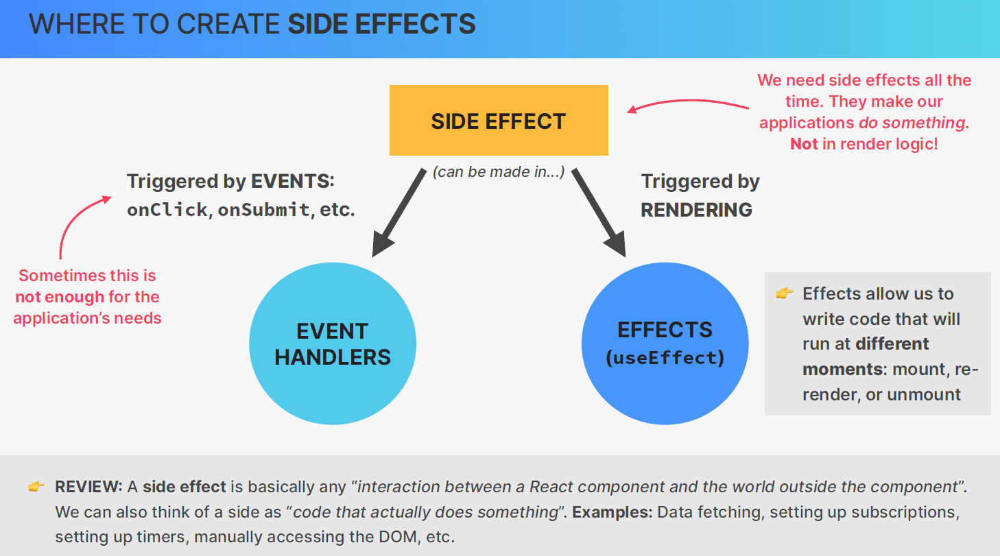

# 12 - Effects and Data Fetching


## 001 Section Overview

## 002 The Component Lifecycle
This image represents the **Component Lifecycle** in React, which refers to the different phases that a component goes through during its existence, from creation to destruction. These phases include mounting, updating (re-render), and unmounting.

### **Phases of the Component Lifecycle:**

1. **Mount / Initial Render:**
   - This is the phase where the component is created and rendered to the DOM for the first time.
   - In this phase, the component's state and props are initialized.
   - Lifecycle method examples in React:
     - **`componentDidMount()`** (for class components)
     - **`useEffect(() => {...}, [])`** (for functional components)

   **Example:**
   ```js
   import React, { useEffect } from 'react';

   function MyComponent() {
     useEffect(() => {
       console.log('Component mounted');
     }, []); // Empty dependency array to ensure this runs only once at mount

     return <div>Hello, World!</div>;
   }

   export default MyComponent;
   ```

   In the example above, the `useEffect` hook mimics the behavior of `componentDidMount()` for a functional component. It runs only when the component is mounted for the first time.

2. **Re-render (Update):**
   - This phase happens when the component is updated due to changes in **state**, **props**, **parent re-renders**, or **context**.
   - After these changes, the component is re-rendered with the updated data.

   **When re-render happens:**
   - **State changes**: If you change a component's state, it triggers a re-render.
   - **Props change**: If the parent component passes new props to the child, the child will re-render.
   - **Parent re-renders**: If the parent component re-renders, all its children will re-render unless optimized.
   - **Context changes**: If the context API changes values, it triggers re-renders for components consuming that context.

   **Example:**
   ```js
   import React, { useState } from 'react';

   function Counter() {
     const [count, setCount] = useState(0);

     return (
       <div>
         <p>Count: {count}</p>
         <button onClick={() => setCount(count + 1)}>Increment</button>
       </div>
     );
   }

   export default Counter;
   ```

   In the above example, clicking the button changes the state (`count`), which causes a re-render of the component to reflect the updated count value.

3. **Unmount:**
   - The **unmounting** phase occurs when a component is removed from the DOM. This is when a component is destroyed, and any associated resources or subscriptions (such as event listeners or intervals) should be cleaned up.
   - Lifecycle method examples in React:
     - **`componentWillUnmount()`** (for class components)
     - **`useEffect(() => { return () => {...}; }, [])`** (for functional components)

   **Example:**
   ```js
   import React, { useEffect } from 'react';

   function Timer() {
     useEffect(() => {
       const timerId = setInterval(() => {
         console.log('Timer running...');
       }, 1000);

       // Clean up the timer when the component is unmounted
       return () => {
         clearInterval(timerId);
         console.log('Component unmounted, timer cleaned up');
       };
     }, []); // Run only once on mount and clean up on unmount

     return <div>Timer Component</div>;
   }

   export default Timer;
   ```

   In this example, we set up an interval when the component mounts, and then we clean it up by clearing the interval when the component is unmounted. This is crucial to avoid memory leaks or unwanted behavior when the component is no longer in the DOM.

---

### **Component Lifecycle Overview in React:**

1. **Mounting**: 
   - The component is created, and the constructor (for class components) or `useState` (for functional components) initializes the state. Then the component is rendered for the first time.
   
2. **Re-rendering**: 
   - The component is re-rendered whenever its state, props, or context changes. This phase can happen multiple times throughout the lifecycle of the component.

3. **Unmounting**: 
   - The component is removed from the DOM, and any necessary cleanup is performed (e.g., removing event listeners, clearing intervals).

---

### **Conclusion**

The **React Component Lifecycle** helps you understand how React handles component updates and rendering under the hood. The three main phases—**Mounting**, **Re-render**, and **Unmounting**—provide hooks to run specific code at different stages in a component's life. By using lifecycle methods like `componentDidMount`, `componentWillUnmount`, or `useEffect` in functional components, you can control what happens when components are created, updated, or destroyed.


## 003 How NOT to Fetch Data in React
```tsx
import NavBar from "./components/NavBar";
import Main from "./page/Main";
import {useState} from "react";
import SearchBar from "./components/SearchBar";
import NumResults from "./components/NumResults";
import Box from "./page/Box";
import MovieList from "./components/MovieList";
import WatchSummery from "./components/WatchSummery";
import WatchedMovieList from "./components/WatchedMovieList";

export type TTempMovieData = {
    imdbID: string;
    Title: string;
    Year: string;
    Poster: string;
};

export type TTempWatchedData = {
    imdbID: string;
    Title: string;
    Year: string;
    Poster: string;
    runtime: number;
    imdbRating: number;
    userRating: number;
};


const tempMovieData: TTempMovieData[] = [
    {
        imdbID: "tt1375666",
        Title: "Inception",
        Year: "2010",
        Poster:
            "https://m.media-amazon.com/images/M/MV5BMjAxMzY3NjcxNF5BMl5BanBnXkFtZTcwNTI5OTM0Mw@@._V1_SX300.jpg",
    },
    {
        imdbID: "tt0133093",
        Title: "The Matrix",
        Year: "1999",
        Poster:
            "https://m.media-amazon.com/images/M/MV5BNzQzOTk3OTAtNDQ0Zi00ZTVkLWI0MTEtMDllZjNkYzNjNTc4L2ltYWdlXkEyXkFqcGdeQXVyNjU0OTQ0OTY@._V1_SX300.jpg",
    },
    {
        imdbID: "tt6751668",
        Title: "Parasite",
        Year: "2019",
        Poster:
            "https://m.media-amazon.com/images/M/MV5BYWZjMjk3ZTItODQ2ZC00NTY5LWE0ZDYtZTI3MjcwN2Q5NTVkXkEyXkFqcGdeQXVyODk4OTc3MTY@._V1_SX300.jpg",
    },
];

export const tempWatchedData: TTempWatchedData[] = [
    {
        imdbID: "tt1375666",
        Title: "Inception",
        Year: "2010",
        Poster:
            "https://m.media-amazon.com/images/M/MV5BMjAxMzY3NjcxNF5BMl5BanBnXkFtZTcwNTI5OTM0Mw@@._V1_SX300.jpg",
        runtime: 148,
        imdbRating: 8.8,
        userRating: 10,
    },
    {
        imdbID: "tt0088763",
        Title: "Back to the Future",
        Year: "1985",
        Poster:
            "https://m.media-amazon.com/images/M/MV5BZmU0M2Y1OGUtZjIxNi00ZjBkLTg1MjgtOWIyNThiZWIwYjRiXkEyXkFqcGdeQXVyMTQxNzMzNDI@._V1_SX300.jpg",
        runtime: 116,
        imdbRating: 8.5,
        userRating: 9,
    },
];

const KEY = "3ce56f7d"

export default function App() {
    const [movies, setMovies] = useState<TTempMovieData[]>([]);
    const [watched, setWatched] = useState<TTempWatchedData[]>(tempWatchedData);

    fetch(`http://www.omdbapi.com/?apikey=${KEY}&s=matrix`)
        .then((response) => response.json())
        .then((data) => {
            setMovies(data.Search);
        });

    setWatched([])
    return (
        <>
            <NavBar>
                <SearchBar/>
                <NumResults movies={movies}/>
            </NavBar>
            <Main>
                <Box>
                    <MovieList movies={movies}/>
                </Box>
                <Box>
                    <WatchSummery watched={watched}/>
                    <WatchedMovieList watched={watched}/>
                </Box>
            </Main>
        </>
    );
}
```

The error **"Too many re-renders. React limits the number of renders to prevent an infinite loop"** is thrown by React when it detects that a component is rendering over and over again, causing an **infinite rendering loop**. This usually happens when state updates occur inside the main body of the component, triggering the component to re-render continuously.

### **Understanding the Problem:**

React components re-render whenever their state or props change. If you update state or trigger a side effect (like fetching data) in such a way that it directly causes another render immediately, you can end up with an infinite loop.

### **Why Does This Happen?**

In React, any state update (via `setState`, `setSomething`, etc.) causes the component to re-render. If this state update is inside the component's rendering logic or occurs on every render, it will cause the component to re-render continuously, leading to the **too many re-renders** error.

---

### **Example of the Problem in Your Code:**

```js
fetch(`http://www.omdbapi.com/?apikey=${KEY}&s=matrix`)
  .then((response) => response.json())
  .then((data) => {
    setMovies(data.Search);  // This triggers a re-render
  });

setWatched([]);  // This also triggers a re-render
```

In the code above:
- **`fetch` and `setMovies`**: This fetch call and state update are being executed during every render, which results in continuous re-renders.
- **`setWatched([])`**: Every time the component renders, this line resets the `watched` state to an empty array, causing another re-render.

Both of these together are causing the infinite loop.

### **Solution: Use `useEffect` to Control Side Effects**

To prevent the component from re-rendering infinitely, you need to wrap any side-effect logic (like fetching data) and state updates in a **`useEffect` hook**. This ensures that side-effects only run once (or when certain dependencies change) instead of during every render.

### **Correcting the Code Using `useEffect`:**

```js
import { useState, useEffect } from "react";
import NavBar from "./components/NavBar";
import Main from "./page/Main";
import SearchBar from "./components/SearchBar";
import NumResults from "./components/NumResults";
import Box from "./page/Box";
import MovieList from "./components/MovieList";
import WatchSummery from "./components/WatchSummery";
import WatchedMovieList from "./components/WatchedMovieList";

export type TTempMovieData = {
  imdbID: string;
  Title: string;
  Year: string;
  Poster: string;
};

export type TTempWatchedData = {
  imdbID: string;
  Title: string;
  Year: string;
  Poster: string;
  runtime: number;
  imdbRating: number;
  userRating: number;
};

const tempWatchedData: TTempWatchedData[] = [
  {
    imdbID: "tt1375666",
    Title: "Inception",
    Year: "2010",
    Poster:
      "https://m.media-amazon.com/images/M/MV5BMjAxMzY3NjcxNF5BMl5BanBnXkFtZTcwNTI5OTM0Mw@@._V1_SX300.jpg",
    runtime: 148,
    imdbRating: 8.8,
    userRating: 10,
  },
  {
    imdbID: "tt0088763",
    Title: "Back to the Future",
    Year: "1985",
    Poster:
      "https://m.media-amazon.com/images/M/MV5BZmU0M2Y1OGUtZjIxNi00ZjBkLTg1MjgtOWIyNThiZWIwYjRiXkEyXkFqcGdeQXVyMTQxNzMzNDI@._V1_SX300.jpg",
    runtime: 116,
    imdbRating: 8.5,
    userRating: 9,
  },
];

const KEY = "3ce56f7d111";

export default function App() {
  const [movies, setMovies] = useState<TTempMovieData[]>([]);
  const [watched, setWatched] = useState<TTempWatchedData[]>(tempWatchedData);

  // Use useEffect to fetch movies only once when the component mounts
  useEffect(() => {
    fetch(`http://www.omdbapi.com/?apikey=${KEY}&s=matrix`)
      .then((response) => response.json())
      .then((data) => {
        setMovies(data.Search);
      });
  }, []); // Empty array ensures this runs only once on mount

  // Removing unnecessary setWatched([]) to prevent infinite re-renders
  // setWatched([]); <-- this line was causing infinite render

  return (
    <>
      <NavBar>
        <SearchBar />
        <NumResults movies={movies} />
      </NavBar>
      <Main>
        <Box>
          <MovieList movies={movies} />
        </Box>
        <Box>
          <WatchSummery watched={watched} />
          <WatchedMovieList watched={watched} />
        </Box>
      </Main>
    </>
  );
}
```

### **Explanation of the Fix:**

1. **`useEffect` to Fetch Data**:
   - The `fetch` call is now wrapped in a `useEffect` hook. This ensures that the data is fetched only once when the component mounts (as indicated by the empty dependency array `[]`).
   - Without `useEffect`, the `fetch` call would happen on every render, leading to infinite re-renders since `setMovies` triggers a re-render every time.

2. **Removed `setWatched([])`**:
   - The line `setWatched([])` was resetting the `watched` state on every render, which caused the component to re-render repeatedly. Removing this line prevents the infinite loop.
   - If you want to reset the `watched` state in a controlled manner, you can do it conditionally or based on an event.

---

### **Common Causes of "Too Many Re-Renders" Error**

1. **State Update Without Conditions**: 
   - Any time you call a `setState` or `setSomething` function inside the main body of a component, it causes a re-render. If this is done repeatedly without a condition, it leads to an infinite loop.
   
   Example of problematic code:
   ```js
   setCount(count + 1);  // Directly in render → infinite re-renders
   ```

2. **Not Using `useEffect` for Side Effects**:
   - When you fetch data or execute side effects (e.g., timers, subscriptions) without wrapping them in `useEffect`, they will run on every render, leading to an infinite loop.

   Solution:
   ```js
   useEffect(() => {
     fetchData();
   }, []);  // Use an empty dependency array to fetch data only once
   ```

3. **Rendering Components Conditionally but Triggering Updates Regardless**:
   - Sometimes, you render components conditionally but update state even when the component is not needed. This can cause re-renders if not handled carefully.

---

### **Best Practices to Avoid Too Many Re-renders**

1. **Use `useEffect` to Handle Side Effects**: If you need to fetch data or manipulate the DOM, use the `useEffect` hook and control when it runs using dependency arrays.

2. **Avoid Updating State Unconditionally**: State updates should be conditional and shouldn't be done during the render process unless they are part of an event handler or a controlled function.

3. **Check for State Changes Before Setting State**: 
   - Ensure that you're not unnecessarily triggering state updates that don't change the actual state value.

   Example:
   ```js
   if (count !== newCount) {
     setCount(newCount);  // Only update if the new count is different
   }
   ```

---

### **Conclusion**

The "Too many re-renders" error occurs when React detects an infinite rendering loop caused by state or props updating continuously. In your case, fetching data and updating state directly in the render process caused this error. Using `useEffect` properly and avoiding state updates in the render body will resolve this problem.
## 004 useEffect to the Rescue
```tsx
export default function App() {
    const [movies, setMovies] = useState<TTempMovieData[]>([]);
    const [watched, setWatched] = useState<TTempWatchedData[]>(tempWatchedData);

    useEffect(() => {
        fetch(`http://www.omdbapi.com/?apikey=${KEY}&s=matrix`)
            .then((response) => response.json())
            .then((data) => {
                setMovies(data.Search);
            });

    }, [])
    return (
        <>
            <NavBar>
                <SearchBar/>
                <NumResults movies={movies}/>
            </NavBar>
            <Main>
                <Box>
                    <MovieList movies={movies}/>
                </Box>
                <Box>
                    <WatchSummery watched={watched}/>
                    <WatchedMovieList watched={watched}/>
                </Box>
            </Main>
        </>
    );
}

```
## 005 A First Look at Effects

The image explains **where to create side effects** in React applications and the difference between **event-triggered side effects** and **render-triggered side effects**.

### **Understanding Side Effects in React**

A **side effect** in React is any interaction between the component and the outside world that is not part of the rendering process. Side effects involve tasks like fetching data from an API, setting timers, manually manipulating the DOM, or subscriptions to external services.

React's render logic should remain pure, meaning it should not directly perform side effects. Instead, side effects should be triggered through **event handlers** or through the **useEffect** hook, depending on the requirement.

---

### **Event-Triggered Side Effects (Event Handlers)**

Side effects can be triggered by user events such as clicking a button, submitting a form, or hovering over an element. Event handlers in React handle these side effects.

#### **Example: Side Effect Triggered by an Event (onClick)**

```js
function FetchDataOnClick() {
  const [data, setData] = useState(null);

  const handleClick = () => {
    fetch('https://api.example.com/data')
      .then(response => response.json())
      .then(result => setData(result));
  };

  return (
    <div>
      <button onClick={handleClick}>Fetch Data</button>
      {data && <pre>{JSON.stringify(data, null, 2)}</pre>}
    </div>
  );
}
```

In this example:
- The side effect (fetching data from an API) happens only when the user clicks the **Fetch Data** button.
- The side effect is isolated within the **onClick** event handler and is not tied to the component's rendering.

**When to use event-triggered side effects:**
- When the side effect is dependent on user actions.
- For one-off side effects that do not need to run automatically during the component's lifecycle.

---

### **Render-Triggered Side Effects (useEffect)**

**`useEffect`** is a hook that allows you to manage side effects based on a component's lifecycle. With `useEffect`, you can control when side effects should occur, such as when the component mounts, updates (re-renders), or unmounts.

#### **Key Phases where `useEffect` Can be Used:**

1. **Mount (Initial Render)**: 
   - When the component is mounted (rendered for the first time), `useEffect` can trigger tasks like fetching data from an API.
   
2. **Re-render (Update)**: 
   - When state or props change, `useEffect` can re-run the side effect based on the dependency array.
   
3. **Unmount**: 
   - When the component is about to be destroyed, `useEffect` can clean up side effects like removing event listeners or cancelling network requests.

#### **Example: Side Effect Triggered by Rendering (useEffect)**

```js
import React, { useState, useEffect } from "react";

function FetchDataOnMount() {
  const [data, setData] = useState(null);

  useEffect(() => {
    // This effect runs when the component mounts (initial render)
    fetch('https://api.example.com/data')
      .then(response => response.json())
      .then(result => setData(result));

    return () => {
      // Clean-up logic if necessary (runs on unmount)
      console.log('Component unmounted');
    };
  }, []); // Empty array means this runs only once (on mount)

  return (
    <div>
      {data ? <pre>{JSON.stringify(data, null, 2)}</pre> : 'Loading...'}
    </div>
  );
}
```

In this example:
- **Initial Render**: The API call is triggered only once when the component is first mounted (`useEffect` with an empty dependency array `[]`).
- **Unmount**: You can return a clean-up function within `useEffect` to remove any listeners or stop timers when the component is removed.

**When to use render-triggered side effects (useEffect):**
- When side effects need to occur after the component renders (e.g., fetching data from an API).
- When side effects depend on specific dependencies (like state or props).
- When you need clean-up logic (e.g., cleaning up timers, subscriptions).

---

### **Comparison: Event Handlers vs. useEffect**

- **Event Handlers**: Used for user-triggered side effects. The side effect is performed as a direct response to an event, such as a button click or form submission.
  
- **useEffect**: Used for lifecycle-triggered side effects. Side effects are tied to the component's lifecycle and can run on mount, update, or unmount. This is useful for tasks like data fetching, setting up subscriptions, or making changes that should reflect in the DOM after the initial render.

---

### **Key Points from the Image:**

1. **Side Effects Can be Triggered by Events or Renders**:
   - **Event Handlers**: Trigger side effects in response to events like `onClick` or `onSubmit`.
   - **useEffect**: Triggers side effects based on the component’s lifecycle—when it mounts, re-renders, or unmounts.

2. **Side Effects are Essential**:
   - Applications often need side effects (such as fetching data) to interact with external APIs or systems. These effects should not be executed directly in render logic but handled in `useEffect` or event handlers.

3. **Different Timing**:
   - Side effects inside `useEffect` can be executed at different points: when the component first renders, when it updates, or when it unmounts. This allows you to manage your application's behavior more flexibly than using event handlers alone.

---

### **Review: What is a Side Effect?**

A side effect is any "interaction between a React component and the world outside the component." This includes:
- Fetching data from an API
- Updating the DOM directly
- Setting up timers or intervals
- Subscribing or unsubscribing from external services

In React, the ideal way to manage side effects is through event handlers (e.g., `onClick`) or through `useEffect`, depending on the specific requirements of the application.

---

### **Conclusion**

- Use **event handlers** (like `onClick`) for side effects triggered by user interactions.
- Use **useEffect** for side effects tied to a component's lifecycle, such as fetching data when the component mounts or performing clean-up tasks when it unmounts.

By carefully managing side effects in your React components, you ensure that your app behaves as expected without introducing bugs or performance issues caused by side effects in the rendering process.

The image compares two common methods of handling side effects in React: **Event Handlers** and **Effects (using `useEffect`)**. Both approaches can trigger the same result but under different circumstances and use cases.

### **1. Event Handlers**

- **Executed when the corresponding event happens**: 
  - Event handlers in React are functions that are executed when a user action triggers an event, such as a button click, form submission, or keyboard input.
  
- **Used to react to an event**: 
  - Event handlers are designed to handle user interactions and can be used to perform tasks like fetching data from an API when a button is clicked.

- **Preferred for creating side effects based on user actions**: 
  - Event handlers are ideal when a side effect should occur only when a specific event is triggered.

#### **Example: Fetching Data on Button Click**

```js
function FetchMovies() {
  const [movies, setMovies] = useState([]);

  const handleClick = () => {
    fetch(`http://www.omdbapi.com/?s=inception`)
      .then((response) => response.json())
      .then((data) => setMovies(data.Search));
  };

  return (
    <div>
      <button onClick={handleClick}>Fetch Movies</button>
      <ul>
        {movies.map((movie) => (
          <li key={movie.imdbID}>{movie.Title}</li>
        ))}
      </ul>
    </div>
  );
}
```

In this example:
- **Event handler** `handleClick` is tied to the button's `onClick` event.
- When the button is clicked, it fetches data from the API and updates the component's state (`movies`).
- The UI is updated only when the user interacts with the button.

---

### **2. Effects (useEffect)**

- **Executed after the component mounts**:
  - The `useEffect` hook is executed when the component first renders (mounts) and can be re-executed after subsequent renders if dependencies change.
  
- **Used to keep a component synchronized with external systems**:
  - `useEffect` is ideal when you want to synchronize the component with some external system or resource, such as fetching data from an API or interacting with a subscription service.

- **Cleanup function**: 
  - `useEffect` can return a cleanup function to clean up resources (like removing event listeners or cancelling timers) when the component unmounts or before it re-renders.

- **Dependency Array**: 
  - The dependency array controls when the `useEffect` hook re-runs. If the array is empty (`[]`), the effect only runs once when the component mounts. If there are dependencies, the effect runs whenever the dependencies change.

#### **Example: Fetching Data on Component Mount**

```js
import { useState, useEffect } from 'react';

function FetchMoviesOnMount() {
  const [movies, setMovies] = useState([]);

  useEffect(() => {
    // Fetch movies when the component mounts
    fetch(`http://www.omdbapi.com/?s=inception`)
      .then((response) => response.json())
      .then((data) => setMovies(data.Search));

    // Cleanup function, if necessary
    return () => {
      console.log('Component unmounted or re-rendered');
    };
  }, []); // Empty array ensures this runs only on mount

  return (
    <div>
      <ul>
        {movies.map((movie) => (
          <li key={movie.imdbID}>{movie.Title}</li>
        ))}
      </ul>
    </div>
  );
}
```

In this example:
- **Effect (useEffect)** is executed after the component renders for the first time.
- The API request is made inside `useEffect`, and the result is stored in the state (`movies`).
- The empty dependency array `[]` ensures the effect runs only once, during the initial render.
- A cleanup function is included (though optional), which would run when the component unmounts or if it re-renders due to changes in dependencies (none in this case).

---

### **Comparison Between Event Handlers and useEffect:**

1. **Timing**:
   - **Event Handlers**: Triggered by user events like clicks or form submissions. The side effect (e.g., data fetching) occurs only when the event happens.
   - **useEffect**: Automatically runs after the component is mounted (rendered) or when dependencies change. It's used for side effects tied to the component's lifecycle, not direct user actions.

2. **Purpose**:
   - **Event Handlers**: Suitable for side effects that are dependent on user interactions.
   - **useEffect**: Best for side effects that need to happen as part of the component’s lifecycle, such as fetching data when the component is first displayed.

3. **Re-runs**:
   - **Event Handlers**: Side effects run only when triggered by a specific event.
   - **useEffect**: Re-runs depending on the dependencies passed into the effect. With an empty dependency array, it runs only on mount, but with dependencies, it can run multiple times when those dependencies change.

4. **Cleanup**:
   - **Event Handlers**: No direct cleanup is needed for event handlers unless you're dealing with resources that persist after the event (e.g., timers).
   - **useEffect**: You can return a cleanup function in `useEffect`, which will run when the component unmounts or when the effect is re-executed.

---

### **When to Use Each Approach:**

- **Event Handlers**:
  - When side effects need to be triggered by user actions (like button clicks or form submissions).
  - Suitable for one-off actions that don't need to run automatically during the component's lifecycle.

- **useEffect**:
  - When side effects should be tied to the component’s lifecycle (mount, unmount, updates).
  - Suitable for actions like data fetching, setting up subscriptions, or working with external resources that need synchronization with the component.

---

### **Conclusion:**

- **Event Handlers** are perfect for side effects that need to be triggered by a specific event like clicking a button or submitting a form. 
- **useEffect** is useful for side effects that should run automatically when a component renders, re-renders, or unmounts, such as data fetching or setting up subscriptions.
- Both approaches handle side effects, but their usage depends on when the effect should be triggered: either by an event (event handler) or by the component's lifecycle (useEffect).

This distinction ensures you handle side effects at the right moments in your React application.
## 006 Using an async Function
This code demonstrates a **React TypeScript** application that fetches movie data from an API (OMDb) and displays a list of movies alongside a summary of movies that have been watched. The app follows the React pattern of using hooks for state management (`useState`) and side effects (`useEffect`). Below is a detailed explanation of the code and its functionality.

### **1. Types for Movie Data**

First, the code defines TypeScript types to describe the data structure of both movies and watched movies. TypeScript is used here to ensure type safety, helping catch errors during development by enforcing the structure of the objects.

```ts
export type TTempMovieData = {
    imdbID: string;
    Title: string;
    Year: string;
    Poster: string;
};

export type TTempWatchedData = {
    imdbID: string;
    Title: string;
    Year: string;
    Poster: string;
    runtime: number;
    imdbRating: number;
    userRating: number;
};
```

- `TTempMovieData`: This type defines the structure for movie data fetched from the OMDb API. Each movie has an `imdbID`, `Title`, `Year`, and `Poster` URL.
  
- `TTempWatchedData`: This extends `TTempMovieData` and adds additional properties like `runtime`, `imdbRating`, and `userRating` for movies that have already been watched.

### **2. Sample Watched Movies Data**

Next, the code defines a constant array `tempWatchedData` with some initial watched movie data:

```ts
export const tempWatchedData: TTempWatchedData[] = [
    {
        imdbID: "tt1375666",
        Title: "Inception",
        Year: "2010",
        Poster: "https://m.media-amazon.com/images/M/MV5BMjAxMzY3NjcxNF5BMl5BanBnXkFtZTcwNTI5OTM0Mw@@._V1_SX300.jpg",
        runtime: 148,
        imdbRating: 8.8,
        userRating: 10,
    },
    {
        imdbID: "tt0088763",
        Title: "Back to the Future",
        Year: "1985",
        Poster: "https://m.media-amazon.com/images/M/MV5BZmU0M2Y1OGUtZjIxNi00ZjBkLTg1MjgtOWIyNThiZWIwYjRiXkEyXkFqcGdeQXVyMTQxNzMzNDI@._V1_SX300.jpg",
        runtime: 116,
        imdbRating: 8.5,
        userRating: 9,
    },
];
```

This data simulates a list of watched movies and is used to initialize the `watched` state in the component.

### **3. Fetching Movies from the API (`useEffect`)**

The `App` component fetches movie data when it is first rendered using the `useEffect` hook. The side effect of fetching movie data is performed only once (on component mount), thanks to the empty dependency array (`[]`) passed to `useEffect`.

#### **Setting State:**
- **`movies`**: This state holds the list of movies fetched from the API.
- **`watched`**: This state holds the list of watched movies, initialized with `tempWatchedData`.

#### **API Fetching Logic:**
```ts
useEffect(() => {
    void getMovies(setMovies, "matrix");
}, []);
```

- `getMovies`: A function that accepts `setMovies` and `searchTerm` as arguments and makes an API call to OMDb to fetch movies that match the search term (`matrix` in this case).
- The result is stored in the `movies` state using `setMovies`.

### **4. API Fetch Function (`getMovies`)**

The function `getMovies` is defined in the `api/api.ts` file and is responsible for making the API request to OMDb:

```ts
const getMovies = async (
    setMovies: Dispatch<SetStateAction<TTempMovieData[]>>, 
    searchTerm: string
): Promise<void> => {
    const response = await fetch(`http://www.omdbapi.com/?apikey=${KEY}&s=${searchTerm}`);
    const data = await response.json();
    setMovies(data.Search);
};
```

- **`setMovies`**: A state setter function passed as an argument to update the `movies` state in the `App` component.
- **`searchTerm`**: A string representing the movie search term (e.g., `"matrix"`).
- The API returns a list of movies that match the search term, which is then set in the `movies` state using `setMovies(data.Search)`.

### **5. UI Structure and Rendering**

The `App` component renders a navigation bar, a list of fetched movies, and a summary of watched movies.

#### **Components Breakdown**:

- **`NavBar`**: Contains the search bar and the number of movie results found.
  ```ts
  <NavBar>
    <SearchBar />
    <NumResults movies={movies} />
  </NavBar>
  ```

- **`Main`**: Contains two boxes:
  1. **Movie List**: Displays the list of movies fetched from the API.
  2. **Watched Movie Summary**: Displays a summary of the movies that have been watched.

  ```ts
  <Main>
    <Box>
      <MovieList movies={movies} />
    </Box>
    <Box>
      <WatchSummery watched={watched} />
      <WatchedMovieList watched={watched} />
    </Box>
  </Main>
  ```

### **6. Search Bar and NumResults**

- **`SearchBar`**: Likely a component to search for movies (though its implementation is not shown here).
  
- **`NumResults`**: Displays the number of movies found, passed in as the `movies` prop. It calculates the length of the `movies` array to show the number of results.

### **7. Movie List and Watch Summary**

- **`MovieList`**: Displays a list of movies fetched from the API. The movies are passed as a prop (`movies`).
  
- **`WatchSummery`**: Summarizes the watched movies, including details like the number of watched movies, total runtime, and average ratings.

### **8. TypeScript and Type Safety**

By defining types (`TTempMovieData` and `TTempWatchedData`), the application ensures that the data structures passed between components conform to a specific format. This prevents errors caused by incorrect data structures or missing fields.

For example:
- The `movies` state is defined with the type `TTempMovieData[]`, ensuring that each movie object in the array has the required fields (`imdbID`, `Title`, `Year`, `Poster`).
- The function `getMovies` ensures that the state setter `setMovies` can only accept an array of `TTempMovieData` objects, enforcing data integrity.

### **Conclusion**

This React TypeScript application demonstrates how to:
1. **Manage state** using `useState` for both fetched data (`movies`) and static data (`watched`).
2. **Use `useEffect`** to handle side effects like fetching data from an API when the component mounts.
3. **Use TypeScript** to define types that ensure data consistency across the application.

The application follows best practices, such as keeping side effects (like fetching data) in `useEffect` and using TypeScript types to maintain type safety throughout the app.
## 007 Adding a Loading State
```tsx
const Loader = () => {
    return (
        <h1>Loading...</h1>
    );
}

export default Loader;
```

```tsx
import {Dispatch, SetStateAction} from "react";
import {TTempMovieData} from "../App";

const KEY = "3ce56f7d"
const getMovies = async (setMovies: Dispatch<SetStateAction<TTempMovieData[]>>, searchTerm: string, setIsLoading: Dispatch<SetStateAction<boolean>>): Promise<void> => {
    setIsLoading(true);
    const response = await fetch(`http://www.omdbapi.com/?apikey=${KEY}&s=$${searchTerm}`);
    const data = await response.json();
    setMovies(data.Search);
    setIsLoading(false);
}


export {
    getMovies
}
```

```tsx
export default function App() {
    const [movies, setMovies] = useState<TTempMovieData[]>([]);
    const [watched, setWatched] = useState<TTempWatchedData[]>(tempWatchedData);
    const [isLoading, setIsLoading] = useState<boolean>(false);

    useEffect(() => {
        void getMovies(setMovies, "matrix", setIsLoading);
    }, [])


    return (
        <>
            <NavBar>
                <SearchBar/>
                <NumResults movies={movies}/>
            </NavBar>
            <Main>
                <Box>
                    {
                        isLoading ? <Loader/> : <MovieList movies={movies}/>
                    }
                </Box>
                <Box>
                    <WatchSummery watched={watched}/>
                    <WatchedMovieList watched={watched}/>
                </Box>
            </Main>
        </>
    );
}
```

## 008 Handling Erro`rs

## 009 The useEffect Dependency Array

## 010 Synchronizing Queries With Movie Data

## 011 Selecting a Movie

## 012 Loading Movie Details

## 013 Adding a Watched Movie

## 014 Adding a New Effect Changing Page Title

## 015 The useEffect Cleanup Function

## 016 Cleaning Up the Title

## 017 Cleaning Up Data Fetching

## 018 One More Effect Listening to a Keypress

## 019 CHALLENGE #1 Currency Converter

