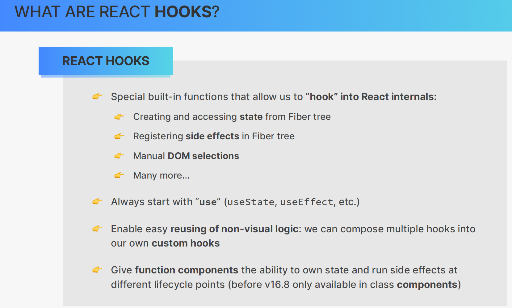

# 13 - Custom Hooks, Refs, and More State

This is the readme file for the 13 - Custom Hooks, Refs, and More State folder.

## 001 Section Overview

## 002 React Hooks and Their Rules


In React, hooks are built-in functions that let you "hook" into React's state and lifecycle features from function components. Since React v16.8, hooks have enabled functional components to access features that were previously only available to class components. Let’s explore some of the most commonly used hooks and their TypeScript examples, as well as a few less common hooks.

### 1. **useState**
This is the most commonly used hook, allowing us to declare state variables in function components.

**Example:**
```tsx
import { useState } from 'react';

const Counter = () => {
  const [count, setCount] = useState<number>(0);

  return (
    <div>
      <p>Count: {count}</p>
      <button onClick={() => setCount(count + 1)}>Increment</button>
    </div>
  );
};
```

In this example, `useState<number>(0)` declares a state variable `count` of type `number` with an initial value of `0`. The `setCount` function is used to update the count.

### 2. **useEffect**
This hook is used to handle side effects such as fetching data or subscribing to an event.

**Example:**
```tsx
import { useState, useEffect } from 'react';

const FetchData = () => {
  const [data, setData] = useState<string[]>([]);

  useEffect(() => {
    fetch('https://jsonplaceholder.typicode.com/posts')
      .then(response => response.json())
      .then(json => setData(json.map((post: any) => post.title)));
  }, []);  // Empty dependency array ensures the effect runs only once on mount

  return (
    <div>
      <h3>Post Titles:</h3>
      <ul>
        {data.map(title => <li key={title}>{title}</li>)}
      </ul>
    </div>
  );
};
```

Here, `useEffect` triggers a fetch request after the component mounts. It updates the `data` state with post titles when the response is received. The empty array (`[]`) ensures the effect runs only once when the component is mounted.

### 3. **useReducer**
This hook is useful for managing complex state logic or when state transitions depend on the previous state.

**Example:**
```tsx
import { useReducer } from 'react';

interface State {
  count: number;
}

type Action = { type: 'increment' } | { type: 'decrement' };

const reducer = (state: State, action: Action): State => {
  switch (action.type) {
    case 'increment':
      return { count: state.count + 1 };
    case 'decrement':
      return { count: state.count - 1 };
    default:
      throw new Error();
  }
};

const CounterWithReducer = () => {
  const [state, dispatch] = useReducer(reducer, { count: 0 });

  return (
    <div>
      <p>Count: {state.count}</p>
      <button onClick={() => dispatch({ type: 'increment' })}>Increment</button>
      <button onClick={() => dispatch({ type: 'decrement' })}>Decrement</button>
    </div>
  );
};
```

`useReducer` provides a way to manage more complex state logic by using actions and a reducer function. This pattern is often used in larger applications for centralized state management.

### 4. **useContext**
`useContext` allows you to access values from a context directly.

**Example:**
```tsx
import { useContext, createContext } from 'react';

// Create a context with a default value
const ThemeContext = createContext('light');

const ThemedComponent = () => {
  const theme = useContext(ThemeContext);

  return <div>The current theme is {theme}</div>;
};

const App = () => (
  <ThemeContext.Provider value="dark">
    <ThemedComponent />
  </ThemeContext.Provider>
);
```

Here, `useContext(ThemeContext)` accesses the `ThemeContext` value provided by the `ThemeContext.Provider`. The component renders based on the current theme.

### 5. **useRef**
`useRef` allows you to persist values across renders without causing a re-render, often used to store DOM elements.

**Example:**
```tsx
import { useRef } from 'react';

const TextInputWithFocusButton = () => {
  const inputRef = useRef<HTMLInputElement>(null);

  const focusInput = () => {
    inputRef.current?.focus();
  };

  return (
    <div>
      <input ref={inputRef} type="text" />
      <button onClick={focusInput}>Focus the input</button>
    </div>
  );
};
```

In this example, `useRef` is used to create a reference to the input field, and the button sets focus on the input when clicked.

### 6. **useCallback**
`useCallback` is used to memoize functions, preventing unnecessary re-creations on re-renders.

**Example:**
```tsx
import { useState, useCallback } from 'react';

const Counter = () => {
  const [count, setCount] = useState(0);

  const increment = useCallback(() => {
    setCount(prevCount => prevCount + 1);
  }, []);

  return (
    <div>
      <p>{count}</p>
      <button onClick={increment}>Increment</button>
    </div>
  );
};
```

The `useCallback` hook memoizes the `increment` function, ensuring it only changes if its dependencies (in this case, none) change. This can improve performance by preventing the creation of new functions on every re-render.

### 7. **useMemo**
`useMemo` memoizes a computed value, avoiding unnecessary recalculations.

**Example:**
```tsx
import { useState, useMemo } from 'react';

const ExpensiveComputation = () => {
  const [count, setCount] = useState(0);

  const expensiveValue = useMemo(() => {
    console.log('Calculating expensive value...');
    return count * 2;
  }, [count]);

  return (
    <div>
      <p>Expensive value: {expensiveValue}</p>
      <button onClick={() => setCount(count + 1)}>Increment</button>
    </div>
  );
};
```

`useMemo` ensures the expensive computation only runs when `count` changes, improving performance in expensive operations.

### Conclusion
React hooks have revolutionized how we build React components, providing a functional, declarative approach to state and lifecycle management. By leveraging TypeScript, we can ensure strong type-checking and better developer tooling to catch errors early.

When using React Hooks in TypeScript, it’s crucial to follow specific rules to avoid unexpected behavior in your applications. Hooks allow you to manage state and side effects inside functional components. These rules ensure that React can correctly manage the internal order and state of hooks.

### Rules of Hooks

#### 1. **Call Hooks at the Top Level**

Hooks must be called at the top level of your component, not inside loops, conditionals, or nested functions. This ensures that React can maintain the hook's order between renders.

**Why is this important?**
React hooks rely on the order in which they are called. If you conditionally call a hook, React's internal hook system will lose track of which hook to update, leading to bugs.

**Example**:

Here’s a violation of this rule:
```tsx
function MyComponent() {
  const [count, setCount] = useState(0);

  if (count > 0) {
    const [name, setName] = useState("John"); // This is not allowed
  }

  return <div>{count}</div>;
}
```

This would break because the second hook (`useState`) is conditionally rendered, which would mess up the order of hooks when `count` changes.

**Corrected version**:
```tsx
function MyComponent() {
  const [count, setCount] = useState(0);
  const [name, setName] = useState("John"); // This is correct as it is at the top level

  return <div>{count}</div>;
}
```

#### 2. **Call Hooks Only from React Functions**

Hooks should only be called from React function components or custom hooks, not from regular JavaScript functions.

**Why is this important?**
Hooks are used to add functionality to function components. They rely on the context of being inside a component function to work correctly. Using them outside of a component function would prevent React from properly associating the hook’s behavior with a component.

**Example**:

Incorrect usage:
```tsx
function notAComponent() {
  const [data, setData] = useState(null); // This is incorrect as it's not a component or custom hook
}
```

Correct usage:
```tsx
function MyComponent() {
  const [data, setData] = useState(null); // Correctly used inside a React component

  return <div>{data}</div>;
}
```

Or, inside a custom hook:
```tsx
function useCustomHook() {
  const [data, setData] = useState(null); // Correct usage inside a custom hook

  return data;
}
```

### Example in TypeScript

Now, let's see how these rules apply in a React component using TypeScript:

1. **Using `useState` and `useEffect` with TypeScript:**

```tsx
import { useState, useEffect } from 'react';

// Type definition for our data
interface Data {
  id: number;
  name: string;
}

function MyComponent() {
  // useState with type definition
  const [data, setData] = useState<Data | null>(null);
  const [loading, setLoading] = useState<boolean>(true);

  // Fetch data with useEffect
  useEffect(() => {
    async function fetchData() {
      const response = await fetch('https://api.example.com/data');
      const result: Data = await response.json();
      setData(result);
      setLoading(false);
    }

    fetchData();
  }, []); // Empty array means this effect runs only once

  return (
    <div>
      {loading ? <p>Loading...</p> : <p>Data: {data?.name}</p>}
    </div>
  );
}
```

### Custom Hook Example in TypeScript

Now let’s create a reusable custom hook that follows the same rules:

```tsx
import { useState, useEffect } from 'react';

// Define the structure of your data using TypeScript interfaces
interface Data {
  id: number;
  name: string;
}

// Create a custom hook to fetch data
function useFetch(url: string) {
  const [data, setData] = useState<Data | null>(null);
  const [loading, setLoading] = useState<boolean>(true);

  useEffect(() => {
    async function fetchData() {
      const response = await fetch(url);
      const result: Data = await response.json();
      setData(result);
      setLoading(false);
    }

    fetchData();
  }, [url]); // Re-fetch if the URL changes

  return { data, loading };
}

// Now use the custom hook in a component
function MyComponent() {
  const { data, loading } = useFetch('https://api.example.com/data');

  return (
    <div>
      {loading ? <p>Loading...</p> : <p>Data: {data?.name}</p>}
    </div>
  );
}
```

### Explanation

1. **`useState` in TypeScript**: You can specify the type of the state by providing a type inside the `useState` call. For example, `useState<Data | null>(null)` means that `data` will either be of type `Data` (our defined interface) or `null`.

2. **`useEffect` and fetching data**: The `useEffect` hook here is fetching data from an API and updating the state. By providing an empty array `[]` as a dependency, the hook runs only once, when the component mounts.

3. **Custom Hook**: We created a custom hook `useFetch` that fetches data from a URL and handles the loading state. This hook can now be reused across multiple components.

### Summary

The two rules of hooks are critical to follow to maintain proper behavior:
- Call hooks at the top level to ensure the order is preserved between renders.
- Only call hooks inside React components or custom hooks.

By following these rules and leveraging TypeScript for type safety, you can build robust and reusable logic using hooks. This makes your React components more modular and maintainable.


In React, hooks rely heavily on the order in which they are called. This is because React needs to maintain a consistent order of hooks to manage their state properly. If the order of hooks changes between renders, it can cause unexpected behaviors or even application crashes. Here’s a detailed explanation of how React's hook system works, with examples in TypeScript.

### Hook Call Order

React uses a system called the **Fiber Tree**, which helps React track state and effects across re-renders. Hooks are tied to this fiber tree, and they need to be called in the same order on every render. If the order changes, React loses track of which hook corresponds to which state or effect.

The diagram shows how React tracks the order of hooks. If a hook’s position changes, it breaks the fiber tree's structure and causes bugs.

#### Example of Hook Call Order in TypeScript

```tsx
import { useState, useEffect } from "react";

function MyComponent() {
  const [count, setCount] = useState<number>(0);

  // This hook will break the order if conditionally called
  if (count > 3) {
    const [name, setName] = useState<string>("John");
  }

  useEffect(() => {
    console.log("Count:", count);
  }, [count]);

  return (
    <div>
      <button onClick={() => setCount(count + 1)}>Increment</button>
    </div>
  );
}
```

In this code:
- **Violation**: `useState` is conditionally called inside the `if (count > 3)` block. This breaks the rule that hooks must always be called in the same order. On the initial render, the second `useState` might not be called, but if `count` becomes greater than 3, React won’t know how to handle the new state, causing a bug.

**Correct version**:
```tsx
import { useState, useEffect } from "react";

function MyComponent() {
  const [count, setCount] = useState<number>(0);
  const [name, setName] = useState<string>("John"); // Always called, regardless of count

  useEffect(() => {
    console.log("Count:", count);
  }, [count]);

  return (
    <div>
      <button onClick={() => setCount(count + 1)}>Increment</button>
    </div>
  );
}
```

Now, the hooks are called in the same order regardless of how `count` changes.

### Why React Relies on Call Order

When React renders a component:
1. It builds a **list of hooks** in the same order they are called during the first render.
2. During each subsequent render, React expects these hooks to be called in the exact same order. If the order changes, React can no longer match the previous state or effects with the correct hooks.

In the example in the diagram:
- `useState(A)` is called first and stored as the first hook in the list.
- Then `useState(B)` is called second.
- Finally, `useEffect(fnZ)` is called third.

This order is important because React assigns each hook a unique index based on its position in the list. If the order changes, React might think that `useState(A)` is now `useState(B)`.

### Example of a Custom Hook in TypeScript with Proper Call Order

Let’s create a custom hook that fetches data and maintains the correct hook call order:

```tsx
import { useState, useEffect } from "react";

// Custom hook to fetch data
function useFetchData(url: string) {
  const [data, setData] = useState<any>(null);
  const [loading, setLoading] = useState<boolean>(true);

  useEffect(() => {
    async function fetchData() {
      const response = await fetch(url);
      const result = await response.json();
      setData(result);
      setLoading(false);
    }
    fetchData();
  }, [url]);

  return { data, loading };
}

// Component that uses the custom hook
function MyComponent() {
  const { data, loading } = useFetchData("https://api.example.com/data");

  return (
    <div>
      {loading ? <p>Loading...</p> : <pre>{JSON.stringify(data, null, 2)}</pre>}
    </div>
  );
}
```

Here:
- The custom hook `useFetchData` maintains the same call order for `useState` and `useEffect`, ensuring React can track the state correctly across renders.
- `useEffect` fetches the data when the `url` changes.

### Violating the Hook Order and Fixing It

Now, let's consider another violation:

```tsx
import { useState, useEffect } from "react";

function MyComponent() {
  const [count, setCount] = useState<number>(0);

  if (count > 3) {
    const [name, setName] = useState<string>("John"); // Violates the rule
  }

  useEffect(() => {
    console.log("Count:", count);
  }, [count]);

  return (
    <div>
      <button onClick={() => setCount(count + 1)}>Increment</button>
    </div>
  );
}
```

In this case, `useState(name)` is conditionally called when `count > 3`. This violates the rule because hooks must always be called in the same order during each render. React uses the hook call order to manage state, and this code will break when `count` becomes greater than 3.

**Fix:**
Always call hooks in the same order:

```tsx
import { useState, useEffect } from "react";

function MyComponent() {
  const [count, setCount] = useState<number>(0);
  const [name, setName] = useState<string>("John"); // Hook always called

  useEffect(() => {
    console.log("Count:", count);
  }, [count]);

  return (
    <div>
      <button onClick={() => setCount(count + 1)}>Increment</button>
    </div>
  );
}
```

This version ensures that the hooks are always called in the same order, regardless of `count`.

### Conclusion

- **Hooks Call Order**: React relies on the call order of hooks to track state and effects. Always call hooks in the same order, and never conditionally call hooks.
- **Correct Usage**: Ensure that hooks like `useState` and `useEffect` are always invoked in the same sequence on every render to maintain the integrity of React's Fiber Tree.
- **TypeScript Support**: Using TypeScript with React hooks provides type safety and helps you avoid bugs related to state management by ensuring correct types for state variables.

For further details, you can refer to the official React documentation [here](https://react.dev/reference/react).
## 003 The Rules of Hooks in Practice

in a early return or a conditional statement, you can't use hooks, because it will break the order of hooks.

## 004 More Details of useState

## 005 Initializing State With a Callback (Lazy Initial State)

## 006 useState Summary

In React, the concept of **state** allows you to manage dynamic data in a component. React's built-in `useState` hook is crucial for handling state, and updating it in a functional component.

Here’s a breakdown of the key aspects of defining and updating state using React and TypeScript:

### **1. Creating State**

State is created using the `useState` hook. This hook allows you to define a piece of state that will change over time within the component.

**Example of simple state initialization:**
```typescript
const [count, setCount] = useState(23);
```
Here, `count` is the current value of the state, and `setCount` is the function to update that state. The initial value `23` is passed to `useState`, which means `count` will start with the value of `23`.

In **TypeScript**, the state type can be explicitly defined:
```typescript
const [count, setCount] = useState<number>(23);
```
This ensures that `count` is always treated as a number.

**Example of lazy initialization:**
If you have a costly computation or an operation like fetching from localStorage, you can use a lazy evaluation function, which only runs once during the initial render.

```typescript
const [count, setCount] = useState(() => {
  return localStorage.getItem('count') || 0;
});
```
In this case, `useState` takes a function, which computes the initial value only on the first render, saving resources on re-renders.

### **2. Updating State**

React state should be updated using the setter function returned from `useState`. There are two ways to update state:

#### **Simple Update**
```typescript
setCount(1000);
```
This directly sets the value of `count` to `1000`. In TypeScript:
```typescript
setCount(1000); // count is a number
```

#### **Updating Based on Current State**
If the new state depends on the previous state, pass a function to `setCount`. This ensures that React has the most recent state when updating.

```typescript
setCount((prevCount) => prevCount + 1);
```
Here, the current state (`prevCount`) is passed to the function, and you return the new value (`prevCount + 1`). This is useful when state updates rely on the previous state, which can be especially important in async operations or frequent updates like counters.

#### **TypeScript Example**
```typescript
setCount((prevCount: number) => prevCount + 1);
```
Here, TypeScript ensures that `prevCount` is always treated as a number.

### **Important Notes:**
- **State Immutability**: Do not mutate objects or arrays directly in state. Always return a new copy. This ensures React can properly track and re-render components when state changes.
  
- **Lazy Initialization**: Useful for computationally expensive initial state values or when retrieving from storage like `localStorage`. React will only run this function once during the initial render.

### **React Reference**
For more detailed information and examples, you can visit the official React documentation on `useState` [here](https://react.dev/reference/react/useState).

Let me know if you need further clarifications or more examples!
## 007 How NOT to Select DOM Elements in React

## 008 Introducing Another Hook useRef

### Understanding `useRef` in React

`useRef` is a powerful React hook that provides a way to persist values across renders without causing a re-render. It essentially allows us to access and store values that are not part of the visual rendering, like DOM nodes or state that doesn’t trigger a re-render.

Here’s a deep dive into **`useRef`**:

### **1. What is a Ref?**

A ref in React can be thought of as a “box” with a `.current` property that holds a mutable value. The key thing about refs is that their values are persisted across renders, meaning their values can be read and updated without causing a component to re-render.

#### **Basic Syntax Example:**
```typescript
const myRef = useRef<number>(23);
```

Here, `myRef.current` is initialized to `23`, and this value persists across renders. You can access or change the value of `myRef.current`, but this will not cause a re-render.

### **2. Two Main Use Cases for `useRef`**

#### **(i) Persisting Mutable Data Across Renders**
You can use `useRef` to store any value that should persist between renders without causing a re-render. For example, this is useful for keeping track of timers, previous states, or any other side effects.

**Example:**
```typescript
const timerId = useRef<number | null>(null);

// Start a timer when the component mounts
useEffect(() => {
  timerId.current = window.setTimeout(() => {
    console.log("Timer finished");
  }, 3000);

  return () => {
    // Clear the timer on component unmount
    if (timerId.current) {
      window.clearTimeout(timerId.current);
    }
  };
}, []);
```

Here, the timer ID is stored in `timerId.current`. The timer continues across re-renders without causing the component to re-render when the timer ID changes.

#### **(ii) Accessing and Storing DOM Elements**
Refs are often used to directly access DOM elements or React elements in the component.

**Example:**
```typescript
const inputRef = useRef<HTMLInputElement | null>(null);

const focusInput = () => {
  if (inputRef.current) {
    inputRef.current.focus();
  }
};

return (
  <div>
    <input ref={inputRef} type="text" />
    <button onClick={focusInput}>Focus Input</button>
  </div>
);
```

In this example, `inputRef` is attached to the input element. When the button is clicked, it calls `focusInput`, which accesses `inputRef.current` and focuses the input field. This is a practical way to manipulate the DOM without needing to trigger a component re-render.

### **3. Key Properties of `useRef`**

- **Mutable `.current` Property**: The `useRef` hook returns an object with a single property `.current`. This property can be updated freely without triggering re-renders.
  
- **No Re-renders**: Unlike `useState`, updating a ref does not cause a component to re-render. This is ideal for storing values that don’t need to affect the visual interface.

- **Ref Behavior**: Refs are **not** suitable for values that need to be displayed or updated in the UI. For those cases, you should use `useState` or similar hooks.

### **4. Important Points to Remember**

- **Avoid using refs for rendering data**: If a value is part of the UI and changes should trigger a re-render, you should use `useState` instead of `useRef`. `useRef` is specifically for non-rendered data.

- **Do not read or write `ref.current` in JSX directly**: Since it doesn’t trigger re-renders, directly using `ref.current` in JSX can cause bugs where the UI doesn’t properly update.

#### **Example to Avoid:**
```typescript
// BAD EXAMPLE - DON’T DO THIS
<p>{myRef.current}</p> // This will not update when myRef.current changes
```

### **React with TypeScript Example**

When using `useRef` with **TypeScript**, you can explicitly define the type of the ref’s value.

#### **Storing DOM Elements with TypeScript:**
```typescript
const divRef = useRef<HTMLDivElement | null>(null);
```
Here, `divRef` is a reference to an HTML `div` element. It is explicitly typed as `HTMLDivElement | null`.

#### **Updating Ref Values in TypeScript:**
```typescript
const countRef = useRef<number>(0);

function incrementCount() {
  countRef.current += 1;
  console.log(countRef.current); // Logs the updated count
}
```

In this example, the `countRef` stores a number and can be updated without causing re-renders.

### **Conclusion**
`useRef` is a versatile hook in React that helps manage mutable data across renders. Whether you're working with DOM elements or persisting values between renders, `useRef` is a go-to solution for non-rendered values.

You can find more about `useRef` in the official [React Documentation](https://react.dev/reference/react/useRef).

Let me know if you'd like to explore more examples or scenarios!

In React, **state** and **refs** serve distinct but complementary roles in managing data in a component. Understanding when to use `useState` versus `useRef` is essential for creating efficient and functional React applications. Let’s explore their key differences and practical examples using TypeScript.

### **State (`useState`)**:
`useState` is used to manage stateful data in a React component. When state is updated, it causes the component to re-render. The key feature is that state is **immutable**—meaning when you update state, you create a new state value, not mutating the previous one. This ensures that React’s rendering behavior is predictable.

### **Refs (`useRef`)**:
`useRef` is used to store mutable data that persists across renders but does **not trigger a re-render** when updated. Refs are particularly useful when you need to track non-render-related values, such as DOM elements or the ID of a `setTimeout`.

Let’s break down the key attributes, when to use each, and how to implement them with **TypeScript**.

---

### **1. Persists Across Renders:**
Both **state** and **refs** persist across renders. This means that if a value changes within a component and you need to access that value in future renders, both state and refs can hold that value.

#### Example:
```typescript
const [count, setCount] = useState<number>(0); // This persists across renders
const countRef = useRef<number>(0); // Also persists across renders
```

### **2. Updating Causes Re-Render:**
- **State (`useState`)**: **Yes**. Updating state triggers a re-render of the component and updates the UI.
- **Refs (`useRef`)**: **No**. Updating a ref’s `.current` value does not trigger a re-render.

#### Example (State triggering re-render):
```typescript
const [count, setCount] = useState<number>(0);

const incrementCount = () => {
  setCount(count + 1); // Triggers a re-render
};
```

#### Example (Ref not triggering re-render):
```typescript
const countRef = useRef<number>(0);

const incrementRef = () => {
  countRef.current += 1; // No re-render occurs
};
```

### **3. Immutable:**
- **State (`useState`)**: **Yes**. State is immutable, meaning updates to the state produce new values without directly modifying the previous state.
- **Refs (`useRef`)**: **No**. Refs are mutable, meaning you can directly modify their `.current` property without causing a re-render.

#### Example:
```typescript
const [count, setCount] = useState<number>(0);
// Updating state is immutable
setCount(prevCount => prevCount + 1);

const ref = useRef<number>(0);
// Updating ref is mutable
ref.current += 1;
```

### **4. Asynchronous Updates:**
- **State (`useState`)**: **Yes**. React batches updates to state to improve performance, so updates are asynchronous.
- **Refs (`useRef`)**: **No**. Ref updates happen synchronously and are applied immediately.

---

### **When to Use State (`useState`) vs Refs (`useRef`)**

#### **1. If You Need to Update and Trigger a Re-render:**
Use **`useState`** when the value changes need to reflect in the UI and trigger re-rendering.

**Example:**
```typescript
const [name, setName] = useState<string>("John");

const handleNameChange = (e: React.ChangeEvent<HTMLInputElement>) => {
  setName(e.target.value); // The UI will re-render to reflect the updated name
};
```

#### **2. If You Need to Persist Data but Don’t Need Re-rendering:**
Use **`useRef`** when you need to store a value across renders, but changing the value shouldn’t cause a re-render.

**Example:**
```typescript
const timeoutId = useRef<number | null>(null); 

useEffect(() => {
  timeoutId.current = window.setTimeout(() => {
    console.log("Timeout triggered");
  }, 1000);

  return () => {
    if (timeoutId.current) {
      window.clearTimeout(timeoutId.current); // Persisting timeout ID across renders
    }
  };
}, []);
```

In this example, `timeoutId.current` holds the ID of the `setTimeout`, and this ref allows us to cancel the timeout without re-rendering the component.

#### **3. If You Need to Access DOM Elements:**
Use **`useRef`** when you need to interact with or manipulate DOM elements directly.

**Example:**
```typescript
const inputRef = useRef<HTMLInputElement | null>(null);

const focusInput = () => {
  inputRef.current?.focus(); // Programmatically focus the input
};

return <input ref={inputRef} type="text" />;
```

---

### **Choosing Between State and Ref**

Let’s visualize the decision-making process:
- **Will data change at some point?** 
  - If **NO** → Use a regular `const` variable.
  - If **YES** → Move to the next step.
  
- **Should it re-render the component?**
  - If **YES** → Use **`useState`** (causes re-render).
  - If **NO** → Use **`useRef`** (does not re-render).

---

### **Final Example with React and TypeScript**

Here’s a complete example using both `useState` and `useRef` in a functional component:

```typescript
import React, { useState, useRef } from "react";

const CounterComponent: React.FC = () => {
  // State for triggering re-render
  const [count, setCount] = useState<number>(0);

  // Ref for persisting data across renders without causing re-render
  const renderCountRef = useRef<number>(0);

  // Increment count (triggers re-render)
  const incrementCount = () => {
    setCount(count + 1); // This will trigger a re-render
  };

  // Track number of renders (does not trigger re-render)
  renderCountRef.current += 1;

  return (
    <div>
      <p>Counter: {count}</p>
      <button onClick={incrementCount}>Increment Count</button>
      <p>Render Count (using ref): {renderCountRef.current}</p>
    </div>
  );
};

export default CounterComponent;
```

### **Explanation:**
1. **State** is used for the `count` value because we want changes in `count` to trigger a re-render.
2. **Ref** is used for `renderCountRef` to track the number of renders without triggering re-renders. Every time the component re-renders, the ref’s value increments, but the component does not re-render because of the ref update.

---

### Conclusion
- Use **`useState`** when changes to the value should update the UI and cause re-rendering.
- Use **`useRef`** when you need to persist data across renders but don’t need to trigger a re-render (like DOM manipulations or timers).

For further reference, you can explore more on the [React documentation](https://react.dev/reference/react).
## 009 Refs to Select DOM Elements

## 010 Refs to Persist Data Between Renders

## 011 What are Custom Hooks When to Create One

In React, **custom hooks** are a way to reuse logic that includes hooks across multiple components, improving maintainability and readability in larger applications. Custom hooks allow you to encapsulate **non-visual logic** and share it between components.

Let’s explore this deeply with an example in **TypeScript**.

---

### **What Are Custom Hooks?**
Custom hooks are functions that:
- **Start with `use`** (like `useFetch`, `useAuth`, etc.).
- **Encapsulate logic** that can include state (`useState`), effects (`useEffect`), or other hooks.
- **Return** some relevant data or methods that the component can use.

Custom hooks follow the **rules of hooks**, meaning they can only be used at the top level of a component or another hook and must not be called conditionally.

---

### **Creating a Custom Hook in TypeScript**

Let’s create a custom hook called `useFetch` to fetch data from an API and manage loading state.

#### **Step-by-Step Implementation:**

1. **Define the Hook:**
   The hook `useFetch` accepts a URL as an argument and internally manages the state of the data and loading state.

2. **Use Hooks Internally:**
   The custom hook will use `useState` to manage data and loading, and `useEffect` to fetch the data.

3. **Return Values:**
   The hook will return both the fetched data and the loading state, which the consuming component can use.

#### **Code Example:**

```typescript
import { useState, useEffect } from 'react';

// Define the type for the data expected from the API (can be adjusted based on your API)
type FetchData<T> = {
  data: T | null;
  isLoading: boolean;
  error: string | null;
};

// Custom hook that fetches data from an API
function useFetch<T>(url: string): FetchData<T> {
  const [data, setData] = useState<T | null>(null);
  const [isLoading, setIsLoading] = useState<boolean>(true);
  const [error, setError] = useState<string | null>(null);

  useEffect(() => {
    // Define an async function to fetch data
    const fetchData = async () => {
      try {
        const response = await fetch(url);
        if (!response.ok) {
          throw new Error('Network response was not ok');
        }
        const result = await response.json();
        setData(result); // Set fetched data
      } catch (err) {
        setError(err.message); // Set error if fetch fails
      } finally {
        setIsLoading(false); // Set loading to false after fetching
      }
    };

    fetchData(); // Call the async fetch function
  }, [url]); // Effect runs whenever URL changes

  return { data, isLoading, error }; // Return data, loading, and error state
}

export default useFetch;
```

### **Using the Custom Hook in a Component**

Now that we have a `useFetch` custom hook, let’s use it in a functional component. The component will render a list of users fetched from an API.

```typescript
import React from 'react';
import useFetch from './useFetch'; // Import the custom hook

type User = {
  id: number;
  name: string;
  email: string;
};

const UsersList: React.FC = () => {
  const { data: users, isLoading, error } = useFetch<User[]>('https://jsonplaceholder.typicode.com/users');

  if (isLoading) return <p>Loading users...</p>;
  if (error) return <p>Error: {error}</p>;

  return (
    <div>
      <h2>Users List</h2>
      <ul>
        {users?.map(user => (
          <li key={user.id}>
            {user.name} - {user.email}
          </li>
        ))}
      </ul>
    </div>
  );
};

export default UsersList;
```

### **Explanation:**
1. **Custom Hook (`useFetch`)**:
   - We’ve created a custom hook `useFetch` to fetch data from a given API.
   - The hook uses `useState` to manage the `data`, `isLoading`, and `error` state and `useEffect` to perform the fetch.
   - The hook returns an object with `data`, `isLoading`, and `error` that the component can consume.

2. **Component (`UsersList`)**:
   - The component calls `useFetch` and passes the URL for the API (`https://jsonplaceholder.typicode.com/users`).
   - It checks the `isLoading` and `error` states and renders the list of users when data is successfully fetched.

### **Reusing the Custom Hook:**
The beauty of custom hooks is that they can be reused across different components. For example, if you want to fetch posts from another API, you can call `useFetch` again with a new URL:

```typescript
import React from 'react';
import useFetch from './useFetch';

type Post = {
  id: number;
  title: string;
  body: string;
};

const PostsList: React.FC = () => {
  const { data: posts, isLoading, error } = useFetch<Post[]>('https://jsonplaceholder.typicode.com/posts');

  if (isLoading) return <p>Loading posts...</p>;
  if (error) return <p>Error: {error}</p>;

  return (
    <div>
      <h2>Posts List</h2>
      <ul>
        {posts?.map(post => (
          <li key={post.id}>
            <strong>{post.title}</strong>
            <p>{post.body}</p>
          </li>
        ))}
      </ul>
    </div>
  );
};

export default PostsList;
```

### **Custom Hook Structure:**
- **Input:** 
  The hook can take input parameters (like `url` in this case), which makes it dynamic.
  
- **State Management:**
  Inside the hook, you can manage state with `useState`, track lifecycle events with `useEffect`, and even use other hooks like `useMemo`, `useCallback`, etc.

- **Reusable Logic:** 
  The logic for fetching data and managing the loading/error state can now be reused in any component that needs to fetch data. This avoids duplication of code.

### **Advantages of Custom Hooks:**
- **Encapsulation:** 
  Custom hooks encapsulate logic, which makes the components cleaner and easier to maintain.
  
- **Reusability:** 
  By creating custom hooks, you can reuse logic across multiple components in your application, promoting DRY (Don't Repeat Yourself) principles.

- **Portability:**
  Custom hooks are highly portable. You can move them to different projects without any dependency on UI, making them easy to maintain.

### **More Examples of Custom Hooks:**

#### **1. `useLocalStorage` Custom Hook:**
```typescript
function useLocalStorage<T>(key: string, initialValue: T) {
  const [storedValue, setStoredValue] = useState<T>(() => {
    try {
      const item = window.localStorage.getItem(key);
      return item ? JSON.parse(item) : initialValue;
    } catch (error) {
      return initialValue;
    }
  });

  const setValue = (value: T | ((val: T) => T)) => {
    try {
      const valueToStore = value instanceof Function ? value(storedValue) : value;
      setStoredValue(valueToStore);
      window.localStorage.setItem(key, JSON.stringify(valueToStore));
    } catch (error) {
      console.error(error);
    }
  };

  return [storedValue, setValue] as const;
}
```

#### **Usage in Component:**
```typescript
const [name, setName] = useLocalStorage<string>('name', 'John');
```

This custom hook allows you to easily work with `localStorage` while keeping the state synced with React.

#### **2. `useDebounce` Custom Hook:**
```typescript
function useDebounce<T>(value: T, delay: number): T {
  const [debouncedValue, setDebouncedValue] = useState<T>(value);

  useEffect(() => {
    const handler = setTimeout(() => {
      setDebouncedValue(value);
    }, delay);

    return () => {
      clearTimeout(handler);
    };
  }, [value, delay]);

  return debouncedValue;
}
```

#### **Usage in Component:**
```typescript
const [searchTerm, setSearchTerm] = useState('');
const debouncedSearchTerm = useDebounce(searchTerm, 500);
```

This hook can be used when you want to delay the execution of a function until a certain time has passed, useful in search fields.

---

### **Conclusion:**
Custom hooks are a powerful feature of React that allow you to extract reusable logic and make your code cleaner and more maintainable. In TypeScript, you can further enhance custom hooks with strong type definitions, ensuring more robust and type-safe code.

For further reading and more advanced hooks, check out the official [React reference](https://react.dev/reference/react).
## 012 Creating our First Custom Hook useMovies

## 013 Creating useLocalStorageState

## 014 Creating useKey

## 015 CHALLENGE #1 useGeolocate

