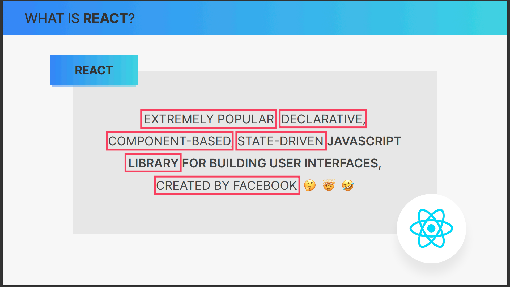

# 2. A First Look at React

- [2. A First Look at React](#2-a-first-look-at-react)
  - [1. Section Overview](#1-section-overview)
    - [what is react ?](#what-is-react-)
  - [3. React vs. Vanilla JavaScript](#3-react-vs-vanilla-javascript)
  - [4. What is React](#4-what-is-react)
    - [Component Based](#component-based)
    - [Declarative](#declarative)
    - [State Driven](#state-driven)
    - [Javascript Library](#javascript-library)
    - [Extremely Popular](#extremely-popular)
    - [created by Facebook](#created-by-facebook)
  - [5. Setting Up Our Development Environment](#5-setting-up-our-development-environment)
  - [6. Pure React](#6-pure-react)
  - [7. A Quick Look at React's Official Documentation](#7-a-quick-look-at-reacts-official-documentation)
  - [8. Setting Up a New React Project The Options](#8-setting-up-a-new-react-project-the-options)
  - [9. Setting Up a Project With Create-React-App](#9-setting-up-a-project-with-create-react-app)

## 1. Section Overview

### what is react ?

React is a popular JavaScript library for building user interfaces, particularly single-page applications where you need a fast, interactive user experience. Here are some reasons why developers choose React:

1. **Component-Based**: React is built around the concept of components. This promotes code reusability and makes it easier to manage and test code.

2. **Virtual DOM**: React uses a virtual DOM, which optimizes rendering and improves app performance. When the state of an object changes, React only updates that specific part of the DOM, rather than updating the entire DOM.

3. **Unidirectional Data Flow**: React implements one-way data flow which makes the application more stable and easier to debug as the data goes in a single direction.

4. **Strong Community and Ecosystem**: React has a large community and a rich ecosystem of libraries and tools, making it easier to find help, resources, and middleware.

5. **Used by Large Companies**: React is used by large companies like Facebook, Instagram, and Airbnb, which speaks to its scalability and reliability.

6. **JSX**: React uses JSX, a syntax extension for JavaScript that allows you to write HTML-like code in your JavaScript code. This makes the code easier to understand and write.

7. **Easy to Learn**: Compared to other popular frameworks like Angular, React is easier to learn due to its simplicity and straightforward data flow.

8. **React Native**: With React Native, you can use the same knowledge to build mobile applications for both iOS and Android.

Remember, while React has many advantages, whether it's the right choice depends on the specific needs and constraints of your project.

## 3. React vs. Vanilla JavaScript

code example

<https://codesandbox.io/s/react-first-app-advice-52879f>

## 4. What is React




### Component Based


### Declarative


### State Driven


### Javascript Library


### Extremely Popular


### created by Facebook


## 5. Setting Up Our Development Environment

- step 1 install code editor


[vscode download page](https://code.visualstudio.com/download)

- step 2 install node js


[Node.js download page](https://nodejs.org/en/download/)

- step 3 vscode extensions

we will install the following extensions:

press `ctrl + shift + x` to open the extensions view

and search for the following extensions:

1. Prettier - Code formatter

2. eslint


- step 4 vs code settings

let's setup the auto save feature in vscode

press `ctrl + ,` to open the settings view

search for `files.autoSave` and set it to `onFocusChange`


let's set the prettier as the default formatter

search for `editor.defaultFormatter` and set it to `esbenp.prettier-vscode`


let's setup format on save feature

search for `editor.formatOnSave` and set it to `true`


let's set eslint on save


- step 5 check node and npm versions

open the terminal in vscode by pressing `ctrl +`

and type the following commands:

`command`

```bash
node -v
```

`output`

```bash
v20.11.0
```

`command`

```bash
npm -v
```

`output`

```bash
10.5.0
```

some other useful extensions:


## 6. Pure React

let's create a `index.html` file and add the following code:

```html
<!DOCTYPE html>
<html lang="en">
  <head>
    <meta charset="UTF-8" />
    <meta name="viewport" content="width=device-width, initial-scale=1.0" />
    <title>Document</title>
  </head>
  <body></body>
</html>
```

go to react installation page <https://react.dev/learn/installation>

it will redirect you to the following page <https://gist.githubusercontent.com/gaearon/0275b1e1518599bbeafcde4722e79ed1/raw/db72dcbf3384ee1708c4a07d3be79860db04bff0/example.html>

from there copy the following code:

```html
<script src="https://unpkg.com/react@18/umd/react.development.js"></script>
<script src="https://unpkg.com/react-dom@18/umd/react-dom.development.js"></script>

```

and paste it in the `body` tag of the `index.html` file

```html
<!DOCTYPE html>
<html lang="en">
  <head>
    <meta charset="UTF-8" />
    <meta name="viewport" content="width=device-width, initial-scale=1.0" />
    <title>Document</title>
  </head>
  <body>
    <div id="root"></div>
    <script src="https://unpkg.com/react@18/umd/react.development.js"></script>
    <script src="https://unpkg.com/react-dom@18/umd/react-dom.development.js"></script>
  </body>
</html>

```

let's create a clock using pure react

```html
<!DOCTYPE html>
<html lang="en">
  <head>
    <meta charset="UTF-8" />
    <meta name="viewport" content="width=device-width, initial-scale=1.0" />
    <title>Document</title>
  </head>
  <body>
    <div id="root"></div>
    <script src="https://unpkg.com/react@18/umd/react.development.js"></script>
    <script src="https://unpkg.com/react-dom@18/umd/react-dom.development.js"></script>
    <script>
      function App() {
        const [time, setTime] = React.useState(new Date().toLocaleTimeString());

        React.useEffect(() => {
          setInterval(() => {
            setTime(new Date().toLocaleTimeString());
          }, 1000);
        }, []);

        return React.createElement("header", null, `Hello React it's ${time}`);
      }

      const root = ReactDOM.createRoot(document.getElementById("root"));
      root.render(React.createElement(App));
    </script>
  </body>
</html>
```


## 7. A Quick Look at React's Official Documentation

<https://react.dev/>

## 8. Setting Up a New React Project The Options


react official documentation recommendations:

<https://react.dev/learn/start-a-new-react-project>


## 9. Setting Up a Project With Create-React-App

we will use vite instead of create-react-app

<https://vitejs.dev/>


go to your terminal and type the following command:

```bash
npm create vite@latest
```


now cd into the project directory

```bash
cd sample-vite-project
```

and run the following command:

```bash
npm install
```


to`start the development server` run the following command:

```bash
npm run dev
```

to `build the project` run the following command:

```bash
npm run build
```

to `preview the build` run the following command:

```bash
npm run serve
```
