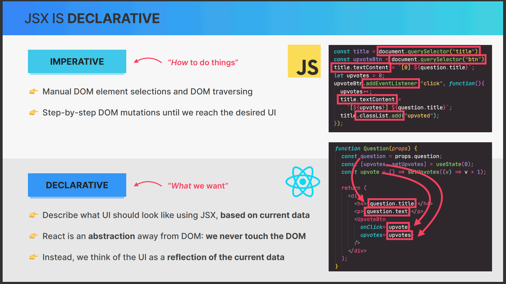

# Working With Components, Props and JSX

## 1. Section Overview

## 2. Rendering the Root Component and Strict Mode

this is the root component of the application

```tsx
import React from "react";
import ReactDOM from "react-dom/client";
import App from "./App.tsx";
import "./index.css";

ReactDOM.createRoot(document.getElementById("root")!).render(
  <React.StrictMode>
    <App />
  </React.StrictMode>
);

```

## 3. Before We Start Coding Debugging

## 4. Components as Building Blocks

### what is react component ?

A React component is a reusable, independent piece of code that returns a React element to be rendered to the page. Each component can have its own state and props. Components can be defined as classes or functions.

Components are the building blocks of any React application, and a single app usually consists of multiple components. These components can be nested within each other to allow complex applications to be built out of simple building blocks.

Here's an example of a simple functional component in React:

```jsx
function Welcome(props) {
  return <h1>Hello, {props.name}</h1>;
}
```

In this example, `Welcome` is a React component. It accepts an object of properties (often referred to as `props`) and returns a React element. This component can be used in JSX like this: `<Welcome name="Sara" />`.

Components can also be ES6 classes:

```jsx
class Welcome extends React.Component {
  render() {
    return <h1>Hello, {this.props.name}</h1>;
  }
}
```

In this example, `Welcome` is a React component defined as an ES6 class. It has a `render` method that returns a React element.


## 5. Creating And Reusing a Component
```tsx
import { ModeToggle } from "./components/mode-toggle";
import { ThemeProvider } from "./components/theme-provider";
import imagerl from "./assets/pizzas/test.jpg";
import { AspectRatio } from "./components/ui/aspect-ratio";

interface IPizza {
  name: string;
  ingredients: string;
  price: number;
  photoName: string;
  soldOut: boolean;
}
const pizzaData: IPizza[] = [
  {
    name: "Focaccia",
    ingredients: "Bread with italian olive oil and rosemary",
    price: 6,
    photoName: "./pizzas/focaccia.jpg",
    soldOut: false,
  },
  {
    name: "Pizza Margherita",
    ingredients: "Tomato and mozarella",
    price: 10,
    photoName: "./pizzas/margherita.jpg",
    soldOut: false,
  },
  {
    name: "Pizza Spinaci",
    ingredients: "Tomato, mozarella, spinach, and ricotta cheese",
    price: 12,
    photoName: "./pizzas/spinaci.jpg",
    soldOut: false,
  },
  {
    name: "Pizza Funghi",
    ingredients: "Tomato, mozarella, mushrooms, and onion",
    price: 12,
    photoName: "./pizzas/funghi.jpg",
    soldOut: false,
  },
  {
    name: "Pizza Salamino",
    ingredients: "Tomato, mozarella, and pepperoni",
    price: 15,
    photoName: "./pizzas/salamino.jpg",
    soldOut: true,
  },
  {
    name: "Pizza Prosciutto",
    ingredients: "Tomato, mozarella, ham, aragula, and burrata cheese",
    price: 18,
    photoName: "./pizzas/prosciutto.jpg",
    soldOut: false,
  },
];

function Pizza() {
  return (
    <>
      <h1 className="scroll-m-20 text-4xl font-extrabold tracking-tight lg:text-5xl mb-10">
        Hi Pizza
      </h1>
      <div className="w-[200px]">
        <AspectRatio ratio={16 / 9} className="bg-purple-400">
          
        </AspectRatio>
      </div>
    </>
  );
}

function App() {
  return (
    <ThemeProvider defaultTheme="dark" storageKey="vite-ui-theme">
      <nav className="flex items-center justify-between">
        <ul className="flex gap-5">
          <li>Items 1</li>
          <li>Item 2</li>
        </ul>
        <ModeToggle />
      </nav>

      <Pizza />
      <Pizza />
      <Pizza />
      <Pizza />

      {/* <LoginForm /> */}
    </ThemeProvider>
  );
}

export default App;

```


## 6. What is JSX



## 7. Creating More Components

## 8. JavaScript Logic in Components

## 9. Separation of Concerns

## 10. Styling React Applications

## 11. Passing and Receiving Props

## 12. Props, Immutability, and One-Way Data Flow

## 13. CHALLENGE #1 Profile Card (v1)

## 14. The Rules of JSX

## 15. Rendering Lists

## 16. Conditional Rendering With &&

## 17. Conditional Rendering With Ternaries

## 18. Conditional Rendering With Multiple Returns

## 19. Extracting JSX Into a New Component

## 20. Destructuring Props

## 21. React Fragments

## 22. Setting Classes and Text Conditionally

## 23. Section Summary

## 24. CHALLENGE #2 Profile Card (v2)
