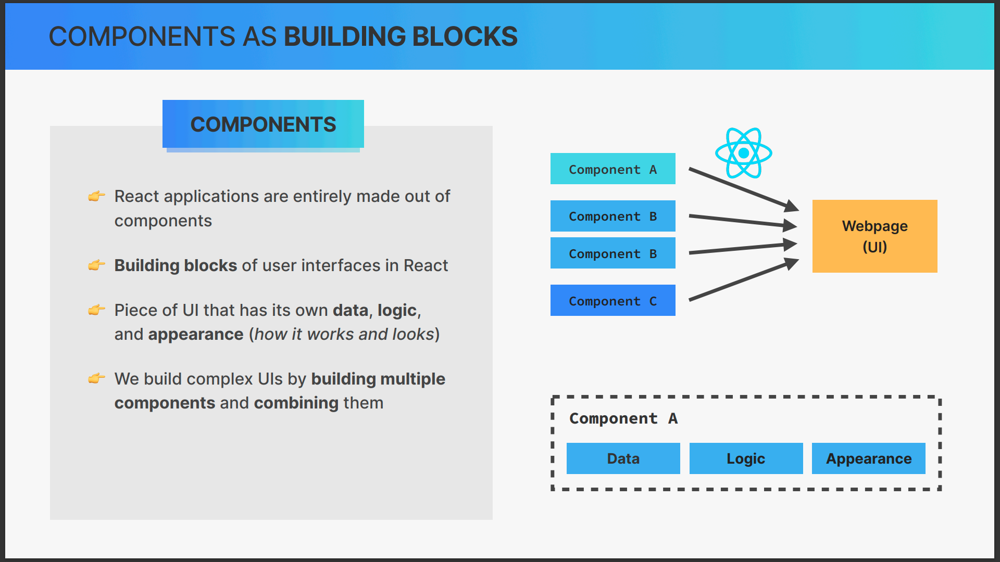

# Working With Components, Props and JSX

## 1. Section Overview

## 2. Rendering the Root Component and Strict Mode

this is the root component of the application

```tsx
import React from "react";
import ReactDOM from "react-dom/client";
import App from "./App.tsx";
import "./index.css";

ReactDOM.createRoot(document.getElementById("root")!).render(
  <React.StrictMode>
    <App />
  </React.StrictMode>
);

```

## 3. Before We Start Coding Debugging

## 4. Components as Building Blocks

### what is react component ?

A React component is a reusable, independent piece of code that returns a React element to be rendered to the page. Each component can have its own state and props. Components can be defined as classes or functions.

Components are the building blocks of any React application, and a single app usually consists of multiple components. These components can be nested within each other to allow complex applications to be built out of simple building blocks.

Here's an example of a simple functional component in React:

```jsx
function Welcome(props) {
  return <h1>Hello, {props.name}</h1>;
}
```

In this example, `Welcome` is a React component. It accepts an object of properties (often referred to as `props`) and returns a React element. This component can be used in JSX like this: `<Welcome name="Sara" />`.

Components can also be ES6 classes:

```jsx
class Welcome extends React.Component {
  render() {
    return <h1>Hello, {this.props.name}</h1>;
  }
}
```

In this example, `Welcome` is a React component defined as an ES6 class. It has a `render` method that returns a React element.




## 5. Creating And Reusing a Component
```tsx
import { ModeToggle } from "./components/mode-toggle";
import { ThemeProvider } from "./components/theme-provider";
import imagerl from "./assets/pizzas/test.jpg";
import { AspectRatio } from "./components/ui/aspect-ratio";

interface IPizza {
  name: string;
  ingredients: string;
  price: number;
  photoName: string;
  soldOut: boolean;
}
const pizzaData: IPizza[] = [
  {
    name: "Focaccia",
    ingredients: "Bread with italian olive oil and rosemary",
    price: 6,
    photoName: "./pizzas/focaccia.jpg",
    soldOut: false,
  },
  {
    name: "Pizza Margherita",
    ingredients: "Tomato and mozarella",
    price: 10,
    photoName: "./pizzas/margherita.jpg",
    soldOut: false,
  },
  {
    name: "Pizza Spinaci",
    ingredients: "Tomato, mozarella, spinach, and ricotta cheese",
    price: 12,
    photoName: "./pizzas/spinaci.jpg",
    soldOut: false,
  },
  {
    name: "Pizza Funghi",
    ingredients: "Tomato, mozarella, mushrooms, and onion",
    price: 12,
    photoName: "./pizzas/funghi.jpg",
    soldOut: false,
  },
  {
    name: "Pizza Salamino",
    ingredients: "Tomato, mozarella, and pepperoni",
    price: 15,
    photoName: "./pizzas/salamino.jpg",
    soldOut: true,
  },
  {
    name: "Pizza Prosciutto",
    ingredients: "Tomato, mozarella, ham, aragula, and burrata cheese",
    price: 18,
    photoName: "./pizzas/prosciutto.jpg",
    soldOut: false,
  },
];

function Pizza() {
  return (
    <>
      <h1 className="scroll-m-20 text-4xl font-extrabold tracking-tight lg:text-5xl mb-10">
        Hi Pizza
      </h1>
      <div className="w-[200px]">
        <AspectRatio ratio={16 / 9} className="bg-purple-400">
          
        </AspectRatio>
      </div>
    </>
  );
}

function App() {
  return (
    <ThemeProvider defaultTheme="dark" storageKey="vite-ui-theme">
      <nav className="flex items-center justify-between">
        <ul className="flex gap-5">
          <li>Items 1</li>
          <li>Item 2</li>
        </ul>
        <ModeToggle />
      </nav>

      <Pizza />
      <Pizza />
      <Pizza />
      <Pizza />

      {/* <LoginForm /> */}
    </ThemeProvider>
  );
}

export default App;

```


## 6. What is JSX


## 7. Creating More Components
```tsx
import { ModeToggle } from "./components/mode-toggle";
import { ThemeProvider } from "./components/theme-provider";
import imagerl from "./assets/pizzas/test.jpg";
import { AspectRatio } from "./components/ui/aspect-ratio";

interface IPizza {
  name: string;
  ingredients: string;
  price: number;
  photoName: string;
  soldOut: boolean;
}
const pizzaData: IPizza[] = [
  {
    name: "Focaccia",
    ingredients: "Bread with italian olive oil and rosemary",
    price: 6,
    photoName: "./pizzas/focaccia.jpg",
    soldOut: false,
  },
  {
    name: "Pizza Margherita",
    ingredients: "Tomato and mozarella",
    price: 10,
    photoName: "./pizzas/margherita.jpg",
    soldOut: false,
  },
  {
    name: "Pizza Spinaci",
    ingredients: "Tomato, mozarella, spinach, and ricotta cheese",
    price: 12,
    photoName: "./pizzas/spinaci.jpg",
    soldOut: false,
  },
  {
    name: "Pizza Funghi",
    ingredients: "Tomato, mozarella, mushrooms, and onion",
    price: 12,
    photoName: "./pizzas/funghi.jpg",
    soldOut: false,
  },
  {
    name: "Pizza Salamino",
    ingredients: "Tomato, mozarella, and pepperoni",
    price: 15,
    photoName: "./pizzas/salamino.jpg",
    soldOut: true,
  },
  {
    name: "Pizza Prosciutto",
    ingredients: "Tomato, mozarella, ham, aragula, and burrata cheese",
    price: 18,
    photoName: "./pizzas/prosciutto.jpg",
    soldOut: false,
  },
];

function Pizza() {
  return (
    <>
      <h1 className="scroll-m-20 text-4xl font-extrabold tracking-tight lg:text-5xl mb-10">
        Hi Pizza
      </h1>
      <div className="w-[200px]">
        <AspectRatio ratio={16 / 9} className="bg-purple-400">
          
        </AspectRatio>
      </div>
    </>
  );
}

type THeaderProps = {};

const Header = (props: Props) => {
  return (
    <nav className="flex items-center justify-between">
      <ul className="flex gap-5">
        <li>
          <h1>Fast React Pizza Company</h1>;
        </li>
        <li>Items 1</li>
        <li>Item 2</li>
      </ul>
      <ModeToggle />
    </nav>
  );
};

type TMenuProps = {};

const Menu = (props: Props) => {
  return (
    <>
      <h2>Our Menu</h2>;
      <Pizza />
    </>
  );
};

type FooterProps = {};

const Footer = (props: Props) => {
  return (
    <footer>{new Date().toLocaleTimeString()}we are currently open</footer>
  );
};

function App() {
  return (
    <ThemeProvider defaultTheme="dark" storageKey="vite-ui-theme">
      <Header />
      <Menu />
      <Footer />

      {/* <LoginForm /> */}
    </ThemeProvider>
  );
}

export default App;

```


## 8. JavaScript Logic in Components
```tsx
type FooterProps = {};

const Footer = (props: Props) => {
  const hours = new Date().getHours();

  const openHour = 12;
  const closeHour = 22;
  console.log(hours);

  const isOpen = hours >= openHour || hours <= closeHour;
  console.log("🚀 ~ Footer ~ isOpen:", isOpen);

  return (
    <footer>{new Date().toLocaleTimeString()}we are currently open</footer>
  );
};
```
## 9. Separation of Concerns


Separation of Concerns (SoC) is a design principle for separating a program into distinct sections, where each section addresses a separate concern. In the context of React, it means organizing your code in a way that each component or module has a specific job or concern.

For example, in a typical React application, you might have components for the header, footer, and main content of your application. Each of these components has a specific job:

- The header component might contain navigation and branding.
- The main content component might contain the main interactive parts of the application.
- The footer component might contain copyright information and links.

Each of these components is responsible for a specific part of the application and doesn't need to know about the others. This makes the code easier to understand, test, and maintain.

Here's an example of how you might structure these components in a React application:

```jsx
function Header() {
  return (
    <header>
      {/* Navigation and branding */}
    </header>
  );
}

function MainContent() {
  return (
    <main>
      {/* Main interactive parts of the application */}
    </main>
  );
}

function Footer() {
  return (
    <footer>
      {/* Copyright information and links */}
    </footer>
  );
}

function App() {
  return (
    <div>
      <Header />
      <MainContent />
      <Footer />
    </div>
  );
}

export default App;
```

In this example, each component has a specific concern and doesn't need to know about the others. This is the essence of Separation of Concerns in React.
## 10. Styling React Applications
```tsx
function Pizza() {
  // .pizza {
  //   display: flex;
  //   gap: 3.2rem;
  // }

  return (
    <div className="flex flex-col gap-2 py-2">
      
      <h3 className="text-xl font-normal">Pizza Spinichi</h3>
      <p className="text-sm font-light italic mb-auto">
        Tomato, mozarella, spinach, and ricotta cheese
      </p>
    </div>
  );
}

type THeaderProps = {};

const Header = (props: Props) => {
  return (
    <div>
      <nav className="flex items-center justify-between">
        <ul className="flex gap-5">
          <li>Items 1</li>
          <li>Item 2</li>
        </ul>
        <ModeToggle />
      </nav>
      <header className="self-stretch mt-10">
        <h1 className="text-[#edc84b] uppercase text-5xl text-center font-light relative block w-full before:block before:content-[''] before:h-[3px] before:w-[4rem] before:bg-[#edc84b] before:absolute before:top-11 before:-left-14 after:block after:content-[''] after:h-[3px] after:w-[4rem] after:bg-[#edc84b] after:absolute after:top-11 after:-right-12">
          Fast React Pizza Company
        </h1>
      </header>
    </div>
  );
};

type TMenuProps = {};

const Menu = (props: Props) => {
  return (
    <div className="flex flex-col items-center gap-4">
      <h2 className="text-2xl uppercase py-3 border-t-2 inline-block border-black border-b-2 tracking-wider font-medium">
        Our Menu
      </h2>
      <div className="grid grid-cols-2 gap-12 list-none">
        <Pizza />
      </div>
    </div>
  );
};

type FooterProps = {};

const Footer = (props: Props) => {
  const hours = new Date().getHours();

  const openHour = 12;
  const closeHour = 22;
  console.log(hours);

  const isOpen = hours >= openHour || hours <= closeHour;
  console.log("🚀 ~ Footer ~ isOpen:", isOpen);

  return (
    <footer className="text-sm text-center">
      {new Date().toLocaleTimeString()}we are currently open
    </footer>
  );
};

function App() {
  return (
    <ThemeProvider defaultTheme="dark" storageKey="vite-ui-theme">
      <div className="container flex flex-col items-center gap-12">
        <Header />
        <Menu />
        <Footer />
        {/* <LoginForm /> */}
      </div>
    </ThemeProvider>
  );
}

export default App;

```
## 11. Passing and Receiving Props
```tsx
type TMenuProps = {};

const Menu = (props: Props) => {
    return (
        <div className="flex flex-col items-center gap-4">
            <h2 className="text-2xl uppercase py-3 border-t-2 inline-block border-black border-b-2 tracking-wider font-medium">
                Our Menu
            </h2>
            <div className="grid grid-cols-2 gap-12 list-none">
                <Pizza
                    photoName="/src/assets/pizzas/prosciutto.jpg"
                    ingredients="Tomato, mozarella, ham, aragula, and burrata cheese"
                    name="Pizza Prosciutto"
                    price={18}
                    soldOut
                    key={"Pizza Prosciutto"}
                />
                <Pizza
                    photoName="/src/assets/pizzas/prosciutto.jpg"
                    ingredients="Tomato, mozarella, ham, aragula, and burrata cheese"
                    name="Pizza Prosciutto"
                    price={18}
                    soldOut
                    key={"Pizza Prosciutto"}
                />
            </div>
        </div>
    );
};

function App() {
  return (
    <ThemeProvider defaultTheme="dark" storageKey="vite-ui-theme">
      <div className="container flex flex-col items-center gap-12">
        <Header />
        <Menu />
        <Footer />
        {/* <LoginForm /> */}
      </div>
    </ThemeProvider>
  );
}

```
## 12. Props, Immutability, and One-Way Data Flow

## 13. CHALLENGE #1 Profile Card (v1)

## 14. The Rules of JSX

## 15. Rendering Lists

## 16. Conditional Rendering With &&

## 17. Conditional Rendering With Ternaries

## 18. Conditional Rendering With Multiple Returns

## 19. Extracting JSX Into a New Component

## 20. Destructuring Props

## 21. React Fragments

## 22. Setting Classes and Text Conditionally

## 23. Section Summary

## 24. CHALLENGE #2 Profile Card (v2)
