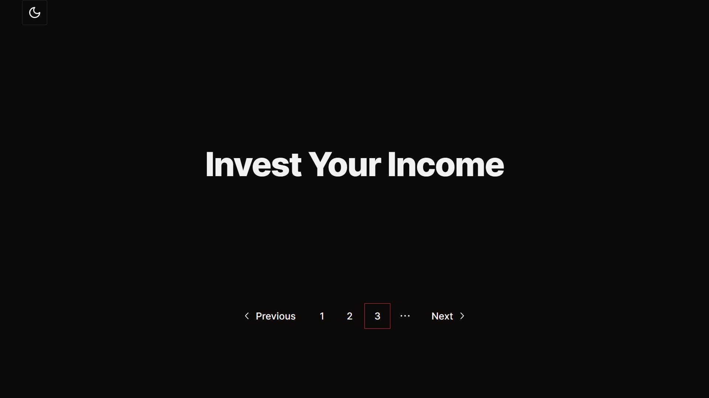
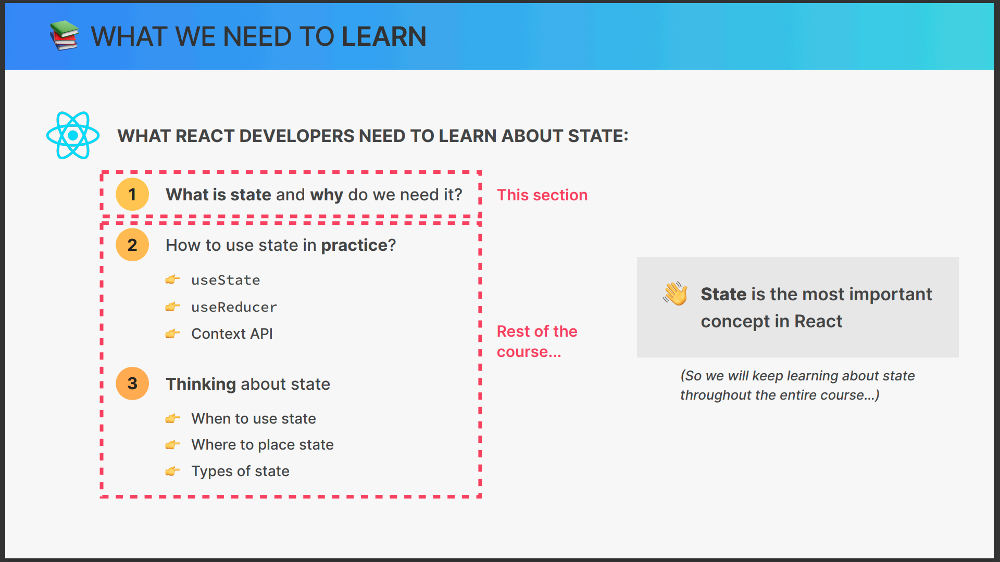
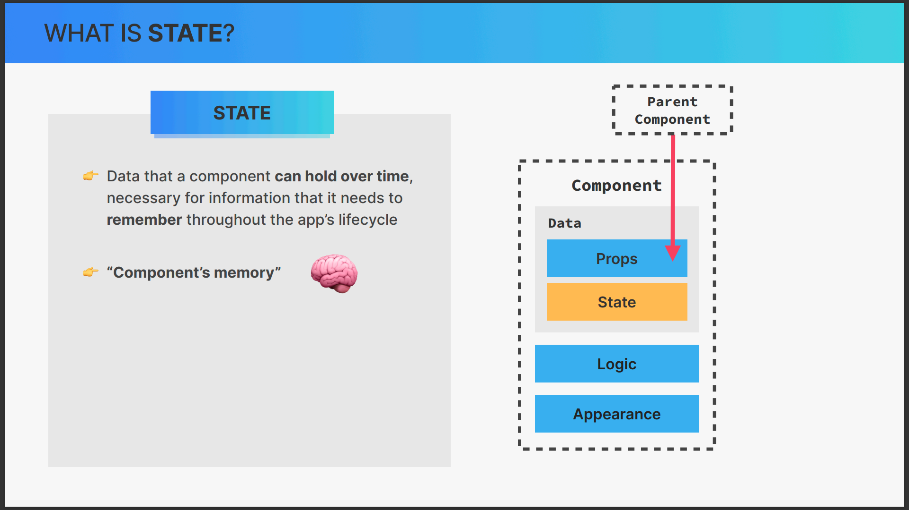
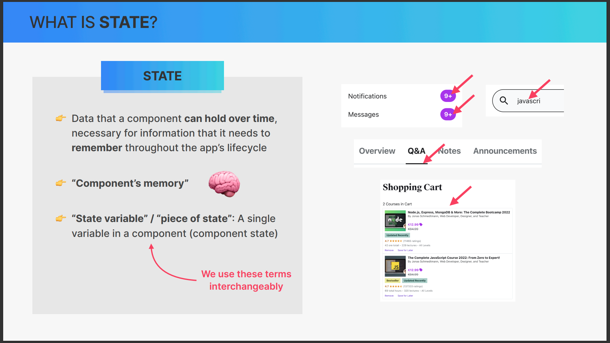
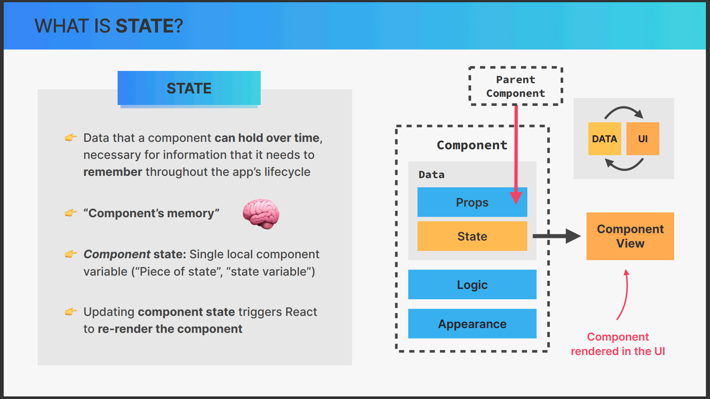
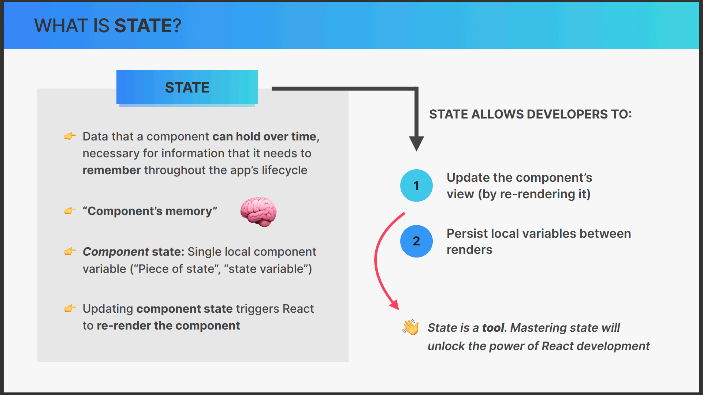

# 6.State_Events_and_Forms_Interactive_Components

- [6.State\_Events\_and\_Forms\_Interactive\_Components](#6state_events_and_forms_interactive_components)
  - [1. Section Overview](#1-section-overview)
  - [2. Let's Build a Steps Component](#2-lets-build-a-steps-component)
  - [3. Handling Events the React Way](#3-handling-events-the-react-way)
  - [4. What is State in React](#4-what-is-state-in-react)
  - [5. Creating a State Variable With useState](#5-creating-a-state-variable-with-usestate)
  - [6. Don't Set State Manually!](#6-dont-set-state-manually)
  - [7. The Mechanics of State](#7-the-mechanics-of-state)
  - [8. Adding Another Piece of State](#8-adding-another-piece-of-state)
  - [9. React Developer Tools](#9-react-developer-tools)
  - [10. Updating State Based on Current State](#10-updating-state-based-on-current-state)
  - [11. More Thoughts About State + State Guidelines](#11-more-thoughts-about-state--state-guidelines)
  - [12. A Vanilla JavaScript Implementation](#12-a-vanilla-javascript-implementation)
  - [13. CHALLENGE #1 Date Counter (v1)](#13-challenge-1-date-counter-v1)
  - [14. Starting a New Project The Far Away Travel List](#14-starting-a-new-project-the-far-away-travel-list)
  - [15. Building the Layout](#15-building-the-layout)
  - [16. Rendering the Items List](#16-rendering-the-items-list)
  - [17. Building a Form and Handling Submissions](#17-building-a-form-and-handling-submissions)
  - [18. Controlled Elements](#18-controlled-elements)
  - [19. State vs. Props](#19-state-vs-props)
  - [20. EXERCISE #1 Flashcards](#20-exercise-1-flashcards)
  - [21. CHALLENGE #2 Date Counter (v2)](#21-challenge-2-date-counter-v2)


## 1. Section Overview

add these styles to the `index.css` file
```css
/* 
const messages = [
  "Learn React ⚛️",
  "Apply for jobs 💼",
  "Invest your new income 🤑",
];
 */

* {
  box-sizing: border-box;
}

body {
  font-family: sans-serif;
  color: #333;
}

.steps {
  width: 600px;
  background-color: #f7f7f7;
  border-radius: 7px;
  padding: 25px 100px;
  margin: 100px auto;
}

.numbers {
  display: flex;
  justify-content: space-between;
}

.numbers > div {
  height: 40px;
  aspect-ratio: 1;
  background-color: #e7e7e7;
  border-radius: 50%;
  display: flex;
  align-items: center;
  justify-content: center;
  font-size: 18px;
}

.numbers .active {
  background-color: #7950f2;
  color: #fff;
}

.message {
  text-align: center;
  font-size: 20px;
  margin: 40px 0;
  font-weight: bold;

  display: flex;
  flex-direction: column;
  align-items: center;
}

.buttons {
  display: flex;
  justify-content: space-between;
}

.buttons button {
  border: none;
  cursor: pointer;
  padding: 10px 15px;
  border-radius: 100px;
  font-size: 14px;
  font-weight: bold;

  display: flex;
  align-items: center;
  gap: 10px;
}

.buttons button span {
  font-size: 16px;
  line-height: 1;
}

h3 {
  margin: 0;
  text-transform: uppercase;
}

.close {
  position: absolute;
  top: 16px;
  right: 16px;
  border: none;
  background: none;
  cursor: pointer;
  font-size: 40px;
  color: inherit;
}

.close:hover {
  color: #7950f2;
}
```

copy these `vanila.html` file

```html
<!DOCTYPE html>
<html lang="en">
  <head>
    <meta charset="UTF-8" />
    <meta http-equiv="X-UA-Compatible" content="IE=edge" />
    <meta name="viewport" content="width=device-width, initial-scale=1.0" />
    <link rel="stylesheet" type="text/css" href="../src/style.css" />
    <title>Vanilla JS steps</title>
  </head>
  <body>
    <div class="steps">
      <div class="numbers">
        <div class="step-1">1</div>
        <div class="step-2">2</div>
        <div class="step-3">3</div>
      </div>

      <p class="message"></p>

      <div class="buttons">
        <button class="previous">Previous</button>
        <button class="next">Next</button>
      </div>
    </div>

    <script>
      const messages = [
        'Learn React ⚛️',
        'Apply for jobs 💼',
        'Invest your new income 🤑',
      ];

      // Selecting DOM elements
      const step1 = document.querySelector('.step-1');
      const step2 = document.querySelector('.step-2');
      const step3 = document.querySelector('.step-3');
      const message = document.querySelector('.message');
      const btnPrevious = document.querySelector('.previous');
      const btnNext = document.querySelector('.next');

      // "State"
      let step = 1;

      // Manually updating the DOM: changing text content and adding/removing classes (imperative approach)
      const updateUIValues = function () {
        message.textContent = `Step ${step}: ${messages[step - 1]}`;

        if (step >= 1) step1.classList.add('active');
        else step1.classList.remove('active');

        if (step >= 2) step2.classList.add('active');
        else step2.classList.remove('active');

        if (step >= 3) step3.classList.add('active');
        else step3.classList.remove('active');
      };

      // Initial setup
      updateUIValues();

      // Manually attaching event listeners
      btnPrevious.addEventListener('click', function () {
        if (step > 1) step -= 1;
        updateUIValues();
      });

      btnNext.addEventListener('click', function () {
        if (step < 3) step += 1;
        updateUIValues();
      });
    </script>
  </body>
</html>

```
## 2. Let's Build a Steps Component
```tsx
import { ReactNode } from "react";
import { useParams } from "react-router-dom";

const StepPage = () => {
  const { stepId } = useParams<{ stepId: string }>();
  let step: ReactNode = null;

  if (stepId && !parseInt(stepId)) {
    throw new Error("Invalid Route");
  }

  if (stepId && parseInt(stepId) === 1) {
    step = <h1>Learn React</h1>;
  }

  if (stepId && parseInt(stepId) === 2) {
    step = <h1>Apply For a Job</h1>;
  }

  if (stepId && parseInt(stepId) === 3) {
    step = <h1>Invest Your Income</h1>;
  }
  return <div className={"h-[50vh] mx-auto text-center"}>{step}</div>;
};

export default StepPage;

```

```tsx
import {
  Pagination,
  PaginationContent,
  PaginationEllipsis,
  PaginationItem,
  PaginationLink,
  PaginationNext,
  PaginationPrevious,
} from "@/components/ui/pagination";
import { Link, useParams, useNavigate } from "react-router-dom";

const PaginationPage = () => {
  const { stepId } = useParams();
  const navigate = useNavigate();
  const currentPage: number = (stepId && parseInt(stepId)) || 1;
  const pageCount = 3;

  const handlePrevious = (currentPage: number) => {
    if (currentPage <= 1) {
      return;
    }
    navigate(`/step/${currentPage - 1}`);
  };

  const handleNext = (currentPage: number) => {
    if (currentPage < pageCount) {
      navigate(`/step/${currentPage + 1}`);
    }
  };

  return (
    <Pagination>
      <PaginationContent>
        <PaginationItem>
          <PaginationPrevious onClick={() => handlePrevious(currentPage)} />
        </PaginationItem>
        <PaginationItem
          className={`${
            currentPage === 1 && "outline outline-1 outline-primary"
          }`}
        >
          <Link to={`/step/1`}>
            <PaginationLink>1</PaginationLink>
          </Link>
        </PaginationItem>
        <PaginationItem
          className={`${
            currentPage === 2 && "outline outline-1 outline-primary"
          }`}
        >
          <Link to={`/step/2`}>
            <PaginationLink>2</PaginationLink>
          </Link>
        </PaginationItem>
        <PaginationItem
          className={`${
            currentPage === 3 && "outline outline-1 outline-primary"
          }`}
        >
          <Link to={`/step/3`}>
            <PaginationLink>3</PaginationLink>
          </Link>
        </PaginationItem>
        <PaginationItem>
          <PaginationEllipsis />
        </PaginationItem>
        <PaginationItem onClick={() => handleNext(currentPage)}>
          <PaginationNext />
        </PaginationItem>
      </PaginationContent>
    </Pagination>
  );
};

export default PaginationPage;

```

## 3. Handling Events the React Way
In TypeScript with React, handling events is similar to how it's done in JavaScript. However, you need to specify the type of event you're handling. Here's an example of how to handle a click event in TypeScript with React:

```tsx
import React, { MouseEvent } from 'react';

const MyButton: React.FC = () => {
  const handleClick = (event: MouseEvent<HTMLButtonElement>) => {
    console.log('Button clicked!');
  }

  return (
    <button onClick={handleClick}>
      Click me
    </button>
  );
}

export default MyButton;
```

In this example, the `handleClick` function is typed with `MouseEvent<HTMLButtonElement>`, which represents a mouse click event on a button element. When the button is clicked, the `handleClick` function is called, and "Button clicked!" is logged to the console.
## 4. What is State in React





## 5. Creating a State Variable With useState
## 6. Don't Set State Manually!
## 7. The Mechanics of State
## 8. Adding Another Piece of State
## 9. React Developer Tools
## 10. Updating State Based on Current State
## 11. More Thoughts About State + State Guidelines
## 12. A Vanilla JavaScript Implementation
## 13. CHALLENGE #1 Date Counter (v1)
## 14. Starting a New Project The Far Away Travel List
## 15. Building the Layout
## 16. Rendering the Items List
## 17. Building a Form and Handling Submissions
## 18. Controlled Elements
## 19. State vs. Props
## 20. EXERCISE #1 Flashcards
## 21. CHALLENGE #2 Date Counter (v2)
