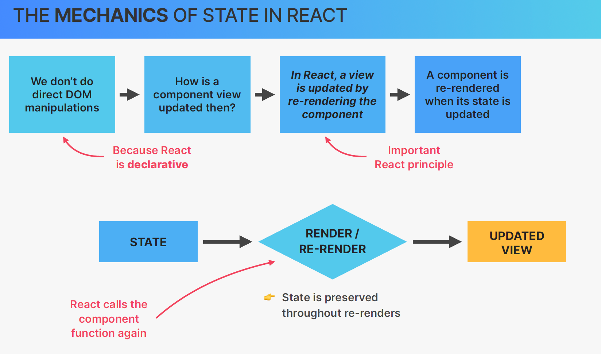
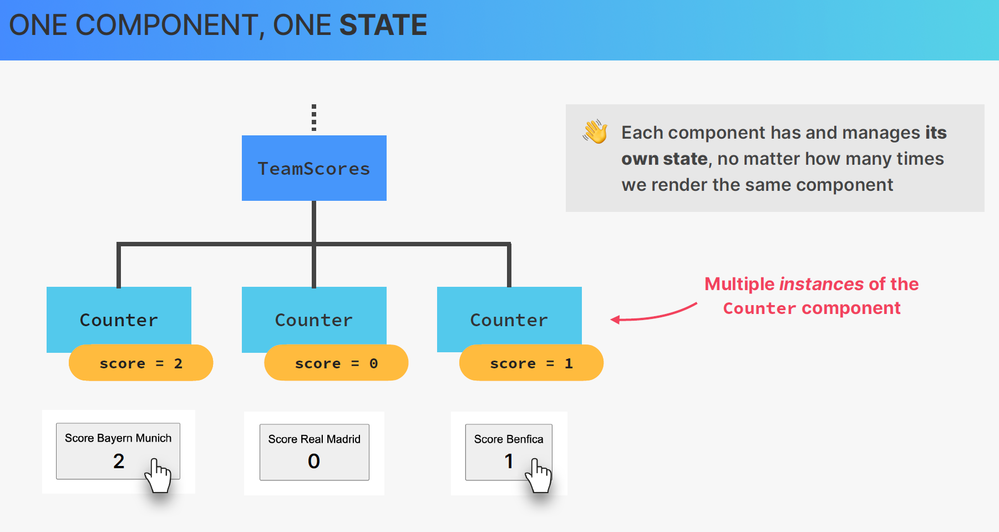
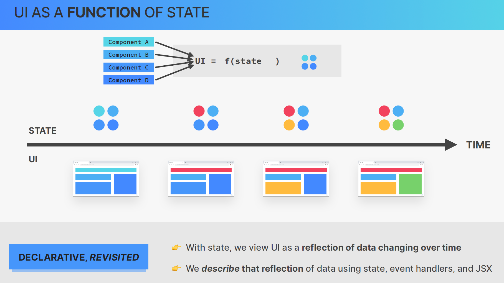
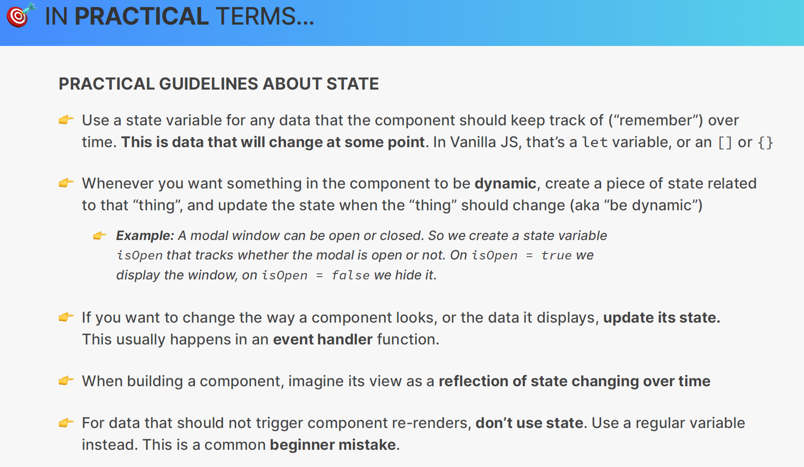
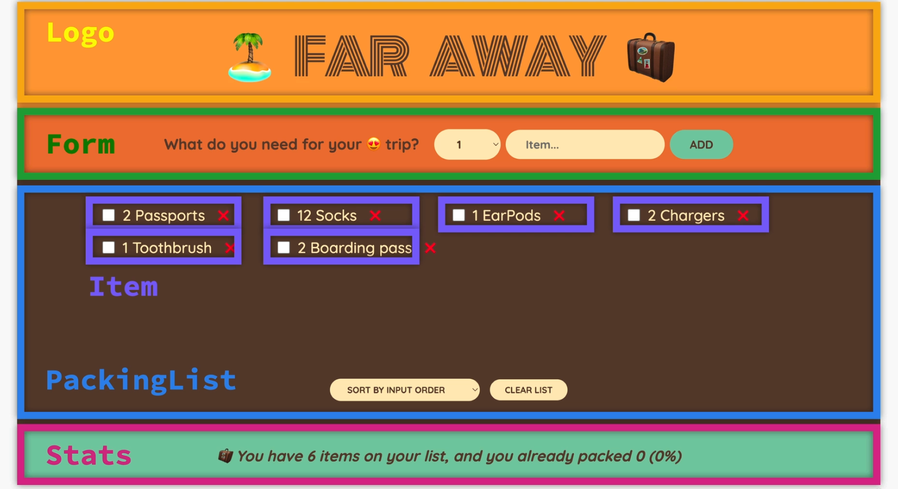
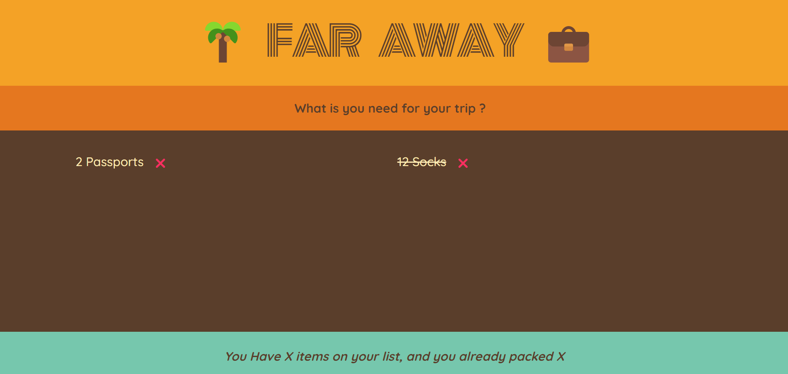
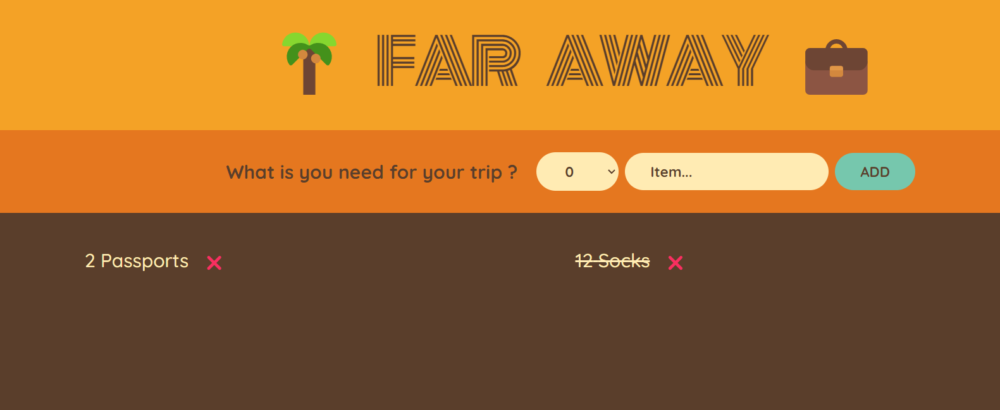
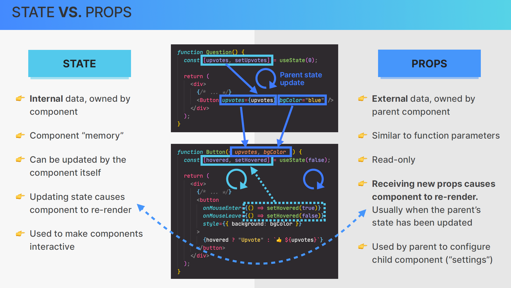
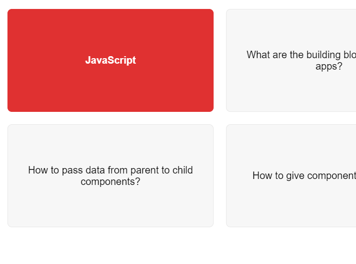
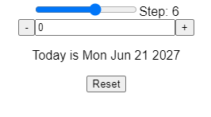

# 6.State_Events_and_Forms_Interactive_Components

- [6.State\_Events\_and\_Forms\_Interactive\_Components](#6state_events_and_forms_interactive_components)
  - [1. Section Overview](#1-section-overview)
  - [2. Let's Build a Steps Component](#2-lets-build-a-steps-component)
  - [3. Handling Events the React Way](#3-handling-events-the-react-way)
  - [4. What is State in React](#4-what-is-state-in-react)
    - [1. **What is State and Why Do We Need It?**](#1-what-is-state-and-why-do-we-need-it)
      - [Why is State Important?](#why-is-state-important)
      - [Example:](#example)
    - [2. **How to Use State in Practice**](#2-how-to-use-state-in-practice)
      - [a) **useState** (for local component state)](#a-usestate-for-local-component-state)
      - [b) **useReducer** (for more complex state logic)](#b-usereducer-for-more-complex-state-logic)
      - [c) **Context API** (for sharing state across components)](#c-context-api-for-sharing-state-across-components)
    - [3. **Thinking About State**](#3-thinking-about-state)
      - [a) **When to use state**:](#a-when-to-use-state)
      - [b) **Where to place state**:](#b-where-to-place-state)
      - [Example:](#example-1)
      - [c) **Types of state**:](#c-types-of-state)
    - [Conclusion](#conclusion)
    - [1. **What is State?**](#1-what-is-state)
      - [Key Concepts:](#key-concepts)
      - [Example:](#example-2)
    - [2. **Props vs. State**](#2-props-vs-state)
    - [Example to Illustrate Props and State:](#example-to-illustrate-props-and-state)
      - [Parent Component (with props):](#parent-component-with-props)
      - [Child Component (with state):](#child-component-with-state)
    - [3. **Lifting State Up**](#3-lifting-state-up)
      - [Example:](#example-3)
    - [4. **Why is State Important?**](#4-why-is-state-important)
    - [Conclusion:](#conclusion-1)
    - [What is State?](#what-is-state)
    - [Examples from the Image:](#examples-from-the-image)
    - [Why is State Important in React?](#why-is-state-important-in-react)
    - [Conclusion:](#conclusion-2)
    - [What is State?](#what-is-state-1)
    - [Component State](#component-state)
    - [Props vs. State](#props-vs-state)
    - [State and UI Relationship](#state-and-ui-relationship)
    - [Component Re-Rendering](#component-re-rendering)
    - [Conclusion:](#conclusion-3)
    - [What is State in React?](#what-is-state-in-react)
    - [State Allows Developers To:](#state-allows-developers-to)
    - [Final Takeaway:](#final-takeaway)
  - [5. Creating a State Variable With useState](#5-creating-a-state-variable-with-usestate)
    - [1. Importing React Dependencies](#1-importing-react-dependencies)
    - [2. Defining an Array of Messages](#2-defining-an-array-of-messages)
    - [3. Defining the Main `App` Component](#3-defining-the-main-app-component)
    - [4. Using `useState` to Manage the Current Step](#4-using-usestate-to-manage-the-current-step)
      - [Example:](#example-4)
    - [5. Handling the "Next" Button Click](#5-handling-the-next-button-click)
      - [Example:](#example-5)
    - [6. Handling the "Previous" Button Click](#6-handling-the-previous-button-click)
      - [Example:](#example-6)
    - [7. Rendering the UI](#7-rendering-the-ui)
      - [a. Step Numbers](#a-step-numbers)
      - [b. Message Display](#b-message-display)
      - [c. Buttons](#c-buttons)
    - [Full Example of Behavior](#full-example-of-behavior)
    - [Key Points:](#key-points)
  - [6. Don't Set State Manually!](#6-dont-set-state-manually)
    - [1. **React's State Management Mechanism**](#1-reacts-state-management-mechanism)
    - [Example of Incorrect State Modification:](#example-of-incorrect-state-modification)
      - [Issues:](#issues)
      - [Output:](#output)
    - [Correct Way to Update State:](#correct-way-to-update-state)
    - [Example of Correct State Update:](#example-of-correct-state-update)
      - [Explanation:](#explanation)
      - [Output:](#output-1)
    - [Why Avoid Direct State Mutation?](#why-avoid-direct-state-mutation)
    - [Example: Handling Asynchronous State Updates](#example-handling-asynchronous-state-updates)
    - [Incorrect Approach (Direct State Mutation):](#incorrect-approach-direct-state-mutation)
      - [What Happens:](#what-happens)
      - [Correct Approach:](#correct-approach)
      - [What Happens:](#what-happens-1)
    - [Key Takeaways:](#key-takeaways)
  - [7. The Mechanics of State](#7-the-mechanics-of-state)
    - [1. **React is Declarative**](#1-react-is-declarative)
      - [Example:](#example-7)
    - [2. **How is a Component View Updated?**](#2-how-is-a-component-view-updated)
      - [Example:](#example-8)
    - [3. **A Component is Re-Rendered When Its State is Updated**](#3-a-component-is-re-rendered-when-its-state-is-updated)
      - [Key Concept: State Preservation](#key-concept-state-preservation)
    - [4. **Render/Re-Render Cycle**](#4-renderre-render-cycle)
      - [Example:](#example-9)
    - [5. **React Calls the Component Function Again**](#5-react-calls-the-component-function-again)
      - [Example with State Preservation:](#example-with-state-preservation)
    - [Summary of Key Concepts:](#summary-of-key-concepts)
  - [8. Adding Another Piece of State](#8-adding-another-piece-of-state)
  - [9. React Developer Tools](#9-react-developer-tools)
    - [How to Install React Developer Tools](#how-to-install-react-developer-tools)
    - [Key Features of React Developer Tools](#key-features-of-react-developer-tools)
    - [1. **Component Tree Inspection**](#1-component-tree-inspection)
      - [Example:](#example-10)
    - [2. **Inspecting Component State and Props**](#2-inspecting-component-state-and-props)
      - [Example:](#example-11)
      - [Example with Props:](#example-with-props)
    - [3. **Editing Props and State in DevTools**](#3-editing-props-and-state-in-devtools)
      - [Example:](#example-12)
    - [4. **Hooks Inspection**](#4-hooks-inspection)
      - [Example:](#example-13)
    - [5. **Component Re-render Tracking**](#5-component-re-render-tracking)
      - [Example:](#example-14)
    - [6. **Profiler**](#6-profiler)
      - [Example:](#example-15)
    - [7. **View Component Source Code**](#7-view-component-source-code)
    - [8. **Debug Context and Providers**](#8-debug-context-and-providers)
      - [Example:](#example-16)
    - [9. **Error Boundaries**](#9-error-boundaries)
    - [Real-World Debugging Scenarios](#real-world-debugging-scenarios)
    - [Conclusion](#conclusion-4)
  - [10. Updating State Based on Current State](#10-updating-state-based-on-current-state)
    - [Why Updating State Based on Current State Matters](#why-updating-state-based-on-current-state-matters)
    - [Key Example of Incorrect State Updates](#key-example-of-incorrect-state-updates)
    - [What Happens Here:](#what-happens-here)
    - [Functional Form of `setState`](#functional-form-of-setstate)
    - [How This Works:](#how-this-works)
    - [Why Use the Functional Form?](#why-use-the-functional-form)
    - [Another Example: Toggling Boolean State](#another-example-toggling-boolean-state)
      - [Incorrect Approach:](#incorrect-approach)
    - [What Happens Here:](#what-happens-here-1)
    - [Correct Approach Using the Functional Form:](#correct-approach-using-the-functional-form)
    - [Explanation:](#explanation-1)
    - [Real-World Example: Updating a List](#real-world-example-updating-a-list)
      - [Incorrect Approach:](#incorrect-approach-1)
    - [Issue:](#issue)
      - [Correct Approach:](#correct-approach-1)
    - [Explanation:](#explanation-2)
    - [Key Takeaways:](#key-takeaways-1)
  - [11. More Thoughts About State + State Guidelines](#11-more-thoughts-about-state--state-guidelines)
  - [12. A Vanilla JavaScript Implementation](#12-a-vanilla-javascript-implementation)
  - [13. CHALLENGE #1 Date Counter (v1)](#13-challenge-1-date-counter-v1)
  - [14. Starting a New Project The Far Away Travel List](#14-starting-a-new-project-the-far-away-travel-list)
  - [15. Building the Layout](#15-building-the-layout)
  - [16. Rendering the Items List](#16-rendering-the-items-list)
  - [17. Building a Form and Handling Submissions](#17-building-a-form-and-handling-submissions)
  - [18. Controlled Elements](#18-controlled-elements)
    - [What Are Controlled Components?](#what-are-controlled-components)
    - [How Controlled Components Work](#how-controlled-components-work)
    - [Example 1: Controlled Input Element (Text Field)](#example-1-controlled-input-element-text-field)
    - [Breakdown:](#breakdown)
    - [Result:](#result)
    - [Example 2: Controlled Checkbox](#example-2-controlled-checkbox)
    - [Breakdown:](#breakdown-1)
    - [Result:](#result-1)
    - [Example 3: Controlled Select Dropdown](#example-3-controlled-select-dropdown)
    - [Breakdown:](#breakdown-2)
    - [Result:](#result-2)
    - [Benefits of Controlled Components](#benefits-of-controlled-components)
    - [Challenges with Controlled Components](#challenges-with-controlled-components)
    - [Uncontrolled Components: An Alternative Approach](#uncontrolled-components-an-alternative-approach)
    - [Key Differences Between Controlled and Uncontrolled Components:](#key-differences-between-controlled-and-uncontrolled-components)
    - [Conclusion](#conclusion-5)
  - [19. State vs. Props](#19-state-vs-props)
  - [**State vs. Props in React**](#state-vs-props-in-react)
    - [1. **State**:](#1-state)
      - [**Example of State in a Functional Component**:](#example-of-state-in-a-functional-component)
    - [How it Works:](#how-it-works)
    - [2. **Props**:](#2-props)
      - [**Example of Props in a Functional Component**:](#example-of-props-in-a-functional-component)
    - [How it Works:](#how-it-works-1)
  - [**Breaking Down the Image**](#breaking-down-the-image)
    - [**State (Left Side)**:](#state-left-side)
      - [Example Based on the Image:](#example-based-on-the-image)
    - [**Props (Right Side)**:](#props-right-side)
      - [How It Works:](#how-it-works-2)
    - [**Key Differences Between State and Props**](#key-differences-between-state-and-props)
    - [**Example: Combining State and Props in an Interactive Component**](#example-combining-state-and-props-in-an-interactive-component)
    - [Breakdown:](#breakdown-3)
    - [Final Thoughts:](#final-thoughts)
  - [20. EXERCISE #1 Flashcards](#20-exercise-1-flashcards)
  - [21. CHALLENGE #2 Date Counter (v2)](#21-challenge-2-date-counter-v2)


## 1. Section Overview

add these styles to the `index.css` file
```css
/* 
const messages = [
  "Learn React ⚛️",
  "Apply for jobs 💼",
  "Invest your new income 🤑",
];
 */

* {
  box-sizing: border-box;
}

body {
  font-family: sans-serif;
  color: #333;
}

.steps {
  width: 600px;
  background-color: #f7f7f7;
  border-radius: 7px;
  padding: 25px 100px;
  margin: 100px auto;
}

.numbers {
  display: flex;
  justify-content: space-between;
}

.numbers > div {
  height: 40px;
  aspect-ratio: 1;
  background-color: #e7e7e7;
  border-radius: 50%;
  display: flex;
  align-items: center;
  justify-content: center;
  font-size: 18px;
}

.numbers .active {
  background-color: #7950f2;
  color: #fff;
}

.message {
  text-align: center;
  font-size: 20px;
  margin: 40px 0;
  font-weight: bold;

  display: flex;
  flex-direction: column;
  align-items: center;
}

.buttons {
  display: flex;
  justify-content: space-between;
}

.buttons button {
  border: none;
  cursor: pointer;
  padding: 10px 15px;
  border-radius: 100px;
  font-size: 14px;
  font-weight: bold;

  display: flex;
  align-items: center;
  gap: 10px;
}

.buttons button span {
  font-size: 16px;
  line-height: 1;
}

h3 {
  margin: 0;
  text-transform: uppercase;
}

.close {
  position: absolute;
  top: 16px;
  right: 16px;
  border: none;
  background: none;
  cursor: pointer;
  font-size: 40px;
  color: inherit;
}

.close:hover {
  color: #7950f2;
}
```

copy these `vanila.html` file

```html
<!DOCTYPE html>
<html lang="en">
  <head>
    <meta charset="UTF-8" />
    <meta http-equiv="X-UA-Compatible" content="IE=edge" />
    <meta name="viewport" content="width=device-width, initial-scale=1.0" />
    <link rel="stylesheet" type="text/css" href="../src/style.css" />
    <title>Vanilla JS steps</title>
  </head>
  <body>
    <div class="steps">
      <div class="numbers">
        <div class="step-1">1</div>
        <div class="step-2">2</div>
        <div class="step-3">3</div>
      </div>

      <p class="message"></p>

      <div class="buttons">
        <button class="previous">Previous</button>
        <button class="next">Next</button>
      </div>
    </div>

    <script>
      const messages = [
        'Learn React ⚛️',
        'Apply for jobs 💼',
        'Invest your new income 🤑',
      ];

      // Selecting DOM elements
      const step1 = document.querySelector('.step-1');
      const step2 = document.querySelector('.step-2');
      const step3 = document.querySelector('.step-3');
      const message = document.querySelector('.message');
      const btnPrevious = document.querySelector('.previous');
      const btnNext = document.querySelector('.next');

      // "State"
      let step = 1;

      // Manually updating the DOM: changing text content and adding/removing classes (imperative approach)
      const updateUIValues = function () {
        message.textContent = `Step ${step}: ${messages[step - 1]}`;

        if (step >= 1) step1.classList.add('active');
        else step1.classList.remove('active');

        if (step >= 2) step2.classList.add('active');
        else step2.classList.remove('active');

        if (step >= 3) step3.classList.add('active');
        else step3.classList.remove('active');
      };

      // Initial setup
      updateUIValues();

      // Manually attaching event listeners
      btnPrevious.addEventListener('click', function () {
        if (step > 1) step -= 1;
        updateUIValues();
      });

      btnNext.addEventListener('click', function () {
        if (step < 3) step += 1;
        updateUIValues();
      });
    </script>
  </body>
</html>

```
## 2. Let's Build a Steps Component
```tsx
const messages: string[] = [
    "Learn React ⚛️",
    "Apply for jobs 💼",
    "Invest your new income 🤑",
];

function App() {

    const step = 3;

    const handleNext = () => {
    };
    const handlePrevious = () => {
    };

    return (
        <div className={'steps'}>
            <div className="numbers">
                <div className={`${step >= 1 ? 'active' : ''}`}>1</div>
                <div className={`${step >= 2 ? 'active' : ''}`}>2</div>
                <div className={`${step >= 3 ? 'active' : ''}`}>3</div>
            </div>
            <div className="message">
                step {step}:{messages[step]}
            </div>
            <div className="buttons">
                <button onClick={handlePrevious} style={{
                    backgroundColor: "#7950f2",
                    color: "#fff",
                }}>Previous
                </button>
                <button onClick={handleNext} style={{
                    backgroundColor: "#7950f2",
                    color: "#fff",
                }}>Next
                </button>
            </div>
        </div>
    )
}

export default App

```

## 3. Handling Events the React Way
In TypeScript with React, handling events is similar to how it's done in JavaScript. However, you need to specify the type of event you're handling. Here's an example of how to handle a click event in TypeScript with React:


In this example, the `handleClick` function is typed with `MouseEvent<HTMLButtonElement>`, which represents a mouse click event on a button element. When the button is clicked, the `handleClick` function is called, and "Button clicked!" is logged to the console.
## 4. What is State in React

The image you’ve provided introduces the concept of **state** in React and how it’s fundamental for React developers to master. The image highlights three major topics related to React state:

1. **What is state and why do we need it?**
2. **How to use state in practice?**
3. **Thinking about state**

Let’s break these down one by one with in-depth explanations and examples to help you fully understand these key aspects of React state.

### 1. **What is State and Why Do We Need It?**

**State** in React refers to the data that can change over time and is specific to a component. React components can maintain their own state, and when this state changes, the component re-renders to reflect the updated data.

#### Why is State Important?
State is crucial because it allows React components to be dynamic and interactive. Without state, a React component would be static, unable to update based on user interaction or data changes.

#### Example:

Consider a simple counter component. The state will hold the current count, and every time a user clicks the "Increment" button, the count will update, and the UI will re-render to reflect the new value.

```jsx
import React, { useState } from 'react';

function Counter() {
  const [count, setCount] = useState(0); // Initial state is 0

  return (
    <div>
      <h1>{count}</h1>
      <button onClick={() => setCount(count + 1)}>Increment</button>
    </div>
  );
}

export default Counter;
```

- **useState(0)** initializes the count to 0.
- **setCount** updates the count state.
- Every time the button is clicked, the count state changes, triggering a re-render of the component.

Without state, the component would be unable to keep track of the count or update dynamically when the button is pressed.

### 2. **How to Use State in Practice**

In practice, there are different ways to manage state depending on the complexity of the app. Here are some of the key tools and techniques:

#### a) **useState** (for local component state)
`useState` is used for managing local state in functional components.

```jsx
const [state, setState] = useState(initialValue);
```

Example:

```jsx
const [name, setName] = useState("John");
```

This holds the current name as a state and updates it whenever needed.

#### b) **useReducer** (for more complex state logic)

`useReducer` is an alternative to `useState` for managing more complex state logic, such as multiple state values or actions.

Example:

```jsx
const initialState = { count: 0 };

function reducer(state, action) {
  switch (action.type) {
    case 'increment':
      return { count: state.count + 1 };
    case 'decrement':
      return { count: state.count - 1 };
    default:
      throw new Error();
  }
}

function Counter() {
  const [state, dispatch] = useReducer(reducer, initialState);

  return (
    <div>
      <h1>{state.count}</h1>
      <button onClick={() => dispatch({ type: 'increment' })}>+</button>
      <button onClick={() => dispatch({ type: 'decrement' })}>-</button>
    </div>
  );
}
```

In this example:
- We use `useReducer` to handle actions like increment and decrement.
- It is especially useful when state changes are complex or involve multiple steps.

#### c) **Context API** (for sharing state across components)

The **Context API** is used when you need to share state between multiple components without having to pass props down manually at every level (also called "prop drilling"). It provides a way to create global state that can be accessed by any component in the tree.

Example:

```jsx
const ThemeContext = React.createContext('light');

function App() {
  return (
    <ThemeContext.Provider value="dark">
      <Toolbar />
    </ThemeContext.Provider>
  );
}

function Toolbar() {
  return (
    <div>
      <ThemedButton />
    </div>
  );
}

function ThemedButton() {
  const theme = React.useContext(ThemeContext);
  return <button style={{ background: theme === 'dark' ? '#333' : '#FFF' }}>Themed Button</button>;
}
```

Here:
- `ThemeContext` is a context that holds the current theme (either light or dark).
- `useContext` is used inside `ThemedButton` to access the theme value from the context.

This helps avoid passing props through every component in the tree.

### 3. **Thinking About State**

When building applications, thinking about how you manage state is critical. React developers need to consider:

#### a) **When to use state**:
Use state when:
- You need dynamic values that change based on user input, API responses, or time.
- The component’s output depends on this changing value.

#### b) **Where to place state**:
State should be placed at the **closest common ancestor** of all components that need to use or update the state. This concept is called "lifting state up."

For example, if two sibling components both need to access the same piece of state, it should be lifted to the parent of both siblings, so that it can be passed down as props.

#### Example:
If `ComponentA` and `ComponentB` both need access to `count`, you would lift the `count` state to their parent and pass it down:

```jsx
function ParentComponent() {
  const [count, setCount] = useState(0);

  return (
    <div>
      <ComponentA count={count} />
      <ComponentB count={count} setCount={setCount} />
    </div>
  );
}
```

#### c) **Types of state**:
React developers often deal with different types of state:
- **Local State**: Managed within a single component.
- **Global State**: Shared across multiple components (often managed by Context API or Redux).
- **Server State**: Data fetched from external APIs (can be handled with libraries like `react-query`).
- **URL State**: State stored in the URL (e.g., query parameters).

---

### Conclusion

State is central to building interactive and dynamic React applications. Understanding how and where to manage state helps developers write more efficient, scalable, and maintainable code. Key tools like `useState`, `useReducer`, and the Context API, along with thoughtful state management practices, enable developers to solve complex UI challenges.

This image emphasizes that state is the most important concept in React, as it underpins the dynamic nature of the library. The first section introduces state, while subsequent sections dive deeper into how to practically use and think about state in React applications.

The image you’ve shared explains the concept of **state** in React. It describes state as the data that a component holds over time, essentially the "component’s memory." The state in React is essential because it allows components to remember and track changes across user interactions or application events.

Let's break this down further:

### 1. **What is State?**
In React, **state** is an object or value that determines how that component renders and behaves. When the state of a component changes, React automatically re-renders that component and updates the user interface (UI) to reflect the new state.

#### Key Concepts:
- **Data a component can hold over time**: State stores information that may change over the lifecycle of the component. For instance, the count in a counter component or the text in an input field.
- **Component's memory**: State allows the component to "remember" information between re-renders, acting like a component's memory.

#### Example:
Here’s an example of a simple counter component using React state:

```jsx
import React, { useState } from 'react';

function Counter() {
  const [count, setCount] = useState(0); // Initializing state

  return (
    <div>
      <h1>{count}</h1>
      <button onClick={() => setCount(count + 1)}>Increment</button>
    </div>
  );
}

export default Counter;
```

- **useState(0)** initializes the count to 0.
- **setCount** is a function that updates the state (in this case, the `count`).
- When the user clicks the "Increment" button, the `count` state changes, and the component re-renders, displaying the updated count.

### 2. **Props vs. State**

In the diagram on the right, it shows a comparison between **props** and **state**:

- **Props**: Props (short for properties) are used to pass data from a **parent component** to a **child component**. Props are read-only; they are immutable within the child component, meaning the child component cannot modify them.
  
- **State**: Unlike props, state is local to a component and can be changed or updated over time. When the state is updated, the component re-renders.

### Example to Illustrate Props and State:

Let’s consider an example where a parent component passes data (props) to a child component while also managing the child’s state internally.

#### Parent Component (with props):
```jsx
function ParentComponent() {
  const greeting = "Hello from the parent!";

  return (
    <div>
      <ChildComponent message={greeting} />
    </div>
  );
}
```
In this example, the parent component passes a prop called `message` to the child component, containing the greeting.

#### Child Component (with state):
```jsx
function ChildComponent({ message }) {
  const [count, setCount] = useState(0); // State management

  return (
    <div>
      <h1>{message}</h1>  {/* Displaying the prop from the parent */}
      <h2>Count: {count}</h2>
      <button onClick={() => setCount(count + 1)}>Increment</button>
    </div>
  );
}
```

- The `ChildComponent` receives `message` as a prop from the parent and displays it in an `<h1>` tag.
- It also manages its own state with the `useState` hook, where clicking the "Increment" button increases the `count` and re-renders the component with the updated value.

### 3. **Lifting State Up**

Sometimes, you may need to share state between different components. In such cases, you can **lift state up** to a common ancestor component and pass the state down as props. This way, multiple child components can access and manipulate the same state.

#### Example:
If both `ChildComponentA` and `ChildComponentB` need to access the same `count` state, you would lift the state up to the `ParentComponent`:

```jsx
function ParentComponent() {
  const [count, setCount] = useState(0);

  return (
    <div>
      <ChildComponentA count={count} />
      <ChildComponentB count={count} setCount={setCount} />
    </div>
  );
}

function ChildComponentA({ count }) {
  return <h2>Count in A: {count}</h2>;
}

function ChildComponentB({ count, setCount }) {
  return (
    <div>
      <h2>Count in B: {count}</h2>
      <button onClick={() => setCount(count + 1)}>Increment</button>
    </div>
  );
}
```

- **State is lifted up** to the `ParentComponent`, which holds the `count` state and a method to update it (`setCount`).
- Both `ChildComponentA` and `ChildComponentB` receive the `count` as props. However, `ChildComponentB` can also modify the count by calling `setCount`.

### 4. **Why is State Important?**
- **Dynamic UIs**: Without state, React components would be static. State allows React to build dynamic and interactive user interfaces that respond to user input and changes in data.
- **Component-Scoped**: State is localized to the component, making it easy to track changes and update the component independently of others.
- **Reactivity**: React’s automatic re-rendering based on state changes allows the UI to stay in sync with the underlying data without manual DOM manipulation.

### Conclusion:

In React, **state** is crucial for building interactive UIs. It stores data that changes over time and is specific to the component. State allows components to "remember" information and react to user interactions, like clicks or form submissions. Props, on the other hand, are used to pass data from a parent component to a child, but they are immutable in the child. Understanding how to manage state and pass props effectively is key to writing efficient, maintainable React applications.


The image explains the concept of **state** in React and how it is used to manage dynamic content on a web application. Let's break this down and explain it in detail with examples.

### What is State?

1. **Data that a component can hold over time**:
   - State is the information that a component keeps track of over time. Unlike props, which are passed down from parent components, state is internal to the component.
   - It is **local and mutable**, meaning a component can change its state, and this change triggers a re-render of that component.

2. **Component’s memory**:
   - State acts as the "memory" of a component. It allows the component to remember certain information, such as user input, a click event, or API data.
   - This is essential for building interactive UIs, as state keeps track of what's happening in the app over time.

3. **"State variable" or "piece of state"**:
   - A state variable is just a single variable or piece of data stored in the component’s state. In React, we often use the `useState` hook to declare state variables.
   - **Example**:
     ```jsx
     const [count, setCount] = useState(0);
     ```
     Here, `count` is the state variable, and `setCount` is the function to update the value of `count`.

### Examples from the Image:

1. **Notifications and Messages (9+ badge)**:
   - In the top-right of the image, there are notification and message indicators with the value **9+**. These are likely managed by state variables. 
   - **State Example**:
     ```jsx
     const [notifications, setNotifications] = useState(9);
     const [messages, setMessages] = useState(9);
     ```
     Here, both `notifications` and `messages` are state variables keeping track of the number of new notifications and messages. As new ones come in, the state can be updated, which will update the UI.

2. **Search Input Box (with "javascript" typed)**:
   - The search input field at the top right shows a user typing **"javascript"**. The search term is typically handled using a state variable that tracks the user's input in real time.
   - **State Example**:
     ```jsx
     const [searchTerm, setSearchTerm] = useState('');
     const handleInputChange = (event) => {
       setSearchTerm(event.target.value);
     };
     ```
     Here, `searchTerm` is the state that stores the text entered by the user in the search input field. The `handleInputChange` function updates the state whenever the user types something.

3. **Tab Selection (Overview, Q&A, Notes, Announcements)**:
   - Below the search bar, there is a tab component with "Overview," "Q&A," "Notes," and "Announcements." The **Q&A** tab is highlighted, which indicates that the state is managing which tab is currently selected.
   - **State Example**:
     ```jsx
     const [activeTab, setActiveTab] = useState('Q&A');
     const handleTabChange = (tab) => {
       setActiveTab(tab);
     };
     ```
     Here, `activeTab` keeps track of which tab is currently selected. When the user clicks a different tab, `handleTabChange` will update the `activeTab` state, which will cause the corresponding content to display.

4. **Shopping Cart (with two courses)**:
   - In the shopping cart section, there are two courses listed. These items are dynamically rendered based on the state of the cart.
   - **State Example**:
     ```jsx
     const [cartItems, setCartItems] = useState([
       { name: 'Node.js Course', price: 12.99 },
       { name: 'JavaScript Course', price: 12.99 }
     ]);
     ```
     Here, `cartItems` is the state variable that holds an array of items in the cart. The app will render the cart dynamically based on the state. Adding or removing items from the cart will update the `cartItems` state and re-render the cart content.

### Why is State Important in React?

State is crucial in React because it enables dynamic behavior in applications. Without state, components would always display the same content regardless of user interactions. By managing state effectively, we can build responsive, interactive UIs.

### Conclusion:
- **State** is fundamental to making React apps interactive. It acts as the memory of a component, allowing it to remember and respond to user interactions, API data, or other changes.
- Through state variables, we can track user inputs, dynamic content like shopping carts, notifications, and selected tabs, enabling our apps to be dynamic and user-friendly.

The image provides a visual explanation of **React's state** and how it works within a component, as well as the relationship between props, state, and UI updates. Let's go through the concepts and how they work with examples.

### What is State?

1. **Data that a component can hold over time**:
   - **State** in React is the data that is held within a component. It is what makes a React component dynamic and allows it to "remember" information even after changes, like user input, API responses, etc.
   - It differs from **props**, which are passed to the component from a parent component. State is **internal** to the component and can be modified within the component.

2. **Component’s memory**:
   - State can be thought of as the "memory" of a component, where it stores the information needed throughout the lifecycle of the app.
   - For example, in a form input component, the text a user types is remembered by the component and stored in its state.

### Component State

- **State variable**: A single piece of data stored in a component's state. We usually define state in functional components using the `useState` hook.
  
  **Example**:
  ```jsx
  const [name, setName] = useState('John');
  ```
  - Here, `name` is the **state variable**, and `setName` is the function that updates the state. By calling `setName('Jane')`, we can change `name` from 'John' to 'Jane', triggering a re-render of the component.

- **Updating component state**: Whenever the state is updated using the `setState` or `useState` function, React re-renders the component to reflect the updated state in the UI.

  **Example**: A simple counter component:
  ```jsx
  function Counter() {
      const [count, setCount] = useState(0);

      return (
          <div>
              <p>Count: {count}</p>
              <button onClick={() => setCount(count + 1)}>Increment</button>
          </div>
      );
  }
  ```
  - Here, `count` is a piece of state, and every time the button is clicked, the `setCount` function increments `count`. React automatically re-renders the component to show the updated count.

### Props vs. State

- **Props** are used to pass data from a parent component to a child component. Props are **read-only** and cannot be changed by the child component.
  
- **State**, on the other hand, is **local** to the component and can be modified by the component itself.

  **Example**:
  ```jsx
  function ParentComponent() {
      return <ChildComponent name="Alice" />;
  }

  function ChildComponent({ name }) {
      return <p>Hello, {name}!</p>;
  }
  ```
  - Here, `name="Alice"` is a prop passed from the `ParentComponent` to the `ChildComponent`. The child cannot modify this prop, but it can display it in the UI.

### State and UI Relationship

In React, **data** and the **UI** are tightly linked:
- When **state** changes, the **UI** updates accordingly, reflecting the new state.
- The UI is a direct representation of the state, which means React components re-render automatically when the state is updated.

  **Example**:
  ```jsx
  function Toggle() {
      const [isOn, setIsOn] = useState(false);

      return (
          <button onClick={() => setIsOn(!isOn)}>
              {isOn ? "ON" : "OFF"}
          </button>
      );
  }
  ```
  - In this example, the button displays "ON" if the `isOn` state is `true` and "OFF" if it's `false`. Clicking the button toggles the state between `true` and `false`, and the UI automatically updates to reflect the new state.

### Component Re-Rendering

- **Re-rendering** happens every time a state variable is updated. React automatically re-renders the component where the state was updated, ensuring the UI stays in sync with the state.
  
  For instance, in the **counter** example, each time the user clicks the button, the component re-renders to show the updated count.

### Conclusion:
- **State** is fundamental in React for building dynamic, interactive UIs. It allows components to remember and react to user interactions, updates from an API, or other changes over time.
- Unlike props, which are passed from parent to child components, state is internal to the component and can be modified, which triggers re-rendering of the component to reflect changes in the UI.


The image explains the concept of **state** in React and its importance for developers when building dynamic web applications. Let's break down the key concepts with deep explanations and examples.

### What is State in React?

1. **Data that a component can hold over time**:
   - In React, **state** refers to data that a component maintains and can change over time. This data is crucial for creating interactive user interfaces because it allows a component to "remember" information, such as user inputs or API responses, even after multiple re-renders.
   - For example, a shopping cart component in an e-commerce application might hold the state of how many items are in the cart. The count will change as users add or remove items.

2. **Component's memory**:
   - **State** can be thought of as the "memory" of the component. It stores dynamic data that a component needs to keep track of throughout the lifecycle of the app.
   - Consider a form component where the user's typed input needs to be remembered while interacting with the form:
     ```jsx
     const [username, setUsername] = useState('');

     function handleChange(e) {
         setUsername(e.target.value);
     }

     return (
         <div>
             <input type="text" value={username} onChange={handleChange} />
             <p>Hello, {username}</p>
         </div>
     );
     ```
   - In this example, the input field stores the `username` in the component's state. Every time the input changes, React updates the state using `setUsername`, allowing the component to remember what the user types.

3. **Component State**:
   - **State** is local to a component. It can only be updated by the component itself (or passed down to child components via functions). This contrasts with **props**, which are passed from a parent component and cannot be changed by the receiving component.
   - **Example**: Let's consider a counter component:
     ```jsx
     const [count, setCount] = useState(0);

     return (
         <div>
             <button onClick={() => setCount(count + 1)}>Increment</button>
             <p>Count: {count}</p>
         </div>
     );
     ```
   - Here, `count` is the component's state. When the user clicks the button, the state changes, causing React to re-render the component with the updated count.

4. **Updating State Triggers Re-rendering**:
   - When a component's state changes, React automatically re-renders the component to reflect the new state in the UI. This is a key feature of React's reactivity system.
   - In the previous counter example, clicking the button triggers an update to the state, which causes the component to re-render and display the new value of `count`.

### State Allows Developers To:

1. **Update the Component's View by Re-rendering It**:
   - React's state is a powerful mechanism that keeps the UI in sync with the data (state) of the component. Whenever the state changes, React automatically updates the rendered output without needing to manually update the DOM.
   - For example, in a to-do list app, the state holds the list of tasks:
     ```jsx
     const [tasks, setTasks] = useState(["Task 1", "Task 2"]);

     return (
         <div>
             <ul>
                 {tasks.map((task, index) => (
                     <li key={index}>{task}</li>
                 ))}
             </ul>
             <button onClick={() => setTasks([...tasks, "New Task"])}>Add Task</button>
         </div>
     );
     ```
   - Every time a new task is added, the state changes and the list of tasks is re-rendered in the UI.

2. **Persist Local Variables Between Renders**:
   - State ensures that local variables (like form data, counters, or selections) are persisted between renders of a component. Without state, the component would lose its local data every time it re-renders.
   - For example, a quiz application might store the user's answers in the component's state. Even when the page re-renders after selecting an answer, the selected state persists:
     ```jsx
     const [selectedAnswer, setSelectedAnswer] = useState(null);

     return (
         <div>
             <p>Question: What is the capital of France?</p>
             <button onClick={() => setSelectedAnswer('Paris')}>Paris</button>
             <button onClick={() => setSelectedAnswer('London')}>London</button>
             <p>Your answer: {selectedAnswer}</p>
         </div>
     );
     ```
   - Here, `selectedAnswer` is preserved between renders, so the user's choice is always displayed until they change it.

### Final Takeaway:
**State is a tool**: By mastering state management in React, developers unlock the power of React to build dynamic, interactive, and responsive user interfaces. With state, components can react to user inputs, API data, and more, dynamically changing the view without manually manipulating the DOM.

In summary:
- **State** allows components to maintain and update data over time.
- **Props** are passed from a parent, while **state** is internal to a component.
- Updating **state** triggers a re-render, keeping the UI in sync with the underlying data.

## 5. Creating a State Variable With useState

```tsx
import {useState} from "react";

const messages: string[] = [
    "Learn React ⚛️",
    "Apply for jobs 💼",
    "Invest your new income 🤑",
];

function App() {

    const [step, setStep] = useState<number>(1);

    const handleNext = () => {
        if (step === 3) {
            return;
        }
        setStep(step + 1);
    };
    const handlePrevious = () => {
        if (step === 1) {
            return;
        }
        setStep(step - 1);
    };

    return (
        <div className={'steps'}>
            <div className="numbers">
                <div className={`${step >= 1 ? 'active' : ''}`}>1</div>
                <div className={`${step >= 2 ? 'active' : ''}`}>2</div>
                <div className={`${step >= 3 ? 'active' : ''}`}>3</div>
            </div>
            <div className="message">
                step {step}:{messages[step - 1]}
            </div>
            <div className="buttons">
                <button onClick={handlePrevious} style={{
                    backgroundColor: "#7950f2",
                    color: "#fff",
                }}>Previous
                </button>
                <button onClick={handleNext} style={{
                    backgroundColor: "#7950f2",
                    color: "#fff",
                }}>Next
                </button>
            </div>
        </div>
    )
}

export default App
```


In this React component, we are building a simple multi-step interface using the `useState` hook to manage state. The interface displays steps, messages corresponding to each step, and buttons to navigate between steps.

Let’s break down the code deeply, step by step, to fully understand what’s happening:

### 1. Importing React Dependencies

```js
import { useState } from "react";
```

We are importing the `useState` hook from React. This hook allows us to create and manage state variables in a functional component. In this case, we will use `useState` to track the current step in our multi-step interface.

### 2. Defining an Array of Messages

```js
const messages: string[] = [
    "Learn React ⚛️",
    "Apply for jobs 💼",
    "Invest your new income 🤑",
];
```

This is a simple array named `messages`, containing three strings. Each string represents a message associated with one of the steps in our interface:

- Step 1: "Learn React ⚛️"
- Step 2: "Apply for jobs 💼"
- Step 3: "Invest your new income 🤑"

### 3. Defining the Main `App` Component

```js
function App() {
```

This is the main component of our app. It encapsulates the entire functionality of our multi-step interface.

### 4. Using `useState` to Manage the Current Step

```js
const [step, setStep] = useState<number>(1);
```

Here, we declare a state variable `step` using `useState`. The initial value is set to `1`, meaning we start at the first step. `setStep` is the function we use to update the `step` state whenever the user clicks "Next" or "Previous."

#### Example:

- At the start, `step` is `1`, so the UI will show the first step and its message ("Learn React ⚛️").

### 5. Handling the "Next" Button Click

```js
const handleNext = () => {
    if (step === 3) {
        return;
    }
    setStep(step + 1);
};
```

`handleNext` is a function that will be triggered when the "Next" button is clicked. It checks whether the current step is `3` (the last step). If the step is `3`, it returns early, preventing further updates. If not, it increments the `step` by `1`.

#### Example:

- If `step` is `1`, clicking "Next" will increment `step` to `2`, displaying the second message ("Apply for jobs 💼").
- If `step` is `3`, clicking "Next" does nothing.

### 6. Handling the "Previous" Button Click

```js
const handlePrevious = () => {
    if (step === 1) {
        return;
    }
    setStep(step - 1);
};
```

`handlePrevious` is triggered when the "Previous" button is clicked. It checks whether the current step is `1` (the first step). If the step is `1`, it returns early, preventing the state from decreasing further. If not, it decrements the `step` by `1`.

#### Example:

- If `step` is `2`, clicking "Previous" will decrement `step` to `1`, displaying the first message ("Learn React ⚛️").
- If `step` is `1`, clicking "Previous" does nothing.

### 7. Rendering the UI

```js
return (
    <div className={'steps'}>
        <div className="numbers">
            <div className={`${step >= 1 ? 'active' : ''}`}>1</div>
            <div className={`${step >= 2 ? 'active' : ''}`}>2</div>
            <div className={`${step >= 3 ? 'active' : ''}`}>3</div>
        </div>
        <div className="message">
            step {step}:{messages[step - 1]}
        </div>
        <div className="buttons">
            <button onClick={handlePrevious} style={{
                backgroundColor: "#7950f2",
                color: "#fff",
            }}>Previous</button>
            <button onClick={handleNext} style={{
                backgroundColor: "#7950f2",
                color: "#fff",
            }}>Next</button>
        </div>
    </div>
);
```

Here’s how this part works:

#### a. Step Numbers

```js
<div className="numbers">
    <div className={`${step >= 1 ? 'active' : ''}`}>1</div>
    <div className={`${step >= 2 ? 'active' : ''}`}>2</div>
    <div className={`${step >= 3 ? 'active' : ''}`}>3</div>
</div>
```

- This section renders three step numbers: "1", "2", and "3".
- It uses a ternary expression to dynamically add the class `active` to the step number when the current `step` is greater than or equal to that number. For example, when `step` is `2`, both step `1` and step `2` will have the `active` class, which could be used to style them differently (e.g., highlighting the steps).

#### b. Message Display

```js
<div className="message">
    step {step}:{messages[step - 1]}
</div>
```

- This displays the current step number and its corresponding message from the `messages` array. 
- Since arrays are zero-indexed, we use `messages[step - 1]` to access the correct message. For example, if `step` is `1`, `messages[0]` is "Learn React ⚛️".

#### c. Buttons

```js
<div className="buttons">
    <button onClick={handlePrevious} style={{
        backgroundColor: "#7950f2",
        color: "#fff",
    }}>Previous</button>
    <button onClick={handleNext} style={{
        backgroundColor: "#7950f2",
        color: "#fff",
    }}>Next</button>
</div>
```

- There are two buttons: "Previous" and "Next."
- The `onClick` attribute specifies which function (`handlePrevious` or `handleNext`) should be called when the button is clicked.
- The `style` attribute applies inline CSS, giving the buttons a consistent appearance (purple background and white text).

### Full Example of Behavior

1. **Initial State**: The component loads with `step` set to `1`. The displayed message is "Learn React ⚛️", and step `1` is marked as active.
2. **Click "Next"**: The `step` is incremented to `2`, the message updates to "Apply for jobs 💼", and steps `1` and `2` are marked as active.
3. **Click "Next" Again**: The `step` is incremented to `3`, the message updates to "Invest your new income 🤑", and steps `1`, `2`, and `3` are marked as active.
4. **Click "Next" Once More**: Since `step` is already `3`, nothing happens.
5. **Click "Previous"**: The `step` is decremented to `2`, the message updates to "Apply for jobs 💼", and step `3` is no longer active.

### Key Points:

- **State Management**: `useState` tracks the current step and updates it when buttons are clicked.
- **Dynamic UI**: The step number and message are dynamically updated based on the state (`step`).
- **Conditional Rendering**: We conditionally apply the `active` class to style the step numbers differently as the user progresses through the steps.
## 6. Don't Set State Manually!

In React, setting the state directly using `state = value` is considered a bad practice. Instead, React provides mechanisms like the `setState` function from the `useState` hook for functional components or `this.setState` for class components to update the state safely and correctly. This concept is crucial to ensure that the React component re-renders properly and maintains the state consistency. Let’s break down why this is important and what the correct approach should be.

### 1. **React's State Management Mechanism**

In React, state changes trigger re-renders. React optimizes rendering by maintaining a virtual DOM, and when you update the state, React compares the current DOM with the virtual DOM to update only the changed parts of the UI. If you directly modify the state, React might not detect the changes, and the UI may not update as expected.

### Example of Incorrect State Modification:

```js
function Counter() {
  let [count, setCount] = useState(0);

  const handleIncrement = () => {
    // Directly modifying state: This is wrong!
    count = count + 1;
    console.log(count);
  };

  return (
    <div>
      <p>Current count: {count}</p>
      <button onClick={handleIncrement}>Increment</button>
    </div>
  );
}
```

#### Issues:
- The `count` variable is updated directly using `count = count + 1`, but React won't trigger a re-render because `setCount` was not used.
- Even though the `count` value has changed in the function, the rendered UI still shows the old value because React doesn't know that a state change has occurred.

#### Output:
- Even if the button is clicked, the UI won’t reflect the changes (the count won't increment).

### Correct Way to Update State:

Instead of modifying the state directly, we should use the `setState` function provided by the `useState` hook. This method ensures that React is aware of the state change and can trigger a re-render, updating the UI properly.

### Example of Correct State Update:

```js
function Counter() {
  let [count, setCount] = useState(0);

  const handleIncrement = () => {
    // Correct way to update state
    setCount(count + 1);
  };

  return (
    <div>
      <p>Current count: {count}</p>
      <button onClick={handleIncrement}>Increment</button>
    </div>
  );
}
```

#### Explanation:

- We use `setCount(count + 1)` to update the state, ensuring that React knows about the state change and can re-render the component.
- `setCount` updates the `count` state, and React will rerender the component, reflecting the new count value in the UI.

#### Output:
- Clicking the "Increment" button will now correctly increase the count displayed in the UI.

### Why Avoid Direct State Mutation?

1. **React Needs to Track State Changes:**
   React relies on the `setState` function (or `setCount` in this case) to know when the state has been modified. If you change the state manually, React has no way of knowing the state was updated, so the UI won’t update.

2. **Ensures Predictability and Consistency:**
   When you use `setState`, React ensures that the updates happen predictably in a synchronous manner. Directly mutating the state can cause unexpected behavior or bugs that are hard to track.

3. **Batching State Updates:**
   React may batch state updates for performance reasons. When multiple `setState` calls happen in a single event loop, React can apply them all at once. However, if you mutate state directly, React won’t be able to batch updates efficiently.

4. **Preserves State History:**
   State is immutable in React. When you use `setState`, you are creating a new state object rather than modifying the existing one. This immutability ensures that previous states are preserved and can be referenced for debugging or undo/redo functionality.

### Example: Handling Asynchronous State Updates

State updates in React may not be immediate, which means the updated value isn’t guaranteed to be available in the next line of code. React batches updates and re-renders components after all updates are processed. This is why you need to avoid manually changing the state.

### Incorrect Approach (Direct State Mutation):

```js
function Counter() {
  const [count, setCount] = useState(0);

  const handleMultipleIncrements = () => {
    // This will not work as expected
    setCount(count + 1); // This line is executed, but React batches updates.
    setCount(count + 1); // React doesn’t know the state has changed already.
  };

  return (
    <div>
      <p>Current count: {count}</p>
      <button onClick={handleMultipleIncrements}>Increment Twice</button>
    </div>
  );
}
```

#### What Happens:

- When the "Increment Twice" button is clicked, the count is only incremented by 1, not 2. This happens because React batches state updates, and both `setCount(count + 1)` calls use the old `count` value (0 in this case).

#### Correct Approach:

You should use the functional form of `setState` when dealing with state updates that depend on the previous state:

```js
function Counter() {
  const [count, setCount] = useState(0);

  const handleMultipleIncrements = () => {
    // Using functional form to ensure each update works with the most recent state
    setCount((prevCount) => prevCount + 1);
    setCount((prevCount) => prevCount + 1);
  };

  return (
    <div>
      <p>Current count: {count}</p>
      <button onClick={handleMultipleIncrements}>Increment Twice</button>
    </div>
  );
}
```

#### What Happens:

- Now, when "Increment Twice" is clicked, the count is incremented by 2 as expected. This is because each `setCount` call works with the latest version of `count`, ensuring that updates are applied in sequence.

### Key Takeaways:

- **Always Use `setState` (or `setCount`)**: Direct state mutation leads to bugs and UI not updating correctly.
- **React Re-renders Based on State Changes**: React uses `setState` to detect changes and re-render components.
- **Functional Updates for Dependent State Changes**: When state updates depend on the previous value, use the functional form of `setState` to ensure correct updates.
- **Batching of Updates**: React batches updates to optimize performance, which means state changes might not be immediately reflected in synchronous code. Direct state mutation can break this batching process.

By following these best practices, you ensure that your React components behave predictably, perform efficiently, and are easy to debug.

## 7. The Mechanics of State

This diagram explains the **mechanics of state in React** by showcasing how React updates the view of a component when its state changes. Let's break it down deeply, step by step, with examples.

### 1. **React is Declarative**

The flow starts with the principle that "We don’t do direct DOM manipulations." In traditional JavaScript, updating the view involved manipulating the DOM directly, like:

```js
document.getElementById('element').innerText = 'New Text';
```

However, **React** works differently because it's **declarative**. This means you don’t specify how the view should be updated manually. Instead, you declare what the view should look like based on the current state, and React takes care of the updates.

#### Example:
```js
function App() {
  const [message, setMessage] = useState("Hello, World!");

  return <h1>{message}</h1>;
}
```

Here, React renders `<h1>Hello, World!</h1>`, but you never have to manually insert or update the `<h1>` element yourself—React handles that.

### 2. **How is a Component View Updated?**

The next block asks the question: **How is a component view updated then?**

Since we’re not manipulating the DOM directly, **React updates the view by re-rendering the component**. When state changes, React re-executes the component function to compute the new UI.

#### Example:
```js
function App() {
  const [message, setMessage] = useState("Hello, World!");

  const updateMessage = () => {
    setMessage("Hello, React!");
  };

  return (
    <div>
      <h1>{message}</h1>
      <button onClick={updateMessage}>Update Message</button>
    </div>
  );
}
```

- When the app first renders, it displays "Hello, World!" in the `<h1>`.
- When you click the "Update Message" button, `setMessage` is called with the new value "Hello, React!".
- React re-renders the component, showing the updated message in the UI without directly modifying the DOM.

### 3. **A Component is Re-Rendered When Its State is Updated**

The diagram then states that **a component is re-rendered when its state is updated**. This is a core principle of React. When the state of a component changes, React triggers a re-render, but importantly, **React only updates the parts of the DOM that have changed**, thanks to the virtual DOM.

#### Key Concept: State Preservation
When React re-renders a component, it preserves the **state** between renders. This means the updated state value is kept throughout the re-render cycle.

### 4. **Render/Re-Render Cycle**

The bottom half of the diagram shows a loop between **state** and **render/re-render**:

- **State** is the source of truth. The UI is always a function of the current state.
- When the state changes (for example, when you use `setState` or `setCount`), React triggers a **re-render** of the component.
- During the re-render, React calculates what has changed in the virtual DOM and efficiently updates only the parts of the real DOM that have changed, resulting in an **updated view**.

#### Example:
Let's look at how this works in practice with a simple counter app:

```js
function Counter() {
  const [count, setCount] = useState(0);

  const increment = () => {
    setCount(count + 1);
  };

  return (
    <div>
      <p>Current count: {count}</p>
      <button onClick={increment}>Increment</button>
    </div>
  );
}
```

1. Initially, the state `count` is `0`, so the app renders "Current count: 0".
2. When the "Increment" button is clicked, the `setCount` function is called with `count + 1`.
3. React re-renders the component with the new state value (`count = 1`), so the UI is updated to show "Current count: 1".

### 5. **React Calls the Component Function Again**

Every time state is updated, **React calls the component function again** to compute the new output based on the updated state. This re-execution of the component function ensures that the component always reflects the latest state in the UI.

However, the re-execution does not mean that the entire DOM is re-rendered. React optimizes the process using the **virtual DOM**, which calculates the minimum changes required to update the real DOM.

#### Example with State Preservation:
```js
function Toggle() {
  const [isVisible, setIsVisible] = useState(true);

  const toggleVisibility = () => {
    setIsVisible(!isVisible);
  };

  return (
    <div>
      <button onClick={toggleVisibility}>
        {isVisible ? "Hide" : "Show"}
      </button>
      {isVisible && <p>This is visible text!</p>}
    </div>
  );
}
```

1. Initially, `isVisible` is `true`, so the `<p>` element is rendered.
2. When the "Hide" button is clicked, `setIsVisible(false)` is called, React re-executes the `Toggle` component, and since `isVisible` is now `false`, the `<p>` element is no longer rendered.
3. The component function runs again every time `setIsVisible` is called, updating the UI based on the current state.

### Summary of Key Concepts:
- **React is Declarative**: You declare what the UI should look like based on the state, and React manages the rendering.
- **State Changes Trigger Re-Renders**: Whenever state is updated, React re-renders the component to reflect the new state in the UI.
- **React Uses the Virtual DOM**: To optimize performance, React uses a virtual DOM to calculate the minimum number of changes needed to update the real DOM.
- **State is Preserved Across Renders**: Even though the component function is re-executed, React preserves the component’s state throughout re-renders, ensuring that the UI accurately reflects the current state.

This mechanism ensures that React apps are efficient, responsive, and easy to reason about, as the UI is always synchronized with the state without manual DOM manipulations.


## 8. Adding Another Piece of State

```tsx
import {useState} from "react";

const messages: string[] = [
    "Learn React ⚛️",
    "Apply for jobs 💼",
    "Invest your new income 🤑",
];

function App() {

    const [step, setStep] = useState<number>(1);
    const [isOpened, setIsOpened] = useState<boolean>(true);

    const handleNext = () => {
        if (step === 3) {
            return;
        }
        setStep(step + 1);
    };
    const handlePrevious = () => {
        if (step === 1) {
            return;
        }
        setStep(step - 1);
    };

    return (
        <>
            <div className="close" onClick={() => setIsOpened(!isOpened)}>&times;</div>
            {
                isOpened ? <div className={'steps'}>
                    <div className="numbers">
                        <div className={`${step >= 1 ? 'active' : ''}`}>1</div>
                        <div className={`${step >= 2 ? 'active' : ''}`}>2</div>
                        <div className={`${step >= 3 ? 'active' : ''}`}>3</div>
                    </div>
                    <div className="message">
                        step {step}:{messages[step - 1]}
                    </div>
                    <div className="buttons">
                        <button onClick={handlePrevious} style={{
                            backgroundColor: "#7950f2",
                            color: "#fff",
                        }}>Previous
                        </button>
                        <button onClick={handleNext} style={{
                            backgroundColor: "#7950f2",
                            color: "#fff",
                        }}>Next
                        </button>
                    </div>
                </div> : ''
            }

        </>
    )
}

export default App

```


## 9. React Developer Tools


**React Developer Tools** (often referred to as "React DevTools") is a browser extension that provides powerful debugging and inspection capabilities specifically for React applications. It enables developers to inspect React component hierarchies, view component state and props, debug performance issues, and more. It’s a critical tool for React development because it allows us to interact with the inner workings of React applications without manually logging everything.

### How to Install React Developer Tools

You can install React DevTools in two main ways:

1. **Browser Extension**: Available for Chrome, Firefox, and Edge.
   - **Chrome**: Search for "React Developer Tools" in the Chrome Web Store and click "Add to Chrome."
   - **Firefox**: Available as an add-on in the Firefox Add-ons store.
   
2. **Standalone DevTools**: If you’re working with React Native or Electron, you can install React DevTools as a standalone package using npm:
   ```bash
   npm install -g react-devtools
   react-devtools
   ```

Once installed, you can access React DevTools in the browser’s developer tools under a new tab called "React".

### Key Features of React Developer Tools

Let’s explore the most important features of React DevTools and how they can help you debug and optimize React applications.

---

### 1. **Component Tree Inspection**

**What it does**: It allows you to view the entire React component hierarchy (the **component tree**) of your application.

When you open React DevTools, you’ll see a tree view of all the components in your app. The tree mirrors the structure of your app’s component hierarchy.

#### Example:
Let’s say you have the following component structure:

```js
function App() {
  return (
    <div>
      <Header />
      <Content />
      <Footer />
    </div>
  );
}

function Header() { return <h1>Header</h1>; }
function Content() { return <p>Some content here.</p>; }
function Footer() { return <footer>Footer</footer>; }
```

In React DevTools, you’ll see something like this:
```
App
  ├── Header
  ├── Content
  └── Footer
```

You can click on each component in the tree to inspect its details, such as its props, state, and hooks.

### 2. **Inspecting Component State and Props**

**What it does**: When you select a component in the tree, you can view all of its **state**, **props**, and **hooks** in the right-hand pane.

#### Example:
If you have a `Counter` component that uses state like this:

```js
function Counter() {
  const [count, setCount] = useState(0);

  return <p>{count}</p>;
}
```

In React DevTools, if you click on the `Counter` component in the tree, you’ll see the current value of `count` (e.g., `0`). You can also see the props being passed to the component (even if there are none).

This is useful for debugging, as you can track how state and props change over time as the user interacts with your app.

#### Example with Props:

```js
function Welcome({ name }) {
  return <h1>Hello, {name}!</h1>;
}
```

In the DevTools, when you click on the `Welcome` component, you’ll see the value of the `name` prop. If `name="John"`, it will display:
```
Props:
  name: "John"
```

### 3. **Editing Props and State in DevTools**

**What it does**: One of the most powerful features of React DevTools is that you can directly edit the **state** and **props** of a component and see how it affects the UI.

#### Example:
If you have the `Counter` component from above and you see that the `count` state is `0`, you can manually edit the state in the DevTools to `5`, and the app will immediately reflect that change in the UI.

This is extremely useful for quickly testing how different state values affect the UI without having to interact with the app manually or write test code.

### 4. **Hooks Inspection**

React DevTools also allow you to inspect the values of **React hooks**, such as `useState` and `useEffect`.

#### Example:
If a component is using hooks like this:

```js
function Profile() {
  const [username, setUsername] = useState("JohnDoe");
  useEffect(() => {
    console.log(username);
  }, [username]);

  return <div>{username}</div>;
}
```

In React DevTools, when you click on `Profile`, you’ll see the current value of `username` under a section labeled **Hooks**. You’ll also be able to track changes to hooks as they occur during interactions with the app.

### 5. **Component Re-render Tracking**

**What it does**: React DevTools highlights components that re-render when their state or props change. This is helpful for identifying **unnecessary re-renders**, which can hurt performance.

You can use this feature by enabling **"Highlight Updates"** from the settings. When enabled, each time your app updates, components that are re-rendered will flash with a color overlay, helping you identify parts of the app that are updating too often or unnecessarily.

#### Example:
Let’s say you have a component that renders a list:

```js
function ItemList({ items }) {
  return (
    <ul>
      {items.map((item, index) => (
        <li key={index}>{item}</li>
      ))}
    </ul>
  );
}
```

If `ItemList` is re-rendering too frequently, you can spot this visually using the "Highlight Updates" feature, allowing you to optimize the component by using `React.memo` or other techniques to prevent unnecessary re-renders.

### 6. **Profiler**

**What it does**: The **Profiler** tool helps you measure the performance of your React app. It records how often components are rendered and how long these renders take. This is useful for identifying performance bottlenecks.

To use the Profiler:
- Open React DevTools and click the **Profiler** tab.
- Click "Record" to start recording the app’s behavior.
- Interact with your app (e.g., click buttons, type in inputs, etc.).
- Click "Stop" to stop recording.

React DevTools will show you a flame graph that visualizes how long each component took to render.

#### Example:
Suppose you have a form that updates its state on every keystroke:

```js
function SearchBox() {
  const [query, setQuery] = useState("");

  return (
    <input
      value={query}
      onChange={(e) => setQuery(e.target.value)}
      placeholder="Search..."
    />
  );
}
```

If the search box causes the entire page to re-render on every keystroke, you’ll see this in the Profiler, allowing you to optimize the search box to prevent unnecessary re-renders.

### 7. **View Component Source Code**

You can also click a component in React DevTools and navigate directly to the source code in your IDE (if configured correctly with source maps). This is especially helpful in large projects where it can be difficult to find the exact component you’re inspecting.

### 8. **Debug Context and Providers**

If you’re using **React Context** to pass data through the component tree, React DevTools allows you to inspect the current value of the context for any component. This is helpful to ensure that the correct context value is being passed to your components.

#### Example:
If you have a theme context:

```js
const ThemeContext = React.createContext("light");

function App() {
  return (
    <ThemeContext.Provider value="dark">
      <Toolbar />
    </ThemeContext.Provider>
  );
}
```

In React DevTools, you’ll see the `ThemeContext.Provider` in the component tree, and you can inspect its current value (`dark` in this case).

### 9. **Error Boundaries**

If a component has encountered an error and is wrapped with an **Error Boundary**, you can inspect the details of the error in DevTools. This helps debug why a component failed to render.

---

### Real-World Debugging Scenarios

1. **Debugging Missing Props**:
   You can use React DevTools to verify if a component is receiving the correct props, especially in complex applications where props are passed through multiple layers.

2. **Debugging Performance Issues**:
   Use the **Profiler** to identify components that are re-rendering too frequently. If a component like a navigation bar re-renders every time the app updates, you can optimize it using memoization (`React.memo`) to prevent unnecessary re-renders.

3. **Tracking State Across Updates**:
   Use the "Inspect state" feature to track how state changes after specific user interactions. For example, you can see how a form’s state changes as the user types in it, making it easier to debug issues related to form validation.

---

### Conclusion

React Developer Tools is a must-have for React developers, offering powerful features to inspect, debug, and optimize your React applications. By using DevTools, you can easily inspect component hierarchies, state, and props, track performance with the Profiler, and spot inefficiencies or bugs in your React code. Whether you’re developing a small app or working on a large-scale project, React DevTools is invaluable for improving your productivity and code quality.
## 10. Updating State Based on Current State

```tsx
import {useState} from "react";

const messages: string[] = [
    "Learn React ⚛️",
    "Apply for jobs 💼",
    "Invest your new income 🤑",
];

function App() {

    const [step, setStep] = useState<number>(1);
    const [isOpened, setIsOpened] = useState<boolean>(true);

    const handleNext = () => {
        if (step === 3) {
            return;
        }
        setStep((s) => s + 1);
    };
    const handlePrevious = () => {
        if (step === 1) {
            return;
        }
        setStep((s) => s - 1);
    };

    return (
        <>
            <div className="close" onClick={() => setIsOpened((prevState) => !prevState)}>&times;</div>
            {
                isOpened ? <div className={'steps'}>
                    <div className="numbers">
                        <div className={`${step >= 1 ? 'active' : ''}`}>1</div>
                        <div className={`${step >= 2 ? 'active' : ''}`}>2</div>
                        <div className={`${step >= 3 ? 'active' : ''}`}>3</div>
                    </div>
                    <div className="message">
                        step {step}:{messages[step - 1]}
                    </div>
                    <div className="buttons">
                        <button onClick={handlePrevious} style={{
                            backgroundColor: "#7950f2",
                            color: "#fff",
                        }}>Previous
                        </button>
                        <button onClick={handleNext} style={{
                            backgroundColor: "#7950f2",
                            color: "#fff",
                        }}>Next
                        </button>
                    </div>
                </div> : ''
            }

        </>
    )
}

export default App

```
In React, when you need to **update the state** based on the **current or previous state**, it’s important to understand how React handles state updates to avoid bugs and unexpected behavior.

State updates in React are **asynchronous**. This means that if you update the state and try to access it immediately afterward, you might not get the latest state value. To ensure that your updates are based on the latest version of the state, React provides a functional form of `setState` (for class components) or the `useState` hook’s updater function (for functional components).

### Why Updating State Based on Current State Matters

Let's first explore why this is important:

- **Asynchronous Updates**: React batches state updates for performance reasons. If you try to update the state multiple times in quick succession, relying on the current state might result in incorrect values because React may not have updated the state when your next update is processed.
  
- **Previous State Dependency**: If the next state depends on the current state, you need to ensure you're working with the most up-to-date version of the state, especially when dealing with multiple updates in quick succession.

### Key Example of Incorrect State Updates

Let’s start with an example where state is updated incorrectly due to the asynchronous nature of state updates:

```js
function Counter() {
  const [count, setCount] = useState(0);

  const increment = () => {
    // Here we are relying on the old count value.
    setCount(count + 1); // This uses the current value of 'count'
    setCount(count + 1); // This also uses the old value of 'count', not the updated one.
  };

  return (
    <div>
      <p>Count: {count}</p>
      <button onClick={increment}>Increment</button>
    </div>
  );
}
```

### What Happens Here:

- Initially, `count` is `0`.
- When the "Increment" button is clicked, two `setCount(count + 1)` calls are executed sequentially.
- Both calls refer to the initial value of `count` (`0` in this case), so each `setCount` call sets the state to `1`, but not `2` as you might expect.
- This is because React **batches** state updates for performance, so the `count + 1` refers to the same, stale value of `count`.

### Functional Form of `setState`

To solve this, React provides a **functional update form** for state setters. This ensures that each state update is based on the most recent state, not the state when the function was initially called.

Here’s the corrected version using the functional form:

```js
function Counter() {
  const [count, setCount] = useState(0);

  const increment = () => {
    // This will ensure each update is based on the most recent state.
    setCount(prevCount => prevCount + 1); // Increment based on the previous count.
    setCount(prevCount => prevCount + 1); // Increment again based on the updated count.
  };

  return (
    <div>
      <p>Count: {count}</p>
      <button onClick={increment}>Increment</button>
    </div>
  );
}
```

### How This Works:

- In the functional form of `setCount`, you pass a function that takes the **previous state** (`prevCount` in this case) and returns the new state.
- The first `setCount` call increments `prevCount` (which starts at `0`) to `1`.
- The second `setCount` call receives the **updated** `prevCount` (now `1`) and increments it to `2`.
- As a result, after the button is clicked, the final value of `count` will be `2`, which is the desired behavior.

### Why Use the Functional Form?

The functional form of `setState` or `useState` is useful in scenarios where:
1. You need to update the state multiple times in quick succession.
2. The next state depends on the previous state (like incrementing a counter, toggling a boolean, or adding to an array).

This approach ensures you are always working with the most up-to-date version of the state, no matter how many times you update it.

### Another Example: Toggling Boolean State

Let’s look at a common scenario of toggling a boolean value. If you want to toggle a boolean (`true`/`false`) based on its previous value, the functional form is critical:

#### Incorrect Approach:

```js
function Toggle() {
  const [isOn, setIsOn] = useState(false);

  const toggle = () => {
    setIsOn(!isOn); // This relies on the current value of isOn
    setIsOn(!isOn); // This also relies on the old value of isOn, so it cancels out the first update.
  };

  return (
    <div>
      <p>{isOn ? "ON" : "OFF"}</p>
      <button onClick={toggle}>Toggle</button>
    </div>
  );
}
```

### What Happens Here:

- Initially, `isOn` is `false`.
- When you click the "Toggle" button, two `setIsOn(!isOn)` calls are made in quick succession.
- Both `setIsOn` calls reference the old `isOn` value (`false`), so the first sets `isOn` to `true`, and the second sets it back to `false`, cancelling out the toggle effect.

### Correct Approach Using the Functional Form:

```js
function Toggle() {
  const [isOn, setIsOn] = useState(false);

  const toggle = () => {
    setIsOn(prevIsOn => !prevIsOn); // This toggles based on the previous state.
    setIsOn(prevIsOn => !prevIsOn); // The second toggle will now correctly toggle again.
  };

  return (
    <div>
      <p>{isOn ? "ON" : "OFF"}</p>
      <button onClick={toggle}>Toggle</button>
    </div>
  );
}
```

### Explanation:

- The first `setIsOn` call receives `prevIsOn` (`false`), and toggles it to `true`.
- The second `setIsOn` call receives the updated `prevIsOn` (`true`), and toggles it back to `false`.
- As a result, clicking the "Toggle" button twice will toggle the state correctly.

### Real-World Example: Updating a List

Imagine you have a list of items in your state, and you want to append a new item based on the current list. Using the functional form of state update is essential to ensure that each new item is added based on the latest version of the list.

#### Incorrect Approach:

```js
function TodoList() {
  const [todos, setTodos] = useState([]);

  const addTodo = (newTodo) => {
    setTodos([...todos, newTodo]); // Spread the old 'todos' and add 'newTodo'
  };

  return (
    <div>
      <button onClick={() => addTodo('Buy Milk')}>Add Todo</button>
      <ul>
        {todos.map((todo, index) => <li key={index}>{todo}</li>)}
      </ul>
    </div>
  );
}
```

### Issue:

- `setTodos([...todos, newTodo])` relies on the **current** value of `todos`, which can lead to race conditions or incorrect appending of items if the state updates are batched.

#### Correct Approach:

```js
function TodoList() {
  const [todos, setTodos] = useState([]);

  const addTodo = (newTodo) => {
    setTodos(prevTodos => [...prevTodos, newTodo]); // Spread the previous state (prevTodos) and add 'newTodo'
  };

  return (
    <div>
      <button onClick={() => addTodo('Buy Milk')}>Add Todo</button>
      <ul>
        {todos.map((todo, index) => <li key={index}>{todo}</li>)}
      </ul>
    </div>
  );
}
```

### Explanation:

- Here, `setTodos(prevTodos => [...prevTodos, newTodo])` ensures that `prevTodos` always reflects the **latest version** of the `todos` list, even if multiple state updates are batched.
- This way, you’re appending the new item to the most up-to-date version of the list.

### Key Takeaways:

1. **State Updates Are Asynchronous**: React batches state updates for performance reasons, so updating the state multiple times in quick succession can lead to unexpected results if you rely on stale state values.
  
2. **Functional Form of `setState`**: When the next state depends on the previous state, always use the functional form of `setState` or the updater function from `useState`. This ensures that you are working with the latest state value.

3. **Examples Where Functional Form is Critical**:
   - **Counters** (incrementing/decrementing based on the previous count).
   - **Toggles** (flipping a boolean value based on the current state).
   - **Arrays or Lists** (adding/removing items from a list based on the current state).
   - **Multistep Forms** (navigating form steps based on the current step state).

By using the functional form of state updates, you can ensure that your React applications behave predictably and avoid issues caused by stale or outdated state values.
## 11. More Thoughts About State + State Guidelines





## 12. A Vanilla JavaScript Implementation

```html
<!DOCTYPE html>
<html lang="en">
<head>
    <meta charset="UTF-8" />
    <meta http-equiv="X-UA-Compatible" content="IE=edge" />
    <meta name="viewport" content="width=device-width, initial-scale=1.0" />
    <link rel="stylesheet" type="text/css" href="../src/style.css" />
    <title>Vanilla JS steps</title>
</head>
<body>
<div class="steps">
    <div class="numbers">
        <div class="step-1">1</div>
        <div class="step-2">2</div>
        <div class="step-3">3</div>
    </div>

    <p class="message"></p>

    <div class="buttons">
        <button class="previous">Previous</button>
        <button class="next">Next</button>
    </div>
</div>

<script>
    const messages = [
        'Learn React ⚛️',
        'Apply for jobs 💼',
        'Invest your new income 🤑',
    ];

    // Selecting DOM elements
    const step1 = document.querySelector('.step-1');
    const step2 = document.querySelector('.step-2');
    const step3 = document.querySelector('.step-3');
    const message = document.querySelector('.message');
    const btnPrevious = document.querySelector('.previous');
    const btnNext = document.querySelector('.next');

    // "State"
    let step = 1;

    // Manually updating the DOM: changing text content and adding/removing classes (imperative approach)
    const updateUIValues = function () {
        message.textContent = `Step ${step}: ${messages[step - 1]}`;

        if (step >= 1) step1.classList.add('active');
        else step1.classList.remove('active');

        if (step >= 2) step2.classList.add('active');
        else step2.classList.remove('active');

        if (step >= 3) step3.classList.add('active');
        else step3.classList.remove('active');
    };

    // Initial setup
    updateUIValues();

    // Manually attaching event listeners
    btnPrevious.addEventListener('click', function () {
        if (step > 1) step -= 1;
        updateUIValues();
    });

    btnNext.addEventListener('click', function () {
        if (step < 3) step += 1;
        updateUIValues();
    });
</script>
</body>
</html>

```

## 13. CHALLENGE #1 Date Counter (v1)


## 14. Starting a New Project The Far Away Travel List


## 15. Building the Layout

```tsx
import {FC} from "react";

type Item = {
    id: number;
    description: string;
    quantity: number;
    packed: boolean;
};


const initialItems: Item[] = [
    {id: 1, description: "Passports", quantity: 2, packed: false},
    {id: 2, description: "Socks", quantity: 12, packed: true},
];

function App() {
    return (
        <div className={'app'}>
            <Logo/>
            <Form/>
            <PackingList/>
            <Stats/>
        </div>
    )
}

const Logo = () => {
    return (
        <h1> 🌴 Far Away 💼</h1>
    )
};
const Form = () => {
    return (
        <div className={'add-form'}>
            <h3>What is you need for your trip ?</h3>
        </div>
    )
};
const PackingList = () => {
    return (
        <div className={'list'}>
            <ul>
                {initialItems.map(item => <Item key={item.id} item={item}/>)}
            </ul>
        </div>
    )
};

type Props = {
    item: Item;
};

const Item: FC<Props> = ({item}) => {
    return (
        <li>
            <span style={item.packed ? {textDecoration: 'line-through'} : {}}>
            {item.quantity} {item.description}
            </span>
            <button>❌</button>
        </li>
    )
}


const Stats = () => {
    return (
        <footer className={'stats'}>
            <em>
                You Have X items on your list, and you already packed X
            </em>
        </footer>
    )
};


export default App

```



## 16. Rendering the Items List

```tsx
import {FC, FormEvent} from "react";

type Item = {
    id: number;
    description: string;
    quantity: number;
    packed: boolean;
};


const initialItems: Item[] = [
    {id: 1, description: "Passports", quantity: 2, packed: false},
    {id: 2, description: "Socks", quantity: 12, packed: true},
];

function App() {
    return (
        <div className={'app'}>
            <Logo/>
            <Form/>
            <PackingList/>
            <Stats/>
        </div>
    )
}

const Logo = () => {
    return (
        <h1> 🌴 Far Away 💼</h1>
    )
};
const Form = () => {

    const handleSubmit = (e: FormEvent<HTMLFormElement>) => {
        e.preventDefault();
        console.log('submit');
    }

    return (
        <form onSubmit={handleSubmit} className={'add-form'}>
            <h3>What is you need for your trip ?</h3>
            <select name="" id="">
                {
                    Array.from({length: 20}, (_, i) => (
                        <option key={i} value={i}>{i}</option>
                    ))
                }
            </select>
            <input type="text" value={'Item...'}/>
            <button>add</button>
        </form>
    )
};
const PackingList = () => {
    return (
        <div className={'list'}>
            <ul>
                {initialItems.map(item => <Item key={item.id} item={item}/>)}
            </ul>
        </div>
    )
};

type Props = {
    item: Item;
};

const Item: FC<Props> = ({item}) => {
    return (
        <li>
            <span style={item.packed ? {textDecoration: 'line-through'} : {}}>
            {item.quantity} {item.description}
            </span>
            <button>❌</button>
        </li>
    )
}


const Stats = () => {
    return (
        <footer className={'stats'}>
            <em>
                You Have X items on your list, and you already packed X
            </em>
        </footer>
    )
};


export default App
```

## 17. Building a Form and Handling Submissions

```tsx
import {FC, FormEvent, useState} from "react";

type Item = {
    id: number;
    description: string;
    quantity: number;
    packed: boolean;
};


const initialItems: Item[] = [
    {id: 1, description: "Passports", quantity: 2, packed: false},
    {id: 2, description: "Socks", quantity: 12, packed: true},
];

function App() {
    return (
        <div className={'app'}>
            <Logo/>
            <Form/>
            <PackingList/>
            <Stats/>
        </div>
    )
}

const Logo = () => {
    return (
        <h1> 🌴 Far Away 💼</h1>
    )
};
const Form = () => {

    const [description, setDescription] = useState<string>('');
    const [quantity, setQuantity] = useState<number>(1);
    const handleSubmit = (e: FormEvent<HTMLFormElement>) => {
        e.preventDefault();

        if (!description) return;


        const newItem: Item = {
            id: initialItems.length + 1,
            description,
            quantity,
            packed: false
        }

        initialItems.push(newItem);

        setDescription('');
        setQuantity(1);
        
    }

    const handleChange = (e: FormEvent<HTMLInputElement>) => {
        setDescription(e.currentTarget.value);
    }

    return (
        <form onSubmit={handleSubmit} className={'add-form'}>
            <h3>What is you need for your trip ?</h3>
            <select value={quantity} onChange={event => setQuantity(+event.target.value)}>
                {
                    Array.from({length: 20}, (_, i) => (
                        <option key={i + 1} value={i + 1}>{i + 1}</option>
                    ))
                }
            </select>
            <input type="text" placeholder={"type a item here"} value={description} onChange={handleChange}/>
            <button>add</button>
        </form>
    )
};
const PackingList = () => {
    return (
        <div className={'list'}>
            <ul>
                {initialItems.map(item => <Item key={item.id} item={item}/>)}
            </ul>
        </div>
    )
};

type Props = {
    item: Item;
};

const Item: FC<Props> = ({item}) => {
    return (
        <li>
            <span style={item.packed ? {textDecoration: 'line-through'} : {}}>
            {item.quantity} {item.description}
            </span>
            <button>❌</button>
        </li>
    )
}


const Stats = () => {
    return (
        <footer className={'stats'}>
            <em>
                You Have X items on your list, and you already packed X
            </em>
        </footer>
    )
};


export default App

```

## 18. Controlled Elements

In React, **controlled components** (or **controlled elements**) refer to form elements (like input fields, checkboxes, text areas, etc.) that are controlled by the React state. This means that the state of the form element is managed and updated using React’s state (`useState`), and any changes to the form input reflect directly in the component’s state.

### What Are Controlled Components?

A **controlled component** is one where the form element’s value (like the value of an input field) is controlled by the state in a React component. The component’s state becomes the **single source of truth** for the input’s value.

This approach makes it easy to:
- **Track changes** to the input fields,
- **Validate inputs** as the user types,
- **Submit** form data, and
- **Reset form values**.

### How Controlled Components Work

In a controlled component, the **value** of the input field is tied to the state. You manage the state with React’s `useState` (in function components) or `this.state` in class components. Whenever the user types into an input field, an `onChange` event is triggered, and you update the state accordingly.

Here’s a deep dive into how this works, with examples.

---

### Example 1: Controlled Input Element (Text Field)

Let’s take a simple example of a controlled text input in React:

```jsx
import React, { useState } from 'react';

function ControlledInput() {
  const [name, setName] = useState(''); // State to hold the input value

  const handleChange = (event) => {
    setName(event.target.value); // Update state when input changes
  };

  return (
    <div>
      <label>
        Name:
        <input
          type="text"
          value={name} // Controlled input bound to state
          onChange={handleChange} // Event handler updates the state
        />
      </label>
      <p>Your name is: {name}</p>
    </div>
  );
}

export default ControlledInput;
```

### Breakdown:

1. **State Initialization**: 
   - The `useState` hook initializes `name` as an empty string (`''`). This state will hold the value of the input field.

2. **Binding the Input’s `value` to the State**:
   - The `value` of the input field is tied to the `name` state: `<input value={name} />`. This makes the input **controlled** because its value is managed by React’s state.

3. **Handling Input Changes**:
   - The `onChange` handler is triggered every time the user types in the input field. It calls `setName(event.target.value)`, which updates the state with the new input value (`event.target.value`).

4. **Displaying the Value**:
   - The updated `name` state is displayed in a paragraph below the input, dynamically updating as the user types.

### Result:
- As the user types into the input field, the `name` state is updated in real-time, and the displayed text (`Your name is: ...`) updates accordingly.

---

### Example 2: Controlled Checkbox

You can also create a controlled checkbox, where the `checked` property of the checkbox is controlled by the component’s state.

```jsx
import React, { useState } from 'react';

function ControlledCheckbox() {
  const [isChecked, setIsChecked] = useState(false); // State to track checkbox status

  const handleCheckboxChange = (event) => {
    setIsChecked(event.target.checked); // Update state with checkbox's checked status
  };

  return (
    <div>
      <label>
        <input
          type="checkbox"
          checked={isChecked} // Controlled checkbox bound to state
          onChange={handleCheckboxChange} // Event handler to update state
        />
        Subscribe to newsletter
      </label>
      <p>{isChecked ? 'Subscribed' : 'Not subscribed'}</p>
    </div>
  );
}

export default ControlledCheckbox;
```

### Breakdown:

1. **State Initialization**:
   - The `useState` hook initializes `isChecked` as `false`, meaning the checkbox is initially unchecked.

2. **Binding the `checked` Property**:
   - The `checked` attribute of the checkbox is controlled by the `isChecked` state: `<input checked={isChecked} />`.

3. **Handling Change Events**:
   - The `onChange` handler updates the `isChecked` state based on whether the checkbox is checked (`event.target.checked`).

4. **Display Subscription Status**:
   - Below the checkbox, the subscription status (`Subscribed` or `Not subscribed`) updates based on the current value of `isChecked`.

### Result:
- When the user clicks the checkbox, the `isChecked` state toggles between `true` and `false`, and the displayed message updates accordingly.

---

### Example 3: Controlled Select Dropdown

You can also use a controlled select dropdown where the selected option is tied to a state variable.

```jsx
import React, { useState } from 'react';

function ControlledSelect() {
  const [selectedOption, setSelectedOption] = useState('apple'); // State for selected option

  const handleSelectChange = (event) => {
    setSelectedOption(event.target.value); // Update state with selected option
  };

  return (
    <div>
      <label>
        Choose a fruit:
        <select value={selectedOption} onChange={handleSelectChange}>
          <option value="apple">Apple</option>
          <option value="banana">Banana</option>
          <option value="orange">Orange</option>
        </select>
      </label>
      <p>Your selected fruit is: {selectedOption}</p>
    </div>
  );
}

export default ControlledSelect;
```

### Breakdown:

1. **State Initialization**:
   - The `useState` hook initializes `selectedOption` to `"apple"`, so "Apple" is the initially selected option.

2. **Binding the `value` to State**:
   - The `value` attribute of the `<select>` element is tied to the `selectedOption` state.

3. **Handling the `onChange` Event**:
   - The `onChange` handler updates the state with the currently selected option (`event.target.value`).

4. **Displaying the Selected Option**:
   - The selected fruit is displayed below the dropdown in real-time.

### Result:
- As the user selects a different option, the state is updated, and the displayed text updates to reflect the selected fruit.

---

### Benefits of Controlled Components

1. **Single Source of Truth**:
   - The value of the form inputs is controlled by the component’s state, ensuring that the component state always reflects the form values and vice versa.

2. **Real-Time Form Validation**:
   - Controlled components make it easy to perform form validation as the user types. You can immediately check the input values and provide feedback to the user.

3. **Flexible and Dynamic**:
   - Controlled components allow you to dynamically update the form based on external conditions, such as enabling or disabling fields, changing options in a dropdown, or setting default values programmatically.

4. **Full Control Over Form Submission**:
   - When the form is submitted, the state contains all the values. This makes handling form submission and processing the data easier, as you can just use the state object.

### Challenges with Controlled Components

- **More Code**: For each input, you need to maintain state and write event handlers, which can make the code more verbose, especially in large forms.
  
- **Performance Considerations**: Since React re-renders components every time the state changes, performance could become a concern in very large forms or with many frequent updates (e.g., typing quickly in a text input). In such cases, optimizations like `React.memo` or debouncing input updates might be necessary.

---

### Uncontrolled Components: An Alternative Approach

The alternative to **controlled components** are **uncontrolled components**, where form inputs maintain their own internal state rather than being controlled by React. In uncontrolled components, you would use `ref` to access the values directly from the DOM when needed, instead of managing the state in React.

Example of an **uncontrolled input**:

```jsx
import React, { useRef } from 'react';

function UncontrolledInput() {
  const inputRef = useRef(null); // Reference to the DOM input element

  const handleSubmit = () => {
    alert(`Input Value: ${inputRef.current.value}`); // Access the input value directly from the DOM
  };

  return (
    <div>
      <input type="text" ref={inputRef} />
      <button onClick={handleSubmit}>Submit</button>
    </div>
  );
}

export default UncontrolledInput;
```

### Key Differences Between Controlled and Uncontrolled Components:

1. **Controlled Components**: The form data is controlled by React’s state.
2. **Uncontrolled Components**: The form data is handled by the DOM directly, with refs used to access the current value.

---

### Conclusion

**Controlled components** provide a powerful and flexible way to manage form elements in React, ensuring that React state is the single source of truth for input values. While they require more setup than uncontrolled components, they offer better control over input validation, dynamic behavior, and form submission. Understanding how to use controlled components effectively is key to building interactive and dynamic forms in React applications.

## 19. State vs. Props



The image you’ve provided explains the difference between **state** and **props** in React, which are two core concepts for managing and passing data between components. Let’s break it down and provide a detailed explanation, along with examples for both.

## **State vs. Props in React**

### 1. **State**:
- **Definition**: State is **internal data** that belongs to a specific component. It's used to keep track of variables that change over time within that component. The component itself manages and updates this data. 
- **Component “Memory”**: State acts like a component’s "memory," meaning that it can store values over time, and these values can change based on user interactions or other conditions.
- **Updatable**: A component can update its own state using the `setState` function (for class components) or the `useState` hook (for function components).
- **Triggers Re-render**: When a component’s state is updated, React will trigger a **re-render** of the component. This ensures that the user interface always reflects the current state of the component.
- **Usage**: State is generally used for data that changes, such as form inputs, toggles, counters, etc., making components interactive.

#### **Example of State in a Functional Component**:

```jsx
import React, { useState } from 'react';

function Counter() {
  const [count, setCount] = useState(0); // Initialize state with useState hook

  const increment = () => {
    setCount(count + 1); // Update the state
  };

  return (
    <div>
      <p>Current count: {count}</p>
      <button onClick={increment}>Increment</button>
    </div>
  );
}

export default Counter;
```

### How it Works:
- `useState(0)` initializes the `count` state to 0.
- The state (`count`) is displayed in the `<p>` tag.
- When the "Increment" button is clicked, `setCount` updates the state to the current value of `count + 1`.
- React re-renders the `Counter` component to reflect the updated state.

### 2. **Props**:
- **Definition**: **Props** are short for "properties," and they are **external data** passed to a component from its parent component. Props are essentially a way to pass data **down** the component tree.
- **Similar to Function Parameters**: Just like a function can receive arguments, a component can receive props from its parent. These props are read-only and cannot be modified by the component receiving them.
- **Read-only**: Unlike state, which can be updated by the component, **props** are immutable in the receiving component. They are used as inputs and are not directly modified.
- **Triggers Re-render**: If the parent component passes new props, React triggers a re-render of the child component so that it can reflect the new prop values.
- **Usage**: Props are used to pass data and configuration settings from one component to another, allowing for reusable components.

#### **Example of Props in a Functional Component**:

```jsx
import React from 'react';

function Greeting(props) {
  return <h1>Hello, {props.name}!</h1>;
}

function App() {
  return <Greeting name="John" />;
}

export default App;
```

### How it Works:
- `App` is the parent component and passes the `name` prop (`"John"`) to the `Greeting` component.
- The `Greeting` component receives `props` and displays "Hello, John!".
- `props.name` is read-only, and the `Greeting` component cannot modify it. If the parent `App` were to change the `name` prop, `Greeting` would re-render with the new value.

---

## **Breaking Down the Image**

Let’s analyze the details shown in the image for both **state** and **props**:

### **State (Left Side)**:

- **Internal Data**: The state is internal to the component and is initialized in the `Question` component with `useState(0)`. In the example, `upvotes` and `setUpvotes` are used to manage the state.
- **Component “Memory”**: The component keeps track of how many upvotes it has (similar to "memory"), and this value can be updated.
- **Can Be Updated by the Component**: The `setUpvotes` function updates the `upvotes` state. This is a core principle of state — a component manages and updates its own state.
- **Triggers Re-render**: When `setUpvotes` is called, the component re-renders to reflect the new value of `upvotes`.
- **Usage**: The `upvotes` state is used to track the number of upvotes, and it’s passed to the `Button` component as a prop (`upvotes={upvotes}`).

#### Example Based on the Image:

```jsx
function Question() {
  const [upvotes, setUpvotes] = useState(0); // State for upvotes

  return (
    <div>
      <Button upvotes={upvotes} bgColor="blue" /> {/* Pass state as props */}
    </div>
  );
}

function Button({ upvotes, bgColor }) {
  return (
    <button style={{ background: bgColor }}>
      👍 {upvotes} Upvotes {/* Use props */}
    </button>
  );
}
```

### **Props (Right Side)**:

- **External Data**: In this case, `Button` is receiving `upvotes` and `bgColor` as **props** from the `Question` component.
- **Similar to Function Parameters**: These props are passed into the `Button` component like function arguments (`Button({ upvotes, bgColor })`).
- **Read-only**: The `Button` component cannot directly modify `upvotes` or `bgColor`; it only uses them to render the button.
- **New Props Trigger Re-render**: If `Question` changes the value of `upvotes` (through `setUpvotes`), the `Button` component will re-render automatically with the new value.
- **Usage**: The `Button` component is configured using the `upvotes` and `bgColor` props, allowing it to display the correct data and style.

#### How It Works:
1. **State in the Parent Component** (`Question`): 
   - Manages the `upvotes` state.
   - Passes the `upvotes` and `bgColor` props to the `Button` component.

2. **Props in the Child Component** (`Button`):
   - Receives the `upvotes` and `bgColor` as props and uses them to render the button with the correct label and background color.
   - Cannot modify these values directly.

---

### **Key Differences Between State and Props**

| **State**                           | **Props**                               |
|-------------------------------------|----------------------------------------|
| Internal data, owned by the component itself. | External data, owned by the parent component. |
| Can be updated by the component itself using `setState` or `useState`. | Cannot be modified by the component receiving the props (read-only). |
| Updating state triggers a re-render of the component. | Receiving new props triggers a re-render of the component. |
| State can change over time, making the component interactive. | Props are passed from parent to child and are static in the receiving component. |
| Typically used for dynamic data that changes within the component. | Used to pass data and configuration from a parent to a child component. |

---

### **Example: Combining State and Props in an Interactive Component**

Let’s combine both state and props to build a simple interactive voting component.

```jsx
import React, { useState } from 'react';

function Question() {
  const [upvotes, setUpvotes] = useState(0);

  const incrementUpvotes = () => {
    setUpvotes(upvotes + 1);
  };

  return (
    <div>
      <Button upvotes={upvotes} bgColor="blue" onClick={incrementUpvotes} />
    </div>
  );
}

function Button({ upvotes, bgColor, onClick }) {
  return (
    <button style={{ background: bgColor }} onClick={onClick}>
      👍 {upvotes} Upvotes
    </button>
  );
}

export default Question;
```

### Breakdown:
- The `Question` component manages the **state** for `upvotes` and updates it using `setUpvotes`.
- The `Button` component receives `upvotes` and `bgColor` as **props** from `Question`.
- The `onClick` handler is also passed as a prop to the `Button` component, allowing it to update the parent component's state.

### Final Thoughts:
- **State**: Used when you need the component to manage its own data and behavior over time (like user interactions).
- **Props**: Used to pass data from a parent component to a child, allowing the parent to control how the child behaves without the child modifying that data directly.

State and props together enable React components to be dynamic and reusable, forming the foundation of interactive and maintainable UIs.
## 20. EXERCISE #1 Flashcards

```tsx
import "./styles.css";
import { useState } from "react";

export default function App() {
  return (
    <div className="App">
      <FlashCards />
    </div>
  );
}

const questions = [
  {
    id: 3457,
    question: "What language is React based on?",
    answer: "JavaScript"
  },
  {
    id: 7336,
    question: "What are the building blocks of React apps?",
    answer: "Components"
  },
  {
    id: 8832,
    question: "What's the name of the syntax we use to describe a UI in React?",
    answer: "JSX"
  },
  {
    id: 1297,
    question: "How to pass data from parent to child components?",
    answer: "Props"
  },
  {
    id: 9103,
    question: "How to give components memory?",
    answer: "useState hook"
  },
  {
    id: 2002,
    question:
      "What do we call an input element that is completely synchronised with state?",
    answer: "Controlled element"
  }
];

function FlashCards() {
  const [selectedId, setSelectedId] = useState(null);

  function handleClick(id) {
    setSelectedId(id !== selectedId ? id : null);
  }

  return (
    <div className="flashcards">
      {questions.map((question) => (
        <div
          key={question.id}
          onClick={() => handleClick(question.id)}
          className={question.id === selectedId ? "selected" : ""}
        >
          <p>
            {question.id === selectedId ? question.answer : question.question}
          </p>
        </div>
      ))}
    </div>
  );
}

```

## 21. CHALLENGE #2 Date Counter (v2)

```tsx
import { useState } from "react";
import "./styles.css";

export default function App() {
  return (
    <div className="App">
      <Counter />
    </div>
  );
}

function Counter() {
  const [count, setCount] = useState(0);
  const [step, setStep] = useState(1);

  function handleReset() {
    setCount(0);
    setStep(1);
  }

  const date = new Date("june 21 2027");
  date.setDate(date.getDate() + count);

  return (
    <div>
      <div>
        <input
          type="range"
          min="0"
          max="10"
          value={step}
          onChange={(e) => setStep(Number(e.target.value))}
        />
        <span>Step: {step}</span>
      </div>

      <div>
        <button onClick={() => setCount((c) => c - step)}>-</button>
        <input
          type="text"
          value={count}
          onChange={(e) => setCount(Number(e.target.value))}
        />
        <button onClick={() => setCount((c) => c + step)}>+</button>
      </div>

      <p>
        <span>
          {count === 0
            ? "Today is "
            : count > 0
            ? `${count} days from today is `
            : `${Math.abs(count)} days ago was `}
        </span>
        <span>{date.toDateString()}</span>
      </p>

      {count !== 0 || step !== 1 ? (
        <div>
          <button onClick={handleReset}>Reset</button>
        </div>
      ) : null}
    </div>
  );
}

```

